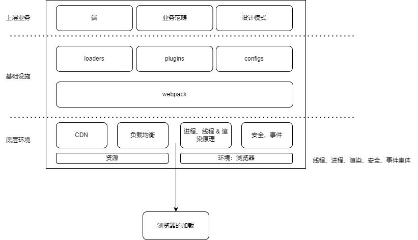

## 项目

### 底层环境

#### 1. CDN

- 概念

  CDN - content delivery network 内容分发网络

- 面试题 1：CDN 系统有哪些组成部分？\*\*

云 本地机房 云服务提供商 云环境 大规模集群便利性 & 融载备份 静态资源 镜像方式 部署在云服务上（大厂要了解）

分发服务部分：

基于缓存设备 - 1. 把缓存在本地的内容快速地提供给用户（每一级）2. 源站点进行准实时地内容同步

负载均衡系统 - 访问调度

分为：- 1. 全局负载均衡（GSLB）：根据就近原则，给用户分配最佳的服务节点。2. 本地负载均衡：节点内部设备集群的负载均衡。

运营管理系统 - 支撑服务于整个网络平台

- 面试题 2：CDN 主要功能区域 / 在何种业务场景的项目里需要使用到 cdn？ / cdn 的工作方式与项目的关系？\*\*\*

CDN 一般托管的资源：文本、图片、脚本、媒体文件、网站......

（1）性能方面：

用户收到内容来自于最近的集群 => 延迟更低、内容加载更快

资源请求分配给了 CDN 节点，减少了服务器的负载 => 服务压力、服务器成本降低

=> 客户量较大、时间上+空间上客户分布较为分散的业务

（2）安全方面：

DDoS：监控异常流量分析，限制请求频率

MITM: 源服务器 => CDN 节点 => ISP 全链路开启网络安全保护、HTTPS 通信服务
=> 容易被攻击获取利益+容易被中间人劫持业务

- 面试题 3：简单说说 CDN 的流程？\*\*\*

第一步：DNS 的解析域名过程

www.zhaowa.Com => 浏览器缓存 => 操作系统缓存(host) => 路由器缓存 => ISP 的 DNS 服务器 => 根域名服务器

第二步：CDN 上场

浏览器通过 DNS 解析域名获取到对应的 IP 地址

（1）用户未使用 CDN 服务的话

浏览器会根据 IP 地址向域名服务器发出请求 => 服务器返回数据

（2）用户使用 CDN 缓存资源

DNS 解析 => CDN 专用的 DNS 服务器 => DNS 域名解析权交给 CNAME 指向的 CDN 专用的 DNS 服务器 => CDN 的全局负载均衡设备 IP 返回给用户

用户向 CDN 全局负载均衡设备发出请求 => 根据 IP+URL 选择一台用户所属区域内负载均衡设备 => 选择合适空闲的服务器进行提供服务 => 返回用户所需内容

- 面试 4：什么场景适合使用 CDN 服务？业务内通常有哪些部分使用 CDN？ \*\*

（1）第三方 CDN 服务

（2）CDN 静态资源缓存

（3）聊天室、直播流 - 直播传输

##2,浏览器灌染

- 1. 什么是重排和重绘？哪些操作会导致重排和重绘？\*

（1）重排

当渲染树中部分或者全部元素的尺寸、结构、内容发生变化的时候，浏览器就会触发重新生成渲染数的方法，进而进行重新渲染 => 重排

=> 页面的首次渲染、浏览器窗口（容器引发的）大小发生变化、元素内容发生变化、字体大小发生变化、激活了伪类

=> 全局：从根节点开始，对整个渲染树进行重新布局 局部：渲染树某部分或者一个渲染对象进行重新布局

（2）重绘

只影响自身属性，不对其他元素影响以及重新绘制

- 面试题 2 动画与重排的关系？你会如何去考虑动画性能的优化？\*\*

一般情况下，动画都会频繁操作 dom 的，就会导致页面性能问题

(1)尽量减少频繁操作 dom 的数量

(2)尽量使用脱离文本流的动画主体

(3)尽量减少循环动画

- 面试题 3 documentFragment?它是什么？他和直接操作 dom 有什么区别？

documentFragment 不是真实 DON 树的一部分，他的属性变化不会直接导致 DOM 树的更新，故频繁改动不会有性能问题

<=> vdom

### 基础设施

#### webpack 工程化理论

1. 如何提高 webpack 的打包速度？ / 有没有做过 webpack 优化项目？\*\*

（1）优化 loaders

```js
  module:{
    // 1. 限制生效范围可以避免大量的无用转义资源消耗
    rules:[(
      // js 文件才会使用 babel 进行转换 => 限制了转义的文件类型
      test: /\.js$/,
      loader: 'babel-loader',
      // 只在 src 文件夹下进行查找转换 => 限制了转义的文件
      include: [resolve('src')],
      // 不会去查找的路径 => 限制了转义的范围
      exclude: /node_modules/
    )]
    // 2. 缓存
    loader: 'babel-loader?cacheDirectory=true'
  }
```

（2）HappyPack

```js
loaders: [{
  test: /\.js$/,
  // 只在src文件夹下进行查找转换 => 限制了转义的文件
  include: [resolve('src')],
  // 不会去查找的路径 => 限制了转义的范围
  exclude: /node_modules/,
  loader: 'happypack/loader?id=happybabel'
}],
plugins: [{
  new HappyPack({
    id: 'happybabel',
    loaders: ['babel-loader?cacheDirectory=true'],
    threads: 4
  })
}]
```

（3）DllPlugin

```js
  // webpack.dll.conf.js
  entry: {
    vendor: ['react']
  },
  output: {
    path: path.join(__dir, 'dist'),
    filename: '[name].dll.js',
    library: '[name]-[hash]'
  },
  plugins: [
    new webpack.DllPlugin({
      name: '[name]-[hash]',
      context: __dir,
      path: path.join(__dir, 'dist', '[name]-manifest.json')
    })
  ]

  // webpack.config.js
  plugins: [
    new webpack.DllReferencePlugin({
      context: __dir,
      manifest: require('./dist/vendor-manifest.json')
    })
  ]
```

（4）其他

代码压缩、extension、alias、noParse、按需加载、scope-hoisting、tree-shaking。

组成结构 & 业务使用

## 最后

你的系统是如何做性能优化的？

根据图，从下往上从左到右一个一个跟面试官说在哪些地方可以做性能优化！


