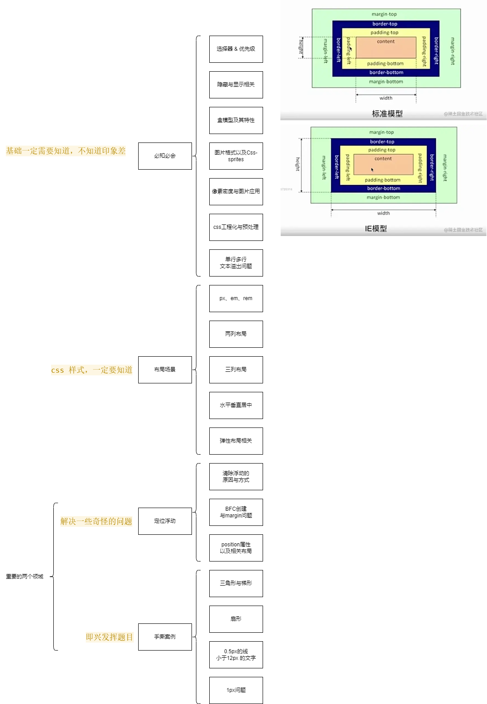

# CSS 面试题

## 一、面试方式（特点）

- 表示难度级别

### 1.1.分级考察状态

#### 初级 => 中级 \*

> **概念 + 原理 + 场景**（夹杂场景考察概念和原理）

- 概念：考察你入门的时候看过书，
- 原理：了解属性背后，思考过
- 场景：考察用过

#### 中级 \*\*

> **实际应用 + 复合场景**

#### 高级 \*\*\*

> 技巧（CSS 本身注重技巧） + 工程化（业务层面注重工程化）

在整个项目/业务中，...

### 1.2.面试方式

> 假如你是面试官，对于 CSS 你会考察哪些方面？

#### 1.2.1.特点：

- 相对零散，从点到面（深度、广度是一个维度）  
  针对面试，不建议读《CSS 世界》，它较体系化（观点、见解、设计理念）

#### 1.2.2.面试题：

[1]display 有哪些属性？\*

- `none` - 不展示
- `block` - 块类型
- `inline` - 行内
- `inline-block` - 默认行内块状
- `list-item` | `table` - 列表标记 | table
- `inherit` - 继承

[2]追问：inline & inline-block 的区别能说说么？ \*

- `inline`: 共享一行，行内概念
- `block`: 独占一行
- `inline-block`：共享一行，内容作为 block 对象呈现（每个元素还是 block 元素）

[3]追问：行内元素和块级元素有什么区别呢？ \*

> 技巧：
>
> 对比多个元素时：
>
> 1. 先说多个元素的概念，
> 2. 然后找相同点，找不同点，
> 3. 再对不同点做二级阐述。

| [3]行内元素和块级元素有什么区别呢？ \* | 区别 1         | 区别 2                                                     | 区别 3         | 区别 4                           |
| -------------------------------------- | -------------- | ---------------------------------------------------------- | -------------- | -------------------------------- |
| 1）行内元素：                          | 1.无法设置宽高 | 2.水平方向可设置 margin + padding，<br/>垂直方向则无法设置 | 3.不会自动换行 |                                  |
| 2）块级元素：                          | 1.可以设置宽高 | 2.水平垂直方向可设置 margin + padding                      | 3.可以自动换行 | 4.多个块状是默认从上往下换行排列 |

[4]追问：有哪些行内和块级元素？\*

| [4]有哪些行内和块级元素？\* |                                                            |
| --------------------------- | ---------------------------------------------------------- |
| 1）行内元素：               | div form h1 pre table ul……                                 |
| 2）块级元素：               | a br code em（强调） img i input strong（修饰） textarea…… |

[5]追问：块级元素和内联元素有**哪几种**转换方式？ \*\*

> CSS 特别喜欢问什么问题：【有哪几种，属于实际运用题，考你知识点、知不知道，还考你用没用过、用过多少、经验丰不丰富】
>
> - 有几种，
> - 你能说几种，
> - 哪几种
>
> 把哪几种去掉，问题变成：CSS 有哪些转换方式？就变成了一道【基础题】

| [5]块级元素和内联元素<br/>有**哪几种**转换方式？ \*\* |                                                                                                                                                    |
| ----------------------------------------------------- | -------------------------------------------------------------------------------------------------------------------------------------------------- |
| 1.display                                             | --                                                                                                                                                 |
| 2.float                                               | float: left/right<br/> => display: block（元素设置 float，display 自动设置 block。） ** <br/> => 去除行内元素之间的空白问题（浏览器默认行为） \*** |
| 3.position                                            | position: absolute / fixed <br/> => 行内变块级<br/>（脱离原来文本流，脱离原来维度、层级的块级。）                                                  |

#### 1.2.3.应用

1. 给自己定位、定级

2. 根据级别考量来准备相应的面试题，自己给自己出题并回答。

3. 知识图谱



## 二、必知必会

### 2.1.选择器 & 优先级

[1]选择器的优先级是什么样的？（开门见山问法）  
选择器如何做样式判断？（委婉问法）  
这段样式能不能生效？（更委婉问法） \*

> 考察选择器优先级
>
> - 转行问的基础细节，比较细。

- 内联样式 **1000**
- id 选择器 `#id` **100**
- 类选择器 `.class` **10**
- 属性选择器 `a[ref="link"]` **10**
- 标签选择器 `div` **1**
- 伪类选择器 `li:last-child` **10**
- 伪元素选择器 `li:before` **1**

- 兄弟选择器 `div+p` **0**
- 子选择器 `ul>li` **0**
- 后代选择器 `li a` **0**

- 通配符 `*` **0**

[2]特殊场景的优先级如何判断？ \*

- `!important` 优先级最高
- 如果优先级相同，则后者高于前者
- 继承得到的样式，优先级最低

[3]可继承的样式有哪些？ \*\*

1）字体

- `font-family`,`font-weight`,`font-size`,`font-style`

2）文本

- `text-indent`,`text-align`,`line-height`,`word-spacing`,`letter-spacing`,`color`

3）元素

- `visibility`

4）列表布局

- `list-style`

5）光标

- `cursor`

### 2.2.隐藏和显示相关

[1]有哪些可以隐藏过一个元素的方法？有什么区别？ \*\*

- `display: none;` 不占位
- `visibility: hidden;` 占位

- `opacity: 0;` 占位
- `position: absolute;` 不占位
- `z-index: 负值;` 不占位
- `clip` 占位
- `transform: scale(0, 0)` 占位

[2]`display` vs `visibility` 有什么区别？ \*\*

他们俩都是让元素隐藏和展示。

- 浏览器渲染时，`display` 不占据空间，渲染树中会不存在
- `visibility`，占据一根树枝

继承属性来说，

- `display` 不会被继承，`visibility` 会被继承

性能影响上，

- `display` 造成文档的重排，但是修改 `visibility` 只会导致文本的重绘

### 2.3.盒模型及其特性

[1]简单说说标准盒模型、IE 盒模型分别是什么？怎么转换? \*

盒模型特点：

- `content + padding + border + margin`

区别：

- 标准盒模型 - width 和 height 只包含 content 部分
- IE 盒模型 - width 和 height 包含了 content + padding + border 部分

转换：

- `box-sizing: content-box` / `border-box`;

[2]伪元素和伪类是什么？如何使用？区别是什么？ \*

- 伪元素：只出现在 css 样式表中，不存在于 doc 中。

```css
p::before {
  content: 'zhaowa';
}
p::first-line {
  background: red;
}
```

伪类：已有的元素上加上特殊类别，不产生新的元素。

```css
div:hover {
  color: red;
}
```

### 2.4.图片格式以及 CSS-sprites

[1]图片格式有哪些？怎么应用？如何选择？\*

- `BMP`，无损、没有压缩。通常体积较大。
- `GIF`，无损、采用了 `LZW` 压缩算法。仅支持 `8bit` 索引色，支持动图。
- `JPEG`，有损、直接色存储，适合还原度要求较高的照片。
- `PNG-8`，无损、使用索引色。体积更优秀，并且支持透明度调节。
- `PNG-24`，无损、使用直接色，压缩。
- `SVG`，无损、`svg` 放大不会是真的吧，所以适合 `logo`、`icon`。
- `webP`，有损+无损、直接色、支持透明度、压缩。`chrome`、`opera` 支持

[2]`CSS-sprites`/精灵图/雪碧图怎么处理？ \*

- 所有涉及到的图片，放到一张大图中去
- `background-image`, `background-repeat`, `background-position`

三个 icon 的

雪碧图性能优化：

- 优点：
- 缺点：不太好开发维护

### 2.5.像素密度与图片应用

[1]**像素密度**有了解吗？ \*

- 经典设备宽高 `414px * 896px`
- 物理像素 `1242px * 2688px` => `1242 / 414 = 3`  
  （1242 除以设计稿的 414，即设计稿的 1px 相当于手机上实际展示的 3 个像素）  
   => `逻辑像素 : 物理像素 = 1 : 3` => 像素密度就是 3 => （就是常说的）3 倍屏（`3 dpi`）

> 设计稿的宽度和实际设备的物理像素的宽度的比，比出来是几，就是几倍屏。

[2]应用：如何在图片的加载上应用**动态密度**？ \*

- 让设计师提供 `@2x` 两倍图，`@3x` 三倍图，`@4x` 四倍图；

- 比如 `200 * 300`：  
   => 2 倍图 => `400 * 600`  
   => 3 倍屏幕 => `600 * 900`  
   => 4 倍屏幕 => `800 * 1200`

实际写的过程中：

```css
image {
  background: ('1x.png');
}
/* 利用媒体查询 */
@media only screen and (min-deivce-pixel-ratio: 3) {
  image {
    /* 加载 3 倍屏 */
    background: ('3x.png');
  }
}
```

### 2.6.css 工程化与预处理

[1]css 类库 与工程化的理解？ \*\*\*

- 预处理器：less scss stylus  
   => 利用编译库提供能力，提供层级、mixin、变量、循环、函数

- 后处理器：postCss  
  => 利用后处理编译，属性增加前缀，实现跨浏览器兼容

### 2.7.单行多行文本超出/溢出问题

#### [1]手写一个单行 & 多行的文本超出省略 \*

问细节：单行超出为什么加 `white-space: nowrap;`？

答：

```css
/* 单行超出 */
overflow: hidden;
text-overflow: ellipsis; /* 超出省略号 */
white-space: nowrap; /* 不换行 */

/* 多行超出 */
overflow: hidden;
text-overflow: ellipsis; /* 超出省略号 */
display: -webkit-box; /* 弹性伸缩盒子模型（描述当前的盒子） */
-webkit-box-orient: vertical; /* （伸缩盒子的方向，设置为）从上往下垂直排列 */
-webkit-line-clamp: 3; /* （垂直排列只显示 3 行）显示的行数 */

/* 效果：如果从上到下排列超出3行，就会显示省略号，这就实现了多行超出。 */
/* ⭐方便，但是，以上方案只支持 webkit */

/* --------------------- */
/* ⭐兼容性方案 */
p {
  position: relative;
  line-height: 18px;
  height: 40px;
  overflow: hidden;
}
p::after {
  content: '...';
  position: absolute;
  bottom: 0;
  right: 0;
}

/* 以上方案：是 先截断，再加省略号的方式 */

/* --------------------- */
/* 方案有什么不足之处？ 
=> 固定行高（height: 40px;height设置为两倍行高，不知道行高，无法做） 
=> 两个方向：js处理 后处理器（兼容性处理，或者后处理技术） */
```

#### [2]扩展：

> 很容易扩展问到的问题：
>
> - 尾元素
> - webkit 兼容性 处理器
> - overflow
> - 换行不换行，行内&块级
> - BFC

#### [3]接下来：

就到了，略带炫技，或者略微需要准备一下的东西。

- 因为这些东西可能需要一些**经验**，不再是基础能力；
- 下面这些是一些实际应用，因为写的多了，会**信手拈来**；
- 如果写的不够多，就可以**练一练、写一写**。

## 三、布局场景

### 3.1.px em rem

[1]多种单位的差别 \*

px 就不说了

- 百分比：子元素的百分比相对于直接父元素的对应属性
- em: 相对于父元素的字体大小倍数
- rem: 相对于根元素字体大小的倍数

- vw: 视窗宽度，满视窗宽度为 100vw - 从左到右
- vh: 视窗高度，满视窗高度为 100vh - 从上到下
- vmin: vw 和 vh 中较小值 - 处理横纵比
- vmax: vw 和 vh 中较大值 - 处理横纵比

[2]如何利用 rem 实现响应式？ 项目如何实现响应式的？（实现响应式的基本原理）

用 `rem`：

> 所有的单位，都根据 **设备的视窗宽度的变化**，来做响应式布局。

- 根据当前**设备的视窗宽度与设计稿的宽度**得到一个**比例**
- 根据比例设置根节点的 font-size（rem 固定下来了）
- 所有长度单位都用 rem

### 布局

> 先把原理搞清楚：

[1]定位浮动 - 简单聊聊看*浮动的影响还有原理*？ \*

浮动工作原理：

- 浮动元素脱离文档流，不占据空间  
  => 不受原有文档流的影响，同时无法影响原有父类  
  => （导致的问题：）高度塌陷

[2]浮动停留的条件？浮动元素移动（所）遵循的空间？\*

- 浮动元素碰到包含它的边框或者其他浮动元素的时候会停留
- => （所以）浮动元素可以左右移动（并且直到遇到它外边缘的包含框或者另一个浮动元素为止）
- => 浮动元素高度独立（计算的），不会再影响撑开原有父类的高度（这是**高度塌陷**的原因，也是**浮动停留**的概念。）

[3]**高度塌陷原因**，如何解决高度塌陷？\*

- （方案 Ⅰ）给父级定义 `height`
- （方案 Ⅱ）浮动元素之后，给一个 div，（同时给 div 设置：）`clear: both;`
- （方案 Ⅲ）父级标签增加 `overflow:hidden;`
- （方案 Ⅳ）用伪元素模拟 `div:after`

[4]简单说说**如何创建 BFC**，以及**如何解决**相应一些问题？ \*\*

[4.1]创建 BFC 的**条件**：

- 根元素 `body`
- 元素设置浮动：`float` 除了 `none` 之外（，其他所有属性都会把元素设置为 BFC 块。）
- `position` `absolute` `fixed`，脱离文本流的操作，都会形成 BFC；
- `display` 的 `inlin-block` `table-cell` `table-caption` `flex`，这些属性都会形成 BFC；
- `overflow` 的 `hidden` `auto` `scroll`，形成 BFC；

[4.2]BFC 的**特点**：

- 垂直方向上，自上而下排列的，和文档流的排列方式一致
- BFC 中上下相邻的两个容器 margin 会重叠
- 计算 BFC 高度时要计算浮动元素
- BFC 不会影响外部元素

[5]BFC **正作用**有哪些？\*\*

1. 解决 margin 重叠问题、
2. 解决高度塌陷、
3. 创建自适应布局

> 怎么理解？引导向手写。

[6]有几种办法能**实现两列布局**？实现一个**左边宽度固定，右侧宽度自适应**的两列布局？\*

1. 浮动 + 生成 BFC 不重叠
2. 浮动 + width auto
3. flex 大法好

```css
/* 1. 浮动 + 生成BFC不重叠 */
.left {
  width: 100px;
  height: 200px;
  float: left;
}
.right {
  height: 200px;
  overflow: hidden;
}

/* 2. 浮动 + width auto */
.container {
  height: 200px;
}
.left {
  width: 200px;
  height: 200px;
  float: left;
}
.right {
  margin-left: 200px;
  width: auto; /* 宽度设置 auto，直接撑开 */
}

/* 3. flex大法好 */
.container {
  height: 200px;
  display: flex;
}
.left {
  width: 200px;
}
.right {
  flex: 1;
}
```

[7]两列布局可以，那**再加一列**呢？**左右两栏宽度固定，中间自适应**？\*\*\*

1. 绝对布局法
2. flex 大法好
3. 圣杯布局

```css
/* 1. 绝对布局法 */
.container {
  position: relative;
  height: 200px;
}
.left {
  position: absolute;
  width: 100px;
  height: 200px;
}
.right {
  position: absolute;
  width: 200px;
  height: 200px;
  top: 0;
  right: 0;
}
.center {
  margin-left: 100px;
  margin-right: 200px;
  height: 200px;
}
/* 2. flex大法好 */
.container {
  display: flex;
  height: 200px;
}
.left {
  width: 100px;
}
.right {
  width: 200px;
}
.center {
  flex: 1;
}
/* 3. 圣杯布局 */
.container {
  height: 200px;
  padding-left: 100px;
  padding-right: 200px;
}
.center {
  float: left;
  width: 100%;
  height: 200px;
}
.left {
  position: relative;
  left: -100px;

  float: left;
  margin-left: -100%;
  width: 100px;
  height: 200px;
}
.right {
  position: relative;
  left: 200px;

  float: right;
  margin-left: -200px;
  width: 200px;
  height: 200px;
}
/* 4. 双飞翼 */
.container {
  height: 200px;
}
.left {
  float: left;
  margin-left: -100%;
  width: 100px;
  height: 200px;
}
.right {
  float: left;
  margin-left: -200px;
  width: 200px;
  height: 200px;
}
.wrapper {
  float: left;
  width: 100%;
  height: 200px;
}
.center {
  margin-left: 100px;
  margin-right: 200px;
  height: 200px;
}
```

[8]**水平垂直居中**问题？ \*\*

1. 绝对定位
2. 自我拉扯
3. flex 大法好

```css
/* 1. 绝对定位 */
div {
  position: absolute;
  left: 50%;
  top: 50%;
  margin-top: -height/2;
  margin-left: -width/2;
}
/* 2. 自我拉扯 */
div {
  margin: auto;
  position: absolute;
  top: 0;
  left: 0;
  right: 0;
  bottom: 0;
}
/* 3. flex大法好 */
.parent {
  display: flex;
  justify-content: center;
  align-items: center;
}
```

## 四、定位浮动

## 五、手撕案例——奇技淫巧

1. 三角形 => 梯形 => 扇形 => 基础元素 + 技巧
2. 1px、12px font => 变形进行处理
3. 动画 => 幻灯片 / 电影
