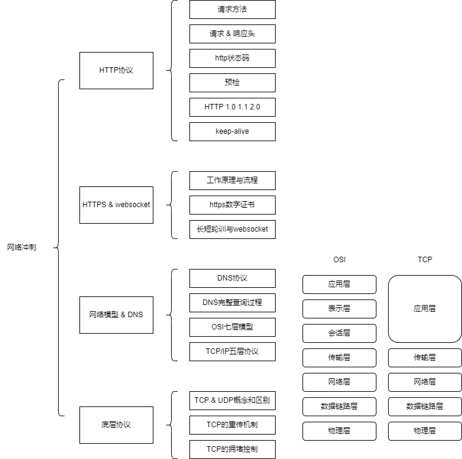

### 网络知识
#### 面试方式
1. 特点：整体
基础理论 + 协议了解 + 业务的场景

2. 面试举例
面试题：
HTTP请求有哪些方式？分别用在哪些场景下？ *
GET POST PUT DELETE OPTIONS

a. GET POST的请求的区别？ *
场景上：
GET 用于获取资源而不对服务资源做更改提交的请求 => 幂等
POST 会对服务资源做更改进而影响数据 => 不幂等

状态：
浏览器不会对post请求进行主动缓存，业务逻辑也很少对post请求做缓存

安全性：
get的参数放在URL，所以请求参数会以请求路径明文方式进行发送

参数：
post支持更多种类的请求参数数据类型

b. POST 和 PUT的区别？ *
对于更新的定义
PUT 请求 通常会修改数据内容，但不会增加种类      -   更新状态
POST 请求 既可以修改内容，同时也代表着可能增加类型种类  - 创建状态

c. OPTIONS请求方法及使用场景？ *
OPTIONS是一种HTTP请求方法
获取当前服务器的状态、性能、特征；
检查访问权限 => 权限、CORS

d. 了解http协议的头部算法吗？如何降低开销的？ **
HPACK算法
    1）客户端和服务端共同维护建立字典，引用索引来标识重复的字符串
    2）通过编码算法压缩字符串，从而进一步减小头的大小

客户端、服务端利用字典来跟踪和实时存储之前发送的数据值，实时记忆
对于相同的数据，不再通过每次请求和响应重复发送

e. 字典的生命周期是如何的呢？是如何保证被更新的？ **
    首部表http连接期内，始终保证存在并独立的，有客户端和服务端共同演进更新
    每次新增的首部键值对都会被追加到末尾，更新的值会替换原有值的位置

#### 请求头 和 响应头
1. 了解的请求和响应头分别有哪些？常见的content-type有哪些？ *
请求头 - 浏览器告知服务端，自己的能力和配置
Accept - *  浏览器的能力
connection 连接类型
cookie 页面设置的内容
host 页面所在的域
referer 表示当前页面的运行身份
user-agent 判断环境

响应头 - 服务端回复告知自己能力
Date server connection cache-control content-type

content-type属性值:
application/x-www-form-urlencoded - 原生form表单的形式
multipart/form-data - post，表单提交post
application/json: 序列化后的JSON字符串

#### HTTP状态码
1. 简述了解的状态码有哪些？ *
1xx 信息类  接收请求并且正在处理
2xx 成功    请求正常且处理完毕
    200 OK
    204 No content 返回为空，但是正确处理了
    206 客户端进行了范围请求
3xx 重定向  需要进行附加操作完成当前请求
    301 永久重定向  - 域名换了、资源地址换了
    302 临时重定向  - 平安夜活动
    303 请求的资源有另一个合适途径
    304 浏览器缓存相关 - 未满足服务端查询需求，但是走缓存条件
4xx 客户端错误 服务端无法根据当前请求参数处理
    400 请求报文出现了语法错误
    401 认证失败
    403 明确拒绝
    404 服务端找不到对应资源 同时，当服务端拒绝查询资源，且不想说明理由的时候
    405 请求方式不被允许
5xx 服务端处理请求错误
    500 执行请求发生错误
    501 暂不支持当前操作
    503 超负荷或停机维护

2. 302 303 307三种重定向的区别有了解吗？ *
302 是http1.0中出现的重定向
    http/1.1细化派生除了303 和 307
        303将当前的post请求变为get请求进行重定向
        307当前的重定向会严格按照浏览器的诉求，不会从post变成get

#### HTTP 版本能力 1.0 1.1 2.0
1. HTTP1.0 和 1.1之间有哪些区别？ *
连接上：
持久型连接 - 复用同一个TCP连接上
资源处理上：
整体的资源查询，通过range来做部分查询
缓存上：
1.0 modified-xx expires 判断是否命中缓存
1.1 etag if-match 缓存策略主动化

2. HTTP1.1和HTTP2.0的区别？ *
二进制协议：
1.1中 头信息 文本； 数据体 文本/二进制
2.0中 头信息 数据体 二进制 信息流统称为帧

多路复用：
2.0中，一方面复用TCP连接，同时在连接中，同时发送多个请求或者回应

数据流：
2.0引入了数据流的概念，并且以数据流ID进行索引

头信息压缩：
对头信息进行字典化索引以及压缩

服务端推送：
2.0允许服务端主动向客户端未经请求地推送资源 - 资源非动态数据

#### keep-alive
1. 了解什么是keep-alive?建立过程是什么样的？使用场景？优缺点？ **
1.0 默认短链接的形式，主动connection中打开keep-alive
1.1 默认长链接的形式，主动关闭

建立过程：
    1）客户端发送报文夹带keep-alive的头配置
    2）服务端接收并处理，并且返回keep-alive的返回头
    3）客户端维持当前长链接建立

服务端主动断开：
    1）等客户端请求
    2）服务端返回请求并且不带keep-alive
    3）关闭连接

客户端主动断开：
    1）客户端请求头带上close字段
    2）服务端接受后处理并断开连接
    3）客户端接收资源并关闭连接

好处：
    服务端 - CPU和内存占用下降
    请求和回复复用管道变少 - 降低拥塞
    减少了后续请求的延时
    无需每次异常都关闭TCP

缺点：
    长时间连接可能会导致无效占用

解决通道拥堵

#### https 和 websocket
1. 了解https吗？和http比起来有哪些区别？ *
HTTPS经由HTTP进行通信，利用了SSL/TLS来加密数据包
实现了数据交换的可行性和安全性

HTTP采用明文传输，存在安全性问题
+
TLS/SSL利用了身份验证 + 信息加密 + 完整性校验

结合了http的传输能力同时
    对发起的http请求数据进行加密操作
    对接受到的http内容进行解密

2. SSL/TLS是什么？作用和工作原理？ *
是一层安全协议
主要依赖：散列函数hash、对称加密、非对称加密
    1）散列函数hash
    MD5、SHA1…… => 单向不可逆，且输入敏感型，输出长度固定 => 任何对于数据的修改都会导致他值的变化
        => 验证信息的完整性

    2）对称加密
    特点是两者公用一种密钥，同时用其进行加解密
        => 存在问题：如何保证密钥的传输安全性

    3）非对称加密
    利用公钥和对应私钥的互相加解密能力进行加密
        => 存在问题：中间截取问题
        => 数字证书：可信度高的机构

3. websocket基础原理？使用方式特点？ *
全双工的网络技术 => 应用层
基于TCP传输协议，可以复用HTTP的通道
原理：
    请求 - 客户端向服务端发送notify => id + event
    推送 - 立即通知所有客户端，id满足的客户端，才会响应当前推送的反馈

#### DNS 与 网络协议
1. 了解DNS的作用和传输机制吗？ **
 作用： 
    将域名解析为ip地址，客户端会向DNS服务器发送查询请求
    服务器返回给我们对应的IP地址

迭代查询
    每次请求都会单词访问不同级别的DNS服务器
递归查询
    只向目标服务器发送一次请求，优先自我查找，向下一级服务器进行进一步查询

2. OSI七层模型 / TCP模型
见图

#### TCP 和 UDP
1. 对比有何区别？ *
握手机制、校验、安全保障

TCP注重完整性、确定性的领域
UDP注重的是分发速率