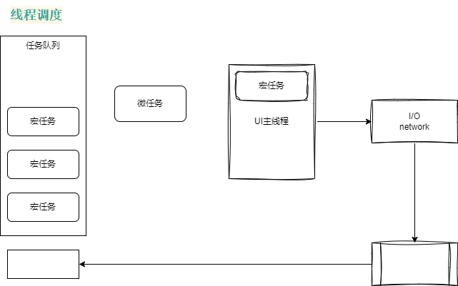

# HTML 面试题

## HTML DOCTYPE 的含义？什么是 HTML 的标准模式与混杂模式？

> 概率不大，H5 之前问的多；  
> 背过：
>
> - [3. DOCTYPE(⽂档类型) 的作⽤](https://juejin.cn/post/6905294475539513352#heading-3)

HTML 的文档类型声明，doctype ，一般 HTML 第一行代码，web 浏览器的一行指令，说明这个页面是用什么来编写的。

现在一般写 html，不写 xml，xhtml 等一些以前比较老的标准，而且都是写 html5，新建一个 index.html，打个感叹号`!`，默认会给你一个页面：

```html
<!DOCTYPE html>
<html lang="en">
  <head>
    <meta charset="UTF-8" />
    <meta name="viewport" content="width=device-width, initial-scale=1.0" />
    <title>Document</title>
  </head>
  <body></body>
</html>
```

当然也有一些其他的写法，比如：

```html
<!DOCTYPE html public "...">
```

声明一些 w3c 等，当然这是 4.0.1 的标准。

h5 html5 有一个比较宽松的语法，基本上完全向后兼容。

```html
<!DOCTYPE html>
```

html4.0.1，就会分严格模式、过渡模式等，比如说：strict、transitional 等；

那么它们两个的区别是什么？strict VS transitional ?

- strict 结构中不能有出现格式或表现的内容
  - 比如 `<b></b>`标签，相当于有明确的格式，代表加粗，是不能用的；
  - 或者 `<p font='5'></p>`
- tansitional

```html
<!-- strict html -->
<!DOCTYPE html PUBLIC "-//W3C//DTD HTML 4.01//EN" "http://www.w3.org/TR/html4/strict.dtd">
<!-- strict xhtml -->
<!DOCTYPE html PUBLIC "-//W3C//DTD XHTML 1.0 Strict//EN" "http://www.w3.org/TR/xhtml1/DTD/xhtml1-strict.dtd">

<!-- transitional html -->
<!DOCTYPE html PUBLIC "-//W3C//DTD HTML 4.01 Transitional//EN" "http://www.w3.org/TR/html4/loose.dtd">
<!-- transitional xhtml -->
<!DOCTYPE html PUBLIC "-//W3C//DTD XHTML 1.0 Transitional//EN" "http://www.w3.org/TR/xhtml1/DTD/xhtml1-transitional.dtd">
```

## HTML5 有哪些语义化标签及其特性？HTML 元素有哪些分类与特性？

### 【1】语义化的好处：

> 从真正的业务、研发的角度来说，并没有真正的好处，  
> 但是其中最重要的就是说：

让我们根据结构化的内容，选择合适的标签。

> 那这样有什么**好处？**

1. seo 有利；
2. 代码的可读性，更好；
3. 标签上加上 alt, title，其中 hover 的效果：如果图片有一些问题，可以解释这个图片，都有一些描述的信息；
4. 更好的 Accessibility（Web Accessibility，A11y，无障碍访问） 更好的方便一些其他的设备进行解析。（尤其那些盲人用的，给图片上加一些标签，给 tab index 加一些标记，tab 页怎么往前推的？）

> 提高我们无障碍访问的 web 技术叫做 Accessible Rich Internet Applications (ARIA)  
> 参考链接：
>
> - [被大多数开发人员忽略的 Web Accessibility 是什么？](https://www.jianshu.com/p/4f6a23d4f288)

### 【2】那么 **HTML 标签**有哪些呢，包括这些**语义化的标签**？

#### Head 头文件类 & Sections 表示块、区域 & Grouping 表示分组 & Tables 表格类

> [1]Head 类，这一部分，比较重要的是 meta；
>
> - 因为 meta 相对来说，里面有各种各样的东西，可以做一些 html 优化，
> - 通过 `http-equiv` 编译的指令，可以写白名单策略，一些属性 `Content-Type`，`Refresh` 的一些情况、作者、描述等方便 html 去解析、方便机器人去索引

> **基础课里，对 html 标签都做了仔细地分析。**

> [2]Sections：表示块、区域的，比如：body、article、nav 等；不用它们，用 div 也是一样的，比如 使用 section 表示一个块。

> [3]Grouping 分组：比较常用的 ol li

> [4]Tables 表格：现在相对用的少一些，因为表格其实会造成比较严重的回流和重写，尤其是回流，它布局的特点，会让中间的计算内容比较大，比如大家在做一些比较极致的 html 的时候， 我们可以少用表格，可以用 grid 布局；

| Head     | Sections | Grouping   | Tables   |
| -------- | -------- | ---------- | -------- |
| doctype  | body     | p          | table    |
| html     | article  | hr         | caption  |
| head     | nav      | pre        | thead    |
| title    | aside    | blockquote | tbody    |
| base     | section  | ol, ul     | tfoot    |
| link     | header   | li         | tr       |
| **meta** | footer   | dl, dt, dd | th       |
| style    | h1 - h6  | figure     | td       |
| script   | main     | figcaption | col      |
| noscript | address  | div        | colgroup |

##### Chat 拓展【todo】

> 在 HTML 中，编译指令通常是指使用 `<meta>` 标签中的 `http-equiv` 属性来配置一些与 HTTP 响应头类似的指令。这些指令可以用来控制缓存、内容类型、重定向等行为。以下是一些常见的 http-equiv 编译指令：

【1】常见的 `http-equiv` 编译指令：

1. Content-Type：

2. Refresh：

3. X-UA-Compatible：

4. Cache-Control

5. Pragma：

6. Expires

【2】例子解释：

#### Forms 表单 & Interactive 互动 & Edits 编辑

> [1]当然不止这些，比如这里我们常用的表单，可能会考你 input：  
> 【面试题】：input type 有多少种类型？你知道哪些，简单说一说。  
> 23 种（联想：设计模式也有 23 种），平时知道的有：text，radio、password

> [2]那这些类型分别都有什么用呢？
>
> - 我们经常写 antv，element 的时候，用 radio、checkbox 其实它们的本质上都是 input 的 type，如果不知道还是要了解一下。

> [3]比如，还有一些交互的、还有一些编辑的。有的也不是很常用。

| Forms          | Interactive | Edits |
| -------------- | ----------- | ----- |
| form           | details     | del   |
| fieldset       | summary     | ins   |
| legend         | command     |       |
| label          | menu        |       |
| input          |             |       |
| button         |             |       |
| select         |             |       |
| textarea       |             |       |
| option         |             |       |
| progress...... |             |       |

#### 嵌入型标签 & 文本级别标签

> 嵌入型，比较常用；  
> 比如 图片 img，怎么加载的？可能图片这个标签加载了但是嵌入的内容没有加载，  
> 所以分为两种：它是否会阻塞 dom，比如 img 不会的，比如 img content loading 这个阶段，img 可能还没有加载完，比如 video，它可能是个 shadow dom；

> 这几个分类，相对来说已经比较完善了。

| Embedded 嵌入型        | Text-level                          |
| ---------------------- | ----------------------------------- |
| img                    | a                                   |
| iframe                 | em                                  |
| embed                  | strong                              |
| object                 | i, b                                |
| param                  | u, s, small                         |
| video                  | abbr                                |
| audio                  | q                                   |
| source                 | cite                                |
| canvas                 | dfn                                 |
| area, map, track...... | sub, sup, code, br, var, span...... |

## 如何检测浏览器是否支持 HTML5 特性？

### 分析题目，了解考点

> 一定要搞清楚，面试官想要问什么，面试官是想问 是否有什么办法检测 H5 吗？  
> 肯定不是，他肯定更想了解、更想考察你是否对 **HTML5 新特性**有一定的总结。
>
> - [6. HTML5 有哪些更新](https://juejin.cn/post/6905294475539513352#heading-6)

比如说：

- 比如说 canvas
- 比如说 用于媒体播放的 video, audio
- 比如说 对于本地缓存的支持 localStorage, Web Worker
- 比如说 新的语义化标签，比如 article, footer, header
- 比如说 新的表单控件，比如 form: calender, date
- 比如说 esm（es module），或者说 es module 不一定准确，但是 script 是不再需要 type 属性了。

> 我们想一想，在这个过程中，我们怎么说呢？并不是每一种都去检测，比如是否有这个标签怎么检测，当然 create 也可以 create 出来，  
> 但是我们可以先描述一下，如果面试官问到你的时候：

### 【答】：

【1】针对这个问题，我想一下，emmm，H5 新特性大概有哪些。。。

【2】在这里边，比较方便使用的有 [1] [2] [3]，如下：

[1]检查特定的属性和方法

> 都可以 检测浏览器是否支持 H5

```js
!!navigator.geolocation // 判断地理位置是否有
!!window.localStorage
!!window.Worker
```

[2]创建一个元素，看看特定元素，有没有属性和方法

> 创建一个 `canvas`，也可能是个字符串；所以使用 `.getContext()` 方法，判断是否是 H5 里的 `canvas`。

> 看 video 里是否有这个属性 `canPlayType`；  
> 参考链接：[MDN - HTMLMediaElement: canPlayType() method](https://developer.mozilla.org/en-US/docs/Web/API/HTMLMediaElement/canPlayType)

```js
document.createElement('canvas').getContext()
document.createElement('video').canPlayType
```

[3]第三方库（开源的库）

- http://modernizr.cn/

## jump HTML 中 meta 的作用？

- 基础课

## HTML 的标签有哪些可以优化 SEO？

[1]meta 中的相关属性

> keywords 关键词也是方便索引

```html
<meta name="author" content="aaa@gmail.com" />
<meta name="description" content="XXX XRM XXX 系统" />
<meta name="keywords" content="XXX XRM XXX 系统" />
```

[2]标签

1.  title
2.  meta
3.  header
4.  nav
5.  article
6.  aside
7.  footer

### Answer:

> 回答时，肯定不能把所有的语义化标签都说一遍，而是像以下这样回答更好：

1. 首先要保证是 SSR 的（然后你才存在 SEO 的可能性，不然浏览器都抓取不到你页面里写了啥）；
2. meta 中相关的属性；
3. 语义化标签，以一些结构化的为主。比如你写一些非结构化的它也能，但是起到的作用很小，因为很多时候要考虑**费效比**。比如你写一些非结构化的东西，它能起到的作用很小，那你要花大量的时间把它改成结构化的，

比如你真的想做很 NB 的 SEO 怎么办？百度买排名，自己做，其实费效比很高，比如请一个工程师做 SEO，一个月多给几 W，还不如把前投入广告，费效比会很低/高(√)，

回答时，就会加入你的思考，如果做的非常的厉害，非常的语义化，非常的结构化，多花几天时间做，那还不如拿这些工资去买一些 Baidu 排名。效果会更好。

无障碍。

## DOM 和 BOM 有什么区别？

JavaScript 在浏览器环境下，一般由三部分组成。

- ① ECMAScript 核心。描述了 JS 的语法和基本对象；
- ② DOM 文档对象模型， document. 你有一些 API，可以操作 文档。  
  控制台里，整个的 `document` 显示 `#document`，整个文档，就是 dom。
- ③ BOM 浏览器对象模型，browser. 你有一些 API，可以操作 浏览器。  
  比如操作：屏幕 `screen` 前进后退 `history`，`navigation`，`location`，`url` 等

进一步解释 ECMAScript 核心：

[1]比如，在 html 里写一些 js 代码，写一个冒泡排序：

```html
<!DOCTYPE html>
<html lang="en">
  <head>
    <meta charset="UTF-8" />
    <meta name="viewport" content="width=device-width, initial-scale=1.0" />
    <title>Document</title>
  </head>
  <body>
    <script>
      function sortArray() {
        // ...
      }
      sortArray(arr)
    </script>
  </body>
</html>
```

[2]这个和浏览器的 BOM DOM 没有任何关系，它依赖的是，我本身浏览器，比如 Chrome 的 V8、Safari JSCore，Spired monkey ，我依赖的是它这个 runtime 这个核心，能够对我的语法做一个解析，这个是 ECMAScript 的核心。

[3]就比如说浏览器，既不写`document.createApp` 也不写 `location.href=xxx`，它依然能运行 js 语法，靠的就是这一部分的东西。

## 如何实现移动端适配？

响应式布局是很小的一部分。

要了解移动端适配，首先要了解什么是像素、屏幕分辨率、图像分辨率、PPI、DPI、屏幕像素比？

举个例子：

比如一个屏幕，打开控制台，拖拽边框，宽度显示 1508 等，但是苹果的像素不可能只有 1501 的像素，这是为什么？
所以这里涉及到一个比较重要的概念，叫做 设备像素比。其实，关于移动端的一些方案，很多都是由 设备像素比 产生的。

```js
window.devicePixelRatio // 2
```

看显示器：内建视网膜显示器（14 英寸 3024 \* 1964），但是为什么在这里只能看到 1506 呢？

因为最早的时候，一个像素指的是 你可以显示的一个文字或者说一个什么的最小单元，那么怎么定义这个最小单元？比如一张图片，当放大到很大时，里面的字，有一个最小的区域，这个区域只能是一种颜色，放的小，只能看到一个字母 O，放的很大，就能看到这么一个区域，这个格子就是一个像素。

正常的一个设备，比如浏览器、PC，我们一个像素，一般以前的工艺，只能做到 72 个像素一英寸，但是苹果就很厉害，一开始是夏普，它能做到视网膜显示，一个像素这个物理大小的空间里，我能放下 144 个像素。

那么，如果一个 12 号的字体或者说一个 72 号的字体，所有的大小，小 50%，

不能做一个网页，专门适配苹果浏览器。

每一个移动端都有一个设备像素比

### 响应式布局

> 可能会问高端一些的东西，如果是响应式布局，直接说就完了。
>
> - 参考链接：[面试官：什么是响应式设计？响应式设计的基本原理是什么？如何做？](https://github.com/febobo/web-interview/issues/108)

### 1px 问题

#### 1px 是什么？

> 存在一个框，画时是 1px，当把边框等比例缩小一倍时，边框成了 0.5 px，  
> 放到 css 里，本身 css 没有 0.5 px，所以这里又渲染成了 1px，  
> 就会显得边框很粗，跟我们最初的设计稿不一致，  
> 大概会有这样一个问题，即 1px 的问题。

#### 那么 1px 的问题，该怎么解决呢？

一般怎么做？

- 先放大成 200%，然后 `scale(0.5)`

### rem 方案

在根目录下字体的大小。

各种各样的方案去适配移动端的布局，

rem 指的是 html 的 font-size 的大小。

就是把它的宽度，或者说一个图片，或者一个区域，先放大成 200% 的大小，再用 `scale(0.5)`给它缩小回来，你的边框 1px 看上去就比较正常了，相对来说。

具体做的时候，可以通过媒体查询，给不同的像素设备设置像素比，定制不同的 border-image
或者给不同的像素比，去设置它的 background-image，这只是大概讲一下方案

具体情况要具体分析，因为不同的像素比，要做的 scale 是不一样的，

像媒体查询器里

画一个 0.5 的线。

包括图片产生模糊，用一些两倍图，去处理这些东西。

或者用 js 去拼接一些 url 去处理一些图片，或者用 svg。

## 如何禁用页面中的右键、打印、另存为、复制等功能？

```js
// 右键
document.onmousedown = function (event) {
  if(event.button === 2) {
    return false
  }
}

document.oncontextmenu = function(event) {
  return false
}

// 打印

// 另存为

// 复制
<body oncopy="nocopy()"></body>
function nocopy(event) {
  event.returnValue = false
}

// F12
document.onkeydown = function(e) {
  if(window.event && window.event.keyCode === 123 ) {
    window.event.returnValue = false
  }
}
```

其实禁用某个东西，就是用户在执行这个事件的时候，你捕获到了，然后用一些方法，让这个事件不再往下传播，让这个事件不要再执行，不要再执行它应有的操作。

这个放到 5 年前，可能会考，比如工作 3~5 年，面试 1h，不会问你太原生的东西，可能会问你一些比较高级的东西，

所以 html 的题，大家有一些比较基本的理解，就可以了。

## `href="javascript:void(0)"` 和 `href="#"` 的区别是什么？

`href="#"` 锚点，默认 #top，会让你的网页网上走。

`href="javascript:void(0)"` 阻止事件，什么都不干，死链接。

## 对 `target="_blank"` 的理解？有什么安全性问题？如何防范？

`target="_blank"`，类似于 `window.open`，你的子页面，会拿到你当前的句柄（句柄就是当前 window 对象）。

window.opener

> `target="_blank"` 会新开一个页面，在新开的窗口里打印 `window.opener` 可以拿到上个窗口的一些东西。

```js
if (window.opener) {
  window.opener.location.href = 'bad.html'
}
```

```html
<a href="x.html" target="_blank" rel="noopener noreferer">跳转</a>
```

```js
var otherWindow = window.open('xxx')
otherWindow.opener = null
```

## 简述页面的存储区别？什么是本地存储？怎么做离线存储？

> 【todo】
>
> - 第 25 章 　 客户端存储  
>   [美] 马特 • 弗里斯比. JavaScript 高级程序设计（第 4 版） (Kindle 位置 26098). 人民邮电出版社.

一般问到浏览器存储的区别，分为以下几类：

### 【1】`cookie`

- 可能会在 cookie 存一些东西，比如 JWT 相关的操作，比如为了安全考虑，设置成 HTTPOnly、Expires、Secure 等，在特定的情况下才能拿到这个东西
- cookie 特点：每个 cookie 不能超过 4kb
- 每个域 20 个
- 构成：有其自己的 [Name 名称, Value 值, Domain 域, Expires 过期时间, HttpOnly, Secure 安全标志, ss?]

#### 扩展：

[1]cookie 耗费性能，

[2]不安全，安全是一个相对的概念：

首先自己登录的用户肯定要信任浏览器自己，在这个过程中，它的不安全因素就会有很多，比如：

- 其他的网站 已经登录了 比如 `baidu.com`，现在输入域名进入 `bad.com`，这个 bad 能否拿到 cookie，如果 bad 能读取，说明这个网站不安全，这就是典型的 **CSRF**，利用登录态拿取到我的东西；所以就需要对`cookie`做一些限制，防止其他能拿到；
- 比如打开某个论坛，论坛没有做保护的前提下，别人写了一段代码去获取我们的 cookie，发送到其他环境上，这里就是典型的**XSS**攻击；此时，cookie 必须设置成 HTTPOnly，设置只有 HTTP 访问，才能拿到 cookie，不能让 js 读取到我的 cookie。

### 【2】web storage

[1]localStorage

- 浏览器端的缓存
- 永久存储，只要不清空页面内存，都会一直会有
- 可以是离线缓存
- `window.localStorage.getItem/setItem`

[2]sessionStorage

- 会话存储，
- `window.sessionStorage.getItem/setItem`

> 两个 API 很像：
>
> - 虽然是个同步阻塞的方式，但是依然有不安全的时候，拿到一些值 比如存了一个 json，要把它反序列化时，做 try catch，防止出现一些问题。
> - 还可以**监听 storage 发生变化**：`window.addEventListener('storage', ...)`
> - 大小一般限制 5MB
> - 如果 localStorage 比较大，可以用 iframe，做无限缓存

### 【3】indexDB [webSQL]

> 除此之外，还有 indexDB：

- web sql 相当于浏览器端的一个数据库
- 再往前一个版本，叫 webSQL

### 【4】application cache 真正做离线缓存的

[1]pwa

[2]service worker：

- 浏览器端和客户端之间相当于构建一个服务器、一个中间件，本身也是 web Worker 的一种；
- 如果做离线缓存，标准的来说就是 service worker，
- 它是一个独立的 js 主线程，访问时要用 postMessage 去访问，
- 其实就是用来实现 离线的 web app 的，用浏览器缓存。
- 知道、了解即可，没必要研究，没有接触过，可以找个很简单的例子怎么玩。
- 通过 manifest 设置 web worker 相关的一些东西

## 什么是 canvas？什么时候需要使用 canvas？

浏览器端的一个绘图工具

[1]canvas 中文：画布。

[2]一般常见的动画方案：

- css div css 动画；
- svg；
- canvas；

[3]它们各有优缺点。

- 普通的动画，左右移动，使用 css，普通的网页。html 简单的 animation transform

- svg 和传统的 html 差别不大，html 处理矢量绘图的能力不足。

- canvas 分为 canvas 2d 和 canvas webgl：  
  -拿到上下文 getContext()，画圆、画方、写字都可以，相当于在界面上就是一个画布，比较方便的绘制一些几何图形，此时我们用 canvas 比较多，相当于 渲染引擎会做一些优化 canvas 用起来比较难，但性能比较好。  
  -获取 webGL 上下文，相当于 3D，相当于浏览器提供的另外一种上下文，是 OpenGL 的 ES 规范 在 web 端的实现。相对复杂很多。利用 GPU 去渲染一些尤其是 3d，或 2d 的图形。webGL 的应用 Three.js。

[4]什么时候适合使用 canvas？

- 当数据量大，同时动画渲染比较复杂的时候，用 canvas 是比较合适的。

## 什么是 PWA？

> - 渐进式 Web 应用程序（ PWA， Progressive Web Application）  
>   [美] 马特 • 弗里斯比. JavaScript 高级程序设计（第 4 版） (Kindle 位置 28969-28970). 人民邮电出版社.

> - [前端 PWA 应用的相关知识和基础 Demo](https://blog.csdn.net/weixin_45092437/article/details/132385204)

Demo 报错：

> Demo 来源：
>
> ./execise/html/src  
>  ├─ images
> ├ └─launcher-icon.png  
>  ├─ index.html  
>  ├─ manifest.json  
>  └─ sw.js

```js
Error while trying to use the following icon from the Manifest: http://127.0.0.1:5500/assault_course/html/src/images/launcher-icon.png (Resource size is not correct - typo in the Manifest?)
```

渐进式网页应用

核心技术：

- app manifest
- service worker 客户端代理的工作
- web push

国内用的较少，

- 豆瓣
- 饿了么

国外用的较多：

- twitter

## 什么是 Shadow DOM？

[1]新的浏览器标准，**web component**，框架里做到**真正的组件化**

- 原生规范，无需框架
- 原生使用，无需编译
- 真正意义上的 css scope

[1.1]**示例**：

> execise/html/current/src/index.html  
> 右键 -> Open with Live Server

```html
<!DOCTYPE html>
<html lang="en">
  <head>
    <meta charset="UTF-8" />
    <meta name="viewport" content="width=device-width, initial-scale=1.0" />
    <title>Document</title>
  </head>
  <body>
    <script>
      customElements.define(
        'shadow-test',
        class extends HTMLElement {
          connectedCallback() {
            const shadow = this.attachShadow({ mode: 'open' })
            shadow.innerHTML = 'this is a shadow dom'
          }
        }
      )
    </script>
    <shadow-test></shadow-test>
  </body>
</html>
```

[1.2]构建可以模块化，并不是模块化要依赖构建。

[2]不管在代码里怎么用 css 隔离 js 隔离，但最好的沙箱隔离依然是 web component，它是原生的东西，比如：

- `stencil` 框架 真正意义上的组件化

[3]整个 video 标签其实就是一个 shadow dom：

[3.1]搜索“好看视频”，点开某个 video  
 -> Ctrl + Alt + C 选中 video 标签  
 -> 设置  
 -> 偏好设置  
 -> 元素  
 -> 勾选“显示用户代理 Shadow DOM”

[3.2]再看 video 标签里，有个 #shadow-root(user-agent) 可以点开，有缓冲、选项等，对用户隔离了，是天然的沙盒，真正意义上的 scope。

## iframe 有哪些应用？

- 最常见的一种微前端手段
- ajax 上传文件
- 广告
- 跨域

## 如何处理 iframe 通信？

- 同域下面

```js
document.domain = 'baidu.com'
frame.contentWindow.xxx // iframe 作为子域，可以直接拿父级窗口的东西，直接拿数据
```

- post message

### iframe 实战

#### 【1】搭建基本的环境

[1]current/src 右键，在集成终端中打开：

```bash
npm init -y
npm install -g yarn # 全局安装 yarn
yarn add express
```

[2]新建 3 个文件：

- `current/src/iframe/a/index.html`
- `current/src/iframe/b/index.html`
- `server.js`

```html
<body>
  A
</body>
```

```html
<body>
  B
</body>
```

> `server.js`

```js
const path = require('path')
const express = require('express')

const app1 = express()
const app2 = express()

app1.use(express.static(path.resolve(__dirname, './iframe/a')))
app2.use(express.static(path.resolve(__dirname, './iframe/b')))

app1.listen(8101)
app2.listen(8102)
```

[3]运行 `server.js` & 启动服务

- 点右上角的 `Run Code`
- 之后浏览器输入`localhost:8101` 和 `8102`
- 分别显示页面 A 和页面 B。

【2】编写 iframe 框架代码，以测试 iframe 间的通信：

[1]A 页面 发送消息

> a.html

```html
<body>
  <h1>A页面</h1>
  <button id="btn">post</button>
  <iframe src="http://localhost:8102" id="iframe"></iframe>
  <script>
    window.onload = function () {
      document.getElementById('btn').addEventListener('click', function () {
        var iframe = document.getElementById('iframe')
        iframe.contentWindow.postMessage('xxxxx', '*')
      })
    }
  </script>
</body>
```

[2]B 页面 接收消息

> b.html

```html
<body>
  B
  <script>
    window.addEventListener('message', function (event) {
      console.log(event)
    })
  </script>
</body>
```

[3]`localhost:8101` 点击 post 按钮，接收到 event，点击索引，定位到 B 页面的打印位置代码，说明已经进行通信了

[4]消息怎么回去呢？

[4.1]B 页面添加代码：

> b.html

```diff
window.addEventListener('message', function (event) {
  console.log(event)
+   event.source.postMessage('i am b', '*')
})
```

[4.2]A 页面添加代码（以防止死循环？）：

> a.html

```diff
<script>
+   window.addEventListener('message', function (event) {
+     console.log(event)
+   })
</script>
```

[5]点击 post 按钮，控制台打印：

```bash
MessageEvent {isTrusted: true, data: 'xxxxx', origin: 'http://localhost:8101', lastEventId: '', source: Window, …}

MessageEvent {isTrusted: true, data: 'i am b', origin: 'http://localhost:8102', lastEventId: '', source: Window, …}
```

## 什么是 web worker？为什么要使用 web worker？

> 这里先不讲

## 什么是 SSO 打通？怎么做前端沙盒模式？

> （SSO 跟后端关系大，这里先不讲）
> 令牌，后端有个持久的会话

## 浏览器的渲染和布局逻辑是什么？

[1]DOM 树 和 CSS 树的构建，是两种不同的解析器

- DOM 树构建
- CSS 树构建
- 渲染树构建
- 页面布局
- 页面绘制

DOM 和 CSS ，边解析，边渲染。

[2]这个流程有两个东西，一个是 html 的 parser，一个是 css parser

[3]当然这个过程，并不是完全同步的过程：

- 因为构建 DOM 树时，同时也会做一些渲染，所以 CSS 的位置要放到前面去；

- 因为最后还要构建渲染树，去进行页面渲染，所以 DOM 已经构建完了，CSS 还没下载，

- 等到 CSS 下载完，还要重新再次构建渲染树，再次进行布局

## 页面的重绘、回流是什么？

### ⭐【2】什么是回流？

- `<h1>` 改为 `<h2>`，A 页面变小了，那么下面所有的东西都会往上走，这个过程就是回流（又叫重排）。

#### 参考答案：

回流

- 回流又称重排，指改变几何属性的渲染。感觉“回流”较高大上，后续统称回流吧。

- 可理解为将整个网页填白，对内容重新渲染一次。只不过以人眼的感官速度看浏览器回流是不会有任何变化的，若你拥有闪电侠的感官速度看浏览器回流(实质是将时间调慢)，就会发现每次回流都会将网页清空，从左上角第一个像素点从左到右从上到下这样一点一点渲染，直至右下角最后一个像素点。每次回流都会呈现该过程，只是感受不到而已。

- 渲染树的节点发生改变，影响了节点的几何属性，导致节点位置发生变化，此时就会触发浏览器回流并重新生成渲染树。回流意味着节点的几何属性改变，需重新计算并生成渲染树，导致渲染树的全部或部分发生变化。

### ⭐【1】什么是重绘？

- 一个框 100 \* 200，
- 改变框里内容，如：由 A 图片加载成了 B 图片，
- 理论上，它不会回流，它只会重绘（相当于内容重绘了）。

#### 参考答案：

重绘

- 重绘指改变外观属性而不影响几何属性的渲染。相比回流，重绘在两者中会温和一些，后续谈到的 CSS 性能优化就会基于该特性展开。

- 渲染树的节点发生改变，但不影响节点的几何属性。由此可见，回流对浏览器性能的消耗高于重绘且回流一定伴随重绘，重绘却不一定伴随回流。

【3】举例：

做核算，女朋友排了个位置，

- 把位置让给你叫**重绘**，因为后面人都不用动；
- 如果她也没做核酸，让你插队，你后面所有人都要后退 1m（两人间隔 1m），这样引发了性能相对更多了，这就是回流。

这就是回流和重绘的区别。

【4】所以 哪些情况会影响到/引发回流？

- 修改盒模型，增删改查样式，只要是你把这个样式，

字体大小改变，肯定会引发回流。

- 改变文字、窗口大小、增加布局（增加 margin、padding、border 都会）

什么时候不会引发回流？

- 假如一开始确定了 img 的大小 width 和 height，现在把 img 的 src 换了，是否会影响？不会。

### ⭐【5】为何回流一定伴随重绘？

参考答案：

整个节点的位置都变了，肯定要重新渲染它的外观属性啊！

- 回流必定引发重绘，重绘不一定引发回流，可利用该法则解决一些因为回流重绘而引发的性能问题。在优化性能前，需了解什么情况可能产生性能问题，以下罗列一些常见情况。

- 改变窗口大小
- 修改盒模型
- 增删样式
- 重构布局
- 重设尺寸
- 改变字体
- 改动文字

## 怎样计算首屏和白屏的时间？常统计的页面性能数据指标包括？

> FP 首屏时间、FCP 首次内容绘制时间

### 【1】法 Ⅰ：

[1]`window.performance.timing`

> - 基本可以拿到你想要的所有时间的。

```js
Performance {timeOrigin: 1717810203902.9, onresourcetimingbufferfull: null, timing: PerformanceTiming, navigation: PerformanceNavigation, memory: MemoryInfo, …}
```

[2]性能上，不光是首屏 & 白屏，还有很多，比如：ttfb，dns 时间，tcp 时间。

[3]首屏渲染时间，一般是：

- 下一阶段结束（数据回来以后） responseEnd
- 到开始请求时间 fetchStart
- 这两个的时间差，一般是首次渲染的耗时。

[4]首次可交互的时间，

> 首屏 和 白屏 的说法，有点太过于简单了。

### 【2】法 Ⅱ：`new PerformanceObserver()`

> 还可以通过 `PerformanceObserver` 获取数据：

[1]举例-打印 FP 和 FCP 指标：

`PerformanceObserver` 在这个过程中，可以抓取到它里面关于性能指标相关的东西

> b.html

```html
<html>
  <body>
    B
  </body>
  <script>
    // 2
    console.log(window.performance.timing)

    // 1
    new PerformanceObserver((entryList, observer) => {
      let entries = entryList.getEntries()
      for (let i = 0; i < entries.length; i++) {
        if (entries[i].name === 'first-paint') {
          console.log('FP', entries[i].startTime)
        }
        if (entries[i].name === 'first-contentful-paint') {
          console.log('FCP', entries[i].startTime)
        }
      }
      observer.disconnect()
    }).observe({ entryTypes: ['paint'] })
  </script>
</html>
```

[2]演示-控制台打印：

```js
FP 307.7999999523163                                        (index):22
FCP 307.7999999523163                                       (index):25
```

【3】用什么方法验证回流？

- cls 这个性能？
- 你可以监听这个元素的位置是否发生改变。

## 页面上有哪些领域可以做进一步的性能优化？

### 【1】答：

- 尽量不要重绘，关键时刻引发负荷：  
  `visibility: hidden` 代替 `display: none`（display 不 play 了，下面的是不是会上来）  
   ① 一般不能这样替换。  
   ② 这里看业务需求：要考虑是用 v-if v-show 好，还是用上面这个好？
- 避免使用 table 布局
- 避免层级过多
- 操作 dom insert 时，尽量使用 fragment，构建好，一起插入。
- 关键的动画，使用 requestIdelCallback，使用这样的一些 API

### 【2】整个来说就几点：

1. 不要频繁的操作 DOM；
2. 不要让 DOM 做太多的更新；
3. 有一些动画等，需要额外的去处理；

### 【3】简单来说，就这几个指标：

> 保证它们是 OK 的

- FCP（First Content Paint）：首屏渲染不要太多内容；
- CLS：  
  ① 不要大量的回流和重绘；  
  ② 不要频繁的插入 DOM，删除 DOM；
- FID（First Input Delay 输入延时）：用在输入时不要做太多其他操作；

## 浏览器之间的线程调度是怎么做的？

> 浏览器有哪些线程？
>
> - 首先有很多进程，进程里有很多线程，它们是怎么调度的呢？

### 【1】画图理解：

- 有个 UI 主线程，有个任务队列，还有个微任务队列；
- 任务队列里有多个宏任务，有微任务栈；

- 每次 UI 主线程从任务队列里取出一个宏任务执行，这个执行如果有 I/O 或者 network，就交给对应的资源进行处理，处理完再把这个任务放到队尾上去；

- 那么浏览器不断地循环这个过程，

- 每次循环这个过程时，浏览器拿到一个宏任务，执行完后，清空任务队列，再拿下一个宏任务，这就是浏览器的线程调度

- 在一帧的时间内，在一个事件循环内，每次执行任务和 UI 线程是互斥的



### 【2】参考答案：

#### [1]● 最新的 Chrome 浏览器包括：1 个浏览器主进程，1 个 GPU 进程，1 个网络进程，多个渲染进程，和多个插件进程；

○ 浏览器进程： 负责控制浏览器除标签页外的界面，包括地址栏、书签、前进后退按钮等，以及负责与其他进程的协调工作，同时提供存储功能

○ GPU 进程：负责整个浏览器界面的渲染。Chrome 刚开始发布的时候是没有 GPU 进程的，而使用 GPU 的初衷是为了实现 3D CSS 效果，只是后面网页、Chrome 的 UI 界面都用 GPU 来绘制，这使 GPU 成为浏览器普遍的需求，最后 Chrome 在多进程架构上也引入了 GPU 进程

○ 网络进程：负责发起和接受网络请求，以前是作为模块运行在浏览器进程一时在面的，后面才独立出来，成为一个单独的进程

○ 插件进程：主要是负责插件的运行，因为插件可能崩溃，所以需要通过插件进程来隔离，以保证插件崩溃也不会对浏览器和页面造成影响

○ 渲染进程：负责控制显示 tab 标签页内的所有内容，核心任务是将 HTML、CSS、JS 转为用户可以与之交互的网页，排版引擎 Blink 和 JS 引擎 V8 都是运行在该进程中，默认情况下 Chrome 会为每个 Tab 标签页创建一个渲染进程

#### [2]● 渲染进程中的线程

○ GUI 渲染线程：负责渲染页面，解析 html 和 CSS、构建 DOM 树、CSSOM 树、渲染树、和绘制页面，重绘重排也是在该线程执行

○ JS 引擎线程：一个 tab 页中只有一个 JS 引擎线程(单线程)，负责解析和执行 JS。它 GUI 渲染进程不能同时执行，只能一个一个来，如果 JS 执行过长就会导致阻塞掉帧

○ 计时器线程：指 setInterval 和 setTimeout，因为 JS 引擎是单线程的，所以如果处于阻塞状态，那么计时器就会不准了，所以需要单独的线程来负责计时器工作

○ 异步 http 请求线程： XMLHttpRequest 连接后浏览器开的一个线程，比如请求有回调函数，异步线程就会将回调函数加入事件队列，等待 JS 引擎空闲执行

○ 事件触发线程：主要用来控制事件循环，比如 JS 执行遇到计时器，AJAX 异步请求等，就会将对应任务添加到事件触发线程中，在对应事件符合触发条件触发时，就把事件添加到待处理队列的队尾，等 JS 引擎处理

#### [3]Chrome 为例，有四种进程模型，分别是

● Process-per-site-instance：默认模式。访问不同站点创建新的进程，在旧页面中打开的新页面，且新页面与旧页面属于同一站点的话会共用一个进程不会创建

● Process-per-site：同一站点使用同一进程

● Process-per-tab：每一个标签页都创建新的进程

● Single Process：单进程模式

#### [4]线程模型中的线程都是干嘛的呢？

● MessagePumpForIO：处理进程间通信的线程，在 Chrome 中，这类线程都叫做 IO 线程

● MessagePumpForUI：处理 UI 的线程用的

● MessagePumpDefault：一般的线程用到的

#### [5]典型进程通信方式有：

● 管道通信：就是操作系统在内核中开辟一段缓冲区，进程 1 可以将需要交互的数据拷贝到这个缓冲区里，进程 2 就可以读取了

● 消息队列通信：消息队列就是用户可以添加和读取消息的列表，消息队列里提供了一种从一个进程向另一个进程发送数据块的方法，不过和管道通信一样每个数据块有最大长度限制

● 共享内存通信：就是映射一段能被其他进程访问的内存，由一个进程创建，但多个进程都可以访问，共享进程最快的是 IPC 方式

● 信号量通信：比如信号量初始值是 1，进程 1 来访问一块内存的时候，就把信号量设为 0，然后进程 2 也来访问的时候看到信号量为 0，就知道有其他进程在访问了，就不访问了

● socket：其他的都是同一台主机之间的进程通信，而在不同主机的进程通信就要用到 socket 的通信方式了，比如发起 http 请求，服务器返回数据

# ⭐ 最后总结

> HTML 重点：

1. 了解清除性能相关 ：回流重绘

2. `iframe` 通信，浏览器的通信，`postMessage`

3. 存储相关：`localStorage`、`sessionStorage`、各种 `cache`

4. 面试跨端、移动端有一些经验，你是需要具备的。

# 参考链接

> 参考背题：

- [前端开发面试题](https://www.runoob.com/w3cnote/front-end-developer-questions-and-answers.html)

- [「2021」高频前端面试题汇总之 HTML 篇](https://juejin.cn/post/6905294475539513352)
