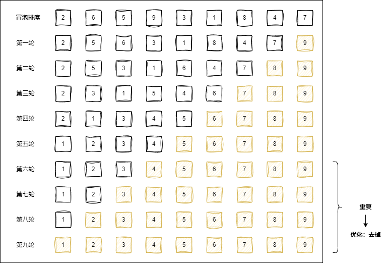
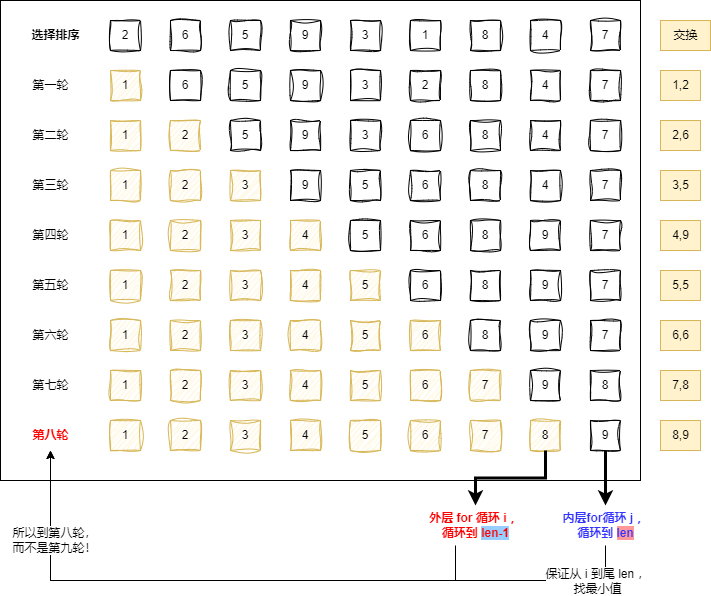
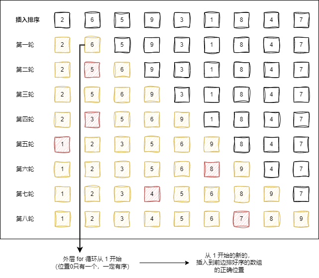
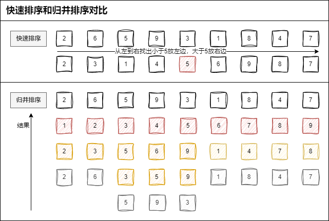
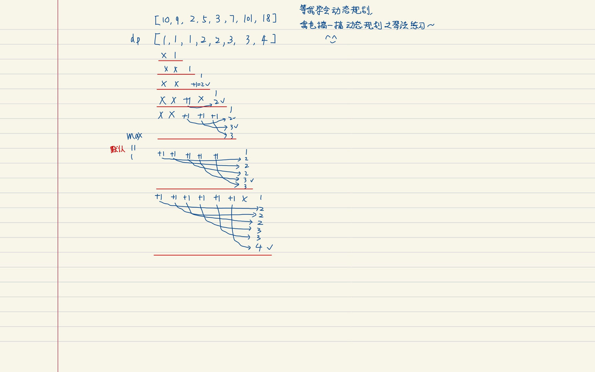

# 前言：排序为什么如此重要？<span style="color:red;">（很基础，只知道冒泡和快排是有问题的）</span><span style="color:red;">（双指针，难）</span>

我需要一个表格，在表格中根据一定的条件，筛选一部分的数据。

- **n 平方的排序，是蕴含着一定的 贪心 在里面的。**
- **n \* lgn 的排序，是蕴含着一定的 二分 在里面的。**

# 一、n 平方复杂度的排序有哪些？

[1]冒泡排序

[2]选择排序

- 选择最小的，开始交换。

[3]插入排序

- 插入数据，让前面的始终有序。

## 1.1 实现 冒泡排序 & 优化

优化思路：每一轮迭代，已经不迭代了，可以直接 break。



### bubbleSort.js

```js
// function bubbleSort(arr) {
//   const len = arr.length
//   for (let i = 0; i < len; i++) {
//     for (let j = 0; j < len - 1; j++) {
//       if (arr[j] > arr[j + 1]) {
//         ;[arr[j], arr[j + 1]] = [arr[j + 1], arr[j]]
//       }
//     }
//     console.log(arr.join(','))
//   }
//   return arr
// }

// 写冒泡：
function bubbleSort1(arr) {
  const len = arr.length
  for (let i = 0; i < len; i++) {
    for (let j = 0; j < len - 1; j++) {
      if (arr[j] > arr[j + 1]) {
        ;[arr[j], arr[j + 1]] = [arr[j + 1], arr[j]]
      }
    }
    console.log(arr.join(','))
  }
  return arr
}

// 优化 1：
// j < len - i - 1
function bubbleSort2(arr) {
  const len = arr.length
  for (let i = 0; i < len; i++) {
    for (let j = 0; j < len - i - 1; j++) {
      if (arr[j] > arr[j + 1]) {
        ;[arr[j], arr[j + 1]] = [arr[j + 1], arr[j]]
      }
    }
    console.log(arr.join(','))
  }
  return arr
}

// 优化 2：
// 每一轮迭代，已经不迭代了，可以直接break。
function bubbleSort3(arr) {
  const len = arr.length
  for (let i = 0; i < len; i++) {
    let unSwap = true
    for (let j = 0; j < len - i - 1; j++) {
      if (arr[j] > arr[j + 1]) {
        ;[arr[j], arr[j + 1]] = [arr[j + 1], arr[j]]
        unSwap = false
      }
    }
    if (unSwap) break
    console.log(arr.join(','))
  }
  return arr
}

// 测试：
// const arr = [2, 6, 5, 9, 3, 1, 8, 4, 7]
const arr1 = [2, 6, 5, 9, 3, 1, 8, 4, 7]
const arr2 = [2, 6, 5, 9, 3, 1, 8, 4, 7]
const arr3 = [2, 6, 5, 9, 3, 1, 8, 4, 7]

// console.time('bubbleSort')
// bubbleSort(arr)
// console.timeEnd('bubbleSort') // 5.124ms

console.time('bubbleSort1')
bubbleSort1(arr1)
console.timeEnd('bubbleSort1') // 0.459ms

console.time('bubbleSort2')
bubbleSort2(arr2)
console.timeEnd('bubbleSort2') // 0.355ms

console.time('bubbleSort3')
bubbleSort3(arr3)
console.timeEnd('bubbleSort3') // 0.238ms

console.log('冒泡排序数组，优化后：', arr3)
```

## 1.2 实现 选择排序

思路：选择 后面（内部循环）最小的，和外部循环 i 交换。  
注意：外部到 len - 1，内部到 len！

- 选择最小的，开始交换。



### selectSort.js

```js
function selectSort(arr) {
  const len = arr.length
  let minIdx
  for (let i = 0; i < len - 1; i++) {
    minIdx = i
    for (let j = i; j < len; j++) {
      if (arr[j] < arr[minIdx]) {
        minIdx = j
      }
    }
    if (minIdx !== i) {
      // 找到后面小的，交换（arr[minIdx] < arr[i]）

      ;[arr[i], arr[minIdx]] = [arr[minIdx], arr[i]]
    }
    console.log(arr.join())
  }
  return arr
}
const arr = [2, 6, 5, 9, 3, 1, 8, 4, 7]
selectSort(arr)
```

## 1.3 实现 插入排序

思路：从 1 开始的新的，插入到前边排好序的，数组的正确位置

- 插入数据，让前面的始终有序。



### insertSort.js

```js
function insertSort(arr) {
  const len = arr.length
  for (let i = 1; i < len; i++) {
    let j = i // j 倒着走
    // 当前我可能要插入或者要排的一个数据。
    let target = arr[j] // 记录要往前插入的值
    while (j > 0 && arr[j - 1] > target) {
      arr[j] = arr[j - 1]
      j--
    } // 目标前所有大于目标的往后移一位
    arr[j] = target // 此时 j 即插入位
    console.log(arr.join())
  }
  return arr
}
const arr = [2, 6, 5, 9, 3, 1, 8, 4, 7]
insertSort(arr)
```

# 二、n\*logn 复杂度的排序有哪些？

## 2.1 实现 快速排序

思路：选一个支点 pivot（少宾），让左边都是小于 pivot 的，右边都是大于 pivot 的，递归，concat 连接。


### quickSort.js

> 写法 Ⅰ

```js
function quickSort(arr) {
  // if (!arr.length) return []
  if (arr.length <= 1) {
    return arr.slice()
  }

  const pivot = arr[Math.floor(Math.random() * arr.length)]

  let left = []
  let right = []
  let middle = []

  for (let i = 0; i < arr.length; i++) {
    let val = arr[i]
    if (val < pivot) {
      left.push(val)
    }
    if (val === pivot) {
      middle.push(val)
    }
    if (val > pivot) {
      right.push(val)
    }
  }

  return quickSort(left).concat(middle, quickSort(right))
}
```

> 写法 Ⅱ

```js
function quickSort2(arr) {
  // if (!arr.length) return []
  if (arr.length <= 1) {
    return arr
  }

  const pivot = arr[arr.length - 1]
  const left = arr.filter((v, i) => v <= pivot && i !== arr.length - 1)
  const right = arr.filter((v) => v > pivot)

  return quickSort2(left).concat(pivot, quickSort2(right))
}
```

### 测试

```js
const arr = [2, 6, 5, 3, 3, 1, 8, 4, 7]

console.time('quickSort')
console.log(quickSort(arr))
console.timeEnd('quickSort')

console.time('quickSort2')
console.log(quickSort2(arr))
console.timeEnd('quickSort2')
```

### 实现 **原地快速排序**

## 2.2 实现 归并排序

思路：之前的有序数组合并，得来新的有序数组。

归并用的方法是合并两个有序数组。

[2,3,5,6,9] 和 [1,4,7,8] 合并，两个共同遍历，到最后剩余的那个一定是最大的值，比如这里的 9（因为本身就是两个有序数组合并）。

它也相当于一种分治，把一些问题拆解成了更小的问题，反向拆解问题，归并排序是在归的阶段（快速排序是递的阶段，这两个排序对比着看）。

### mergeSort.js

```js
function merge(left, right) {
  let res = []
  let i = 0
  let j = 0
  while (i < left.length && j < right.length) {
    if (left[i] < right[j]) {
      res.push(left[i])
      i++
    } else {
      res.push(right[j])
      j++
    }
  }

  if (i < left.length) {
    res.push(...left.slice(i))
  } else {
    res.push(...right.slice(j))
  }

  return res
}

// 这个函数的功能，是不是就是排序？input arr， --> sorted arr
function mergeSort(arr) {
  if (arr.length <= 1) {
    return arr
  }

  const mid = Math.floor(arr.length / 2)
  // mergeSort 本身给出的就是一个有序数组。
  const left = mergeSort(arr.slice(0, mid))
  // mergeSort 本身给出的就是一个有序数组。
  const right = mergeSort(arr.slice(mid))

  // 合并两个有序数组。
  return merge(left, right)
}

const arr = [2, 6, 5, 9, 3, 1, 8, 4, 7]

console.log(mergeSort(arr))
```

## 2.3 快速排序 vs 归并排序，区别是什么？



快速排序

- 递的阶段

归并排序

- 归并的主要方法，是递归地合并两个有序数组。
- 有序归来：  
  （我理解的：**先一层层向下递进搞了一堆 mergeSort 的 left、right，拆解成了一个个的小数组；**  
   **后来又在归的阶段，按大小顺序合并两个数组为有序的。）**

# 三、复杂度为 n 的排序算法有哪些？具体的思路是什么样的？

## 3.1 桶排序

核心在于分桶。

- 对 100W 个用户，进行年龄的排序。1000 \* 1000
  - 10-100
- 是不是可以对每个月的用户进行分桶，分成 1000 个桶。
- 那我就只要对 每个桶里，1000 个数据进行排序了。
  - 1000 \* 1000

步骤：

1. 要排序的数据，很容易就能分到 m 个桶里；
2. 数据在各个桶之间，分布比较均匀。

## 3.2 计数排序

计数排序是桶排序的一种特殊情况。  
100W 考生，我们按照分数排序的时候，其实就是计数排序。

- 当 N 个数据的范围不大的时候，其实每个桶就是数据值，桶内不用再排序。
- 0-750.
- 751 个桶。

## 3.3 基数排序

1. 对我们要排的数据有要求，需要可以分割出来位。

我把 100W 个电话号码进行排序。  
139-1234-5678  
139-1234-5678  
139-1234-5678

11 \* n --> n

# 四、一些题目

## 4.1 无重复最长子串

（返回 arr 的最长无重复元素子数组的长度）

a,b,c,a,b,c,b,b

a, b, c, d, c, c, a, b,

### 3.无重复字符的最长子串.js

```js
var lengthOfLongestSubstring = function (s) {
  // "abcabcbb"

  // 思路：
  // 输入：1.1 1.2 1.3
  // 循环：2.1, 2.2, 2.3.1, 2.3.2, 2.4, 2.5
  // 输出：3

  // 1.输入：
  let pStart = 0, pEnd = 0 // 1.1 左右指针
  let maxLength = 0 // 1.2 最长字串的长度
  const sArr = s.split('') // 1.3 字符串 -> 数组——数据结构

  // 2.用循环
  while (pEnd < sArr.length) {
    // 算法如下：
    const subArr = sArr.slice(pStart, pEnd) // 2.1 复制子串；
    const index = subArr.findIndex((item) => item === sArr[pEnd]) // 2.2 记录位置：子串的右指针值 -> subArr 里 sArr[pEnd] 位置；
    pStart = pStart + index + 1 // 2.3.1 左指针右移：子串存在右指针值 -> subArr 存在 sArr[pEnd]
    // 2.3.2 不存在，不右移 -> `index+1=-1+1=0`
    pEnd++ // 2.4 右指针：每次右移
    maxLength = Math.max(pEnd - pStart, maxLength) // 2.5 记录长度：最长子串
  }

  // 3.输出：
  return maxLength // 返回
}
```

## 4.2 盛水最多的容器

### 11.盛最多水的容器.js

```js
var maxArea = function (height) {
  let max = 0 // 起始面级
  let pStart = 0 // 左指针
  let pEnd = height.length - 1 // 右指针
  while (pStart !== pEnd) {
    const hStart = height[pStart] // 左高度
    const hEnd = height[pEnd] // 右高度
    const minHeight = hStart < hEnd ? hStart : hEnd // 最小高度
    const tmpMax = minHeight * (pEnd - pStart) // 面积
    max = max > tmpMax ? max : tmpMax // 与之前面积对比，记录最大面积
    hStart > hEnd ? pEnd-- : pStart++ // 左、右高度，低的向里走。
  }
  return max
}
```

## 4.3 最长上升子序列（之前做过，是错的）<strong style="color:red;">（※）</strong>

思路：看图画图。  
递归的迭代。



### 300.最长递增子序列.js

```js
var lengthOfLIS = function (nums) {
  // 假如我第 i 个值，大于 第 j 个值。
  // 那么，我的 dp[i] 的值。等于 j 从 0 到 i-1 各个位置的最长上升子序列+1 的最大值。
  let dp = []
  let max = 1
  dp[0] = 1

  for (let i = 1; i < nums.length; i++) {
    dp[i] = 1
    for (let j = 0; j < i; j++) {
      if (nums[i] > nums[j]) {
        dp[i] = Math.max(dp[j] + 1, dp[i])
      }
    }
    max = Math.max(dp[i], max)
  }

  return max
}
```

### 什么时候用动态规划？

1. 动规，其实就是转移方程。  
   如果能够把转移方程看出来，那这道题就解了一半了。

2. 什么时候用动规？  
   最核心的一点是，当你的局部最优解，和全局最优解，没有直接关系。

3. 比如：人通过各种路径去一个地方 place。  
   从上头走，一段 1s，这个是最优吗？不一定，但是之后可能需要 100s。  
   有可能从下头走，2s，3s，5s 就到了。

4. 所以就是当前局部最优解和全局最优解没有什么太大的关系。

5. 这个举例，让我想到了之前刷题 labuladong，14 天进阶。  
   最后一天，魔塔游戏？反正我是没解出来，可真太难。  
   不过我有这个思路了，知道是啥意思，也不错~跟迷宫一样~

第二波算法完喽~
