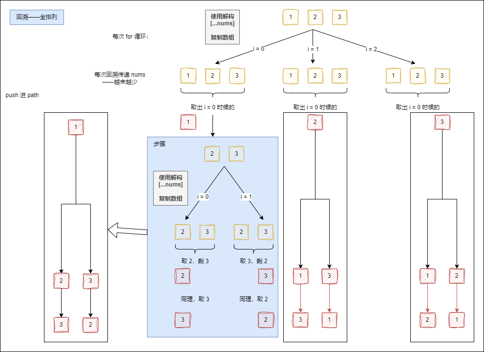

二分和回溯

# 一、二分搜索

## 1.0 概述

- 二分搜索包含在搜索算法里。  
  搜索算法有：顺序搜索、二分搜索、内插搜索。

- 二分搜索方法论：  
  [二分搜索算法总结](https://zhuanlan.zhihu.com/p/633311891)

## 1.1 典型二分（基本二分）

### 1）两种情形：

1. 寻找一个数的位置，没找到 return -1（704.二分查找）
2. 寻找一个数的位置，没找到返回插入的位置；（35.搜索插入位置）  
   如果说是找一个位置，return left ; return right + 1；

### 2）二分注意：

1. low <= high, 而不是 low < high ， 如果数组的长度是偶数，倒数第二步，low = high.
2. mid = low + ((high - low) >> 1); 而不是 mid = (low + high) / 2; 因为两者之和，有可能会溢出。（考察）
3. low = mid + 1; high = mid - 1. 如果你直接写成 low = mid 或者 high = mid， 可能会发生死循环。

### 3）二分场景：

1. 二分依赖的是顺序表，是数组，而不是链表；
2. 二分查找的一定是有序数组；
3. 数据量一般比较大。

## 1.2 题目

### 1.2.1 寻找一个数的位置

#### 704.二分查找.js

```js
var search = function (nums, target) {
  let low = 0
  let high = nums.length - 1
  while (low <= high) {
    /**
     * // 防止 left & right 太大相加导致溢出
     * let mid = left + (right - left) / 2;
     * // JavaScript 向下取整，可是困难到我了，测试用例运行 Run Code 一直不出结果，因为别的语言自动取整了，我要手动取整。
     * mid = Math.floor(mid);
     */
    let mid = low + ((high - low) >> 1)
    if (nums[mid] === target) {
      return mid
    } else if (nums[mid] < target) {
      low = mid + 1
    } else if (nums[mid] > target) {
      high = mid - 1
    }
  }
  return -1
  // 如果说是找一个位置，return left ;   return right + 1
}
```

### 1.2.2 确定一个数在有序数组中的位置

#### 35.搜索插入位置.js

> 法 Ⅰ：二分-while 循环

```js
var searchInsert = function (nums, target) {
  let low = 0
  let high = nums.length - 1
  while (low <= high) {
    let mid = low + ((high - low) >> 1)
    if (nums[mid] === target) {
      return mid
    } else if (nums[mid] < target) {
      low = mid + 1
    } else {
      high = mid - 1
    }
  }
  return high + 1
}
```

> 法 Ⅱ：二分-递归

```js
var searchInsert = function (arr, target) {
  const search = function (arr, target, low, high) {
    let mid = low + ((high - low) >> 1)

    if (arr[mid] === target) {
      return mid
    }

    if (low > high) {
      return low
    }

    if (arr[mid] < target) {
      return search(arr, target, mid + 1, high)
    } else {
      return search(arr, target, low, mid - 1)
    }
  }
  return search(arr, target, 0, arr.length - 1)
}
console.log(searchInsert([2, 3, 4, 5, 6, 7, 8, 9], 10))
```

### 1.2.3 求平方根

思路：

- 平方根一定是在这两个之间的：1----------x
- 不断地取中间值 mid 求平方，
- 比一下是否<=x（或者用 x 除以 mid 看大小），看看哪一个成立。

#### 69.x-的平方根.js

```js
var mySqrt = function (x) {
  let low = 1,
    high = x
  while (low <= high) {
    let mid = low + ((high - low) >> 1)
    if (mid * mid <= x) {
      if ((mid + 1) * (mid + 1) > x) {
        return mid
      }
      low = mid + 1
    } else {
      high = mid - 1
    }
  }
  return 0
}
```

### 1.2.4 搜索旋转排序数组

思路：二分左右指针。

1. 先看**中间值 mid** 在整个数组的哪个**位置**；
2. 有两种情况：  
   1）因为是先逐渐升高突然到达断点再从更低再爬回原来的起始点，比如：[4,5,6,7,0,1,2]；  
   2）所以要看 mid 在中间**断点悬崖左边还是右边**；断点左右分别有序，所以从 mid 在所在断点的相对位置->得知**某一边有序**。
3. 某一边有序->再看 **target 区间是否位于其中**，就可以像基本的二分一样修改左右 left、right 或者低高 low、high 指针，从而完成循环判断。不存在返回-1 呗。

总结：同基本的二分一样，就是**多了一层思路上的判断**。

#### 33.搜索旋转排序数组.js

读懂题目：

1. 首先：整数升序元素互不相同数组 nums ，  
   未知下标 k 位置，元素旋转 180° 。
2. 比如：[0,1,2,4,5,6,7] 下标 3 处 -> [4,5,6,7,0,1,2]
3. 已知：旋转后数组 nums ，整数 target
4. 求： search(nums, target) 函数，  
   target 在 nums ，  
   存在返回下标，  
   不存在返回-1 。

5. 时间复杂度 O(log n) 。

```js
/**
 * @param {number[]} nums
 * @param {number} target
 * @return {number}
 */
var search = function (nums, target) {
  let low = 0
  let high = nums.length - 1

  while (low <= high) {
    let mid = low + ((high - low) >> 1)

    if (nums[mid] === target) {
      return mid
    }

    if (nums[mid] >= nums[high]) {
      // 左边有序——[low, mid)
      if (nums[low] <= target && target < nums[mid]) {
        high = mid - 1
      } else {
        low = mid + 1
      }
    } else if (nums[mid] < nums[high]) {
      // 右边有序——(mid, high]
      if (nums[mid] < target && target <= nums[high]) {
        low = mid + 1
      } else {
        high = mid - 1
      }
    }
  }

  return -1
}
```

### 1.2.5 在排序数组中查找元素的第一个和最后一个位置

思路：题目要求 and 8 步（1 2 3 4 5 6 7 8）

找到 target 的范围区间内的值的时候——  
需要根据 true / false ——

- 左移右指针找（target 区间的）左边界，
- 右移左指针找（target 区间的）右边界；

从而找到左右边界；

#### 34.在排序数组中查找元素的第一个和最后一个位置.js

```js
// 题目要求：
// - 非递减顺序排列的整数数组 nums
// - 目标值 target
// - 开始位置和结束位置
// - 不存在 target，返回 [-1, -1]。
// - O(log n) 的算法
// nums = [5,7,7,8,8,10], target = 8
var searchRange = function (nums, target) {
  // 思路：题目要求 and 8 步（1 2 3 4 5 6 7 8）
  // 1. search fromLow
  const search = function (fromLow) {
    // 3. 左右指针
    let low = 0
    let high = nums.length - 1
    // 4. while循环
    while (low <= high) {
      // 5. 二分查找 mid
      let mid = low + ((high - low) >> 1)
      // 6. 二分查找 if
      if (nums[mid] < target) {
        low = mid + 1
      } else if (target < nums[mid]) {
        high = mid - 1
      } else {
        // 找到 target 的范围区间内的值的时候——
        // 需要根据 true / false ——

        // - 左移右指针找（target 区间的）左边界，
        // - 右移左指针找（target 区间的）右边界；

        // 从而找到左右边界；

        // 7. fromLow
        if (fromLow) {
          // 找左边界
          if (nums[mid] === nums[mid - 1]) {
            high = mid - 1
          } else {
            return mid
          }
        } else {
          // 找右边界
          if (nums[mid] === nums[mid + 1]) {
            low = mid + 1
          } else {
            return mid
          }
        }
      }
    }
    // 8. -1
    return -1
  }
  // 2. return [s..., s...]
  return [search(true), search(false)]
}
```

# 二、回溯<span style="color:red;">（常考，重点）</span>

## 2.0 概述

大部分情况下，解决的都是一个广义搜索的问题，也就是，从一组可能满足需求的解中，找出一部分正解。

1. 组合： N 个数，找 K 个数的集合；
2. 排列： N 个数，有几种排列方式；
3. 棋盘： N 皇后，数独。

## 2.1 回溯方法论

回溯大概率是一个公式：

```js
var combine = function(n, k) {
  const result = []
  const path = []

  function backtrack() {
    if(condition) {
      result.push([...path])
      return
    }
    for() {
      path.push()
      backtrack()
      path.pop()
    }
  }

  backtrack()

  return result
}
```

## 2.2 题目

### 2.2.1 组合 1：给定两个整数 n 和 k，返回范围 [1, n] 中所有可能的 k 个数的组合

#### 77.组合.js

```js
// 求：1 到 n，k个数的组合。
var combine = function (n, k) {
  // 1......n

  // 1. 先写 回溯公式

  // 1.1 result path

  const result = []
  const path = []

  // 1.2 backtrack

  function backtrack(path, startIndex) {
    // 1.3 if condition result

    // 2.
    // 到达树的底部
    //    k个数的组合，所以 path 长度为 k 为 condition。
    if (path.length === k) {
      // 3.
      // 停止回溯的条件就是：
      //    返回范围 [1, n] 中所有可能的 k 个数的组合
      //    ——每个组合有 k 个数
      //    ——每个组合长度为 k
      //    即：path 的长度为 k 。
      result.push([...path])
      return
    }

    // 1.4 for path.push backtrack path.pop

    // 注意 i 从 startIndex 开始递增
    // 注意小于等于 <=
    for (let i = startIndex; i <= n; i++) {
      path.push(i) // 做选择

      // 4.
      // 回溯阶段让 i + 1，实现 从 1 -> n 的遍历：
      //    i + 1 后，传给的就是新的 回溯 backtrack 的第二个参数 startIndex，
      //    也就在每次回溯的时候：得到 i 从 startIndex(i + 1) 开始遍历的初始点了。
      backtrack(path, i + 1)
      path.pop() // 撤销选择
    }
  }

  // 1.5 执行backtrack

  backtrack(path, 1) // 执行回溯

  // 1.6 return

  return result // 返回结果
}
```

### 2.2.2 组合 2：找出 candidates 中可以使数字和为目标数 target 的 所有 不同组合

#### 39.组合总和.js

```js
var combinationSum = function (candidates, target) {
  /**
   * 注意：
   * 排序，28行可用 break 或者 return ；
   * 不排序，28 行 用 continue ；
   */

  // 注意：必须排序，否则报错！
  // candidates = candidates.sort((a, b) => a - b)
  const res = []
  const path = []

  function backtrack(sum, startIndex) {
    if (sum === target) {
      res.push([...path])
      return
    }
    for (let i = startIndex; i < candidates.length; i++) {
      // 剪枝？
      if (candidates[i] + sum > target) continue
      path.push(candidates[i])
      // 在每次回溯时候：
      // 把当前循环的项 item(=candidates[i]) 与 sum 相加
      // ——从而计算下次回溯的参数：和 sum 。
      backtrack(candidates[i] + sum, i)
      path.pop()
    }
  }

  backtrack(0, 0)

  return res
}
```

### 2.2.3 组合 3：找出 candidates 中可以使数字和为目标数 target 的 所有 不同组合， candidates 不重复

#### 40.组合总和-ii.js

```js
var combinationSum2 = function (candidates, target) {
  // 注意：必须排序，否则报错！
  candidates = candidates.sort((a, b) => a - b)

  const res = []
  const path = []

  function backtrack(sum, startIndex) {
    if (sum === target) {
      res.push([...path])
      return
    }
    for (let i = startIndex; i < candidates.length; i++) {
      // 剪枝
      if (candidates[i] + sum > target) return
      // 数组中可能有相同的数据，这个数据会影响最后的结果，有重复。
      // 因为上面排过序了，这里判断 candidates 的 i 和 i -1 相同否，就可知道是否选择了重复的。
      if (i === startIndex || candidates[i] !== candidates[i - 1]) {
        path.push(candidates[i])
        // 在每次回溯时候：
        // 把当前循环的项 item(=candidates[i]) 与 sum 相加
        // ——从而计算下次回溯的参数：和 sum 。

        // !注意 i + 1
        backtrack(candidates[i] + sum, i + 1)
        path.pop()
      }
    }
  }

  backtrack(0, 0)

  return res
}
```

### 2.2.4 全排列 1：数组 nums ，返回其 所有可能的全排列



#### 46.全排列.js

```js
var permute = function (nums) {
  const result = []
  const path = []

  function backtrack(nums) {
    if (!nums.length) {
      result.push([...path])
      return
    }
    for (let i = 0; i < nums.length; i++) {
      // [1,2,3]
      const _nums = [...nums]
      const tmp = _nums.splice(i, 1)[0]
      path.push(tmp)
      backtrack(_nums)
      path.pop()
    }
  }

  backtrack(nums)

  return result
}
```

##### 思路：

```js
// 1. 读懂题目：
// 不含重复数字的数组 nums
// 全排列
// 按任意顺序
// 2. 写出思路：
// nums = [1,2,3]
// [[1,2,3],[1,3,2],[2,1,3],[2,3,1],[3,1,2],[3,2,1]]
var permute = function (nums) {
  // 1.先写回溯公式
  const result = []
  const path = []

  // 2.考虑backtrack参数
  function backtrack(nums, path) {
    // 5.condition
    //    nums.length === 0
    if (nums.length === 0) {
      result.push([...path])
      return
    }
    // 3.for：循环 nums
    for (let i = 0; i < nums.length; i++) {
      // 全排列：

      // 第一波 for 循环：
      //   [1,2,3]        [1,2,3]         [1,2,3]   ----------> nums
      //    1                2                 3    ----------> tmp[0]

      // 第二波 for 循环：
      // [2,3] [2,3]    [1,3] [1,3]     [1,2] [1,2] ----------> _nums
      //  2       3      1       3       1       2  ----------> tmp[0]

      // 第三波 for 循环：
      //   [3] [2]        [3] [1]         [2] [1]   ----------> _nums
      //    3   2          3   1           2   1    ----------> tmp[0]

      const _nums = [...nums]
      const tmp = _nums.splice(i, 1) // tmp[0] 是当前要push的值

      path.push(tmp[0]) // 4.path 元素为 nums[i]

      backtrack(_nums, path)

      path.pop()
    }
  }

  // 2.考虑backtrack参数
  backtrack(nums, path)

  return result
}
// 测试
// console.log(permute([1, 2, 3]))
// console.log(permute([0, 1]))
// console.log(permute([1]))
```

### 2.2.5 全排列 2：数组 nums ，返回其 所有可能的全排列，不重复

#### 47.全排列-ii.js

```js
var permuteUnique = function (nums) {
  nums.sort((a, b) => a - b)
  const result = []
  const path = []

  function backtrack(used) {
    if (nums.length === path.length) {
      result.push([...path])
      return
    }
    for (let i = 0; i < nums.length; i++) {
      if (i > 0 && nums[i] === nums[i - 1] && !used[i - 1]) {
        continue
      }
      if (!used[i]) {
        used[i] = true
        path.push(nums[i])
        backtrack(used)
        path.pop()
        used[i] = false
      }
    }
  }

  backtrack([])

  return result
}
```

### 2.2.6 N 皇后问题

#### 51.n-皇后.js

```js
var solveNQueens = function (n) {
  const res = []

  /**
   * 初始化棋盘
   */

  // '.' 表示空，'Q' 表示皇后，初始化棋盘
  // 0: (5) ['.', '.', '.', '.', '.']
  // 1: (5) ['.', '.', '.', '.', '.']
  // 2: (5) ['.', '.', '.', '.', '.']
  // 3: (5) ['.', '.', '.', '.', '.']
  // 4: (5) ['.', '.', '.', '.', '.']
  // length: 5
  const board = Array(n)
    .fill(-1)
    .map(() => Array(n).fill('.'))

  function backtrack(board, row) {
    const n = board.length
    // 结束条件
    if (row === n) {
      // 最后形成了 n 皇后 board ，把 n 皇后 board 的每一行转字符串，形成一组可行的 n 皇后给了 结果数组 res 。
      res.push(board.map((i) => i.join('')))
      return
    }

    for (let i = 0; i < n; i++) {
      if (valid(board, row, i)) {
        // go 本行设置 'Q'，for设置皇后
        board[row][i] = 'Q'
        // row + 1（until row = n-1），回溯（设置 'Q'）
        // ——（加 1 行 设置 Q ，每个回溯 都加 1 行，直到 row 是 n-1）
        backtrack(board, row + 1)
        // back 本行设置 '.'，for恢复棋盘
        board[row][i] = '.'
      }
    }
  }

  /* 是否可以在 board[row][col] 放置皇后？*/
  function valid(board, row, col) {
    const n = board.length
    /**
     * 1.检查列是否有皇后互相冲突
     */

    // 检查 col 列中，从 0 到 row 行，没有 Q
    for (let i = 0; i < row; i++) {
      if (board[i][col] === 'Q') return false
    }

    /**
     * 2.检查右上方是否有皇后互相冲突
     */

    // 2.1 检查：
    // 从上一行 row-1 （let i = row - 1,），
    // 从列加一 col+1 （j = col + 1;），
    // 开始；
    // 2.2 每次都让：
    // 行减一 i-1 （i--），
    // 以及（&），
    // 列加一 j+1 （j++）；
    // 2.3 符合：
    // （ i >= 0 && j < n;），
    // 条件；
    // 2.4 使得：
    // 右上对角线，如果有 Q 返回不合法 false 。
    for (let i = row - 1, j = col + 1; i >= 0 && j < n; i--, j++) {
      if (board[i][j] === 'Q') return false
    }

    /**
     * 3.检查左上方是否有皇后互相冲突
     */

    // 同理，以 `i=row-1,j=col-1` 为开始，i-- j--，左上对角线，如果有 Q 返回不合法 false 。
    for (let i = row - 1, j = col - 1; i >= 0 && j >= 0; i--, j--) {
      if (board[i][j] === 'Q') return false
    }

    /**
     * 4.没有不合法的，返回 合法 true
     */

    return true
  }

  backtrack(board, 0)

  return res
}
```
