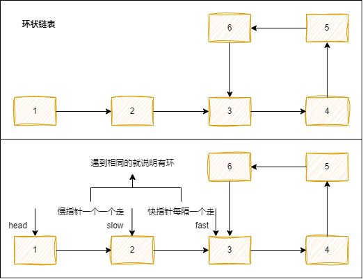
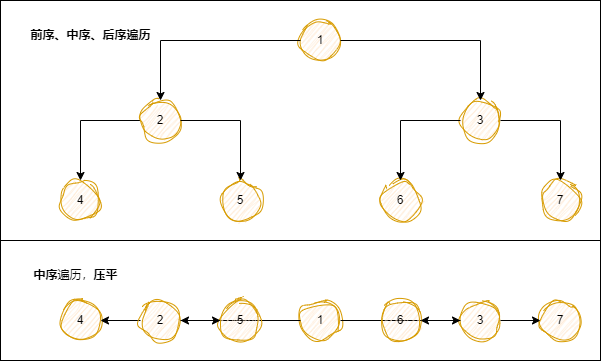
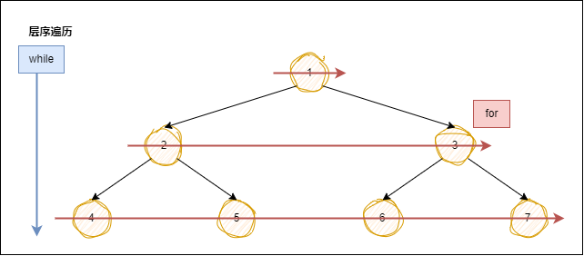

# 本章重点考点介绍

新年快乐~

## 简单说一说

1. 算法：解决一个问题、一系列问题的一个具体的步骤。

2. 数据结构：实际问题的抽象；把实际问题抽象成为数据结构。（青蛙跳井、接雨水）

3. 讲解顺序：数据结构、排序、双指针、动规（最近常考）、回溯（最近常考，尤其排列组合的题）、贪心、二分。

4. 链表 - React 源码：effect、nextEffect、lastEffect、updateQueue、hook、memoryStack。

5. 非常容易考：DOMTOJSON、JSONTODOM、数组打平。

## 实现一个 LRU 缓存

概念：LRU -- 最近最少使用（least recently used）。  
应用：vue - keep-alive 缓存。  
实现：LRUCache，缓存，有一个大小 capacity=2 `const lru = new LRUCache(capacity);`

lru.put(1, 1) // { 1 => 1 }
lru.put(2, 2) // { 1 => 1, 2 => 2 }
lru.get(1) // { 2 => 2, 1 => 1 }
// 1

lru.put(3, 3) // { 1 => 1, 3 => 3 }
lru.get(2) // { 1 => 1, 3 => 3 }
// -1

lru.put(4, 4) // { 3 => 3, 4 => 4 }
lru.get(1) // { 3 => 3, 4 => 4 }
// -1

### 1_lru.js

```js
// 函数的 get 和 put 必须以 O(1)的时间复杂度运行。
// get ，我是Hash, Map
// ES6 迭代器 iterator.

const LRUCache = function (capacity) {
  this.cacheQueue = new Map()
  this.capacity = capacity
}

LRUCache.prototype.get = function (key) {
  if (this.cacheQueue.has(key)) {
    // 如果我找到了，我是不是这个 key 对应的 value， 要提升新鲜度。
    const result = this.cacheQueue.get(key)
    this.cacheQueue.delete(key)
    this.cacheQueue.set(key, result)
    console.log(16, this.cacheQueue)
    return result
  }
  console.log(19, this.cacheQueue)
  return -1
}

LRUCache.prototype.put = function (key, value) {
  if (this.cacheQueue.has(key)) {
    this.cacheQueue.delete(key)
  }

  if (this.cacheQueue.size >= this.capacity) {
    // 删除 map 的第一个元素，即最长未使用的。
    this.cacheQueue.set(key, value)
    this.cacheQueue.delete(this.cacheQueue.keys().next().value)
  } else {
    this.cacheQueue.set(key, value)
  }
  console.log(35, this.cacheQueue)
}

// 测试用例：
const lru = new LRUCache(2)
lru.put(1, 1) // { 1 => 1 }
lru.put(2, 2) // { 1 => 1, 2 => 2 }
console.log(lru.get(1)) // { 2 => 2, 1 => 1 }
// 1
lru.put(3, 3) // { 1 => 1, 3 => 3 }
console.log(lru.get(2)) // { 1 => 1, 3 => 3 }
// -1
lru.put(4, 4) // { 3 => 3, 4 => 4 }
console.log(lru.get(1)) // { 3 => 3, 4 => 4 }
// -1

// 输出：
// 35 Map(1) { 1 => 1 }
// 35 Map(2) { 1 => 1, 2 => 2 }
// 16 Map(2) { 2 => 2, 1 => 1 }
// 1
// 35 Map(2) { 1 => 1, 3 => 3 }
// 19 Map(2) { 1 => 1, 3 => 3 }
// -1
// 35 Map(2) { 3 => 3, 4 => 4 }
// 19 Map(2) { 3 => 3, 4 => 4 }
// -1
```

## 求环状链表（简单，常见）

思路：慢指针一个一个走，快指针每隔一个走，遇到相同的就说明有环。



### 141.环形链表.js

```js
const hasCycle = function (head) {
  let fast = (slow = head)
  while (fast && fast.next) {
    fast = fast.next.next
    slow = slow.next
    if (fast === slow) {
      return true
    }
  }
  return false
}
```

## 二叉树的前序、中序、后序遍历

思路：  
前序，根在前；中序，根在中；后序，根在后。  
前中后序的前中后就是根的位置。



### 2_tree.js

```js
const treeRoot = {
  val: 1,
  left: {
    val: 2,
    left: {
      val: 4
    },
    right: {
      val: 5
    }
  },
  right: {
    val: 3,
    left: {
      val: 6
    },
    right: {
      val: 7
    }
  }
}

const preOrder = function (node) {
  if (node) {
    console.log(node.val)
    preOrder(node.left)
    preOrder(node.right)
  }
}

const inOrder = function (node) {
  if (node) {
    inOrder(node.left)
    console.log(node.val)
    inOrder(node.right)
  }
}

const postOrder = function (node) {
  if (node) {
    postOrder(node.left)
    postOrder(node.right)
    console.log(node.val)
  }
}

console.log(preOrder(treeRoot)) // 前序：1 2 4 5 3 6 7
console.log(inOrder(treeRoot)) // 中序：4 2 5 1 6 3 7
console.log(postOrder(treeRoot)) // 后序：4 5 2 6 7 3 1
```

### 144.二叉树的前序遍历.js

```js
/**
 * @param {TreeNode} root
 * @return {number[]}
 */
var preorderTraversal = function (root) {
  // 回溯算法思想
  let res = []
  const preOrder = function (node) {
    if (node == null) return
    res.push(node.val)
    preOrder(node.left)
    preOrder(node.right)
  }
  preOrder(root)
  return res
}
```

### 94.二叉树的中序遍历.js

```js
/**
 * @param {TreeNode} root
 * @return {number[]}
 */
var inorderTraversal = function (root) {
  // 回溯算法思想
  let res = []
  const inOrder = function (node) {
    if (node == null) return
    inOrder(node.left)
    res.push(node.val)
    inOrder(node.right)
  }
  inOrder(root)
  return res
}
```

### 145.二叉树的后序遍历.js

```js
/**
 * @param {TreeNode} root
 * @return {number[]}
 */
var postorderTraversal = function (root) {
  // 回溯算法思想
  let res = []
  const postOrder = function (node) {
    if (node == null) return
    postOrder(node.left)
    postOrder(node.right)
    res.push(node.val)
  }
  postOrder(root)
  return res
}
```

## 树的层序遍历

思路：

1. for 循环时，依次记录上层每个节点值且出队（记录过所以出队表示记录完成），并且在依次记录上层节点的过程中（在前面这个过程中），把下层节点（每个上层节点的左右节点）记录到队列 queue 里。
2. 这样 result 记录上层值，queue 记录下层节点；一直在 while 队列的长度 & 然后 for 循环队列；当队列 queue 为空的时候，也就是层序遍历完成之时。



### 102.二叉树的层序遍历

> （⭐）

```js
/**
 * Definition for a binary tree node.
 * function TreeNode(val, left, right) {
 *     this.val = (val===undefined ? 0 : val)
 *     this.left = (left===undefined ? null : left)
 *     this.right = (right===undefined ? null : right)
 * }
 */
/**
 * @param {TreeNode} root
 * @return {number[][]}
 */
var levelOrder = function (root) {
  if (!root) return []
  let queue = [root]
  let result = []
  while (queue.length) {
    let len = queue.length
    let level = []
    for (let i = 0; i < len; i++) {
      let node = queue.shift()
      level.push(node.val)
      node.left && queue.push(node.left)
      node.right && queue.push(node.right)
    }
    result.push(level)
  }
  return result
}
```

```js
/**
 * Definition for a binary tree node.
 * function TreeNode(val, left, right) {
 *     this.val = (val===undefined ? 0 : val)
 *     this.left = (left===undefined ? null : left)
 *     this.right = (right===undefined ? null : right)
 * }
 */
/**
 * @param {TreeNode} root
 * @return {number[][]}
 */
var levelOrder = function (root) {
  if (!root) return []
  let queue = [root]
  let result = []

  // 开始循环
  while (queue.length) {
    let tmpQueue = []
    let tmpResult = []
    let len = queue.length
    for (let i = 0; i < len; i++) {
      let node = queue.shift()
      tmpResult.push(node.val)
      node.left && tmpQueue.push(node.left)
      node.right && tmpQueue.push(node.right)
    }
    // 循环完毕后，
    result.push(tmpResult)
    tmpResult = []
    queue = tmpQueue
  }

  return result
}
```

## 获取二叉树的层级

法 Ⅰ：二叉树的层级，我可以直接 return 上面层序遍历的 length.

法 Ⅱ：

### 104.二叉树的最大深度

```js
var maxDepth = function (root) {
  if (!root) return 0
  return Math.max(maxDepth(root.left), maxDepth(root.right)) + 1
}
```

## 实现 类数组转数组

### 3_arr.js

```js
const arrayLike = document.querySelectorAll('div')

// 1.扩展运算符
const arr = [...arrayLike]
// 2.prototype
Array.prototype.slice.call(arrayLike)
Array.prototype.concat.apply([], arrayLike)
Array.apply(null, arrayLike) // Array 是构造函数
// 3.JS 权威指南 7.1.5 Array.from() P146
Array.from(arrayLike)

// -------------------------------------------

function test() {
  // console.log(typeof arguments)
  let args = arguments
  const c = Array.apply(null, args)
  console.log(c, args)
}
test(1, 2, 3, 4)
```

# <span style="color:red;">1:01:11</span>

## 实现 DOM 转 JSON<span style="color:yellowgreen;">（经典）大厂概率高</span><span style="color:red;">（简单，常考）</span>

```js
const dom = document.getElementById('head_wrapper')

function dom2json(dom) {
  let obj = {}
  obj.name = dom.tagName
  obj.children = []
  dom.childNodes.forEach((child) => obj.children.push(dom2json(child)))

  return obj
}

dom2json(dom)
```

## 实现 JSON 转 DOM<span style="color:yellowgreen;">（经典）大厂概率高</span><span style="color:red;">（考的少一点，可能遇到）</span>

### json2dom.html

```html
<!DOCTYPE html>
<html lang="en">
  <head>
    <meta charset="UTF-8" />
    <meta http-equiv="X-UA-Compatible" content="IE=edge" />
    <meta name="viewport" content="width=device-width, initial-scale=1.0" />
    <title>Document</title>
  </head>

  <body>
    <div id="root"></div>
  </body>
  <script>
    window.onload = function () {
      console.log('on load')
      const json = {
        tag: 'div',
        attrs: {
          id: 'app',
          className: 'app'
        },
        children: [
          {
            tag: 'ul',
            children: [
              { tag: 'li', children: ['list 1'] },
              { tag: 'li', children: ['list 2'] },
              { tag: 'li', children: ['list 3'] },
              { tag: 'li', children: ['list 4'] },
              { tag: 'li', children: ['list 5'] }
            ]
          }
        ]
      }

      function json2dom(vnode) {
        if (typeof vnode === 'string' || typeof vnode === 'number') {
          return document.createTextNode(String(vnode))
        } else {
          const __dom = document.createElement(vnode.tag)
          if (vnode.attrs) {
            Object.entries(vnode.attrs).forEach(([key, value]) => {
              if (key === 'className') {
                __dom[key] = value
              } else {
                __dom.setAttribute(key, value)
              }
            })
          }
          vnode.children.forEach((child) => __dom.appendChild(json2dom(child)))
          return __dom
        }
      }

      const app = json2dom(json)
      document.getElementById('root').appendChild(app)
    }
  </script>
  <style>
    .app {
      background-color: aqua;
    }
  </style>
</html>
```

## 实现 树转数组<span style="color:yellowgreen;">（经典）大厂概率高</span>

### treeToList

> 4_treeAndList.js

```js
const root = [
  {
    id: 1,
    text: '根节点',
    children: [
      {
        id: 2,
        text: '一级节点1'
      },
      {
        id: 3,
        text: '一级节点2',
        children: [
          {
            id: 5,
            text: '二级节点2-1'
          },
          {
            id: 6,
            text: '二级节点2-2'
          },
          {
            id: 7,
            text: '二级节点2-3'
          }
        ]
      },
      {
        id: 4,
        text: '一级节点3'
      }
    ]
  }
]

function treeToList(root) {
  let res = []

  const dfs = function (data, parentId) {
    data.forEach((item) => {
      if (item.children) {
        dfs(item.children, item.id)
        delete item.children
      }
      item.parentId = parentId
      res.push(item)
    })
  }

  dfs(root, 0)

  return res
}
```

## 实现 数组转树<span style="color:yellowgreen;">（经典）大厂概率高</span><span style="color:red;">（难，链表相关）</span>

### listToTree

> 4_treeAndList.js

```js
const list = [
  { id: 2, text: '一级节点1', parentId: 1 },
  { id: 5, text: '二级节点2-1', parentId: 3 },
  { id: 6, text: '二级节点2-2', parentId: 3 },
  { id: 7, text: '二级节点2-3', parentId: 3 },
  { id: 3, text: '一级节点2', parentId: 1 },
  { id: 4, text: '一级节点3', parentId: 1 },
  { id: 1, text: '根节点', parentId: 0 }
]

function listToTree(data) {
  let deps = {}
  let result = []
  // 依赖收集一遍。
  data.forEach((item) => {
    deps[item.id] = item
  })

  for (let i in deps) {
    if (deps[i].parentId != 0) {
      if (!deps[deps[i].parentId].children) {
        deps[deps[i].parentId].children = []
      }
      deps[deps[i].parentId].children.push(deps[i])
    } else {
      result.push(deps[i])
    }
  }
  return result
}

console.log(JSON.stringify(listToTree(list)))
```

## 实现 数组打平<span style="color:yellowgreen;">（经典）大厂概率高</span><span style="color:red;">（简单）</span>

```js
const arr = [1, 2, 3, [4, 5, [6, 7, 8], 9, 20]]

function flatten(arr) {
  if (!arr.length) return
  return arr.reduce(
    (pre, cur) =>
      Array.isArray(cur) ? [...pre, ...flatten(cur)] : [...pre, cur],
    []
  )
}

console.log(flatten(arr))
```

## 实现 对象打平<span style="color:yellowgreen;">（经典）大厂概率高</span>

```js
const obj = {
  a: {
    b: {
      c:1,
      d:2,
      e:3
    }
  }
};
-->>>
{
  a.b.c: 1,
  a.b.d: 2,
  a.b.e: 3,
}

```

### 5_flatten.js

```js
const obj = {
  a: {
    b: {
      c: 1,
      d: 2,
      e: 3
    }
  }
}

function flatten(obj) {
  if (typeof obj !== 'object' || obj === null) {
    return
  }

  let res = {}

  const dfs = function (cur, prefix) {
    if (typeof cur === 'object' && cur !== null) {
      for (let k in cur) {
        dfs(cur[k], `${prefix}${prefix ? '.' : ''}${k}`)
      }
    } else {
      res[prefix] = cur
    }
  }

  dfs(obj, '')

  console.log(res)
}

flatten(obj)
```

# 总结

剑指 Offer 简单中等

力扣 top100 简单中等
