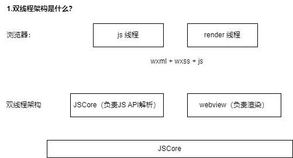

UniApp 基础

# uniapp

> https://hx.dcloud.net.cn/Tutorial/install/macosx

## 课程分布

1. uniapp 是什么？背景。
2. uniapp 能干什么？配置、原理。
3. uniapp 怎么干？实战。

## uni-app 体感

一开始以为 H5 套壳。

后来阅读了源码相关的东西，大概了解整体的设计思路，以及背后的逻辑，以及面向国内开发者的 case。

真香：

- 调料界的老干妈，
- 鸡尾酒界的 rio。

### 生态 - 一款商业化做的最好的技术框架

IDE - HBuilderX

生态特别好，连开发的 IDE 都有，对国内非常友好。

官网非常的全：[uni-app](https://uniapp.dcloud.net.cn/)

（先讲微信小程序）

## 为什么会有微信小程序？

小程序和微信小程序，本质上是两个东西。

在没有微信小程序的时候，企业开发自己的微信引流 - H5

- 挂靠超级引流 weixin
- 接入成本低：扫一扫、附近、搜索
- 用户鸿沟低：不用下载 APP，不用记录 url
- 更安全：用微信做大的技术团队的背靠，更安全。

这里面牵扯到双线程架构，什么是双线程架构？

微信小程序出来以后，出来了一个：双线程架构。

### 双线程架构

> 我们知道：
>
> - 浏览器至少有两个东西：js 线程，渲染线程。
> - 微信为什么不直接用浏览器，为什么要搞一个双线程架构？
> - 为什么要有 wxml + wxss + js，本来有 js 线程和 render 线程就行了。

先看双线程架构有什么：

```
浏览器：
    ----------      --------------
    | JS 线程 |     | render 进程 |
    ----------      --------------
双线程架构：
  -------------     ----------------
  |  JSCore   |     |    webview   |
  -------------     ----------------
--------------------------------------
|              JSBridge              |
--------------------------------------
```



#### 问题 1：为什么要用双线程？（为什么会有双线程？）

【1】正常写 html 的形式，有什么缺点？

```html
<body></body>

<script></script>
```

[1]慢：首先，要打开一个浏览器，还要 下载 h5，下载 js，本身 js 和 h5 还是异步。

比如有的同学要用 defer，async 这些：

- defer, async 本质上解决什么？只是合理的安排了资源的解析而已。 wxSDK（微信角度来说，有个 weixin SDK）

- 但是单线程的问题，导致了慢。  
  不光 js 要下载，执行，还要请求。

[2]web 本身 是不是有很大的安全风险

- 很多时候用 JavaScript 去调用 window.api，但是 window.api 太多了，跳转页面，操作 DOM，动态执行脚本，你很难禁用掉这些风险。

【2】所以就需要：

- 需要一个沙箱环境来处理开发者编写的 JavaScript 代码。这个沙箱环境不能有任何 window.api  
  （跟浏览器相关的 API 不能有，我只是提供 JS 的解析环境）

【3】所以这样整个 app 就成了 双线程架构：

- JSCore 就是 API 解析，
- 右边是 webview，负责渲染的，
- 中间通过 JSBridge 和原生 native 之间进行通信。

#### 问题 2：为什么要用 wxml 这种东西？

> 如果是 webview，我直接写 h5 不好吗？  
> 为什么要写 `<view></view>` 这种标签？

（在小程序）**整体上还是封装了一层**。

> 为什么要封装这一层？  
> （为什么要有自己的一套语言标识？）

- web 可以**通过脚本，来修改页面的敏感内容信息**
- H5 能力有限，会**限制一些小程序的表现**
- 用 veiw，text 让**整个理解成本更低**：把它收拢为自己提供的十几个 api

### 微信小程序做了什么？

**小程序使用一种双线程的架构，提供了 10 多个内置组件来收敛 h5 的标签，并且提供了一个 javascript 的 运行时环境来避免 js 访问到任何 浏览器 api。**

---

特点：很适合小公司。

## 原理【21:01/1:52:14】


Vue code：

script + template + style：

native platform：

H5 platform：

microapp platform：

## uni-app 工程，环境搭建

### 方法一、直接通过 HBuilder 创建

微信开发者工具，本质是一个宿主环境。

### 方法二、

## Q&A

### .vue 到 wxml / wxss 是怎么转换的？

### 埋点
