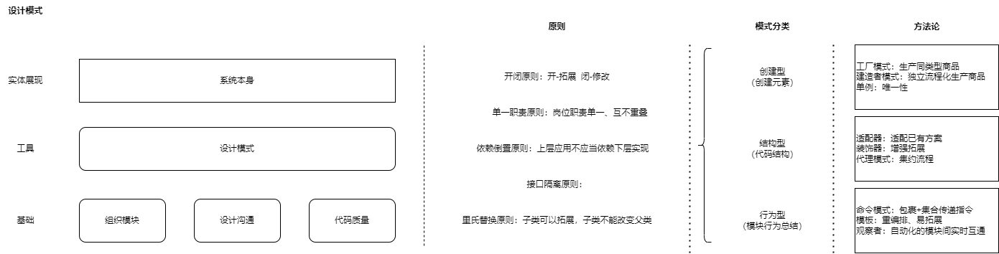

**设计模式**解析与实战（上）

# 零、概览

关注以下四点：

1. 什么是设计模式？
2. 设计模式要细化到哪些点上？
3. 什么时候应该用什么样的设计模式？
4. 设计模式在前端真的那么重要吗？



# 一、大纲

## 一、代码的最佳实践 —— 设计模式

### 1.系统性多赢

### 2.代码编制的真正工程化

## 二、设计模式扮演的角色

### 3.帮助组织模块

    帮助我们组织模块
    通过一些设计模式，组织模块间的组成结构

### 4.帮助设计沟通

    有的设计模式可以帮助我们设计模块间的组成结构

### 5.提高代码质量

    通过设计模式，让代码更加优雅

## 三、设计原则

### 5.开闭原则

    程序要对扩展开放，对修改关闭

### 6.单一职责原则

    模块只做一件事情，模块的职责越单一越好

### 7.依赖倒置原则

    上层模块不要依赖与具体的下层模块，应该依赖于抽象

### 8.接口隔离原则

    接口要细化，功能要单一，一个接口不要调用太多方法，使其能力单一

### 9.里氏替换原则

    它主要关注于继承，它的意义是任何使用父类的地方都可以用子类去替换

## 四、模式分类

### 10.创建型

    工厂模式、建造者模式、单例模式

### 11.结构型

    适配器模式、装饰器模式、代理模式

### 12.行为型

    命令模式、模板模式、观察者模式

## 五、模式设计实战

## 六、系统设计类题目

# 二、基础概念

## 2.1 什么是设计模式？

【1】设计模式是什么？

- 针对于设计问题的**通用解决方案**：  
  这个设计不是页面设计、产品设计，而是对于代码、架构的整个设计问题的通用解决方案；

【2】设计模式的出现提供了什么？

- 设计模式的出现提供了一个**通用的方法论**：  
  前人一定程度**提炼**出来的针对某些场景做的设计，这个设计**最有利于开发、最有利于后期维护、最有利于拓展**；

【3】在什么样的层级归纳结构下？

**基础**（真正开发需要关注的）——**整个层级结构**:

- **组织模块：**  
  列表、详情、编辑、上传文件、下载文件，拆分功能区块，模块；
- **设计沟通：**  
  模块与模块设计沟通，模块的接口是什么，每个接口传递的参数是什么，接口回调如何做，返回什么，返回的参数又是什么？
- **代码质量：**  
  代码鲁棒性（robust）、健壮性如何？是否可以经历边缘验证/边缘场景的测试？代码与代码质量是否稳定？

【4】基于基础之后的，设计模式的归纳和统一：

- 满足者三者的切分维护、拓展，限定在一个区域范围内：  
  A、B 同学开发两个不同的模块——怎样让两个同学齐头并进？都能有固定的最优的代码质量、最强的鲁棒性、最易拓展的可拓展性？  
  大家都遵循、参考同一条*优秀的开发方法论*。

【5】设计模式，就是这样一个*中间层工具*：  
这些都是为了更好的*服务于上层*的*系统本身*，又可以称之为实体展现。

**工具**：

- **设计模式**；

**实体展现**：

- **系统本身**；

【6】总结：

- **设计模式就是**这样的一个**解决方案**。

## 2.2 设计模式好处

- 有利于**代码复用**
- 有利于代码的**稳定可拓展**
- 有利于代码**可读性**的提升

这也是利用设计模式所想要实现的最终目标。

## 2.3 什么时候需要设计模式？

## 2.4 设计模式需要掌握的程度如何？

## 2.5 最后，设计模式的地位：

- 设计模式在代码开发中，处于一个基于基础理念之上，在具体实现之下，中间的方法论工具，这个地位。

# 三、软件开发领域、硬件开发领域的，始终遵循的**几大原则**：

## 3.1 开闭原则：开-拓展 闭-修改<span style="color:red;">（使用过）</span>

拓展类持开放态度，破坏性的修改持封闭态度。

开闭原则的理念：  
已有场景下，保护自己的拓展能力同时，拒绝外部侵扰。

> OCP.js

```js
// 开闭原则（OCP）- 对拓展开放、对修改关闭
// 目标：已有的场景下，对于需要拓展的功能进行开放、拒绝直接的破坏性功能修改

// 【1】假设我们是游戏开发工程师，当前迭代分为三个 sprint 冲刺：

// sprint 1 - 中秋节活动，吃鸡要高亮 + LOL要弹出折扣价格

// render 层
if (game === 'PUBG') {
  // 高亮
} else {
  // ...
}

// event 层
if (game === 'LOL') {
  // 弹出折扣框
} else {
  // ...
}

// sprint 2 - 要对部分游戏进行置灰 + 付款页面弹框要展示停止发售
// ——快速响应 下架、置灰 这两个能力。

// render 层
if (game === 'PUBG') {
  // 高亮
} else if (game === 'yy') {
  // 置灰
} else {
  // ...
}

// event 层
if (game === 'LOL') {
  // 弹出折扣框
} else if (game === 'yy') {
  // break + 提示停止发售
} else {
  // ...
}

// 【2】需求完成了，但是同样带来了一个问题：
// 今天上架活动、明天下架活动，循环这种操作——所有逻辑变成了一个 逻辑串、判断的流水线：
// 需要根据时间的维度做一个判断，先判断最早的需求、然后中间的、然后最新的需求，一层层判断，从而展现每个需求；
// 虽然已经把 render 和 event 区分开了， 做到了一定的业务度的区分，但依旧是面条代码，首尾相连。

// 【3】重构
// - 依旧保留 render event
// - 针对 改动频繁、逻辑变化相对统一、逻辑变化不太大 的代码；
// - 避免使用 面条代码（长 `if-else` 判断）；
// - 需求：高亮置灰、弹框；

// render 渲染层：
gameManager(game).setColor() // 通过游戏管理者，传递游戏名称，设置颜色高亮

// event 事件层：
gameManager(game).openDialog() // 通过游戏管理者，传递游戏名称，弹框提示是否折扣

// game 库：
function gameManager(game) {
  return `${game}Manager`
} // 采用归纳法，都是对主体（游戏）的修饰，所以新生成一个游戏仓库 gameManager

// 【4】导引
// - 将拍平的平面逻辑 -> 变成 上下级的中间层的管理器：gameManager 游戏管理者；
// - 在给每一种类型的游戏 添加配置的时候，对于每种游戏都可以 进行封装/导引；

const LOLManager = {
  setColor() {
    // 正常逻辑
  },
  openDialog() {
    // 折扣框：弹出折扣框
  }
} // 正常展示，且弹出折扣框

const PUBGManager = {
  setColor() {
    // 高亮：中秋节活动
  },
  openDialog() {
    // 付款框：没有折扣直接付款框
  }
}

// 【5】面条结构 -> 中间管理器 & 相应游戏管理器的配置的调用：
// - 这样就把整个 面条结构 变成了 **中间管理器-游戏管理器的调用**，以及**每一款游戏的配置**；
// - 这个时候可以通过 中间管理器 gameManager 快速的传入一个名称 gameManager(name) ，可以返回当前游戏的配置项；
// - 而要做/修改哪款游戏的时候，我要返回的是这款游戏里/配置项里所做的逻辑 setColor、openDialog ，分别是在每一款游戏下进行配置的。

// 好处：
// - 这样产品再次提出一个需求：x年x月x日/三个月前提供了一个需求：LOL 这款游戏弹出了折扣框，现在想延长这个日期/把折扣框下下来；
// - 按照之前的逻辑，我还在 if-else 一个一个找的时候，重构的已经快速的找到了LOL的管理器 LOLManager，并且将它的折扣框下架下来。
// - 这样就真正的把面条代码，真正的按照**配置化**做了**归类**——一款游戏就是一个配置，一个响应的框。

// 【6】细心的同学已经发现了问题：
// - 虽然已经拆分了，但是配置有一定的重复——配置有可能是相同的，都有 setColor、openDialog；
// - 为什么要花很大的篇幅去配置——如果有 20 项，相同的还写 就会产生很多冗余的代码；
// - 能否做一套**默认逻辑——处理默认项的配置**，而每款游戏 Manager 下面只做特异性的配置？
// - 答案是可以的，这就是**叠加型继承的思想**。

// 【7】重构2
// 默认逻辑——Game 类里收归默认逻辑
class Game {
  constructor(name) {
    this.name = name
  }

  setColor() {
    // 正常显示，不高亮
  }

  openDialog() {
    // 正常付款
  }
}

// LOL 继承 Game
class LOL extends Game {
  openDialog() {
    // 折扣框
  }
}

// PUBG 继承 Game
class PUBG extends Game {
  setColor() {
    // 高亮
  }
}
// 再次使用时，new LOL 的实例、new PUBG 的实例 -> 具体使用时，
// 既能拿到 Game 通用属性的默认逻辑，同时更加优先的取到游戏本身的实例上的东西。

// 重构目标 => 便于拓展（利用原有属性 & 在原有属性上拓展） | 封闭改动（不能在面条代码上）

// 这就是 开闭原则：
// 允许拓展，拒绝修改
```

## 3.2 单一职责原则：岗位职责单一、互不重叠

确认什么东西是职责

> SRP.js

```js
// SRP - 通过解耦让每一个模块职责更加独立
// 目标 - 一个功能模块只能做一件事

// sprint----------------------------------------------------
// game store ——计算最后的折扣金额
class PUBGManager {
  openDialog() {
    // 弹框结算
    // 计算结算金额
    setPrice()
  }
}

const game = new PUBGManager()
game.openDialog() // 弹框 < = > 计算金额 两个维度相同的模块耦合

// 【1】对于以上解释说明：
// 对于：openDialog() VS setPrice() / 弹框 VS 计算金额
// 虽然：技术层面 => 都是同一个维度-都服务于游戏本身
// 但是：业务上 => 面向游戏主营业务-提供游戏的服务 VS 服务于给我们赚钱(功能倾向于收费能力)-更倾向于业务底层 => 通用底层仓库

// 通用底层仓库：比如 报表：
// A业务/视频电话 B业务/文字聊天 C业务/卖东西 D业务/收费 回款
// 主营业务是 C业务

// 【2】重构
// 业务前台
// gameManager.js - 业务仓库
class PUBGManager {
  constructor(command) {
    this.command = command
  }
  openDialog(price) {
    // 弹框结算
    commandLine.forEach((_command) => {
      this.command?[_command]
        && this.command[_command](price)
    })
  }
}

// 指令集 utils/commands.js
export {
  commandLine
}

// optManager.js - 底层仓库 中台
class PriceManager {
  setPrice(price) {
    // 配置金额
  }
}

// main.js
const exe = new PriceManager()
const game1 = new PUBGManager(exe)
game1.openDialog(15)

// 没必要抱团的模块，让他们产生明确的边界
```

## 3.3 依赖倒置原则：上层应用不应当依赖下层实现

上层应用不应当依赖下层实现，而只依赖下层暴露的接口(下层的抽象)。

> DIP.js

```js
// DIP
// 目标：面向抽象进行coding，而不是对实现进行 coding，降低需求与实现的耦合

// sprint1------------------------------------------
// 【1】分享功能——游戏商城分享不同平台
class Store {
  constructor() {
    this.share = new Share()
  }
}

class Share {
  shareTo() {
    // 分享到不同的平台
  }
}

const store = new Store()
store.share.shareTo('wx')

// sprint2-----------------------------------------
// 【2】评分功能
class Store {
  constructor() {
    this.share = new Share()
    this.rate = new Rate()
  }
}

class Share {
  shareTo() {
    // 分享到不同的平台
  }
}

class Rate {
  rate() {
    // 评分
  }
}

const store1 = new Store()
store1.rate.rate(5)

// 【3】存在的问题：
// - 功能与功能之间相互独立，相互解耦；
// - 新增功能，还得更改 Store 的 constructor 的内容；
// - 配置项 频繁的进行增加和删除；
// - 对于以上这汇总实现方式来说，就会频繁的 核心代码/底层代码 - 增加逻辑 & 删除

// - 这改动的就不是 维持接口不变 的底层和上层应用了。
// - 而是 加上逻辑后，底层核心跟着一起改动；
// - 核心 & 依赖本身 => 产生了 上下层之间的耦合；

// 解耦就要实现动态挂碍。

// 【4】重构
// 目标：暴露挂载 => **动态挂载**（下面新增功能，上面 Store 自动的 动态挂载 => 增加的始终是 接口定义-接口的抽象定义，而不是底层实现的定义，从而满足依赖倒置的原则。）
// **挂载**应当放入各个**新增的模块中去做**，但是核心要提供一个**通用的挂载能力**。
class Store {
  // 维护模块名单（挂载）
  static modules = new Map()

  constructor() {
    // 遍历当前的名单做初始化挂载
    for (let module of Store.modules.value()) {
      module.init(this) // 每个模块分别进行init 并传入 实例
    }
  }

  // 注入功能模块
  static inject(module) {
    Store.modules.set(module.constructor.name, module)
  }
}

class Rate {
  init(store) {
    store.rate = this
  }
  store(stars) {
    // 评分
  }
}

class Share {
  init(store) {
    store.share = this
  }
  shareTo(platform) {
    // 分享到不同的平台
  }
}

// 依次注册完所有的模块
const rate = new Rate()
Store.inject(rate)

const share = new Share()
Store.inject(share)

const rate2 = new Rate()
Store.inject(rate2)

// 初始化商城
const store2 = new Store()
store2.rate.star(4)

// 注意：这里应当**依赖于 inject 做实现**，而不应当更改原来源代码：Store；
// 如果是**频繁增加、修改配置的逻辑**，每次增加、修改都要改底层的代码的话，是不合适的。
// 需要：**动态设置、动态配置——动态挂载**；
// 这就是依赖倒置的原则。
```

上下层隔离，就满足依赖倒置原则。

## 3.4 接口隔离原则：

胖接口 -> 专业接口

接口：

- 接口抽象、抽象隔离；
- 模块，外部来看就是几个接口，不关心模块里有什么，只关心有几个接口。

带来了什么问题：

- 接口与接口之间是否有重复。

> ISP.js

```js
// ISP
// 专业接口 胖度接口
// 目标：多个专业接口比单个胖接口要好用
// 多个胖接口有业务压力。

// sprint----------------------------------------------------
// 【1】已经可以开发游戏了，但是要实现游戏中台 - 快速生产游戏

// 为什么要实现游戏中台？
// 游戏应当中台化，不应该来一个游戏就开发一个游戏，而应该把中台的模块抽象出来一部分游戏方法 & 通用能力，将游戏一个一个呈现出来。
// 以致快速生产游戏

// 现在要快速生产 PUBG LOL 这两款游戏。
// PUBG LOL
class Game {
  constructor(name) {
    this.name = name
  }
  run() {
    // 跑
  }
  shot() {
    // 开枪
  }
  mega() {
    // 开大
  }
  // ...
}

// 基于中台生成游戏
class PUBG extends Game {
  constructor() {
    // pubg constructor
  }
}

class LOL extends Game {
  constructor() {
    // LOL constructor
  }
}

// 以上这样，可以快速通过中台生产游戏了。

// 【2】问题：但是 子类不应当拥有的能力，开大 mega 也从中台 Game 继承了过来。
// 不应当将所有的子类，忽略现实情况，将这样一个胖度的抽象，完整的提供给上层；
// 而应当根据上层的隔离，实现上层的一定程度的上层的拆分维护；
// 应有的东西，上层做独立的拆分维护；

// 原本底层的胖度接口，做专业性的专业接口隔离。
const pubg = new PUBG('pubg')
pubg.run()
pubg.shot()
pubg.mega()

// 【3】重构 - 用多个接口替代它，每个接口服务于一个子模块
// 瘦身
// 多层抽象
class Game {
  constructor(name) {
    this.name = name
  }
  run() {
    // 跑
  }
}

// 【5】注意——中间层：

// 中间层、胶水层、中间过滤层。
// 网络层级，鉴权 权限
// 侧边栏，顶栏底栏，登录态信息，
// 网络层存储层，window 信息，
// 这些增加了很多层级模块 最通用、最专业的部分。

// 或者一个胖度接口，维护在一个地方，需要了全部给它。
class FPS {}

class MOBA {}

class PUBG extends Game {
  constructor() {
    // pubg constructor
  }
  shot() {}
}

class LOL extends Game {
  constructor() {
    // LOL constructor
  }
  mega() {}
}

// 【4】注意：

// 底层不应该判断要向外暴露什么。
// 如果需要底层判断，那么这个不应该成为底层的通用能力。
// 如果觉得应该是底层，说明中间缺少专业的层级。

// 以逻辑层级换专业性。
// 更加专业，更加细分更加精确的专业领域的时候，增加层级；
// 以增加层级的方式，去弥补原本接口的不专业性。
// 从而让它更加专业性。
```

## 3.5 里氏替换原则：子类可以拓展，子类不能改变父类

任何父类出现的地方，子类都可以替换掉。  
子类可以拓展，但不能改变父类的能力。

> LSP.js

```js
// LSP - 里氏替换原则
// 目标：子类能够覆盖父类，父类能够出现的地方子类就能够出现

// sprint1
// 【1】开发玩游戏
class Game {
  start() {
    // 开机
  }
  shutdown() {
    // 关机
  }
  play() {
    // 开始pc游戏
  }
}

const game = new Game()
game.play()

// sprint2
// 【2】游戏改革：端游 -> 移动端
class MobileGame extends Game {
  tombStone() {
    // 墓碑机制：游戏存入后台，一个图标点击，快速还原墓碑，类似镜像。
  }
  play() {
    // 移动端游戏
  }
}

// 【3】带来的问题：
// 以上方式要避免，因为 play 更改了原有的方法：pc游戏 更改为了 移动端游戏。

// 【4】重构
// 父子类有方法冲突，不应放在父类里，因为父类应该永远提供最基础、最根本、最底层的东西。
class Game {
  start() {
    // 开机
  }
  shutdown() {
    // 关机
  }
}

class MobileGame extends Game {
  tombStone() {
    // 墓碑机制：游戏存入后台，一个图标点击，快速还原墓碑，类似镜像。
  }
  play() {
    // 移动端游戏
  }
}

class PCGame extends Game {
  speed() {
    // 加速器
  }
  play() {
    // 开始pc游戏
  }
}

// 【4.1】这样，任何出现 Game 的地方，都应该用 MobileGame 和 PCGame 进行替换。

// 【4.2】还有方案：
// - 依旧把 play 放在底层，加入 playMobile，可以不改变父亲方法，同时拥有自己的 play 入口；
// - 但是满足 LSP ，不满足 ISP ，拿到的又是胖度接口，而不是专业性接口。
```

# 四、最后

- 以上的这些原则，本质上是独立的，但是看起来又是相连的。

- 依赖倒置：上下层之间是相互关系的隔离，需求的应用，基于现有接口进行拓展，底层不应该依赖于上层需求。上下层满足以抽象为准。

- 依赖倒置 & 开闭原则 都是 上下层之间的关系。

以上原则都是从三个方面分析：

- 模块 VS 模块
- 抽象接口
- 整体
