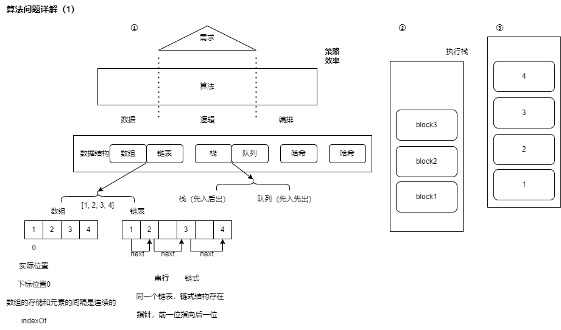
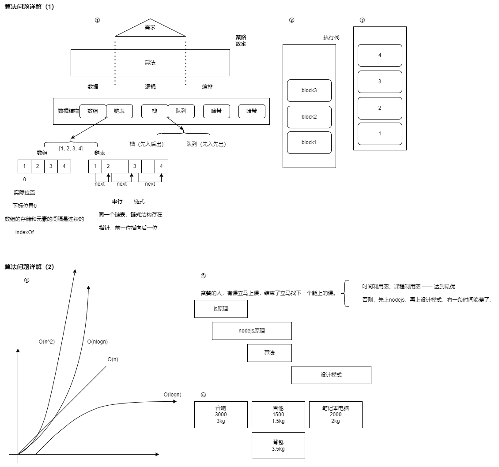

算法问题详解（1）0909——了解数据结构及其分类实战

# 目录

数据结构与算法

一 前言

- 算法考察：算法考察开发人员对于代码/计算机语言熟悉&敏锐程度。

- **归纳**：从准备 -> 熟悉 -> 归纳，帮助更好的总结。

- **刷题**：代码的敏锐/熟练还是需要刷题。



⼀、基础数据结构了解

    1.栈与队列
    2.数组和链表
    3.哈希表
    4.树结构

二 前言

⼆、数据结构分类实战

    5.栈的实现与应⽤
    6.单链表与双向链表
    7.树操作

三 & 四 前言

- 策略 -> 头绪 -> 找灵感

- 算法策略：四大策略类

- 回顾上节：  
  [1]算法在数据结构和需求之间，数据和需求的逻辑之间串通起了桥梁；  
  [2]算法最重要的一点是技巧和效率。

- 为什么需要这层，我们直接用数据结构做需求能做吗？  
  [1]绝大多数场景，日常工作中，很多时候我们屏蔽了这一层；我们直接拿数据结构做需求，数据结构不满足需求的，我们会跟后台/跟底层数据去沟通，把数据结构调整成当前需求所需要的。  
  [2]但是有些情况下，我们的确很需要在中间层做很多这样操作，算法就是这样很讲究策略和效率的。

- 那什么是策略？什么是效率？  
  [1]我们从后往前，先说效率。
  [2]再说策略。



三、算法复杂度概念

    8.时间复杂度
    9.空间复杂度
    10.复杂度计算
    11.复杂度场景

四、具体算法技巧与概念

    12.分治法
    13.贪婪
    14.动态规划
    15.图

- 预习参考⽂档：  
  https://juejin.cn/post/6844904111092006925

五、⾯试技巧&学习总结

- 预习总结⽂档：  
  https://juejin.cn/post/6844903509351989261

- 推荐参考书籍：  
  《⼤话数据结构》、 《数据结构与算法分析》、《算法图解》、《剑指 offer》

# ⼀. 基础数据结构了解 & ⼆、数据结构分类实战

## 【算法流程】重要思路

最主要的就是这个【算法流程】的思路：

1. 确定需要什么样的数据结构、满足模型的数据 - 构造变量 & 常量
2. 运行方式 简单条件执行｜遍历｜递归 - 算法主体结构
3. 确定输入输出 - 确定流程

## 1.数组和链表

> array_link.js

```js
// 数组 & 链表
// 相连性 | 指向性 -> 两种操作不同
// 查找：数组连续，效率更高
//      数组可以迅速定位到数组中某一个节点的位置
//      链表则需要通过前一个元素指向下一个元素，需要前后依赖顺序查找，效率较低
// 插入：
//      数组插入元素后，后续所有元素的索引都会收到影响，进而改变。
//      链表由于其指向属性的原因，只要改变前一项和当前被插入项的next指向即可
// （2指向5，5指向3，改动两个节点就能完成一次插入）

// 面试题：实现链表（数组=>链表）（只有数组的js系统里，如何实现一个频繁插入且能够提升效率的高效系统呢？）（【笔试】）
// head => node1 => node2 => ... => null
class LinkedList {
  // 题目：1 2 3 4 5 6 7
  constructor() {
    this.length = 0
    // 1.空链表特征 => 判断链表长度
    this.head = null
  }
  getElementAt(position) {} // 2.返回索引对象的元素
  indexOf(element) {} // 3.查找元素所在位置

  append(element) {} // 4.添加节点
  insert(position, element) {} // 5.指定位置插入节点

  removeAt(position) {} // 6.删除指定位置元素
  remove(element) {} // 7.删除指定元素
}

// 辅助类
class Node {
  constructor(element) {
    this.element = element
    this.next = null
  }
}

// 1. 定位节点 => 前置节点
function getElementAt(position) {
  // 边缘检测
  if (position < 0 || position >= this.length) return null // 边缘检测 -> **注意是大于等于号**

  let _current = this.head
  for (let i = 0; i < position; i++) {
    _current = _current.next
  }

  return _current
}

// 2. 判断当前节点位置
function indexOf(element) {
  let _current = this.head

  for (let i = 0; i < this.length; i++) {
    if (_current.element === element) return i

    _current = _current.next
  }

  return -1
}

// 3. 添加节点 => 找到尾巴
function append(element) {
  let _node = new Node(element)

  if (this.head === null) {
    this.head = _node
  } else {
    let _current = this.getElementAt(this.length - 1)
    _current.next = _node
  }

  this.length++
}

// 4. 插入节点 => 找到前一位（找到前置节点）
function insert(position, element) {
  if (position < 0 || position > this.length) return false // 边缘检测 -> **注意是大于号**：插入时，position是length是可以插入，比长度大就不能插入了。

  let _node = new Node(element) // 构造新节点

  if (position === 0) {
    _node.next = this.head
    this.head = _node
  } else {
    let _previous = this.getElementAt(position - 1) // 找到前一位
    // 插入
    _node.next = _previous.next
    _previous.next = _node
  }
  this.length++ // 长度++
  return true
}

// 5. 删除节点 => 找到前置节点
function removeAt(position) {
  if (position < 0 || position >= this.length) return false // 边缘检测 -> **注意是大于等于号**

  let _current = this.head

  if (position === 0) {
    this.head = _current.next
  } else {
    let _previous = this.getElementAt(position - 1)
    // 删除
    _current = _previous.next
    _previous.next = _current.next
  }
  this.length-- // 长度--
  return _current.element // 返回删除的位置
}

// 双向链表
// head <=> node1 <=> node2 <=> ... <=> null
// tail | prev
class DoubleLink extends LinkedList {
  // ......
}
```

## 2.栈与队列

> stack_queue.js

```js
// 栈和队列
// 执行顺序： 栈 - 先入后出，队列 - 先入先出
// 面试题：实现一个栈（如何实现一个栈）
class Stack {
  constructor() {
    this.items = []
  }
  // 添加新元素 入栈 => 栈顶
  push(element) {
    this.items.push(element)
  }
  // 删除
  pop() {
    return this.items.pop()
  }
  // 返回栈顶元素
  peek() {
    return this.items[this.items.length - 1]
  }
  // 是否为空
  isEmpty() {
    return this.items.length === 0
  }
  clear() {
    this.items = []
  }
  // 大小
  size() {
    return this.items.length
  }
}

// 【面试题-**真题**】
// 判断括号是否有效自闭合——**有效自闭合**问题——// > 20.有效的括号.js
// '{}[]' true, '[{()}]' true, \{\{}[] false

// 【算法流程】
// *1. 确定需要什么样的**数据结构**、满足模型的数据 -> 构造变量 & 常量

// 比如此题：
// - 1.有先后顺序？有，强相关于先后顺序
// - 2.先后顺序是什么？
// - 3.先后顺序是单向的还是双向的？
// - 4.怎么样去匹配？需要去做什么？
// 这几点考量之后，基本可以确认当前题目需要用什么样的数据结构去解决了：
// - 单向的/单维度的/不是x、y轴的/找到左括号 再找右括号就可以了/从左向右 或者 从右向左——是单向的；
// - 就排除了双向链表、一些双向的数据结构了。
// - 先入后出，用栈
// - 匹配，用哈希map

// *2. **运行方式** 简单条件执行 | 遍历 | 递归 -> （搭建）算法主体结构

// - 字符串一个一个匹配，要入栈，所以选择遍历方式。
// - 条件执行：一整块处理，不需要关注内容每一个元素，不需要遍历 -> 条件执行就可以了；
// - 递归：前一项包含后一项的内容，执行完前一项之后，需要再次执行 -> 用递归；

// 当然，递归 & 遍历 在一些场景下可以互相替换。
// - 比如 经典排序、走宫格（走两格退一格），可以既用遍历又用递归的。

// *3. 确定**输入输出** - 确定流程（确定主要流程）

const isValid = function (s) {
  const stack = new Stack()
  const map = {
    '}': '{',
    ']': '[',
    ')': '('
  }
  // 因为是字符串，所以接下来要遍历了。
  for (let i = 0; i < s.length; i++) {
    const char = s[i] // 当前字符串遍历到哪一个字符
    stack.push(char) // 当前字符串 push 进去 —— 薯片桶 立起来

    if (stack.size() < 2) continue // 只有一个元素不能匹配/没必要匹配
    // 等于2 或者 超过2，判断是否可以有效自闭合

    // 顶层/次顶层
    const theLastOne = stack[stack.size() - 1] // 栈顶
    const theLastTwo = stack[stack.size() - 2] // 栈次顶

    // 匹配是否有效：
    if (map[theLastOne] === theLastTwo) {
      stack.pop()
      stack.pop()
    } // 如果 栈顶 匹配上栈次顶，都弹出去
    // * 两两配对都成功了 -> 说明 当前字符串 可以有效自闭合。
  }
  return stack.size === 0
}

// 判断如果字符长度奇数 直接返回false，偶数继续计算；
// 有其他字符，只能严格的按照 '顶层 - 次顶层' 判断。
// 只有**表里登记的才能入栈**，非括号不入栈。
```

## 3.哈希表

> hash.js

```js
// 哈希表 - 快速匹配定位

// 面试题：罗马字符翻译
// - 最经典题目：翻译字典类
// - 变体：密码、罗马字符（中文、摩斯密码）

// I   1
// II  2
// III 3
// IV  4
// V   5
// VI  6
// X   10
// L   50
// C   100

// 【算法流程】——算法三部曲
// *1. 确定需要什么样的**数据结构**、满足模型的数据 -> 构造变量 & 常量
// - hash
// *2. **运行方式** 简单条件执行 | 遍历 | 递归 -> （搭建）算法主体结构
// - 遍历：翻译-单字母多字符-遍历 ，不需要入栈出栈弹出等操作。
// *3. 确定**输入输出** - 确定流程（确定主要流程）
// 分析 - **从右到左遍历**：罗马字符 & 数字一样，都是 右边个位 & 左边十位
// - 从右往左遍历每个字符：
// - 1）情况一：右侧 <= 左侧 => 可以通过hash表直接翻译 取值相加
//    - 比如 VI ：1 + 5 = 6
//           VIII=5+1+1+1=8
// - 2）情况二：右侧 > 左侧
//    - 比如 IV ：右侧 - 左侧 = 5 - 1 = 4
//           IV=V-I=5-1=4
// 这就是罗马字符的 特点/独特的算法。

const MAP = {
  I: 1,
  V: 5,
  X: 10,
  L: 50,
  C: 100
}

const romanToInt = function (s) {
  // 接收字符串
  let len = s.length
  let max = 0 // max 判断最大值
  let res = 0 // 保留结果

  while (len--) {
    // 遍历之后要做什么？翻译。
    let num = MAP[s[len]] // s 是拿到的值，MAP[s[len]] 即 num 是翻译后的值
    if (max > num) {
      res -= num
      continue
    }
    max = num
    res += num
  }

  // 只要选对数据类型，选对执行方式，**遍历过程中 结合 算法**，就可以 快速返回 相应的操作。
  // 重点在于找规律；一般题干告诉规律。

  // 遍历时，结合规律，做相应的计算 -> 先翻译，后计算 -> 得到产出值。

  return res // 返回计算之后的值
}

// 这就是哈希类型的题。
```

## 4.树结构

> tree.js

```js
// 树结构
// 遍历
// 前序遍历（中左右）中是父
// 中序遍历（左中右）
// 后序遍历（左右中）

// 数据结构体现 -> 通用树结构
// const response = [{
//     name: 'root',
//     value: 5,
//     children: [{
//         name: 'node4',
//         value: 0
//     }, {
//         name: 'node6',
//         value: 1
//     }, {
//         name: 'node8',
//         value: 3
//     }, {
//         name: 'node9',
//         value: 5
//     }]
// }]

// 遍历二叉树
class Node {
  constructor(node) {
    this.left = node.left
    this.right = node.right
    this.value = node.value
  }
}
// 父节点 包含 子节点的索引信息 -> 用递归。
const PreOrder = function (node) {
  if (node !== null) {
    console.log(node.value)
    PreOrder(node.left)
    PreOrder(node.right)
  }
}

const InOrder = function (node) {
  if (node !== null) {
    InOrder(node.left)
    console.log(node.value)
    InOrder(node.right)
  }
}

const PostOrder = function (node) {
  if (node !== null) {
    PostOrder(node.left)
    PostOrder(node.right)
    console.log(node.value)
  }
}

// xx二叉树 | XX树
//  e.g. 搜索二叉树 平衡二叉树 红黑树 。。。。。。
```
