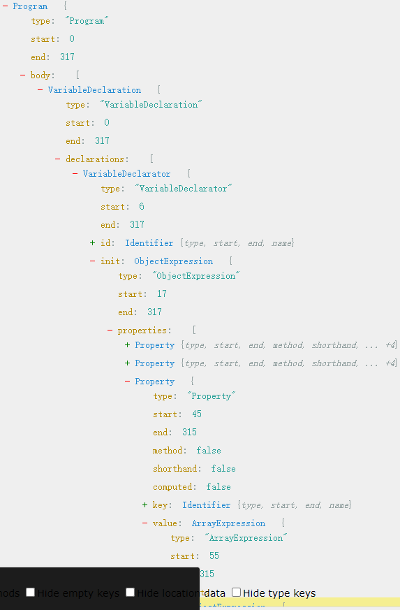

算法问题详解（3）0917——树操作

# 目录

算法 - 树（三）

⼀、树结构

    1.定义 & 分类
    2.构造

⼆、前端中常⻅的树结构

    3.DOM树结构
    4.对象树结构

三、JS 中树结构的遍历

    5.深度优先遍历
    6.⼴度优先遍历

四、⼆叉树类型算法集合

    12.构建⼆叉树 & ⼆叉树的实现
    13.最值查找（最⼤值 & 最⼩值）
    14.值存在查找
    15.节点删除操作

五、⼆叉搜索树

    16.定义与规范
    17.BST的结构实现与操作

六、平衡⼆叉查找树

    18.定义与规范
    19.BST的结构实现与操作

七、红⿊树

    20.定义与规范
    21.从树旋转到红⿊树的修复

# ⼆、数据结构分类实战——7.树操作

## 2.1 定义与分类

【1】分类：  
二叉树 0r 多子树

【2】结构定义：

- 树是非线性数据结构
- 每个节点都可能会有 0 个到多个后代
- 除了根节点，每个节点必须具备唯一父节点（若存在多个父节点，则变成有指向图）

## 2.2 常见的树结构

### 2.2.1 dom 树结构：

```html
<!-- dom 树 -->
<html>
  <head></head>
  <body>
    <div id="app">
      <ul>
        <li>1</li>
        <li>2</li>
        <li>3</li>
        <li>4</li>
        <li>5</li>
        <li>6</li>
      </ul>
    </div>
  </body>
  <script></script>
</html>
```

### 2.1.2 抽象成一个树结构对象：

描述当前页面中，dom 的状态。

```js
const tree_obj = {
  id: 1,
  type: 'dom',
  children: [
    {
      id: 2,
      type: 'html',
      children: [
        {
          id: 3,
          type: 'head'
        },
        {
          id: 4,
          type: 'body'
        },
        {
          id: 5,
          type: 'script'
        }
      ]
    }
  ]
}

// 抽象语法树 AST
```

### 2.2.3 抽象语法树 AST：

【1】js 写插件就是：对抽象语法树 AST 的编辑、解析的过程。

【2】描述：

[2.1]有一个 Program，其 body 下有一个声明 const，声明 VariableDeclarator 的就是一个 id 是 tree_obj 的声明；

声明成了对象(init ObjectExpression)，有三个属性 Properties：

- 第一个 key.name: 'id', value.value: 1;
- 第二个 key.name: 'type', value.value: 'dom';
- 第三个 key.name: 'children', value.elements: ObjectExpression; 继续嵌套。

[2.2]如果是 `const tree_obj = 123` ，同样是树结构；

[2.3]使用树形结构描述任何逻辑定义。

【3】这就是抽象语法树 AST：
网站：[AST Explorer](https://astexplorer.net/)



【4】错误：`const tree_obj == 123` ，展示如下；其中，token 表示错误节点，抽象语法树里没有节点概念，而是 token/令牌流：

```js
Unexpected token (1:15)
```

## 2.3 树结构的遍历

```js
const tree = {
  value: 'A',
  children: [
    {
      value: 'B',
      children: [
        {
          value: 'E'
        },
        {
          value: 'F'
        }
      ]
    },
    {
      value: 'C'
    },
    {
      value: 'D',
      children: [
        {
          value: 'E'
        },
        {
          value: 'F'
        }
      ]
    }
  ]
}
```

### 2.3.1 深度优先遍历

[1]先一路走到底，再兄弟

- **优先遍历** 节点的**子节点** => 兄弟节点

[2]两种不同的方式——深度优先遍历：

1. 确认输入输出 - 入: tree | 出: void
2. 确认执行方式 - 遍历 & 递归
3. 先子后兄

#### 1）dfs - 递归

如果有孩子，那就去孩子；如果没有孩子，就打印。

```js
// 递归方式
function dfs(node) {
  console.log(node.value)
  // 有子则子
  if (node.children) {
    node.children.forEach((child) => {
      dfs(child)
    })
  }
}

// 输出：A B E F C D E F
```

#### 2）dfs - 遍历

[1]遍历时，用什么数据结构处理遍历树，能更好的承载？

- 如果用遍历方法，要单向线性遍历 Node，有序（先走哪个再走哪个节点）。
- 栈：单向、有序且线性。

[2]写算法前，最好把数据结构温习一遍。

```js
// 遍历方式 - 栈
function dfs(node) {
  const stack = [node]
  while (stack.length > 0) {
    const current = stack.pop()
    if (current.children) {
      current.children.reverse().forEach((child) => stack.push(child)) // 后处理的先入栈
    }
  }
}
// 输出：A B E F C D G H
```

### 2.3.2 广度优先遍历

[1]关键词：辈分、家族、长幼。

[2]两种不同的方式进行广度优先遍历。

#### 1）bfs - 递归

```js
// 递归
function bfs(node, queue = [node]) {
  // 退出条件
  if (queue.length === 0) {
    return
  }

  const current = queue.shift()
  console.log(current.value)
  if (current.children) {
    queue.push(...current.children)
  }
  bfs(null, queue)
}
```

#### 2）bfs - 遍历

```js
// 遍历
function bfs(node) {
  const queue = [node]
  while (queue.length > 0) {
    const current = queue.shift()
    if (current.children) {
      current.children.forEach((child) => {
        queue.push(child)
      })
    }
  }
}

// 输出：A B C D E F G H
```

## 2.4 二叉树/BT & 二叉搜索树/BST & 平衡二叉树/AVL & 红黑树/RBT

### 2.4.1 二叉树

#### 【1】题目：<span style="color:red;">面试题</span>

面试：实现快速构造一个二叉树

（1）若他的左子树非空，那么他的所有左子节点的值都应该小于根节点的值  
（2）若他的右子树非空，那么他的所有右子节点的值都应该大于根节点的值  
（3）他的左右子树各自又是一颗满足上面两个条件的二叉树

#### 【2】思路：

[2.1]Node

- constructor(key) {}

[2.2]BinaryTree

- constructor() {}
- insert(key) {} 新增节点
- findMax() {} 查找最大值
- findMin() {} 查找最小值
- contains(key) {} 值存在
- delete(key) {} 删除

#### 【3】实现：

```JS
// 面试：实现快速构造一个二叉树
// （1）若他的左子树非空，那么他的所有左子节点的值都应该小于根节点的值
// （2）若他的右子树非空，那么他的所有右子节点的值都应该大于根节点的值
// （3）他的左右子树各自又是一颗满足上面两个条件的二叉树

class Node {
  constructor(key) {
    this.key = key
    this.left = null
    this.right = null
  }
}

class BinaryTree {
  constructor() {
    // 根节点
    this.root = null
  },
  // 新增节点
  insert(key) {
    const newNode = new Node(key)

    // 约定右子节点都大于左子节点
    const insertNode = (node, newNode) => {
      // 小于参照物
      if(newNode.key < node.key) {
        // 1. 没有左节点的场景 => 则成为左节点
        // 2. 已有左节点的场景 => 递归改变参照物，与左节点进行对比判断插入位置
        if(node.left === null) {
          node.left = newNode
        } else {
          insertNode(node.left, newNode)
        }
      } else {
        // b. 大于参照物
        // 1. 没有右节点的场景 => 则成为右节点
        // 2. 已有右节点的场景 => 递归改变参照物，与右节点进行对比判断插入位置
        if(node.right === null) {
          node.right = newNode
        } else {
          insertNode(node.right, newNode)
        }
      }
    }

    // 判断是否为根节点
    if(this.root === null) {
      this.root = newNode
    } else {
      // 有参照物，则递归进入插入节点逻辑
      insertNode(node.right, newNode)
    }
  },
  // 查找
  // 最大值
  // 贪婪
  findMax() {
    let max = null

    // 深度优先遍历
    const dfs = node => {
      if(node === null) {
        return
      }
      if(max === null || node.key > max) {
        max = node.key
      }
      dfs(node.left)
      dfs(node.right)
    }

    dfs(this.root)
    return max
  },
  // 最小值
  findMin() {
    let min = null

    // 深度优先遍历
    const dfs = node => {
      if(node === null) {
        return
      }
      if(min === null || node.key < min) {
        min = node.key
      }
      dfs(node.left)
      dfs(node.right)
    }

    dfs(this.root)
    return min
  },
  // 值存在
  contains(key) {
    let found = false

    // 深度优先遍历
    const dfs = node => {
      if(node === null) {
        return
      }
      if(node.key === key) {
        found = true
        return
      }
      dfs(node.left)
      dfs(node.right)
    }

    dfs(this.root)
    return found
  }
  // 删除
  delete(key) {
    const deleteNode = function (node, key) {
      // 边缘检测
      if(node === null) {
        return
      }
      // 匹配
      if(key === node.key) {
        if( node.left === null && node.right ===null) {
          return null
        }
        if(node.left === null) {
          return node.right
        }
        if(node.right === null) {
          return node.left
        }

        // 左右都有
        let tmpNode = node.right
        while(tmpNode.left !== null) {
          tmpNode = tmpNode.left
        }
        node.key = tmpNode.key
        node.right = deleteNode(node.right, tmpNode.key)
      } else if(key < node.key) {
        // 走左
        node.left = deleteNode(node.left, key)
        return node
      } else {
        //走右路
        node.right = deleteNode(node.right, key)
        return node
      }
    }

    this.root = deleteNode(this.root, key)
  }
}
```

### 2.4.2 平衡二叉树/自平衡二叉搜索树、红黑树

#### 【1】题目：

```
           5
         /   \
        3     8
       / \   / \
      1   4 7   9
      搜索二叉树
```

```
      => 拓展1，平衡二叉树
             8
           /   \
          7     10
         /
        5
       / \
      3   6
```

```
      每个节点的左子树和右子树高度因子差至多为 1
      旋转操作

           7
         /   \
        5     8
       / \     \
      3   6     10
```

#### 【2】思路：

平衡二叉树（height）

红黑树（color）

[2.1]Node

- constructor(key) {}

[2.2]AVL：

- constructor() {}
- rotateLeft(node) {} 左旋
- rotateRight(node) {} 右旋
- getHeight(node) {} 获取高度

#### 【3】实现：

```js
//       5
//     /   \
//    3     8
//   / \   / \
//  1   4 7   9
// 搜索二叉树

// => 拓展1，平衡二叉树
//        8
//      /   \
//     7     10
//    /
//   5
//  / \
// 3   6

// 每个节点的左子树和右子树高度因子差至多为1
// 旋转操作
//       7
//     /   \
//    5     8
//   / \     \
//  3   6     10

class Node {
  constructor(key) {
    this.key = key
    this.left = null
    this.right = null
    this.height = 1 //  rotateLeft & rotateRight & getHeight ——> 拓展1
    this.color = 'BLACK' // 红黑树 ——> 拓展2
  }
}

class AVL {
  constructor() {},
  rotateLeft(node) {
    const newNode = node.right
    node.right = newNode.left
    newRoot.left = node

    node.height = Math.max(
      this.getHeight(node.left),
      this.getHeight(node.right),
    ) + 1

    newRoot.height = Math.max(
      this.getHeight(newRoot.left),
      this.getHeight(newRoot.right),
    ) + 1

    return newRoot
  },
  rotateRight(node) {
    const newNode = node.left
    node.left = newNode.right
    newRoot.right = node

    node.height = Math.max(
      this.getHeight(node.left),
      this.getHeight(node.right),
    ) + 1

    newRoot.height = Math.max(
      this.getHeight(newRoot.left),
      this.getHeight(newRoot.right),
    ) + 1

    return newRoot
  },
  getHeight(node) {
    if(node === null) {
      return 0
    }
    return node.height
  }
  // => 拓展2：红黑树
  // 根节点是黑色
  // 当一个节点是红色的，那么他的两个子节点必须是黑色的
  // 从根节点到每个肚子的
}
```

## 2.5 总结

本节讲树，如下：

[1]定义与分类

- 分类是什么？
- 结构定义是什么？

[2]常见树结构

- dom 树结构如何抽象成一个树结构？
- AST 是什么？

[3]树结构的遍历

[3.1]四种遍历方式：

[Depth-first search 深度优先搜索](https://en.wikipedia.org/wiki/Depth-first_search)

- ① DFS-递归、
- ② DFS-遍历、

[Breadth-first search 广度优先搜索](https://en.wikipedia.org/wiki/Breadth-first_search)

- ③ BFS-递归、
- ④ BFS-遍历；

[3.2]DFS / BFS - 思路：

- 输入输出（入 tree 出 void）
- 执行方式（遍历 & 递归）
- 先子后兄

[4] BT / BST / AVL / RBT

- [Binary tree 二叉树](https://en.wikipedia.org/wiki/Binary_tree)

- [Binary search tree 二叉搜索树](https://en.wikipedia.org/wiki/Binary_search_tree)

- [AVL tree AVL 树](https://en.wikipedia.org/wiki/AVL_tree)

- [Red–black tree 红黑树](https://en.wikipedia.org/wiki/Red%E2%80%93black_tree)
