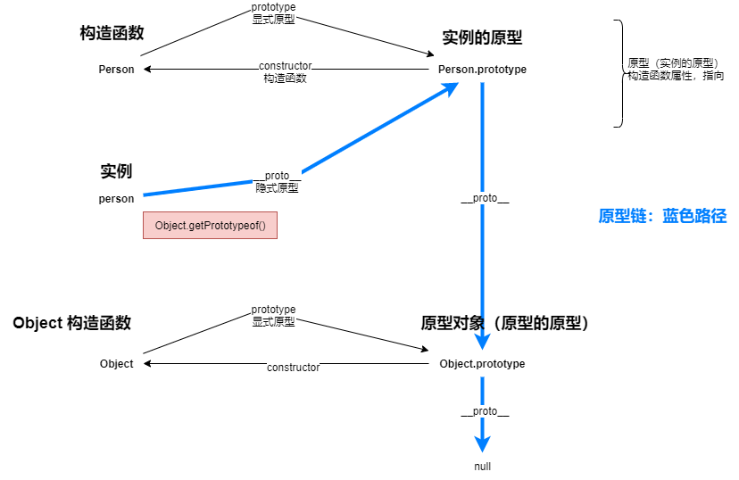
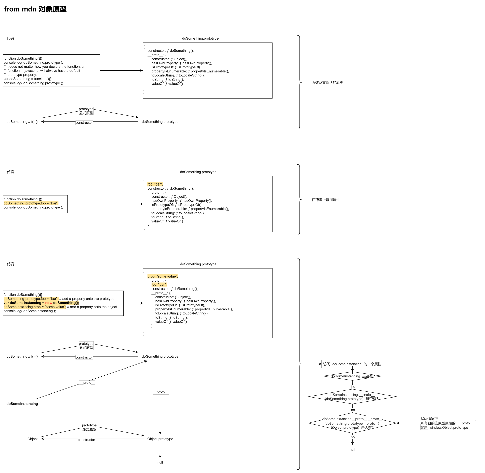
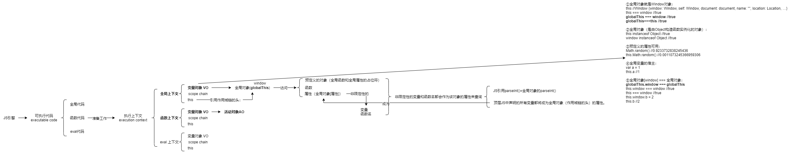

# 一、JavaScript 高级用法（1）

## 前言

1. 阶段

   - 1-3 基础高阶语言扎实
   - 3-5 工作优秀落地
   - 5+ 掌握 用好&展望生态形式未来

     - 遇到之后要知道怎么解决问题，得到最优解

   - 工作内容 & 年限定级
   - 行情 & offer & 级别 & 今后发展 & 对自己负责 & 课程代码资料坚持
   - 提前 10 min 可以答疑
   - 技术达到预期
   - chatGPT 开源
   - 头发

2. 课程介绍

   1. 目录大纲 目标
   2. 高频考点面试能讲通？
   3. 一大坨 everything 基础 高级 生态库 源码 实战
   4. 用法框架架构 生态库 实际应用 实战效果
   5. 工程化 构建 测试 部署
   6. 流程 模块化开发
   7. 构建工具发展历程 原因 配置 实战 原理 优化 自定义插件
   8. 商业化实战项目
   9. low-code
   10. 坚持
   11. 优雅（通读）
   12. 照猫画虎
   13. 原文 法 ⅠⅡⅢ 得最优解
   14. 问问题

## 一、原型&原型链

### 1.1 `理解`原型&原型链



### 1.2 文字表达

1. 构造函数能通过 prototype 属性找到实例的原型；

2. 实例能通过 `__proto__` 属性（此方式`不推荐`但浏览器都支持）或 Object.getPrototypeOf() 方法（ECMAScript 定义的`标准`）找到实例的原型；// 2.1&2.3  
   Object.getPrototypeOf(new Person()) 和 Person.prototype 指向着同一个对象。// 2.3

3. 实例的原型能通过 constructor 属性找到构造函数；
   实例 能通过原型链 找到实例的原型，通过 constructor 属性找到构造函数；

4. 实例的原型不能通过属性找到实例，因为一个构造函数可以创建多个实例，构造函数通过 new 关键字创建了一个或多个实例；

5. 实例 & 原型 & 原型的原型

   ```js
   读取`实例属性`-存在吗
       ? (`实例属性`存在 -> 读取`实例属性`;)
       : (`实例属性`不存在 -> 读取`实例原型属性`-存在吗
           ? (`实例原型属性`存在 -> 读取`实例原型属性`)
           : (`实例原型属性`不存在 -> 读取`原型的原型属性`-存在吗
               ? (`原型的原型属性`存在 -> 读取`原型的原型属性`)
               : (`原型的原型属性`不存在 -> 读取`原型de原型de原型属性`-存在吗
                   ? (...)
                   : (...) // 一直向上查找直到找到/null
                 )
             )
         )
   ```

6. 原型链 & 一直向上查找(向上查找的路径就是原型链) & Object.prototype 没有原型

7. 继承：委托更准确

### 1.3 公例

（PS：地图有个图例，统计图有个图例，汉语中例是比照、依照的意思；公式那就有个公例吧，或者 code 例？）

Person.prototype ：`实例的原型`；  
Person ：`构造函数`；  
person ：构造函数 Person 用 new 创建的`实例`；同理，可以再创建一个 person2 ；  
`Person.prototype.__proto__` ：实例的原型 的原型——原型的原型；  
`person.__proto__.__proto__` ：实例的 原型的 原型；

### 1.4 公式

- 要点：顺着箭头的方向写/按图位置写

```js
// 都为 true

Person.prototype === Person.prototype // 1

person.__proto__ === Object.getPrototypeOf(person) // 2.0
person.__proto__ === Person.prototype // 2.1
Object.getPrototypeOf(person) === Person.prototype // 2.2
Object.getPrototypeOf(new Person()) === Person.prototype // 2.3

Person.prototype.constructor === Person // 3.1
person.constructor === Person.prototype.constructor // 3.2&6 由于原型链，person 的 constructor就是 Person.prototype 的 constructor
person.constructor === Person // 3.3

Object.prototype.__proto__ === null // 6. 即 Object.prototype 没有原型
```

### 1.5 一些概念

JavaScript 常被描述为一种基于原型的语言——每个对象拥有一个原型对象，对象以其原型为模板、从原型继承方法和属性。原型对象也可能拥有原型，并从中继承方法和属性，一层一层、以此类推。这种关系常被称为原型链 (prototype chain)，它解释了为何一个对象会拥有定义在其他对象中的属性和方法。

`对象原型` 指 对象的原型，一个对象被创建一定有原型——对象的原型——实例的原型。

`原型对象` 指一个东西的`__proto__`属性所指向的东西，也就是某个原型。

在传统的 OOP 中，首先定义“类”，此后创建对象实例时，类中定义的所有属性和方法都被复制到实例中。在 JavaScript 中并不如此复制——而是在对象实例和它的构造器之间建立一个链接（它是**proto**属性，是从构造函数的 prototype 属性派生的），之后通过上溯原型链，在构造器中找到这些属性和方法。

备注： 理解对象的原型（可以通过 Object.getPrototypeOf(obj)或者已被弃用的**proto**属性获得）与构造函数的 prototype 属性之间的区别是很重要的。前者是每个实例上都有的属性，后者是构造函数的属性。也就是说，Object.getPrototypeOf(new Foobar()) 和 Foobar.prototype 指向着同一个对象。



#### 1.5.1 参考链接

[mdn 对象原型](https://developer.mozilla.org/zh-CN/docs/Learn/JavaScript/Objects/Object_prototypes#%E7%90%86%E8%A7%A3%E5%8E%9F%E5%9E%8B%E5%AF%B9%E8%B1%A1)

### 1.6 Tips

- 为什么 JS 能写出很好/很坏的代码？

1. 原因在于它是弱类型语言。变化、可操纵性太高，能够实现一些很奇特简便的方法，能够写出很烂的代码，哪怕别人看不懂。
   所以现在强推 TS follow flow 也好。
2. 原因在于 js 通过一些工具把弱类型语言，以强类型规范去要求，最小程度减少可操纵性，减少临摹性，让代码有对应的一些规范；后续维护、新创建、合作，能保证代码内容基础。
3. **掌握好 TS**。
4. **阅读 ES5 标准规范**
5. 实例**委托**实例原型上的属性，交流给我们实例原型的属性——**获取原型上的属性**。所以委托更加标准。

## 二、词法作用域和动态作用域

1. 作用域：
   **定义变量**的区域，规定如何查找变量，确定当前执行代码对变量的访问权限。
   **作用域内操作变量**了。

2. JavaScript 采用词法作用域(lexical scoping)/静态作用域；词法作用域/静态作用域相对的是动态作用域。

### 2.1 静态作用域和动态作用域

词法作用域 lexical scoping：
函数`定义时创建`函数作用域。如 JavaScript 。

动态作用域：
函数`调用时创建`函数作用域。如 bash 。

### 2.2 二个例子巩固

例 1 ：结果是 1

答：foo 函数的作用域在 foo 定义时创建，所以 value 是 1 。

```js
var value = 1
function foo() {
  console.log(value)
}
function bar() {
  var value = 2
  foo()
}
bar()
// 结果是 ???
```

例 2 ：结果是 "local scope"

答：f 函数的作用域在 f 定义时创建，所以 case1 和 case2 的 scope 两个都是 local scope 。

```js
// case 1
var scope = 'global scope'
function checkscope() {
  var scope = 'local scope'
  function f() {
    return scope
  }
  return f()
}
checkscope()

// case 2
var scope = 'global scope'
function checkscope() {
  var scope = 'local scope'
  function f() {
    return scope
  }
  return f
}
checkscope()()
```

### 2.3 `总结`词法作用域和动态作用域

- 因为 JavaScript 采用词法作用域，函数的作用域基于**函数创建**的位置。

> JavaScript 函数的执行用到了作用域链，这个`作用域链`是在`函数定义`的`时`候`创建`的。`嵌套的函数 f() 定义`在这个`作用域链`里，其中的变量 scope `一定是`局部变量，不管何时何地执行函数 f()，`这种绑定`在`执行 f()` 时`依然有效`。——《JavaScript 权威指南》

- 思考：2 个例子巩固-例 2(case 2)，虽然结果一样，但是究竟有哪些不同？

## 三、执行上下文

### 3.0 `理解`顺序执行 & 变量提升/函数提升

例 1

```js
// 顺序执行
var foo = function () {
  console.log('foo1')
}
foo()

var foo = function () {
  console.log('foo2')
}
foo()
```

例 2

```js
// 变量提升/函数提升
function foo() {
  console.log('foo1')
}
foo()

function foo() {
  console.log('foo2')
}
foo()
```

例 3

```js
// 1. function 定义 add2
console.log(add2(1, 1))
function add2(a, b) {
  return a + b
}
// 2. var 定义 add1
console.log(add1(1, 1))
var add1 = function (a, b) {
  return a + b
}
```

1. 函数语句 `function` 定义函数 `add2()` ：

   - 函数名称： add2 提前
   - 函数体： `(a, b) { return a + b }` 提前
   - 解释：用 function 创建 add2() ，add2 和 `(a, b) { return a + b }`**均被提前**，声明前可使用。
   - 结果：输出 2

2. `var` 表达式定义函数 `add1()` ：

   - 函数名称： add1 （变量声明提前）
   - 变量初始化代码： `function (a, b) { return a + b }` （变量初始化代码在原位置，不提前）
   - 解释：但是使用 var 表达式定义函数 add1 ，只有**变量声明提前**，`function (a, b) { return a + b }`在**原位置**，无法提前执行。
   - 结果：报错：add1 is not a function

### 3.1 `理解`执行上下文

#### 3.1.1 几个概念

- ① 可执行代码(executable code)：

  - 全局代码、
  - 函数代码、
  - eval 代码 `eval("console.log(123)")` [mdn-eval() `eval(string)`](https://developer.mozilla.org/zh-CN/docs/Web/JavaScript/Reference/Global_Objects/eval)

- ② 执行上下文(execution context)：执行 ① 进行的`准备工作`—— **xxxContext**

- ③ 执行上下文栈(Execution context stack, **ECS**)：JS 引擎创建 ③ ECS 来`管理` ② —— 模拟其行为时，假设是 **ECStack**

#### 3.1.2 模拟执行上下文栈的行为

1. 工作原理：

   遇到函数时：  
   执行一个函数 -> 创建一个执行上下文 -> 压入执行上下文栈 -> 函数执行完毕 -> 从栈中弹出执行上下文

2. 假如遇到`这段`可执行代码（全局代码、函数代码、eval 代码）：

   ```js
   function fun3() {
     console.log('fun3')
   }
   function fun2() {
     fun3()
   }
   function fun1() {
     fun2()
   }
   fun1()
   ```

3. 模拟执行上下文栈行为：

   ```js
   //伪代码

   // 1.执行上下文栈，开始解释执行代码
   // ECStack = []

   // 【注意】
   // 2.初始化：最先遇全局代码，向执行上下文栈压入全局执行上下文 globalContext ，程序结束之前，ECStack 最底部永远有个 globalContext
   // ECStack = [
   //   globalContext
   // ]

   // 3.之前进行一些 ECStack 的管理执行上下文的操作

   // 4.fun1()
   ECStack.push(<fun1> fun1Context)
   // ECStack = [
   //   fun1Context,
   //   globalContext
   // ]

   // 5.fun1 调用 fun2 ，创建 fun2 执行上下文
   ECStack.push(<fun2> fun2Context)
   // ECStack = [
   //   fun2Context,
   //   fun1Context,
   //   globalContext
   // ]

   // 6.fun2 调用 fun3 ，创建 fun3 执行上下文
   ECStack.push(<fun3> fun3Context);
   // ECStack = [
   //   fun3Context,
   //   fun2Context,
   //   fun1Context,
   //   globalContext
   // ]

   // 7.fun3执行完毕
   ECStack.pop();
   // ECStack = [
   //   fun2Context,
   //   fun1Context,
   //   globalContext
   // ]

   // 8.fun2执行完毕
   ECStack.pop();
   // ECStack = [
   //   fun1Context,
   //   globalContext
   // ]

   // 9.fun1执行完毕
   ECStack.pop();
   // ECStack = [
   //   globalContext
   // ]

   // 【注意】
   // 10.javascript 接着执行下面的代码，但是 ECStack 底层永远有个 globalContext

   // 11.整个应用程序结束，清空 ECStack
   // ECStack = []
   ```

#### 3.1.3 再回顾：例 2 思考题

1. 思考：  
   两段代码执行结果一样，但是究竟有哪些不同？（from 词法作用域和动态作用域-2 个例子巩固-例 2）

   答：  
    `执行上下文栈`，`变化`不一样（**执行上下文的顺序是不一样的**）。

   两段代码：

   ```js
   // case 1
   var scope = 'global scope'
   function checkscope() {
     var scope = 'local scope'
     function f() {
       return scope
     }
     return f()
   }
   checkscope()

   // case 2
   var scope = 'global scope'
   function checkscope() {
     var scope = 'local scope'
     function f() {
       return scope
     }
     return f
   }
   checkscope()()
   ```

2. `分别模拟`两段代码 case 1 和 case 2 的执行上下文栈

   case 1 ：  
   子函数在父函数`内`执行 —— `进进出出`

   ```js
   // case 1
   ECStack.push(<checkscope> functionContext);
   ECStack.push(<f> functionContext);
   ECStack.pop();
   ECStack.pop();
   ```

   case 2 ：  
   子函数在父函数`外`执行 —— `进出进出`

   ```js
   // case 2
   ECStack.push(<checkscope> functionContext);
   ECStack.pop();
   ECStack.push(<f> functionContext);
   ECStack.pop();
   ```

#### 3.1.4 执行上下文中，有哪些属性要掌握？见下文。

- VO
- scope chain
- this

### 3.2 变量对象（执行上下文-重要三属性之一）

变量对象(Variable Object, **VO**)：`存储`上下文中定义的`变量 & 函数声明`



#### 3.2.1 全局上下文

- global code
- 解析当前 JS 环境中讲的
- this 访问的 window 里的变量、函数就是变量对象里预制/预定义的。
- window 对象，在我们当前的宿主环境是浏览器中时，可以通过全局对象访问预制的变量&函数

1. VO： window 里的各种属性和方法
2. scope chain
3. this： window

#### 3.2.2 函数上下文

- 活动对象(Activation Object, AO -> VO)

1. VO： AO
2. scope chain
3. this

执行上下文的执行过程分两步：

1. 分析：进入执行上下文，进入执行环境中——先来定义包含的值（`第一步`）
2. 执行：执行代码，修改赋值——赋值的过程（`第二步`）

```js
// 第一步
AO = {
  arguments: {
    0: 1,
    length: 1
  },
  a: 1
  b: undefined,
  c: reference to function c(){}, // 初始化的内容
  d: undefined
}
```

```js
// 第二步
AO = {
  arguments: {
    0: 1,
    length: 1
  },
  a: 1
  b: 3,
  c: reference to function c(){},
  d: reference to FunctionExpression "d" // 赋值的内容
}
```

1. 全局代码 全局上下文 VO + 作用域链 + this  
   全局上下文 VO 中包含 Math.random()所以可以使用。
2. 函数代码块 函数上下文 VO/AO + 作用域链 + this  
   函数上下文 VO/AO 中包含 arguments 注入了，所以能用。  
   执行完函数代码块进入下一个代码/全局代码块中，所以就是 AO 的来源。
3. 函数执行上下文中，分析-（进入执行上下文，进入执行环境中，先来定义包含的值），给上下文初始化，执行代码——修改赋值。

#### 3.2.3 eval 上下文(略)

变量对象总结完毕。

### 3.3 作用域链（执行上下文-重要三属性之二）

结合执行上下文栈，总结函数执行上下文(变量对象、作用域链)的创建过程：

例子：

```js
var scope = 'global scope'
function checkscope() {
  var scope2 = 'local scope'
  return scope2
}
checkscope()
```

执行过程：

1. 创建 checkscope 函数，保存作用域链(到函数内部属性`[[scope]]`)

```js
checkscope.[[scope]] = [
  globalContext.VO
]
```

2. 创文且文压栈（创建 checkscopeContext，ECStack.push(checkscopeContext)）:

```js
ECStack = [checkscopeContext{}, globalContext]
```

3. JS 引擎遇到可执行代码——函数代码：checkscope，开始做`准备工作`——函数执行上下文 checkscopeContext：

   1. (3.1)创建作用域链(复制`第1步`的函数属性：`checkscope.[[scope]]`)：

   ```js
   checkscopeContext = {
    Scope: checkscope.[[scope]],
   }
   ```

   2. (3.2)创 AO & 初始化 AO ：
      1. (3.2.1)创 AO(用 arguments 创建活动对象)，即：进入函数上下文时刻，创建 AO(通过函数的 arguments 属性初始化)。
      2. (3.2.2)初始化 AO（初始化活动对象，加入形参、函数声明、变量声明），即 AO[形参,函数声明,变量声明]。

   ```js
   checkscopeContext = {
       AO: {
           arguments: {
               length: 0
           },//3.2.1 创 AO (准确：arguments 属性初始化 AO)
           scope2: undefined//3.2.2 初始化 AO (准确：AO[形参,函数声明,变量声明])
       }，
       Scope: checkscope.[[scope]],//第3.1步=第1步，即作用域链。
   }
   ```

   3. (3.3) 活动对象压入 checkscope 作用域顶端：checkscopeContext[Scope].unshift(checkscopeContext[AO])。

      ```js
      checkscopeContext = {
        AO: {
          arguments: {
            length: 0
          },
          scope2: undefined //第4步修改值
        },
        Scope: [AO, [[Scope]]]
      }
      ```

   `第3步`的准备工作做完。

4. `执行函数`，即：随着 fun 执行，`修改 AO 属性值`：

```js
checkscopeContext = {
  AO: {
    arguments: {
      length: 0
    },
    scope2: 'local scope' //4. 修改AO属性值
  },
  Scope: [AO, [[Scope]]]
}
```

5. 文从文栈中弹出：ECStack.pop(checkscopeContext)

```js
ECStack = [globalContext]
```

作用域链总结完毕。

### 3.4 this（执行上下文-重要三属性之三）

#### 3.4.1 Types

- ECMAScript Types 类型分为：
  - ECMAScript language types（语言类型） ①
    - ECMAScript programmer within ECMAScript language to manipulate value directly（开发者直接使用 ECMAScript 可以操作的）
    - Undefined, Null, Boolean, String, Number, and Object.
  - ECMAScript specification types（规范类型——描述语言底层行为逻辑
    ） ②
    - meta-values, with algorithms to describe the semantics(ECMAScript language constructs and ECMAScript language types)（相当于 meta-values，用算法描述 ECMAScript 语言结构和 ECMAScript 语言类型的。）
    - Reference, List, Completion, Property Descriptor, Property Identifier, Lexical Environment, and Environment Record.

#### 3.4.2 Reference

1. What？

   - 用来解释操作行为的（delete、typeof、赋值等）。
   - 不在实际 js 代码中，规范抽象类型，描述语言底层行为逻辑。

   1. base value
      (either undefined, Object, Boolean, String, Number, or environment record.)
   2. referenced name
      (String)
   3. strict reference flag
      (boolean).

   ```js
   var foo = 1
   // 对应Reference：
   var fooReference = {
     base: EnvironmentRecord,
     name: 'foo',
     strict: false
   } // base name strict
   ```

   ```js
   var foo = {
     bar: function () {
       return this
     }
   }

   foo.bar() // foo

   // bar对应Reference：
   var BarReference = {
     base: foo,
     propertyName: 'bar',
     strict: false
   } // base propertyName strict
   ```

2. GetBase(BarReference)：
   返回 BarReference 的 base value 。

   ```js
   GetValue(fooReference) // 1
   ```

3. IsPropertyReference(V)：
   判断 base value 是对象或 HasPrimitiveBase(V) === true 。

#### 3.4.3 如何确定 this 的值
1. 

#### 3.4.4 具体分析

```js

```

## 执行上下文

### 思考题

### 具体执行分析

## 四、闭包

### 1.闭包含义

1. MDN 闭包定义：  
   闭包 = 函数 + 函数能够访问的自由变量
2. 《JavaScript 权威指南》中：  
   技术角度所有的 JavaScript 函数都是闭包。
3. ECMAScript 中：

   - 理论角度： 闭包=所有的函数
   - 实践角度：
     - a. 即使创建它的上下文已经销毁，它仍然存在（比如，内部函数从父函数中返回）；
     - b. 在代码中引用了自由变量；

### 2.分析实践角度闭包

### 3.`总结`闭包

```js
// 输出什么？
for (var i = 0; i < 10; i++) {
  setTimeout(() => {
    console.log(i) // 10
  }, 100)
}
for (var i = 0; i < 10; i++) {
  ;(function (i) {
    setTimeout(() => {
      console.log(i) // i
    }, 100)
  })(i)
}
```
