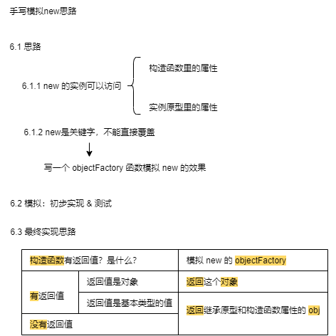

# 一、JavaScript 高级用法（2）

## 一、参数按值传递

- 所有函数的参数 按值传递；
- 函数外部值 复制给 函数内部的参数；
- 值从一个变量 复制到 另一个变量；

### 1.1 按值传递

正如《JavaScript 高级程序设计（第 4 版）》第四章 4.1.3 节所说

> “函数外的值会被复制到函数内部的参数中，就像从一个变量复制到另一个变量一样。”

给一个函数传基本类型的参数并在函数内部改变参数的值。运行函数后，函数内部打印的值和函数外部打印的值互不干扰、互不影响、互相不一样。

### 1.2 共享传递

给函数传递一个引用类型的参数时，也是高程 4 所说：函数外部值复制到函数内部的参数中，其实也是从一个变量复制到另一个变量。不过由于引用类型的变量的值是一个地址，所以函数外、函数内的变量的值都是这个地址，这也符合 JS 高程 4 所说：

> ECMAScript 中所有函数的参数都是按值传递的。

而共享传递就是传递对象时，传递的是对象的地址索引。所以给一个函数传递对象，如果在函数内部直接改变对象参数的值，其实改的是地址索引，就不会改变原来的对象；如果在函数内部改变对象参数的属性，就会通过地址找到对象真正存的值而改变对象。

所以可以理解成下面表格：

| 参数类型 | 参数传递方式 | 什么拷贝     | 拷贝什么       |
| -------- | ------------ | ------------ | -------------- |
| 基本类型 | 按值传递     | 常规类型拷贝 | 拷贝的值       |
| 引用类型 | 共享传递     | 指针拷贝     | 拷贝的地址索引 |

上表补充：函数传递参数，传递的是参数的拷贝（对应表格什么拷贝&拷贝什么）。

### 1.3 总结

| JS 数据类型 |              | X 内存 | 内存里是什么 |
| ----------- | ------------ | ------ | ------------ |
| 基本类型    | --           | 栈内存 | 值           |
| 引用类型    | 索引引用传递 | 栈内存 | 引用地址     |
| 引用类型    | 改           | 堆内存 | 实际值       |

## 二、手写 call 和 apply

### 2.1. 手写题`六字口诀`：

`判 Symbol 获执（参）删返`

### 2.2. 手写 call ：

1. 六字口诀。
2. 手写代码。

```js
Function.prototype.call2 = function (context, ...args) {
  if (typeof context === 'undefined' || context === null) {
    context = window
  } //判
  let fnSymbol = Symbol() //Symbol
  context[fnSymbol] = this //获
  let fn = context[fnSymbol](...args) //执（参）
  delete context[fnSymbol] //删
  return fn //返
}
```

### 2.3. 手写 apply：

1. 六字口诀。
2. 手写代码。

```js
Function.prototype.apply2 = function (context, args) {
  if (typeof context === 'undefined' || context === null) {
    context = window
  } //判
  let fnSymbol = Symbol() //Symbol
  context[fnSymbol] = this //获
  let fn = context[fnSymbol](...args) //执（参）
  delete context[fnSymbol] //删
  return fn //返
}
```

## 三、手写 bind

bind 有如下功能：  
用 bind 绑定函数 x 为新函数 y:  
`let y = x.bind(object,args1)`  
执行 bind 是非构造函数的形式：  
`y(args2)`  
执行 bind 是构造函数形式：  
`let obj = new y(args2)`

1. 上面两种执行时的参数 `args` 是 args1 及 args2 的总和。
2. 在返回函数继承原函数原型的属性时：使用中转空函数应对当修改返回函数的原型时，绑定函数的原型也修改的情况。
3. 返回函数的 this 原型链上有 fNOP，说明以构造函数形式执行的，那么 this 还用 this（实例的 this），与之前 bind 时绑定的 context 这个 this 解绑。

```js
Function.prototype.bind2 = function (context) {
  if(typeof this === 'function'){
    throw new Error('Function.prototype.bind-what is trying to be bound is not callable')
  } // 调用 bind 的不是函数
  var self = this // 获取绑定函数
  var args = Array.prototype.slice.call(arguments,1) // 获取bind的参数
  var fNOP = function(){} // 中转空函数
  var fBound = function() {
    var bindArgs = Array.prototype.slice.call(arguments) // 获取执行参数
    return self.apply(this instance fNOP ? this: context, args.concat(bindArgs)) // 返回函数是空函数创建的实例（是以构造函数形式执行的），用实例的this，否则this指向context，并传入所有参数
  }
  // 返回函数继承原函数原型的属性
  fNOP.prototype = this.prototype // 绑定函数原型给空函数原型
  fBound.prototype = new fNOP() // 空函数创建实例给返回函数的原型
  return fBound
}
```

## 四、手写模拟 new



12345，5 步。

```js
function objectFactory() {
  // 函数模拟 new 关键字
  var obj = new Object(), //创建对象
    Constructor = [].shift.call(arguments) // 获取构造函数
  obj.__proto__ = Constructor.prototype // 继承原型的属性
  var ret = Constructor.apply(obj, arguments) // 继承构造函数的属性
  return typeof ret === 'object' ? ret : obj // 构造函数返回对象?返回构函返回值:否则返回开头创建的对象。
}
```

## 五、类数组对象与 arguments

### 5.1 类数组对象

```js
var array = ['name', 'age', 'sex']

var arrayLike = {
  // 类数组对象
  0: 'name',
  1: 'age',
  2: 'sex', // 和若干索引属性
  length: 3 // 一个 length 属性
}
```

```js
// 1.读
console.log(array[0]) // name
console.log(arrayLike[0]) // name

// 2.写
array[0] = 'new name'
arrayLike[0] = 'new name'

// 3.长度
console.log(array.length) // 3
console.log(arrayLike.length) // 3

// 4.遍历：for 循环遍历类数组对象
for (var i = 0, len = array.length; i < len; i++) {}
for (var i = 0, len = arrayLike.length; i < len; i++) {}

// 5.调方法：Function.call 间接调用数组方法
Array.prototype.join.call(arrayLike, '&') // name&age&sex
Array.prototype.slice.call(arrayLike, 0) // ['name', 'age', 'sex']
Array.prototype.map.call(arrayLike, function (item) {
  return item.toUpperCase()
}) // ['NAME', 'AGE', 'SEX']

// 6.类数组转数组：slice splice Array.from apply
Array.prototype.slice.call(arrayLike) // ['name', 'age', 'sex']
Array.prototype.splice.call(arrayLike, 0) // ['name', 'age', 'sex']
Array.from(arrayLike) // ['name', 'age', 'sex']
Array.prototype.concat.apply([], arrayLike)
```

### 5.2 Arguments 对象

1. 定义在函数体中
2. 函数参数  
   其他属性
3. 指代 Arguments 对象

## 六、创建对象的多种方式&优缺点

### 6.1 工厂模式

### 6.2 构造函数模式

### 6.3 原型模式

### 6.4 组合模式

## 七、继承的多种方式&优缺点

### 7.1 原型链继承

### 7.2 借用构造函数

### 7.3 组合继承

### 7.4 原型继承

### 7.5 寄生式继承

# 总结
