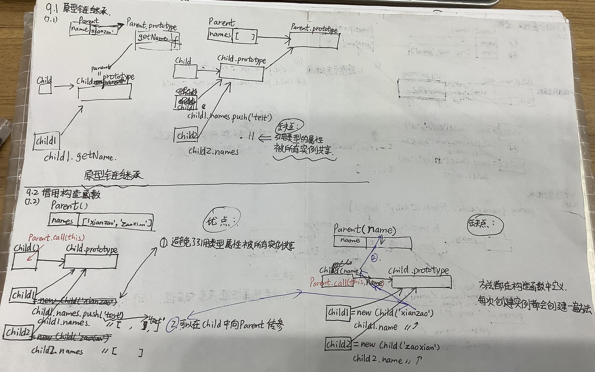
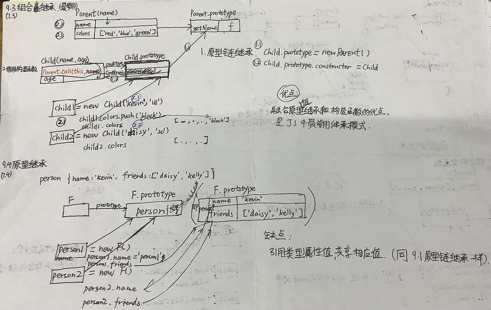
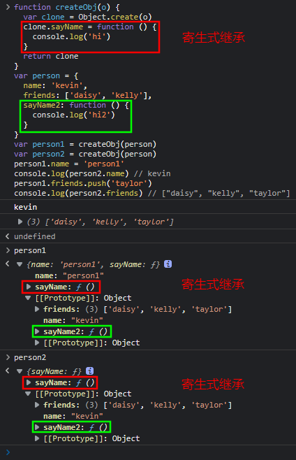

一、JavaScript 高级用法（2）

# 目标

this 指针/闭包/作用域

- this 指针详解
- 闭包的概念及应用场景
- 作用域（全局作用域/函数作用域）
- 默认绑定、显式绑定、隐式绑定
- 存储空间、执行上下文

面向对象编程/原型及原型链

- JS 面向对象编程
- 原型及原型链
- 继承（原型继承、构造函数继承、组合继承）
- new 关键字到底做了什么

# 一、参数按值传递

- 所有函数的参数 按值传递；
- 函数外部值 复制给 函数内部的参数；
- 值从一个变量 复制到 另一个变量；

## 1.1 按值传递

正如《JavaScript 高级程序设计（第 4 版）》第四章 4.1.3 节所说

> “函数外的值会被复制到函数内部的参数中，就像从一个变量复制到另一个变量一样。”

给一个函数传基本类型的参数并在函数内部改变参数的值。运行函数后，函数内部打印的值和函数外部打印的值互不干扰、互不影响、互相不一样。

## 1.2 共享传递

给函数传递一个引用类型的参数时，也是高程 4 所说：函数外部值复制到函数内部的参数中，其实也是从一个变量复制到另一个变量。不过由于引用类型的变量的值是一个地址，所以函数外、函数内的变量的值都是这个地址，这也符合 JS 高程 4 所说：

> ECMAScript 中所有函数的参数都是按值传递的。

而共享传递就是传递对象时，传递的是对象的地址索引。所以给一个函数传递对象，如果在函数内部直接改变对象参数的值，其实改的是地址索引，就不会改变原来的对象；如果在函数内部改变对象参数的属性，就会通过地址找到对象真正存的值而改变对象。

所以可以理解成下面表格：

| 参数类型 | 参数传递方式 | 什么拷贝     | 拷贝什么       |
| -------- | ------------ | ------------ | -------------- |
| 基本类型 | 按值传递     | 常规类型拷贝 | 拷贝的值       |
| 引用类型 | 共享传递     | 指针拷贝     | 拷贝的地址索引 |

上表补充：函数传递参数，传递的是参数的拷贝（对应表格什么拷贝&拷贝什么）。

## 1.3 总结

| JS 数据类型 |              | X 内存 | 内存里是什么 |
| ----------- | ------------ | ------ | ------------ |
| 基本类型    | --           | 栈内存 | 值           |
| 引用类型    | 索引引用传递 | 栈内存 | 引用地址     |
| 引用类型    | 改           | 堆内存 | 实际值       |

# 二、手写 call 和 apply

## 2.1. 手写题`六字口诀`：

`判 Symbol 获执（参）删返`

## 2.2. 手写 call ：

1. 六字口诀。
2. 手写代码。

```js
Function.prototype.call2 = function (context, ...args) {
  if (typeof context === 'undefined' || context === null) {
    context = window
  } //判
  let fnSymbol = Symbol() //Symbol
  context[fnSymbol] = this //获
  let fn = context[fnSymbol](...args) //执（参）
  delete context[fnSymbol] //删
  return fn //返
}
```

## 2.3. 手写 apply：

1. 六字口诀。
2. 手写代码。

```js
Function.prototype.apply2 = function (context, args) {
  if (typeof context === 'undefined' || context === null) {
    context = window
  } //判
  let fnSymbol = Symbol() //Symbol
  context[fnSymbol] = this //获
  let fn = context[fnSymbol](...args) //执（参）
  delete context[fnSymbol] //删
  return fn //返
}
```

# 三、手写 bind

bind 有如下功能：  
用 bind 绑定函数 x 为新函数 y:  
`let y = x.bind(object,args1)`  
执行 bind 是非构造函数的形式：  
`y(args2)`  
执行 bind 是构造函数形式：  
`let obj = new y(args2)`

1. 上面两种执行时的参数 `args` 是 args1 及 args2 的总和。
2. 在返回函数继承原函数原型的属性时：使用中转空函数应对当修改返回函数的原型时，绑定函数的原型也修改的情况。
3. 返回函数的 this 原型链上有 fNOP，说明以构造函数形式执行的，那么 this 还用 this（实例的 this），与之前 bind 时绑定的 context 这个 this 解绑。

```js
Function.prototype.bind2 = function (context) {
  if(typeof this === 'function'){
    throw new Error('Function.prototype.bind-what is trying to be bound is not callable')
  } // 调用 bind 的不是函数
  var self = this // 获取绑定函数
  var args = Array.prototype.slice.call(arguments,1) // 获取bind的参数
  var fNOP = function(){} // 中转空函数
  var fBound = function() {
    var bindArgs = Array.prototype.slice.call(arguments) // 获取执行参数
    return self.apply(this instance fNOP ? this: context, args.concat(bindArgs)) // 返回函数是空函数创建的实例（是以构造函数形式执行的），用实例的this，否则this指向context，并传入所有参数
  }
  // 返回函数继承原函数原型的属性
  fNOP.prototype = this.prototype // 绑定函数原型给空函数原型
  fBound.prototype = new fNOP() // 空函数创建实例给返回函数的原型
  return fBound
}
```

# 四、手写模拟 new


12345，5 步。

```js
function objectFactory() {
  // 函数模拟 new 关键字
  var obj = new Object(), //创建对象
    Constructor = [].shift.call(arguments) // 获取构造函数
  obj.__proto__ = Constructor.prototype // 继承原型的属性
  var ret = Constructor.apply(obj, arguments) // 继承构造函数的属性
  return typeof ret === 'object' ? ret : obj // 构造函数返回对象?返回构函返回值:否则返回开头创建的对象。
}
```

# 五、类数组对象与 arguments

## 5.1 类数组对象

```js
var array = ['name', 'age', 'sex']

var arrayLike = {
  // 类数组对象
  0: 'name',
  1: 'age',
  2: 'sex', // 和若干索引属性
  length: 3 // 一个 length 属性
}
```

```js
// 1.读
console.log(array[0]) // name
console.log(arrayLike[0]) // name

// 2.写
array[0] = 'new name'
arrayLike[0] = 'new name'

// 3.长度
console.log(array.length) // 3
console.log(arrayLike.length) // 3

// 4.遍历：for 循环遍历类数组对象
for (var i = 0, len = array.length; i < len; i++) {}
for (var i = 0, len = arrayLike.length; i < len; i++) {}

// 5.调方法：Function.call 间接调用数组方法
Array.prototype.join.call(arrayLike, '&') // name&age&sex
Array.prototype.slice.call(arrayLike, 0) // ['name', 'age', 'sex']
Array.prototype.map.call(arrayLike, function (item) {
  return item.toUpperCase()
}) // ['NAME', 'AGE', 'SEX']

// 6.类数组转数组：slice splice Array.from apply
Array.prototype.slice.call(arrayLike) // ['name', 'age', 'sex']
Array.prototype.splice.call(arrayLike, 0) // ['name', 'age', 'sex']
Array.from(arrayLike) // ['name', 'age', 'sex']
Array.prototype.concat.apply([], arrayLike)
```

## 5.2 Arguments 对象

### 5.2.1 描述 Arguments 对象：

1. 只定义在：函数体中
2. 包括：函数参数 & 其他属性
3. 函数体中，指代该函数的 Arguments 对象

```js
function foo(name, age, sex) {
  // 1.函数体中
  console.log(arguments) // 3.指代Arguments对象：函数参数、其他属性（2.）
}

foo('name', 'age', 'sex')
```

### 5.2.2 打印后，查看各属性具体用法：

    Arguments(3) ['name', 'age', 'sex', callee: ƒ, Symbol(Symbol.iterator): ƒ]
      0:"name" // 类数组的索引属性。
      1:"age" // 类数组的索引属性。
      2:"sex" // 类数组的索引属性。
      callee:ƒ foo(name, age, sex) // 类数组的callee属性。
      length:3 // 类数组的length属性
      Symbol(Symbol.iterator):ƒ values() // 可迭代对象都有这个属性。
      [[Prototype]]:Object // 隐式原型。

### 5.2.3 length 属性

1. arguments.length - **实参**（函数真实执行时传进来的参数）的长度

2. foo.length - **形参**（函数本来可以传几个参数）的长度

```js
function foo(b, c, d) {
  console.log('实参的长度为：' + arguments.length)
}

console.log('形参的长度为：' + foo.length) // 3
foo(1) // 1

// 形参的长度为：3
// 实参的长度为：1
```

### 5.2.4 callee 属性

- Arguments 对象的 callee 属性，可以**调用函数自身**。
- **闭包**经典面试题：使用 callee 的解决方法：

```js
var data = []
for (var i = 0; i < 3; i++) {
  ;(data[i] = function () {
    console.log(arguments.callee.i)
  }).i = i
}

data[0]()
data[1]()
data[2]()

// 0
// 1
// 2
```

### 5.2.5 arguments 和传入的对应参数（形参）的绑定

【总结】：

一个方法执行时，传入部分参数，

- 传入的参数：  
  改形参，arguments，任意一个，另一个也改变。

- 未传入的参数：  
  改形参，arguments，任意一个，另一个不变。

比如，下面的例 1&2：

```js
function foo(name, age, sex, hobbit) {
  // 例 1.传入的参数，互相绑定：
  // 改变形参、改变arguments，互相都变为新值。

  console.log(name, arguments[0]) // name name
  name = 'name2' // 更改
  console.log(name, arguments[0]) // name2 name2
  arguments[1] = 'age2' // 更改
  console.log(age, arguments[1]) // age2 age2

  // 例 2.未传入的参数，没有互相绑定：
  // 改变形参、arguments其中的一个，另一个不改变。

  console.log(sex) // undefined
  sex = 'sex2' // 改
  console.log(sex, arguments[2]) // sex2 undefined
  arguments[3] = 'hobbit2' // 改
  console.log(hobbit, arguments[3]) // undefined hobbit2
}

foo('name', 'age')
```

### 5.2.6 函数间传参数用 apply

【总结】：

- foo 参数传给 bar 用 apply：

```js
function foo() {
  bar.apply(this, arguments) // foo参数传给bar用apply
}
function bar(a, b, c) {
  console.log(a, b, c)
}

foo(1, 2, 3)
```

### 5.2.7 ES6 中，使用`...arguments`转为数组：

```js
function func(...arguments) {
  console.log(arguments) // [1, 2, 3]
}
func(1, 2, 3)
```

### 5.2.8 arguments 应用

很多，参数不定长、函数柯里化等。

# 六、创建对象的多种方式&优缺点

## 6.1 工厂模式

【1】优点：

- 简单；

【2】缺点：

- 无法识别对象——因为**所有实例**都指向**同一个原型**；

```js
function createPerson(name) {
  // 工厂模式
  const o = new Object()
  o.name = name
  o.getName = function () {
    console.log(name)
  }
  return o
}
var person1 = createPerson('zhangsan')
```

## 6.2 构造函数模式

【1】优点：

- **实例**可**识别**为**特定类型**（同下）；

【2】缺点：

- 创建实例，就要再次创建每个方法 getName。

```js
function Person(name) {
  // 构造函数模式
  this.name = name
  this.getName = function () {
    console.log(name)
  }
}
var person1 = new Person('zhangsan')
```

### 6.2.1 构造函数优化

【1】优点：

- **实例**可**识别**为**特定类型**（同上）；
- **解决**了**重复创建**每个方法 getName 的问题（解决了上述缺点）。

```js
function Person(name) {
  this.name = name
  this.getName = getName
}
function getName() {
  console.log(this.name)
}
var person1 = new Person('zhangsan')
```

## 6.3 原型模式

【1】优点：

- 方法不会重复创建（同上）；

【2】缺点：

- 所有属性、方法共享
- 不能初始化参数。

```js
function Person(name) {}

Person.prototype.name = 'zhang3'
Person.prototype.getName = function () {
  console.log(this.name)
}

var person1 = new Person()
```

### 6.3.1 原型模式优化

【1】优点：

- 封装清晰；

【2】缺点：

- 重写原型，丢失 constructor 属性。

```js
function Person(name) {}

Person.prototype = {
  name: 'zhang3',
  getName = function () {
    console.log(this.name)
  }
}

var person1 = new Person()
```

### 6.3.2 原型模式优化 2

【1】优点：

- 实例可以通过 constructor 属性找到所属构造函数；

【2】缺点：

- 所有属性、方法共享；
- 不能初始化参数。

```js
function Person(name) {}

Person.prototype = {
  constructor: Person, //
  name: 'zhang3',
  getName: function () {
    console.log(this.name)
  }
}

var person1 = new Person()
```

## 6.4 组合模式

【1】优点：

- 使用最广泛的方式，该私有私有，该共享共享；

【2】缺点：

- 期望更好的封装性（写在一个地方）；

```js
function Person(name) {
  this.name = name // 私有
}

Person.prototype = {
  constructor: Person, // 共享
  getName: function () {
    console.log(this.name)
  }
}

var person1 = new Person('zhang3')
```

### 6.4.1 组合模式总结<span style="color:red;">（以上除工厂的所有重要总结）</span>：

**组合模式 = ① + ②**，也就是：

**①** 构造函数优化 + 构造函数优化 2
=（属性写入 this 而非 0）+（不重复创建方法）
=（识别特定类型的实例）+（...）

**加上**

**②** 原型模式 + 原型模式优化 + 原型模式优化 2
=（写原型上）+（重写原型）+（加 constructor）

### 6.4.2 动态原型模式

【1】动态原型模式：

```js
function Person(name) {
  this.name = name
  if (typeof this.getName !== 'function') {
    // 使用动态原型模式
    Person.prototype.getName = function () {
      console.log(this.name)
    }
  }
}
var person1 = new Person('zhang3')
```

【2】注意：动态原型模式，不能用对象字面量`{}`，重写原型：

```js
function Person(name) {
  this.name = name
  if (typeof this.getName !== 'function') {
    // 使用动态原型模式
    Person.prototype = {
      // 不能重写原型（以`{}`形式）【注意】
      constructor: Person,
      getName: function () {
        console.log(this.name)
      }
    }
  }
}

var person1 = new Person('zhang3')
var person2 = new Person('li4')

// 【注意以下】：
// 报错，没有该方法：
// person1.getName()
// Uncaught TypeError: person1.getName is not a function
//     at <anonymous>:1:9

// 这句可以执行：
person2.getName() // li4
```

【2.1】以上代码，person1.getName()报错，但 person2.getName()可执行，为什么？

【2.2】回顾 new 的实现步骤：

1. 创建对象；
2. 对象的原型指向 Person.prototype；
3. Person.apply(obj)；
4. 返回这个对象；

```js
function objectFactory() {
  var obj = new Object()// 1
  var Constructor = [].shift.call(arguments)
  obj.__proto__ = Constructor.prototype // 2
  var ret = Constructor.apply(obj, arguments) // 3
  reutrn typeof ret === 'object' ? ret : obj // 4
}
```

【2.3】回顾 apply 的实现步骤：

fn.apply(context, args) 执行了。

【2.4】所以`Constructor.apply(obj, arguments)`是什么意思？

- 执行 Constructor(arguments)方法，this 变为 obj，arguments 传入这个方法里。

也就是：**`obj.Constructor(arguments)`**.

【2.5】所以，第一个 new Person()：`var person1 = new Person('zhang3')`进行了哪些操作？

自然明白了：

- **执行了 `obj.Person()` 方法。**

也就是**执行 if** 语句里的内容：

```js
if (typeof this.getName !== 'function') {
  // 使用动态原型模式
  Person.prototype = {
    // 不能重写原型（以`{}`形式）【注意】
    constructor: Person,
    getName: function () {
      console.log(this.name)
    }
  }
}
```

自然：

- **`Person.prototype.getName`** 也就**存在**了；

同理：

- **实例的 getName 方法`person2.getName`**，也就**存在**了。

【2.6】注意：

## todo

【3】想用对象字面量`{}`方式重写动态原型模式，可尝试：

```js
function Person(name) {
  this.name = name
  if (typeof this.getName !== 'function') {
    Person.prototype = {
      constructor: Person,
      getName: function () {
        console.log(this.name)
      }
    } // 1.动态重写原型

    return new Person(name) // 2. new 执行 Person() 方法，使得 实例拥有 getName 属性。
  }
}

var person1 = new Person('zhang3')
```

就很好~

# 七、继承的多种方式&优缺点

## 7.1 原型链继承

```js
function Parent() {
  this.name = 'xianzao'
}
Parent.prototype.getName = function () {
  console.log(this.name)
}
function Child() {}
Child.prototype = new Parent()
var child1 = new Child()
console.log(child1.getName()) // xianzao
```

问题：引⽤类型的属性被所有实例共享，举个例⼦：

```js
function Parent() {
  this.names = ['xianzao', 'zaoxian']
}
function Child() {}
Child.prototype = new Parent()
var child1 = new Child()
child1.names.push('test')
console.log(child1.names) // ["xianzao", "zaoxian", "test"]
var child2 = new Child()
console.log(child2.names) // ["xianzao", "zaoxian", "test"]
```

## 7.2 借用构造函数

```js
function Parent() {
  this.names = ['xianzao', 'zaoxian']
}
function Child() {
  Parent.call(this)
}
var child1 = new Child()
child1.names.push('test')
console.log(child1.names) // ["xianzao", "zaoxian", "test"]
var child2 = new Child()
console.log(child2.names) // ["xianzao", "zaoxian"]
```

优点：

1. 避免了引⽤类型的属性被所有实例共享；
2. 可以在 Child 中向 Parent 传参；

```js
function Parent(name) {
  this.name = name
}
function Child(name) {
  Parent.call(this, name)
}
var child1 = new Child('xianzao')
console.log(child1.name) // xianzao
var child2 = new Child('zaoxian')
console.log(child2.name) // zaoxian
```

缺点：

- ⽅法都在构造函数中定义，每次创建实例都会创建⼀遍⽅法。



## 7.3 组合继承（最常用）

```js
function Parent(name) {
  this.name = name
  this.colors = ['red', 'blue', 'green']
}
Parent.prototype.getName = function () {
  console.log(this.name)
}
function Child(name, age) {
  Parent.call(this, name)

  this.age = age
}
Child.prototype = new Parent()
Child.prototype.constructor = Child
var child1 = new Child('kevin', '18')
child1.colors.push('black')
console.log(child1.name) // kevin
console.log(child1.age) // 18
console.log(child1.colors) // ["red", "blue", "green", "black"]
var child2 = new Child('daisy', '20')
console.log(child2.name) // daisy
console.log(child2.age) // 20
console.log(child2.colors) // ["red", "blue", "green"]
```

优点：

- 融合原型链继承和构造函数的优点，
- 是 JavaScript 最常⽤的继承模式。

## 7.4 原型继承

```js
function createObj(o) {
  function F() {}
  F.prototype = o
  return new F()
}
```

缺点：

- 包含**引⽤类型的属性值**，始终都会**共享相应的值**（同 7.1 原型链继承）

```js
var person = {
  name: 'kevin',
  friends: ['daisy', 'kelly']
}
var person1 = createObj(person)
var person2 = createObj(person)
person1.name = 'person1'
console.log(person2.name) // kevin
person1.friends.push('taylor')
console.log(person2.friends) // ["daisy", "kelly", "taylor"]
```



## 7.5 寄生式继承

描述：

① 创建⼀个仅⽤于封装继承过程的函数，  
② 该函数在内部以某种形式来做增强对象，  
③ 最后返回对象。

```js
function createObj(o) {
  var clone = Object.create(o) // ②该函数在内部以某种形式来做增强对象，
  clone.sayName = function () {
    console.log('hi')
  }
  return clone // ③最后返回对象。
} // ①创建⼀个仅⽤于封装继承过程的函数，
```



# 友情链接

- [我的掘金主页](https://juejin.cn/user/1042768423037150)

- [我的 github 主页](https://github.com/djsz3y)

- [读书视频学习笔记](https://github.com/djsz3y/learning-notes)

- [爪哇学习笔记](https://github.com/djsz3y/zhaowa-study-notes)

- [bug 仓库](https://github.com/djsz3y/bug-repository)
