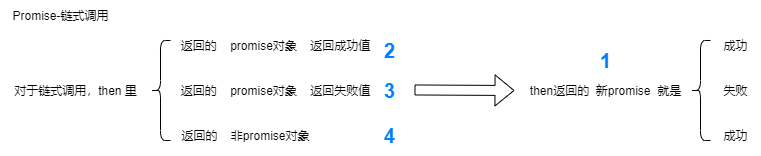

二、前端异步处理规范及应用

# 一、目标

1. 掌握 Promise、async/await 及 generator 的定义及用法

2. 手动实现 Promise 和 async/await

promise 规范及应用

- promise A+ 规范详解
- 手写 promise 函数
- 重点注意 then 的链式调用和值的穿透
- 经典 Promise 相关面试题解析

# 二、简版 Promise

## 2.1 new Promise 的 3 个例子


```js
let p = new Promise((resolve,reject)=>{
  resolve(...) 或
  reject(...) 或
  throw(...)
})
```

### 2.1.1 实现基本的构造函数

三步走策略（value、bind、执行(resolve,reject)）：

1. initValue
2. initBind
3. 执行 executor(resolve,reject)

```js
class MyPromise {
  // 构造方法
  constructor(executor) {
    // 初始化值
    this.initValue() //1.initValue
    // 初始化 this 指向
    this.initBind() //2.initBind
    // 执行传入的参数
    executor(this.resolve, this.reject) //3.执行 executor(resolve,reject)
  }
  initBind() {
    this.resolve = this.resolve.bind(this)
    this.reject = this.reject.bind(this)
  }
  initValue() {
    this.PromiseResult = null
    this.PromiseState = 'pending'
  }
  resolve(value) {
    this.PromiseState = 'fulfilled'
    this.PromiseResult = value
  }
  reject(reason) {
    this.PromiseState = 'rejected'
    this.PromiseResult = reason
  }
}
```

### 2.1.2 状态不可变

```js
  resolve(value) {
    if(this.PromiseState !== 'pending') return
    // ...
  }
  reject(reason) {
    if(this.PromiseState !== 'pending') return
    // ...
  }
```

### 2.1.3 遇 throw，try 包裹执行，catch 捕获异常，调用 reject()

```js
try {
  executor(this.resolve, this.reject)
} catch (e) {
  this.reject(e)
}
```

## 2.2 then

平时业务图：


### 2.2.1 实现 then

记忆错乱点：`reason => { throw reason }`

```js
then(onFulfilled, onRejected){
  // 1.接收回调（平时业务图 1.）

  // 3.确保是函数（扩展）
  onFulfilled = typeof onFulfilled === 'function'? onFulfilled:value => value
  onRejected = typeof onRejected === 'function'? onRejected:reason => { throw reason }

  // 2.状态对应回调（平时业务图 2.）
  if(this.PromiseState === 'fulfilled') {
    // 成功状态执行第一个回调
    onFulfilled(this.PromiseResult)
  } else if(this.PromiseState === 'rejected'){
    // 失败状态执行第二个回调
    onRejected(this.PromiseResult)
  }
}
```

#### 2.2.1.1 测试代码

```js
// 输出 ”success“
const test = new MyPromise((resolve, reject) => {
  resolve('success')
}).then(
  (res) => console.log(res),
  (err) => console.log(err)
)
```

### 2.2.2 定时器

#### 2.2.2.1.思路

1. 用数组
2. 存下回调：then-pending-存下回调
3. 执行回调：调用 `第2步` then-pending-存下的回调


#### 2.2.2.2.实现

##### 1. 使用数组（<span style="color: #007FFF;">4.0 用数组存回调</span>）

```js
initValue(){
  ...
  // 用数组存回调
  this.onFulfilledCallbacks = []
  this.onRejectedCallbacks = []
}
```

##### 2. 存下来成功&失败回调（<span style="color: #007FFF;">4.1 then 里存回调</span>）

```js
then(onFulfilled, onRejected){
  ...
  else if(this.PromiseState === 'pending'){
    this.onFulfilledCallbacks.push(onFulfilled.bind(this))
    this.onRejectedCallbacks.push(onRejected.bind(this))
  } // 如果状态待定，暂时保存两个回调
}
```

##### 3. 执行回调（<span style="color: #007FFF;">4.2 执行存下的回调</span>）

记忆错乱点：`while`

```js
resolve(){
  ...
  while(this.onFulfilledCallbacks.length){
    this.onFulfilledCallbacks.shift()(this.PromiseResult)
  } // fulfilled 状态，执行存下的成功回调
}
reject(){
  ...
  while(this.onRejectedCallbacks.length){
    this.onRejectedCallbacks.shift()(this.PromiseResult)
  } // rejected 状态，执行存下的失败回调
}
```

#### 2.2.2.3.测试代码-定时器

```js
const test2 = new MyPromise((resolve, reject) => {
  setTimeout(() => {
    resolve('success') // 1秒后输出 success
  }, 1000)
}).then(
  (res) => console.log(res),
  (err) => console.log(err)
)
```

### 2.2.3 链式调用

#### 2.2.3.1.思路

1. ① then 返回的新 promise
2. 对于链式调用，then 里：  
   2.1 ② 返回的 promise 对象返回成功值——① 就是成功；  
   2.2 ③ 返回的 promise 对象返回失败值——① 就是失败；  
   2.3 ④ 返回的非 promise 对象——① 就是成功；



#### 2.2.3.2.实现

记忆错乱点：`throw new Error(e)` 容易忘记【5.】

```js
then(onFulfilled, onRejected){
  // 接收两个回调

  // 参数确保是函数
  onFulfilled = typeof onFulfilled === 'function' ? onFulfilled: val => val
  onRejected = typeof onRejected === 'function' ? onRejected: reason => { throw reason }

  var thenPromise = new MyPromise((resolve, reject) => {
  // 1. ① then 返回的新 promise【1.】

    const resolvePromise = cb => {
      // setTimeout(() => {
        try {
          const x = cb(this.PromiseResult)
          if(x === thenPromise && x) {
            throw new Error('不能调用自己哦~')
          }
          if(x instanceof MyPromise) {
            // 2.1 ② 返回的 promise 对象返回成功值——① 就是成功；【2.】
            // 2.2 ③ 返回的 promise 对象返回失败值——① 就是失败；【3.】

            // 只有调用 then ，才知道返回的 promise 对象返回成功，还是失败
            x.then(resolve, reject) // 返回成功值、返回失败值都调用 then
          } else {
            // 2.3 ④ 返回的非 promise 对象——① 就是成功；【4.】

            // 非 promise 直接成功
            resolve(x)
          }
        } catch(e){
          // ⑤ 处理报错【5.】
          reject(e)
          // 注意：容易忘记！
          throw new Error(e)
        }
      // })
    }
    // 状态对应回调
    if(this.PromiseState === 'fulfilled') {
      // 成功状态执行第一个回调
      resolvePromise(onFulfilled)
    } else if(this.PromiseState === 'rejected') {
      // 失败状态执行第二个回调
      resolvePromise(onRejected)
    } else if(this.PromiseState === 'pending') {
      // 如果状态待定，暂时保存两个回调
      this.onFulfilledCallbacks.push(resolvePromise.bind(this, onFulfilled))
      this.onRejectedCallbacks.push(resolvePromise.bind(this, onRejected))
    }
  })

  return thenPromise // 返回包装 promise
}
```

#### 测试代码-链式调用

```js
const test3 = new MyPromise((resolve, reject) => {
  resolve(100) // 输出 状态：success 值： 200
})
  .then(
    (res) => 2 * res,
    (err) => 3 * err
  )
  .then(
    (res) => console.log('success', res),
    (err) => console.log('fail', err)
  )

const test4 = new MyPromise((resolve, reject) => {
  resolve(100) // 输出 状态：fail 值：200
})
  .then(
    (res) => new MyPromise((resolve, reject) => reject(2 * res)),
    (err) => new Promise((resolve, reject) => resolve(3 * err))
  )
  .then(
    (res) => console.log('success', res),
    (err) => console.log('fail', err)
  )
```

### 2.2.4 执行顺序

#### 2.2.4.1.思路 setTimeout

代替微任务，以实现同步与异步任务(微任务)的执行顺序

#### 2.2.4.2.实现

```js
...
const resolvePromise = cb => {
  setTimeout(()=>{
    ...
  })
}
...
```

#### 2.2.4.3.测试代码-执行顺序

```js
const p = new Promise((resolve, reject) => {
    resolve(1) // 异步执行——微任务（用setTimeout代替）
}).then(res => console.log(res), err => console.log(err))

console.log(2) // 同步执行

输出顺序是 2 1
```

### 2.2.5 基本构造函数、状态不可变、throw try...catch、基本 then、then-定时器、then-链式调用、then-执行顺序【2.1 & 2.2】——所有代码为：

```js
class MyPromise {
  constructor(executor) {
    this.initValue()
    this.initBind()
    try {
      executor(this.resolve, this.reject)
    } catch (e) {
      this.reject()
    }
  }
  initBind() {
    this.resolve = this.resolve.bind(this)
    this.reject = this.reject.bind(this)
  }
  initValue() {
    this.PromiseResult = null
    this.PromiseState = 'pending'
    this.onFulfilledCallbacks = []
    this.onRejectedCallbacks = []
  }
  resolve(value) {
    if (this.PromiseState !== 'pending') return
    this.PromiseSate = 'fulfilled'
    this.PromiseResult = value
    while (this.onFulfilledCallbacks.length) {
      this.onFulfilledCallbacks.shift()(this.PromiseResult)
    }
  }
  reject(reason) {
    if (this.PromiseState !== 'pending') return
    this.PromiseSate = 'rejected'
    this.PromiseResult = reason
    while (this.onRejectedCallbacks.length) {
      this.onRejectedCallbacks.shift()(this.PromiseResult)
    }
  }
  then(onFulfilled, onRejected) {
    onFulfilled = typeof onFulfilled === 'function' ? onFulfilled : (val) => val
    onRejected =
      typeof onRejected === 'function'
        ? onRejected
        : (reason) => {
            throw reason
          }

    var thenPromise = new MyPromise((resolve, reject) => {
      const resolvePromise = (cb) => {
        setTimeout(() => {
          // 模拟异步微任务执行顺序
          try {
            const x = cb(this.PromiseResult)
            if (x === thenPromise && x) {
              throw new Error('不能调用自己哦~')
            }
            if (x instanceof MyPromise) {
              x.then(resolve, reject) // 返回的 promise 对象返回成功值、失败值
            } else {
              resolve(x) // 返回非 promise
            }
          } catch (e) {
            reject(e)
            throw new Error(e)
          }
        })
      }

      if (this.PromiseState === 'fulfilled') {
        resolvePromise(onFulfilled)
      } else if (this.PromiseState === 'rejected') {
        resolvePromise(onRejected)
      } else if (this.PromiseState === 'pending') {
        this.onFulfilledCallbacks.push(resolvePromise.bind(this, onFulfilled))
        this.onRejectedCallbacks.push(resolvePromise.bind(this, onRejected))
      }
    })

    return thenPromise
  }
}
```

## 2.3 其他方法

### 2.3.1 all

```js
static all(promises){
  const result = []
  let count = 0
  return new MyPromise((resolve, reject)=>{
    const addData = function (value, index) {
      result[index] = value
      count++
      if(count === promises.length) resolve(result)
    }
    promises.forEach((promise, index)=> {
      if(promise instanceof MyPromise) {
        promise.then(res => {
          addData(res, index)
        },err => {
          reject(err)
        })
      } else {
        addData(promise, index)
      }
    })
  })
}
```

### 2.3.2 race

```js
static race(promises){
  return new MyPromise((resolve, reject)=>{
    promises.forEach((promise,index)=> {
      if(promise instanceof MyPromise){
        promise.then(res => {
          resolve(res)
        }, err => {
          reject(err)
        })
      } else {
        resolve(promise)
      }
    })
  })
}
```

### 2.3.3 allSettled

```js
static allSettled(promises){
  const result = []
  let count = 0
  return new MyPromise((resolve, reject)=>{
    const addData = function (status, value, index) {
      result[index] = {
        status,
        value
      }
      count++
      if(count === promises.length) resolve(result)
    }
    promises.forEach((promise, index)=> {
      if(promise instanceof MyPromise) {
        promise.then(res => {
          addData('fulfilled', res, index)
        },err => {
          addData('rejected', err, index)
        })
      } else {
        addData('fulfilled', promise, index)
      }
    })
  })
}
```

### 2.3.4 any

```js
static any(promises){
  let count = 0
  return new MyPromise((resolve, reject)=>{
    promises.forEach((promise,index)=> {
      if(promise instanceof MyPromise){
        promise.then(res => {
          resolve(res)
        }, err => {
          count ++
          if(count === promises.length) {
            reject(new AggregationError('All promises were rejected!'))
          }
        })
      } else {
        resolve(promise)
      }
    })
  })
}
```

## 2.4 随堂作业

```js

```

# 三、Promise A+ 规范

## 3.1 概要

1. 异步操作的最终结果，注册回调得到 value reason
2. 规范稳定
3. Promises/A+ 涵盖部分已实现拓展，省略未指定问题。
4. 核心：可互操作的 then ；未来涉及 create fulfill 或 reject promises 。

## 3.2 术语：

promise  
thenable  
value  
exception  
reason

## 3.3 内容：

1. 状态只有 3 个
2. 必须提供 then
3. Promise Resolution Procedure

## 3.4 思路（流程图）


## 3.5 参考链接

[官方地址](https://promisesaplus.com/)

[GitHub Promise A+](https://github.com/promises-aplus)

# 四、async/await

## 4.1. 同步方式，执行异步操作

## 4.2. async 函数里使用 await，不然报错

## 4.3. await 后接异步操作 promise（await 异步操作排队执行）（1 个 1 秒）

```js
async function fn() {
  await request(1)
  await request(2)
  // 2秒后执行完
}
fn()
```

```js
async function fn() {
  const res1 = await request(5)
  const res2 = await request(res1)
  console.log(res2) // 2秒后输出 20
}
fn()
```

## 4.4. await 后不接 promise（达不到类似同步效果）

```js
async function fn() {
  await request(1) // 2
  await request(2) // 4
  // 1秒后执行完  同时输出
}
fn()
```

## 4.5. async 返回 promise （async 函数执行完）

- 无 return ：自动返回状态为 fulfilled 的 promise `Promise {<fulfilled>: undefined}`
- 有 return ：`Promise {<fulfilled>: 10}`

## 4.6. async/await 语法糖？

- 语法糖——简化代码，更简便的写法，其他方式也可以。
- async/await 的语法糖——是用 ES6 的迭代函数 —— generator 函数。
- ES6 的 class 也是语法糖——普通 function 也能实现同样效果。

# 五、generator

## 5.1 generator

## 5.2 实现 async/await

# 友情链接

- [我的掘金主页](https://juejin.cn/user/1042768423037150)

- [我的 github 主页](https://github.com/djsz3y)

- [读书视频学习笔记](https://github.com/djsz3y/learning-notes)

- [爪哇学习笔记](https://github.com/djsz3y/zhaowa-study-notes)

- [bug 仓库](https://github.com/djsz3y/bug-repository)
