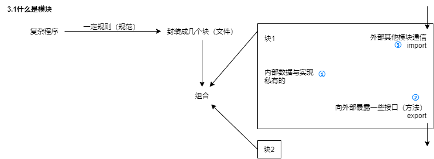
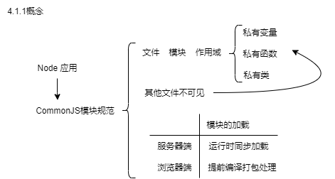
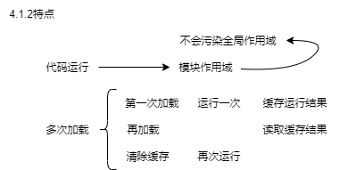

三、了解前端模块化系列

> 了解前端模块化系列内容：  
> [三、了解前端模块化系列（1）——模块化的理解](https://juejin.cn/post/7223407070962827323)  
> [三、了解前端模块化系列（2）——模块化规范-CommonJS](https://juejin.cn/post/7223653429356822586)  
> [三、了解前端模块化系列（3）——模块化规范-AMD](https://juejin.cn/post/7223973532353724472)  
> [三、了解前端模块化系列（4）——模块化规范-CMD & ES6](https://juejin.cn/post/7224518630661570618)  
> [三、了解前端模块化系列（5）——模块化规范-UMD & 总结（CommonJS AMD CMD ES6 UMD）](https://juejin.cn/post/7224873507507109944)

实践是检验真理的唯一标准

- browserify-test
- commonJS-node
- es6-babel-browserify
- requireJS-test
- seaJS-test

# 一、目标

1. 前端模块化发展历程

2. 掌握现代前端开发模块化的实现及实战

JS 模块化详解

- CommonJS 模块化规范及发展
- AMD、CMD、systemJS 模块化规范介绍及使用
- 模块打包工具工程化使用简介
- 同步模式/异步模式的差异、使用、原理
- 回调函数的执行原理

# 二、模块化的理解

1. 模块化规范：
   JS 方面用来管理 web2.0 时代广泛应用 Ajax 技术、jQuery 等前端库而日益膨胀的前端代码。
2. 已发展十余年的**模块化**，不同工具和轮子层出不穷，**主要解决了：**
   1. 外部模块管理；
   2. 内部模块组织；
   3. 模块源码&目标代码 的 编译&转换；
3. 工具框架的诞生时间：

   | 生态           | 诞生时间（年） |
   | -------------- | -------------- |
   | Node.js        | 2009           |
   | NPM            | 2010           |
   | requireJS(AMD) | 2010           |
   | seaJS(CMD)     | 2011           |
   | browserify     | 2011           |
   | webpack        | 2012           |
   | grunt          | 2012           |
   | gulp           | 2013           |
   | react          | 2013           |
   | vue            | 2014           |
   | angular        | 2016           |
   | redux          | 2015           |
   | vite           | 2020           |
   | snowpack       | 2020           |

## 2.1 什么是模块



## 2.2 模块化的进化过程

### 2.2.1 全局 function 模式


举例：

```js
function m1() {
  //...
}
function m2() {
  //...
}
```

### 2.2.2 namespace 模式


举例：

```js
let myModule = {
  data: 'www.baidu.com',
  foo() {
    console.log(`foo() ${this.data}`)
  },
  bar() {
    console.log(`bar() ${this.data}`)
  }
}
myModule.data = 'other data' //能直接修改模块内部的数据
myModule.foo() // foo() other data
```

### 2.2.3 IIFE 模式

匿名函数自调用（闭包）

1. 作用：  
   ① 数据私有  
   ② 外部只能通过暴露方法操作
2. 编码：  
   ① 函数内部封装：**数据**&**行为**  
   ② **window**添加 myModule**属性**，向外**暴露接口** foo,bar
3. bug：  
   当前模块依赖另一个模块，怎么办？

举例：

> index.html

```html
<script type="text/javascript" src="module.js"></script>
<script type="text/javascript">
  myModule.foo() // 【1.作用】——②外部只能通过暴露方法操作
  myModule.bar() // 【1.作用】——②外部只能通过暴露方法操作
  console.log(myModule.data) //undefined 不能访问模块内部数据
  myModule.data = 'xxxx' //不是修改的模块内部的data
  myModule.foo() //没有改变
</script>
```

> module.js

```js
;(function (window) {
  let data = 'www.xianzao.com' // 【1.作用】——①数据私有
  //操作数据的函数
  function foo() {
    //用于暴露有函数
    console.log(`foo() ${data}`)
  }
  function bar() {
    //用于暴露有函数
    console.log(`bar() ${data}`) // 【2.编码】——①函数内部封装：**数据**&行为
    otherFun() //内部调用
  }
  function otherFun() {
    //内部私有的函数
    console.log('otherFun()') // 【2.编码】——①函数内部封装：数据&**行为**
  }
  //暴露行为
  window.myModule = { foo, bar } //ES6写法  // 【2.编码】——②**window**添加myModule**属性**，向外**暴露接口** foo,bar
})(window)
// 【3.bug】——当前模块依赖另一个模块，怎么办？
```

结果：

```js
foo() www.xianzao.com
bar() www.xianzao.com
otherFun()
undefined
foo() www.xianzao.com
```

### 2.2.4 IIFE 模式增强


现代模块实现的基石。

1.  jQuery 页面背景改红
2.  先引入 jQuery 库
3.  库当作参数传入
4.  保证模块的独立性
5.  模块之间依赖关系变得明显

举例：

> module.js

```js
;(function (window, $) {
  let data = 'www.baidu.com'
  //操作数据的函数
  function foo() {
    //用于暴露有函数
    console.log(`foo() ${data}`)
    $('body').css('background', 'red') // 1. jQuery页面背景改红
  }
  function bar() {
    //用于暴露有函数
    console.log(`bar() ${data}`)
    otherFun() //内部调用
  }
  function otherFun() {
    //内部私有的函数
    console.log('otherFun()')
  }
  //暴露行为
  window.myModule = { foo, bar }
})(window, jQuery)
```

> index.html

```js
<!-- 引入的js必须有一定顺序 -->
<script type="text/javascript" src="jquery-1.10.1.js"></script> // 2. 先引入jQuery库
<script type="text/javascript" src="module.js"></script> // 3. 库当作参数传入
<script type="text/javascript">
  myModule.foo()
</script>
// 4. 保证模块的独立性
// 5. 模块之间依赖关系变得明显
```

## 2.3 模块化的优点&缺点

### 2.3.1. 优点

1.  避免命名冲突（减少命名空间污染）
2.  更好分离，按需加载
3.  更高复用性
4.  高可维护性

### 2.3.2. 缺点——引入多个 `<script>` 标签后：

1.  请求过多（多模块 -> 多请求）
2.  依赖模糊（加载先后顺序出错）
3.  难以维护（1+2=3）

### 2.3.3. 解决缺点——通过模块化规范：

1.  common.js 规范
2.  AMD 规范
3.  ES6 规范
4.  CMD 规范

# 三、模块化规范

## 3.1 CommonJS

### 3.1.1 概念



### 3.1.2 特点



### 3.1.3 基本语法

#### 3.1.3.1. 暴露模块：

`module.exports = value` 或  
 `exports.xxx = value`

#### 3.1.3.2. 引入模块：

`require(第三方模块名)` 或  
 `require(自定义模块文件路径)`

#### 3.1.3.3. What is CommonJS 暴露的模块？

  

#### 3.1.3.4. 通过 module.exports 输出变量 x 和函数 addX

```js
// example.js
var x = 5
var addX = function (value) {
  return value + x
}
// 通过 module.exports 输出变量 x 和函数 addX
module.exports.x = x
module.exports.addX = addX
```

#### 3.1.3.5. 加载模块文件：读入并执行一个 JavaScript 文件，返回该模块的 exports 对象；

没有指定模块，报错。

```js
var example = require('./example.js') //如果参数字符串以“./”开头，则表示加载的是一个位于相对路径
console.log(example.x) // 5
console.log(example.addX(1)) // 6
```

### 3.1.4 模块的加载机制

- CommonJS 模块的加载机制是：  
  输入的是被输出的值的拷贝。
- 也就是说，  
  一旦输出一个值，模块内部的变化就影响不到这个值。
- 这与 ES6 模块化有重大差异（下文会介绍）

例子：

> lib.js

```js
// lib.js
var counter = 3
function incCounter() {
  counter++
}
module.exports = {
  counter: counter, // 内部变量counter
  incCounter: incCounter // 改写这个变量的内部方法incCounter
}
```

> main.js

```js
// main.js
var counter = require('./lib').counter
var incCounter = require('./lib').incCounter

console.log(counter) // 3
incCounter()
console.log(counter) // 3
// counter是一个原始类型的值，会被缓存。
// 除非写成一个函数，才能得到内部变动后的值。
```

### 3.1.5 服务器端实现

#### 3.1.5.1. `npm init`

> package.json

```json
{
  "name": "commonjs-node",
  "version": "1.0.0",
  "description": "",
  "main": "app.js",
  "scripts": {
    "test": "echo \"Error: no test specified\" && exit 1"
  },
  "author": "djsz3y",
  "license": "ISC"
}
```

#### 3.1.5.2. 下载第三方模块：

`npm install uniq --save // 用于数组去重`

#### 3.1.5.3. 定义模块代码

```js
//module1.js
module.exports = {
  msg: 'module1',
  foo() {
    console.log(this.msg)
  }
}

//module2.js
module.exports = function () {
  console.log('module2')
}

//module3.js
exports.foo = function () {
  console.log('foo() module3')
}
exports.arr = [1, 2, 3, 3, 2]

// app.js文件
// 引入第三方库，应该放置在最前面
let uniq = require('uniq')
let module1 = require('./modules/module1')
let module2 = require('./modules/module2')
let module3 = require('./modules/module3')

module1.foo() //module1
module2() //module2
module3.foo() //foo() module3
console.log(uniq(module3.arr)) //[ 1, 2, 3 ]
```

#### 3.1.5.4. `node app.js`

输出：

```
..\commonJS-node>
node app.js
module1
module2
foo() module3
[ 1, 2, 3 ]
```

### 3.1.6 浏览器端实现

#### 3.1.6.1. `npm init` & 创建项目结构

```js
|-browserify-test
  |-js
    |-dist //打包生成文件的目录
    |-src //源码所在的目录
      |-module1.js
      |-module2.js
      |-module3.js
      |-app.js //应用主源文件
  |-index.html //运行于浏览器上
  |-package.json
    {
      "name": "browserify-test",
      "version": "1.0.0",
      "description": "",
      "main": "index.js",
      "scripts": {
        "test": "echo \"Error: no test specified\" && exit 1"
      },
      "author": "djsz3y",
      "license": "ISC"
    }
```

#### 3.1.6.2. 下载 browserify

1.  全局: `npm install browserify -g`
2.  局部: `npm install browserify --save-dev`

#### 3.1.6.3. 定义模块代码

```js
//module1.js
module.exports = {
  msg: 'module1',
  foo() {
    console.log(this.msg)
  }
}

//module2.js
module.exports = function () {
  console.log('module2')
}

//module3.js
exports.foo = function () {
  console.log('foo() module3')
}
exports.arr = [1, 2, 3, 3, 2]

// app.js文件
// 引入第三方库，应该放置在最前面
// let uniq = require('uniq')
let module1 = require('./module1')
let module2 = require('./module2')
let module3 = require('./module3')

module1.foo() //module1
module2() //module2
module3.foo() //foo() module3
// console.log(uniq(module3.arr)) //[ 1, 2, 3 ]
```

#### 3.1.6.4. 打包编译 app.js （借助 browserify ）

```js
browserify js/src/app.js -o js/dist/bundle.js
```

#### 3.1.6.5. 页面使用引入 bundle.js

> index.html

```html
<!DOCTYPE html>
<html>
  <head>
    <meta charset="utf-8" />
    <meta name="viewport" content="width=device-width, initial-scale=1" />
    <title></title>
  </head>
  <body></body>
  <script type="text/javascript" src="js/dist/bundle.js"></script>
</html>
```

#### 3.1.6.6. 浏览器打开 index.html

输出：

```js
bundle.js:15 module1
bundle.js:20 module2
bundle.js:24 foo() module3
```

## 3.2 AMD(Asynchronous Module Definition)

### 3.2.1 概念

| 规范          | 加载模块方式   | 含义               | 例子                                                                                    | 时间                                 |
| ------------- | -------------- | ------------------ | --------------------------------------------------------------------------------------- | ------------------------------------ |
| CommonJS 规范 | 同步加载模块   | 加载完成，执行后面 | 服务器编程 Node.js，本地硬盘已存在模块文件，加载块，不考虑非同步加载方式，适用 CommonJS |                                      |
| AMD 规范      | 非同步加载模块 | 允许指定回调函数   | 浏览器环境，从服务器端加载模块，非同步模式，浏览器端一般 AMD 规范                       | AMD 规范早于 CommonJS 在浏览器端实现 |

### 3.2.2 基本语法

#### 3.2.2.1. 定义暴露模块（无依赖/有依赖）：

```js
//定义没有依赖的模块
define(function () {
  return 模块
})

//定义有依赖的模块
define(['module1', 'module2'], function (m1, m2) {
  return 模块
})
```

#### 3.2.2.2. 引入使用模块：

```js
require(['module1', 'module2'], function (m1, m2) {
  使用m1 / m2
})
```

### 3.2.3 AMD 实现（AMD 实际使用效果）

#### 3.2.3.1.未使用 AMD 规范（未使用 require.js）

缺点：

- 发送多个请求
- 按顺序引入 js，否则报错。

> dataService.js

```js
;(function (window) {
  // 【IIFE模式】【1.作用】——①数据私有
  let msg = 'www.xianzao.com'
  // 【IIFE模式】【2.编码】——①函数内部封装：**数据**&行为
  function getMsg() {
    return msg.toUpperCase()
  }
  // 【IIFE模式】【2.编码】——②window添加属性，向外暴露接口
  window.dataService = { getMsg }
})(window) // 【IIFE模式】【3.bug】——当前模块依赖另一个模块，怎么办？
```

> alerter.js

```js
;(function (window, dataService) {
  // 【IIFE模式】【1.作用】——①数据私有
  let name = 'xianzao'
  // 【IIFE模式】【2.编码】——①函数内部封装：**数据**&行为
  function showMsg() {
    // 【IIFE模式】【1.作用】——②外部只能通过暴露方法操作
    alert(dataService.getMsg() + ', ' + name)
  }
  // 【IIFE模式】【2.编码】——②window添加属性，向外暴露接口
  window.alerter = { showMsg }
})(window, dataService) // 【IIFE模式增强】库当作参数传入
```

> main.js

```js
;(function (alerter) {
  // 【IIFE模式】【1.作用】——②外部只能通过暴露方法操作
  alerter.showMsg()
})(alerter) // 【IIFE模式增强】库当作参数传入
```

> index.html

- 注意：按顺序引入 dataService.js,alerter.js,main.js

```html
<div><h1>1.未使用 AMD 规范（未使用 require.js）</h1></div>
<p>注意：按顺序引入 dataService.js,alerter.js,main.js</p>
<script type="text/javascript" src="js/modules/dataService.js"></script>
<script type="text/javascript" src="js/modules/alerter.js"></script>
<script type="text/javascript" src="js/main.js"></script>
```

> 弹框展示，输出结果：

```js
WWW.XIANZAO.COM, xianzao
```

#### 3.2.3.2.使用 AMD 规范（使用 require.js）

RequireJS 工具库：

- 管理客户端模块
- 遵循 AMD 规范

RequireJS 基本思想：

- define 定义模块
- require 加载模块

**AMD** 规范（RequireJS）在**浏览器实现**的步骤：

##### 3.2.3.2.1. 下载 `require.js`-`V2.3.6` & `require.min.js`-`V2.3.6` ，并引入。

- [官网](https://requirejs.org/)
- [github requirejs](https://github.com/requirejs/requirejs)

##### 3.2.3.2.2. 创建项目结构

```js
|-js
  |-libs
    |-jquery
      |-2.0.0
        |-jquery.min.js
    |-requirejs
      |-2.3.6
        |-require.js
        |-require.min.js
  |-modules
    |-alerter.js
    |-dataService.js
  |-main.js
|-index.html
```

##### 3.2.3.2.3. 定义 modules 目录下的模块代码

> js/modules/dataService.js

```js
// dataService.js文件
// 定义没有依赖的模块
define(function () {
  let msg = 'www.djsz3y.xyz'
  function getMsg() {
    return msg.toUpperCase()
  }
  return { getMsg } // 暴露模块
})
```

> js/modules/alerter.js

- 没引入第三方模块前——alerter.js

```js
//alerter.js文件
// 定义有依赖的模块
define(['dataService'], function (dataService) {
  // define(["dataService", "jquery"], function (dataService, $) {
  let name = 'djsz3y'
  function showMsg() {
    alert(dataService.getMsg() + ', ' + name)
  }
  // $("body").css("background", "yellowgreen");
  // 暴露模块
  return { showMsg }
})
```

> js/main.js

- 没引入第三方模块前——main.js

```js
// main.js文件
;(function () {
  require.config({
    baseUrl: 'js/', //基本路径 出发点在根目录下
    paths: {
      // 自定义模块——映射: 模块标识名: 路径
      alerter: './modules/alerter', //此处不能写成alerter.js,会报错
      dataService: './modules/dataService'
      // // 第三方库模块
      // jquery: "./libs/jquery/2.0.0/jquery.min", //注意：写成jQuery会报错
    }
  })
  require(['alerter'], function (alerter) {
    alerter.showMsg()
  })
})()
```

> index.html

```html
<!DOCTYPE html>
<html>
  <head>
    <meta charset="utf-8" />
    <meta name="viewport" content="width=device-width, initial-scale=1" />
    <title>Modular Demo（AMD-RequireJS）</title>
  </head>
  <body>
    <!-- 引入require.js并指定js主文件的入口 -->
    <script
      data-main="js/main"
      src="js/libs/requirejs/2.3.6/require.js"
    ></script>
  </body>
</html>
```

##### 3.2.3.2.4. 引入第三方库：

在 alerter.js 文件中引入 jQuery 第三方库，main.js 文件也要有相应的路径配置。

###### 3.2.3.2.4.1. 修改 `alerter.js`

> 修改：js/modules/alerter.js

```js
// alerter.js文件
// 定义有依赖的模块
define(['dataService', 'jquery'], function (dataService, $) {
  // ...
  // ...
  $('body').css('background', 'yellowgreen')
  // ...
})
```

###### 3.2.3.2.4.2. 修改 `main.js`

添加两行

- 一行注释，
- 一行映射 jquery

> 修改：js/main.js

```js
// main.js文件
;(function () {
  require.config({
    baseUrl: 'js/', //基本路径 出发点在根目录下
    paths: {
      // 自定义模块——映射: 模块标识名: 路径
      alerter: './modules/alerter', //此处不能写成alerter.js,会报错
      dataService: './modules/dataService',
++++++// 第三方库模块
++++++jquery: './libs/jquery/2.0.0/jquery.min' //注意：写成jQuery会报错
    }
  })
  require(['alerter'], function (alerter) {
    alerter.showMsg()
  })
})()
```

###### 3.2.3.2.4.3. 效果：

###### **未引入**第三方模块**前**：

1.  弹框展示结果：`WWW.DJSZ3Y.XYZ, djsz3y`

###### **引入**第三方模块**后**：

1.  弹框展示结果：`WWW.DJSZ3Y.XYZ, djsz3y`
2.  并且 body 背景变为黄绿色。

###### 3.2.3.2.4.4. 测试：

- 确实 `js/main.js` ，`alerter` & `dataService` **模块引入顺序不分先后**
- 很快

### 3.2.4 总结

AMD 规范：

1. **定义**方法**清晰**，**不污染**全局环境，**依赖关系清楚**。
2. 可用于**浏览器环境**，  
   **非同步、按需动态**加载模块。

### 3.2.5 可供参考链接

[requirejs 官网-start.html#get](https://requirejs.org/docs/start.html#get)

[requirejs 官网-download](https://requirejs.org/docs/download.html)

[requireJS 的基本用法](https://blog.csdn.net/sinat_36001828/article/details/113751058)

## 3.3 CMD(Common Module Definition)

### 3.3.1 概念

- CMD 专用 浏览器端
- 异步加载模块
- 使用时加载执行模块
- CMD 整合 CommonJS 和 AMD 的特点。
- Sea.js——JS 模块遵循 CMD 模块定义规范。

### 3.3.2 基本语法

#### 3.3.2.1. **模块定义**：

- `无依赖` CMD `定义`

```js
define(function (require, exports, module) {
  // 无依赖 CMD ——定义
  exports.xxx = value
  module.exports = value
})
```

- `有依赖` CMD `定义`

```js
define(function (require, exports, module) {
  // 有依赖 CMD ——定义
  var module2 = require('./module2') //引入(同步)依赖模块

  require.async('./module3', function (m3) {}) //引入(异步)依赖模块

  exports.xxx = value //暴露模块
})
```

#### 3.3.2.2. **模块使用**：

- `引入/使用` CMD 模块

```js
// CMD ——引入/使用
define(function (require) {
  var m1 = require('./module1')
  var m4 = require('./module4')
  m1.show()
  m4.show()
})
```

### 3.3.3 CMD 实现

#### 3.3.3.1. 下载 sea-2.2.3.js ，并引入。

- [官网](https://seajs.github.io/seajs/)
- [github seajs](https://github.com/seajs/seajs)

#### 3.3.3.2. 创建项目结构

```js
|-js
  |-libs
    |-sea.js
  |-modules
    |-module1.js
    |-module2.js
    |-module3.js
    |-module4.js
    |-main.js
|-index.html
```

#### 3.3.3.3. 定义 modules 目录下的模块代码

> js/modules/module1.js

```js
// module1.js文件
define(function (require, exports, module) {
  var data = 'djsz3y.com' //内部变量数据

  function show() {
    console.log('module1 show() ' + data)
  } //内部函数

  exports.show = show //向外暴露
})
```

> js/modules/module2.js

```js
// module2.js文件
define(function (require, exports, module) {
  module.exports = {
    msg: 'I am djsz3y'
  }
})
```

> js/modules/module3.js

```js
// module3.js文件
define(function (require, exports, module) {
  const API_KEY = 'abcd1234'
  exports.API_KEY = API_KEY //向外暴露
})
```

> js/modules/module4.js

```js
// module4.js文件
define(function (require, exports, module) {
  var module2 = require('./module2') //引入(同步)依赖模块

  function show() {
    console.log('module4 show() ' + module2.msg)
  } //内部函数

  exports.show = show //向外暴露

  require.async('./module3', function (m3) {
    console.log('异步引入依赖模块3  ' + m3.API_KEY)
  }) //引入(异步)依赖模块

  // console.log("--------与上面相反一下--------");

  // var module3 = require("./module3"); //引入(同步)依赖模块 module3

  // function show2() {
  //   console.log("module4 show2() " + module3.API_KEY);
  // } //内部函数

  // exports.show2 = show2; //向外暴露

  // require.async("./module2", function (m2) {
  //   console.log("异步引入依赖模块2  " + m2.msg);
  // }); //引入(异步)依赖模块 module2
})
```

> js/modules/main.js

```js
// main.js文件
define(function (require) {
  var m1 = require('./module1')
  var m4 = require('./module4')
  m1.show()
  m4.show()
  // m4.show2();
})
```

> index.html

```html
<!DOCTYPE html>
<html>
  <head>
    <meta charset="utf-8" />
    <meta name="viewport" content="width=device-width, initial-scale=1" />
    <title>Modular Demo（CMD-seajs）</title>
  </head>
  <body>
    <script type="text/javascript" src="js/libs/sea.js"></script>
    <script type="text/javascript">
      seajs.use('./js/modules/main')
    </script>
  </body>
</html>
```

#### 3.3.3.4. 效果：

```js
module1 show() djsz3y.com
module4 show() I am djsz3y
异步引入依赖模块3  abcd1234
```

### 3.3.4 AMD VS CMD

AMD VS CMD 区别，在于两个方面：

1. 处理依赖
   - AMD 依赖前置：依赖数组，提前声明模块依赖
   - CMD 依赖就近：require 方法，动态引入
2. 处理模块输出
   - AMD 输出：return 返回值
   - CMD 输出：赋值 module.exports

> AMD

```js
// AMD

//【1.处理依赖】——AMD 依赖前置：依赖数组，提前声明模块依赖
define(['Module1'], function (module1) {
  var result1 = module1.exec()
  return {
    result1: result1
  } //【2.处理模块输出】——AMD 输出：return 返回值
})
```

> CMD

```js
// CMD

define(function (requie, exports, module) {
  var module1 = require('Module1') //【1.处理依赖】——CMD 依赖就近：require方法，动态引入
  var result1 = module1.exec()
  module.exports = {
    result1: result1
  } //【2.处理模块输出】——CMD 输出：赋值 module.exports
})
```

## 3.4 ES6 模块化

### 3.4.1 概念

|                         | ES6 模块<br/>（设计思想：静态化）                                                  | CommonJS 模块                                                                                   | AMD 模块 |
| ----------------------- | ---------------------------------------------------------------------------------- | ----------------------------------------------------------------------------------------------- | -------- |
| 1.何时确定<br/>依赖关系 | 编译时                                                                             | 运行时                                                                                          | 运行时   |
| 2.何时确定<br/>输入输出 | 编译时                                                                             | 运行时                                                                                          | 运行时   |
| 3.比如                  |                                                                                    | 对象，<br/>输入时必须查找对象属性                                                               |          |
| **4.本质区别**          | 输出值`引用`；<br/>`编译时`输出接口<br/>（`静态定义`，`生成在代码静态解析`阶段）。 | 输出值`拷贝`；<br/>`运行时`加载<br/>（`加载对象`：module.exports 属性，`生成在脚本运行完`后）。 |          |

### 3.4.2 基本使用

#### 3.4.2.1. 统一暴露，引用名称

- 定义模块——export 对外暴露：统一暴露
- 引用模块——import 对内输入：引用时，知道加载变量名、函数名

```js
// 1.定义 math.js
var basicNum = 0
var add = function (a, b) {
  return a + b
}
export { basicNum, add } // 1.定义模块——export 对外暴露：统一暴露
```

```js
// 2.引用
import { basicNum, add } from './math' // 2.引用模块——import 对内输入：引用时，知道加载变量名、函数名
function test(ele) {
  ele.textContent = add(99 + basicNum)
}
```

#### 3.4.2.2. 默认暴露，自定义名称

- 定义模块——export default 对外暴露：默认暴露
- 引用模块——import 对内输入：引用时，自定义名称

```js
// 1.定义 export-default.js
export default function () {
  console.log('foo')
} // 1.定义模块——export default 对外暴露：默认暴露
```

```js
// 2.引用 import-default.js
import customName from './export-default' // 2.引用模块——import 对内输入：引用时，自定义名称
customName() // 'foo'
```

#### 3.4.2.3. 对 3.4.1 中`本质区别举例`：

【与 CommonJS 的不同】：ES6 动态引用，不会缓存值；模块内变量 绑定所属模块

```js
// lib.js
export let counter = 3
export function incCounter() {
  counter++
}
// main.js
import { counter, incCounter } from './lib'
// 【与 CommonJS 的不同】：ES6 动态引用，不会缓存值；模块内变量 绑定所属模块
console.log(counter) // 3
incCounter()
console.log(counter) // 4
```

### 3.4.3 ES6 实现

> 使用 Babel ：
> 1.ES6 编译为 ES5；
> 2.Browserify 编译打包 js。

#### 3.4.3.1. npm init & 定义 package.json

> package.json

```json
{
  "name": "es6-babel-browserify",
  "version": "1.0.0",
  "description": "ES6 实现",
  "main": "app.js",
  "scripts": {
    "test": "echo \"Error: no test specified\" && exit 1"
  },
  "author": "djsz3y",
  "license": "ISC"
}
```

#### 3.4.3.2. 安装

1.  全局安装 `babel-cli` & `browserify` ：  
    `npm install babel-cli browserify -g`。

    我怕电脑卡，我局部安装 `babel-cli` & `browserify` ：  
    `npm install babel-cli browserify --save-dev`。

2.  项目局部安装 `babel-preset-es2015` ：  
    `npm install babel-preset-es2015 --save-dev`。

#### 3.4.3.3. 定义 .babelrc

> .babelrc

```json
{
  "presets": ["es2015"]
}
```

#### 3.4.3.4. 定义模块

```js
//module1.js文件
// 分别暴露
export function foo() {
  console.log('foo() module1')
}
export function bar() {
  console.log('bar() module1')
}

//module2.js文件
// 统一暴露
function fun1() {
  console.log('fun1() module2')
}
function fun2() {
  console.log('fun2() module2')
}
export { fun1, fun2 }

//module3.js文件
// 默认暴露 可以暴露任意数据类项，暴露什么数据，接收到就是什么数据
export default () => {
  console.log('默认暴露')
}

// app.js文件
import { foo, bar } from './module1'
import { fun1, fun2 } from './module2'
import module3 from './module3'
// import $ from "jquery";
foo()
bar()
fun1()
fun2()
module3()
// $("body").css("background", "green");
```

#### 3.4.3.5. 编译

> 使用 Babel ：
> 1.ES6 编译为 ES5；
> 2.Browserify 编译打包 js。

##### 3.4.3.5.1. ES6 编译为 ES5

> 1.1 全局编译：
> 如果前面全局安装，那么直接根目录编译：
> `babel js/src -d js/lib`。

> 1.2 局部编译：
> 由于前面项目局部安装——**2.安装**的**1.局部安装 `babel-cli` & `browserify`**，所以这里——编译方法为`法 Ⅰ & 法 Ⅱ`。

- 法 Ⅰ：  
  去`根目录\node_modules\.bin`目录下，  
  `babel ../../js/src -d ../../js/lib`

```js
XXX\es6-babel-browserify\node_modules\.bin>babel ../../js/src -d ../../js/lib
// ..\..\js\src\app.js -> ..\..\js\lib\app.js
// ..\..\js\src\module1.js -> ..\..\js\lib\module1.js
// ..\..\js\src\module2.js -> ..\..\js\lib\module2.js
// ..\..\js\src\module3.js -> ..\..\js\lib\module3.js
```

- 法 Ⅱ：  
  `npx babel  js/src -d js/lib2`

```js
XXX\es6-babel-browserify>npx babel  js/src -d js/lib2
// js\src\app.js -> js\lib2\app.js
// js\src\module1.js -> js\lib2\module1.js
// js\src\module2.js -> js\lib2\module2.js
// js\src\module3.js -> js\lib2\module3.js
```

- 对比文件一致：法 Ⅰ & 法 Ⅱ 编译结果 lib & lib2 的文件一致。
- 法 Ⅰ & 法 Ⅱ 思路的参考链接：
  [【建议改成】读完这篇你还不懂 Babel 我给你寄口罩](https://juejin.cn/post/6844904065223098381)

##### 3.4.3.5.2. Browserify 编译打包 js ：

> 2.1 全局编译：
> `browserify js/lib/app.js -o js/lib/bundle.js`。

> 2.2 局部编译：
> 同理。

- 法 Ⅰ：
  去`根目录\node_modules\.bin`目录下，`browserify ../../js/lib/app.js -o ../../js/lib/bundle.js`

```js
XXX\es6-babel-browserify\node_modules\.bin>browserify ../../js/lib/app.js -o ../../js/lib/bundle.js
```

- 法 Ⅱ：
  `npx browserify  js/lib2/app.js -o js/lib2/bundle.js`

```js
XXX\es6-babel-browserify>npx browserify  js/lib2/app.js -o js/lib2/bundle.js
```

#### 3.4.3.6. 引入 index.html

> index.html

```html
<!DOCTYPE html>
<html>
  <head>
    <meta charset="utf-8" />
    <meta name="viewport" content="width=device-width, initial-scale=1" />
    <title>Modular Demo（es6-babel-browserify）</title>
  </head>
  <body>
    <script type="text/javascript" src="js/lib/bundle.js"></script>
  </body>
</html>
```

#### 3.4.3.7. 效果，输出

```js
foo() module1
bar() module1
fun1() module2
fun2() module2
默认暴露
```

#### 3.4.3.8. 引入第三方库

##### 3.4.3.8.1. 安装依赖`npm install jquery@1`

##### 3.4.3.8.2. app.js 文件中引入

```js
//...
import $ from 'jquery'

//...
$('body').css('background', 'green')
```

##### 3.4.3.8.3. 编译

- 法 Ⅰ：

```js
XXX\es6-babel-browserify\node_modules\.bin>babel ../../js/src -d ../../js/lib
  // ..\..\js\src\app.js -> ..\..\js\lib\app.js
  // ..\..\js\src\module1.js -> ..\..\js\lib\module1.js
  // ..\..\js\src\module2.js -> ..\..\js\lib\module2.js
  // ..\..\js\src\module3.js -> ..\..\js\lib\module3.js
XXX\es6-babel-browserify\node_modules\.bin>browserify ../../js/lib/app.js -o ../../js/lib/bundle.js
```

- 法 Ⅱ：

```js
XXX\es6-babel-browserify>npx babel  js/src -d js/lib2
XXX\es6-babel-browserify>npx browserify  js/lib2/app.js -o js/lib2/bundle.js
```

测试法 Ⅱ 的话，要修改 index.html ：

```html
<script type="text/javascript" src="js/lib2/bundle.js"></script>
```

刷新浏览器 index.html ，结果确实变绿。

#### 3.4.3.9. 目录结构：

> es6-babel-browserify

```js
|-js
  |-lib
    |-app.js
    |-bundle.js
    |-module1.js
    |-module2.js
    |-module3.js
  |-lib2
    |-app.js
    |-bundle.js
    |-module1.js
    |-module2.js
    |-module3.js
  |-src
    |-app.js
    |-module1.js
    |-module2.js
    |-module3.js
|-node_modules
|-.babelrc
|-index.html
|-package.json
```

## 3.5 UMD(Universal Module Definition)

### 3.5.1 UMD 是什么？

- JavaScript **通用模块定义**规范——使得模块**在**JavaScript**所有运行环境**（浏览器运行环境、Node.js 运行环境）中**发挥作用**。

- 通用——同时满足 CommonJS、AMD、CMD 的标准。

[javascript 能在哪些环境中运行](https://www.yisu.com/zixun/722601.html)

### 3.5.2 UMD 实现

```js
;(function (root, factory) {
  if (typeof module === 'object' && typeof module.exports === 'object') {
    console.log('是commonjs模块规范，nodejs环境')
    module.exports = factory()
  } else if (typeof define === 'function' && define.amd) {
    console.log('是AMD模块规范，如require.js')
    define(factory)
  } else if (typeof define === 'function' && define.cmd) {
    console.log('是CMD模块规范，如sea.js')
    define(function (require, exports, module) {
      module.exports = factory()
    })
  } else {
    console.log('没有模块环境，直接挂载在全局对象上')
    root.umdModule = factory()
  }
})(this, function () {
  return {
    name: '我是一个umd模块'
  }
})
```

### 3.5.3 UMD 实现——factory 异想天开

参数为什么叫 factory ？我知道有个设计模式叫工厂模式，搜一搜。
看到这篇文章：[JavaScript 设计模式（三）：工厂模式](https://zhuanlan.zhihu.com/p/474296206)

内容大致如下：

#### 3.5.3.1. 简单工厂模式：

应用：创建的对象数量较少，对象的创建逻辑不复杂时使用。
缺点：每添加一个构造函数需要修改两处代码。
（就跟今天看了一个文章：[如何区分 Babel 中的 stage-0,stage-1,stage-2 以及 stage-3（一）](https://www.cnblogs.com/chris-oil/p/5717544.html)babel-stage-2 提案文章提到提交了鸡肋的功能，程序员追求代码完美，能改一处就不改两处代码的提案，代码结尾最后加个逗号。）

```js
let UserFactory = function (role) {
  function User(opt) {
    this.name = opt.name;
    this.viewPage = opt.viewPage;
  }
​
  switch (role) {
    case 'superAdmin':
      return new User({ name: '超级管理员', viewPage: ['首页', '通讯录', '发现页', '应用数据', '权限管理'] });
      break;
    case 'admin':
      return new User({ name: '管理员', viewPage: ['首页', '通讯录', '发现页', '应用数据'] });
      break;
    case 'user':
      return new User({ name: '普通用户', viewPage: ['首页', '通讯录', '发现页'] });
      break;
    default:
      throw new Error('参数错误, 可选参数:superAdmin、admin、user')
  }
}
​
//调用
let superAdmin = UserFactory('superAdmin');
let admin = UserFactory('admin')
let normalUser = UserFactory('user')
```

#### 3.5.3.2. 工厂方法模式

> 工厂方法我们只把它看作是一个实例化对象的工厂，它只做实例化对象这一件事情！ 我们采用安全模式创建对象。

```js
//安全模式创建的工厂方法函数
let UserFactory = function(role) {
  if(this instanceof UserFactory) {
    var s = new this[role]();
    return s;
  } else {
    return new UserFactory(role);
  }
}
​
//工厂方法函数的原型中设置所有对象的构造函数
UserFactory.prototype = {
  SuperAdmin: function() {
    this.name = "超级管理员",
    this.viewPage = ['首页', '通讯录', '发现页', '应用数据', '权限管理']
  },
  Admin: function() {
    this.name = "管理员",
    this.viewPage = ['首页', '通讯录', '发现页', '应用数据']
  },
  NormalUser: function() {
    this.name = '普通用户',
    this.viewPage = ['首页', '通讯录', '发现页']
  }
}
​
//调用
let superAdmin = UserFactory('SuperAdmin');
let admin = UserFactory('Admin')
let normalUser = UserFactory('NormalUser')
```

#### 3.5.3.3. ES6 中的工厂模式

- ES6 重写简单工厂
- ES6 重写工厂方法
- ES6 重写抽象工厂

#### 3.5.3.4. 工厂模式的项目实战应用

#### 3.5.3.5. 总结

- 什么时候会用工厂模式？
- 将 new 操作简单封装，遇到 new 的时候就应该考虑是否用工厂模式；
- jQuery 工厂模式
- React 的 createElement()
- Vue 的异步组件

看第 1 点，第 2 点。

所以也就明白了：

- UMD 实现也可以理解为一个简单工厂模式，对象数量较少，对象的创建逻辑不复杂时使用。
- 针对这四种情况，进行 export ：
  1. commonjs 模块规范
  2. AMD 模块规范
  3. CMD 模块规范
  4. 没有模块直接挂载全局对象
- 所以这不就通用 UMD 了嘛~

# 四、总结（CommonJS AMD CMD ES6 UMD）

以下将分别按照 **3 个方面**总结：**运行的环境、加载模块的方式以及特点优点缺点**。

## 4.1. CommonJS 规范

1.  环境：服务器环境——服务端编程；
2.  加载方式：同步加载模块——不适合浏览器环境；
3.  特点 & 缺点：同步即阻塞加载——浏览器资源异步加载；
4.  因此—— AMD CMD 解决方案；

## 4.2. AMD 规范

1.  环境：浏览器环境——浏览器编程；
2.  加载方式：异步加载模块——并行加载多个模块；
3.  特点 & 缺点：
    - 开发成本高；
    - 代码的阅读书写困难；
    - 模块定义语义不顺畅；

## 4.3. CMD 规范（与 AMD 规范相似）

1.  环境：浏览器环境——浏览器编程；
2.  加载方式：异步加载模块——并行加载多个模块；
3.  特点：
    - 依赖就近，延迟执行；
    - 容易运行在 Node.js 中；

## 4.4. ES6

1.  环境：浏览器、服务器环境——浏览器、服务端编程——所有运行环境；
2.  加载方式：编译时加载（也叫静态加载）
3.  特点 & 优点：
    - 语言标准层面，实现模块功能
    - 实现简单——完全可以取代 CommonJS 和 AMD 规范，
    - 浏览器和服务器通用模块解决方案；

## 4.5. UMD

1.  环境：浏览器、服务器环境——浏览器、服务端编程——所有运行环境；
2.  加载方式：通用——同步、异步
3.  特点 & 优点：
    - 通用——同时满足 CommonJS, AMD, CMD 标准的实现

前端模块化的基础学习，终于写完啦！~  
这只是一个开始，噗[捂脸哭.jpg]。

# 友情链接

- [我的掘金主页](https://juejin.cn/user/1042768423037150)

- [我的 github 主页](https://github.com/djsz3y)

- [读书视频学习笔记](https://github.com/djsz3y/learning-notes)

- [爪哇学习笔记](https://github.com/djsz3y/zhaowa-study-notes)

- [bug 仓库](https://github.com/djsz3y/bug-repository)
