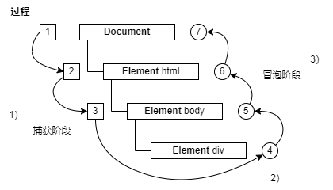

四、浏览器事件模型&请求

# 1.目标

1. 掌握浏览器事件捕获、冒泡等常见的事件模型
2. 掌握 ajax、fetch、axios 的基础使用

## 浏览器事件详解

- 详解浏览器事件捕获，冒泡及浏览器不同规范之间的区别
- 绑定事件的运用，以及封装一个多浏览器兼容的绑定事件函数
- ajax 及 fetch API 详解
- 常见的浏览器请求/响应头/错误码解析
- 发送请求的示例，以及封装一个多浏览器兼容的请求函数

# 2.浏览器事件模型

## 2.1.DOM 事件

### DOM0 级事件

#### click 事件过程

### DOM1 级事件

### DOM2 级事件

### IE 中 DOM2 级事件

### 兼容处理

### 总结

## 2.2.事件捕获&事件冒泡

### 【1】事件流描述的是从页面中接收事件的顺序

- IE 的事件流是事件冒泡流
- `Netscape Communicator` 的事件流是事件捕获流

### 【2】DOM2 级事件规定的事件流

#### 【2.1】包括三个阶段：

- 1）事件捕获阶段
- 2）处于目标阶段
- 3）事件冒泡阶段

#### 【2.2】过程：

- 1）首先发生事件捕获，为截获事件提供了机会
- 2）然后是实际的目标接收到事件
- 3）最后一个阶段是冒泡阶段，可以在这个阶段对事件做出响应



#### 【2.3】具体描述

【2.3.1】对应 2）当**处于目标阶段**，没有捕获和冒泡之分，执行顺序会按照 `addEventListener` 的添加顺序决定，先添加先执行；

【2.3.2】对应 3）当**取消事件传播**时，

- 3.1）若使用 `stopPropagation()`，事件不会被传播给下一个节点 ①，  
  但同一节点上的其他 listener 还是会被执行 ②；
- 3.2）若使用 `stopImmediatePropagation()`，事件同样不会被传播给下一个节点 ①，  
  不过和 `stopPropagation()` 不同的是，同一层级的 listener 也不执行 ③；

2）和 3）的例子（**取消事件传播**的例子）：

```js
// 目标阶段

// list 的捕获
$list.addEventListener(
  'click',
  (e) => {
    console.log('list capturing')
    e.stopPropagation() // 2.1）阻止父节点冒泡
    // 2.2）阻止同一层级 listener（如 list 捕获 2），用 stopImmediatePropagation()
  },
  true
)

// list 捕获 2
$list.addEventListener(
  'click',
  (e) => {
    console.log('list capturing2')
  },
  true
)

// list capturing
// list capturing2
```

【2.3.3】`preventDefault()` 只是**阻止默认行为**，**跟 JS 的事件传播没有关系**；

【2.3.4】一旦发起了 `preventDefault()`，在**之后传递下去的事件里面也会有效果**；

### 【3】测试

[1]如果有以下例子：

```html
<!DOCTYPE html>
<html>
  <head>
    <title>Event Bubbling Example</title>
  </head>
  <body>
    <div id="myDiv">Click Me</div>
  </body>
</html>
```

[2]事件捕获

- ① 最不具体的节点最先收到事件，而最具体的节点最后收到事件。
- ② 事件捕获实际上是为了在事件到达最终目标前拦截事件。
- ③ 如果前面的例子使用事件捕获，则点击`<div>`元素会以下列顺序触发 click 事件：  
  -`document`  
  -`<html>`  
  -`<body>`  
  -`<div>`

[3]事件冒泡

- ① 在点击页面中的 `<div>` 元素后，click 事件会以如下顺序发生：  
  -`<div>`  
  -`<body>`  
  -`<html>`  
  -`document`

- ② 描述：  
  -`<div>` 元素，即被点击的元素，最先触发 click 事件。  
  -然后，click 事件沿 DOM 树一路向上，在经过的每个节点上依次触发，直至到达 `document` 对象

## 2.3.事件对象

[1]DOM0 和 DOM2 的事件处理程序都会自动传入 event 对象

[2]IE 中的 event 对象取决于指定的事件处理程序的方法。

[3]IE 的 handler 会在全局作用域运行，`this === window`，

- 所以在 IE 中会有 `window.event`、`event` 两种情况，
- 只有在事件处理程序期间，event 对象才会存在，
- 一旦事件处理程序执行完成，event 对象就会被销毁

[4]event 对象里需要关心的两个属性：

1. target：target 永远是被添加了事件的那个元素
2. eventPhase：调用事件处理程序的阶段，有三个值：  
   -1）捕获阶段；  
   -2）处于目标；  
   -3）冒泡阶段；

### 2.3.1.`preventDefault` 与 `stopPropagation`

[1]preventDefault：比如链接被点击会导航到其 href 指定的 URL，这个就是默认行为；

[2]stopPropagation：立即停止事件在 DOM 层次中的传播，包括捕获和冒泡事件；

[3]IE 中对应的属性：

- `srcElement` => `target`
- `returnValue` => `preventDefault()`
- `cancelBubble` => `stopPropagation()`

[4]IE 不支持事件捕获，因而只能取消事件冒泡，但 `stopPropagation` 可以同时取消事件捕获和冒泡。

[5]再针对上面不同类型的事件及属性进行区分（`EventUtil` 方法）：

```js
var EventUtil = {
  // element 是当前元素，可以通过 getElementById(id) 获取
  // type 是事件类型，一般是 click，也有可能是鼠标、焦点、滚轮事件等等
  // handle 事件处理函数
  addHandler: (element, type, handler) => {
    // 先检测是否存在 DOM2 级方法，再检测 IE 的方法，最后是 DOM0 级方法（一般不会到这）
    if (element.addEventListener) {
      // DOM2 级方法
      // 第三个参数 false 表示冒泡阶段
      element.addEventListener(type, handler, false)
    } else if (element.attachEvent) {
      // IE 的方法
      element.attachEvent(`on${type}`, handler)
    } else {
      // DOM0 级方法
      element[`on${type}`] = handler
    }
  },

  removeHandler: (element, type, handler) => {
    if (element.removeEventListener) {
      // DOM2 级方法
      // 第三个参数 false 表示冒泡阶段
      element.removeEventListener(type, handler, false)
    } else if (element.detachEvent) {
      // IE 方法
      element.detachEvent(`on${type}`, handler)
    } else {
      // DOM0 级方法
      element[`on${type}`] = null
    }
  },

  // 获取 event 对象
  getEvent: (event) => {
    return event ? event : window.event
  },

  // 获取当前目标
  getTarget: (event) => {
    return event.target ? event.target : event.srcElement
  },

  // 阻止默认行为
  preventDefault: (event) => {
    if (event.preventDefault) {
      event.preventDefault()
    } else {
      event.returnValue = false
    }
  },

  // 停止传播事件
  stopPropagation: (event) => {
    if (event.stopPropagation) {
      event.stopPropagation()
    } else {
      event.cancelBubble = true
    }
  }
}
```

## 2.4.事件委托

[1]事件委托：用来**解决事件处理程序过多的问题**

[2]**页面结构**如下：

```html
<ul id="myLinks">
  <li id="goSomewhere">Go somewhere</li>
  <li id="doSomewhere">Do somewhere</li>
  <li id="sayHi">Say hi</li>
</ul>
```

[3]按照传统的做法，需要像下面这样为它们**添加 3 个事件处理程序。**

```js
var item1 = document.getElementById('goSomewhere')
var item2 = document.getElementById('doSomewhere')
var item3 = document.getElementById('sayHi')
EventUtil.addHandler(item1, 'click', function (event) {
  location.href = 'http://www.xianzao.com'
})
EventUtil.addHandler(item2, 'click', function (event) {
  document.title = "I changed the document's title"
})
EventUtil.addHandler(item3, 'click', function (event) {
  alert('hi')
})
```

[4]缺点：

- 如果在一个复杂的 Web 应用程序中，对所有可单击的元素都采用这种方式，那么结果就会有数不清的代码用于添加事件处理程序。

[5]解决方案：

- 此时，可以利用事件委托技术解决这个问题。使用事件委托，只需在 DOM 树中尽量最高的层次上添加一个事件处理程序，如下面的例子所示

```js
var list = document.getElementById('myLinks')
EventUtil.addHandler(list, 'click', function (event) {
  event = EventUtil.getEvent(event)
  var target = EventUtil.getTarget(event)
  switch (target.id) {
    case 'doSomething':
      document.title = "I changed the document's title"
      break
    case 'goSomewhere':
      location.href = 'http://www.wrox.com'
      break
    case 'sayHi': 9 alert('hi');
      break
  }
})
```

[6]子节点的点击事件会冒泡到父节点，并被这个注册事件处理

[7]最适合采用事件委托技术的事件包括：
`click`、`mousedown`、`mouseup`、`keydown`、`keyup`、`keypress`

- 虽然 `mouseover` 和 `mouseout` 事件也冒泡，但要适当处理它们并不容易，而且经常需要计算元素的位置。

[8]可以考虑为 document 对象添加一个事件处理程序，用以处理页面上发生的某种特定类型的事件，需要跟踪的事件处理程序越少，移除它们就越容易（移除事件处理程序关乎内存和性能）。

[9]只要是通过 `onload` 事件处理程序添加的东西，最后都要通过 `onunload` 事件处理程序将它们移除。

# 3.浏览器请求

> 在浏览器端发送网络请求的常见方式：
>
> - 1）ajax；
> - 2）fetch；
> - 3）axios；

## 3.1.ajax

> Asynchronous JavaScript And XML，翻译过来就是“异步的 JavaScript 和 XML”。  
> ajax 是 js 异步技术的术语，早期相关的 api 是 XHR。

[1]Ajax 是一个技术统称，是一个概念模型，它囊括了很多技术，并不特指某一技术，它很重要的特征之一就是让页面实现局部刷新。

[2]特点：

- 局部刷新页面，无需重载整个页面。

[3]简单来说，

- Ajax 是一种思想，XMLHttpRequest 只是实现 Ajax 的一种方式。
- 其中 XMLHttpRequest 模块就是实现 Ajax 的一种很好的方式。

### 3.1.1.手写 ajax

> 1. 建议先阅读[MDN - AJAX](https://developer.mozilla.org/zh-CN/docs/Glossary/AJAX)
> 2. 利用 XMLHttpRequest 模拟实现 Ajax。

#### 1）创建异步对象

```js
let xmlHttp
if (window.XMLHttpRequest) {
  // code for IE7+, Firefox, Chrome, Opera, Safari
  xmlHttp = new XMLHttpRequest()
} else {
  // code for IE6, IE5
  xmlHttp = new ActiveXObject('Microsoft.XMLHTTP')
}
```

通过 XMLHttpRequest 构造函数创建一个异步对象 xmlhttp，IE6、IE5 使用 ActiveXObject 创建，创建的这个异步对象上有很多属性和方法，常用的有：

【1】`onreadystatechange`：监听异步对象请求状态码 `readyState` 的改变，每当 `readyState` 改变时，就会触发 `onreadystatechange` 事件；

【2】`readyState`：请求状态码【todo】

`readyState` 表示异步对象目前的状态，状态码从 0 到 4：

- 0：
- 1：
- 2：
- 3：
- 4：

【3】status：http 状态码

http 状态码表示成功的 http 状态码有：

- `xmlHttp.status >= 200 && xmlHttp.status < 300 || xmlHttp.status == 304`

【4】responseText：后台返回的字符串形式的响应数据；

【5】responseXML：后台返回的 XML 形式的响应数据；

#### 2）设置请求方式和请求地址

#### 3）发送请求

#### 4）通过 `onreadystatechange` 监听状态变化

#### 5）处理返回的结果

#### 6）其他

### 3.1.2.测试

### 3.1.3.总结

可以发现，ajax 只是一种异步请求的方式，并不特指某一种具体的实现方式，但随着使用这种方式实现网络请求时内部又包含请求的情况，就会出现回调地狱，这也是 XHR 的诟病之一，因此，后来才催生了更加优雅的请求方式。

## 3.2.fetch

## 3.3.axios

## 3.4.总结

1. Ajax 是 `Async JavaScript And Xml` 的简称，它是原生 JavaScript 的一种请求方案，利用 XMLHttpRequest 进行异步请求数据，实现无感刷新数据；

2. Fetch 是 ES6 新推出的一套异步请求方案，它天生自带 Promise，同时也是原生的，如果在较小项目中为了项目大小着想和兼容性不是那么高的前提下不妨可以用它来进行异步请求也是不错的；

3. Axios 是基于 Ajax 和 Promise 封装的一个库，可以利用 Promise 来更好的管控请求回调嵌套造成的回调地狱；

# 4.总结

# 友情链接

- [我的掘金主页](https://juejin.cn/user/1042768423037150)

- [我的 github 主页](https://github.com/djsz3y)

- [读书视频学习笔记](https://github.com/djsz3y/learning-notes)

- [爪哇学习笔记](https://github.com/djsz3y/zhaowa-study-notes)

- [bug 仓库](https://github.com/djsz3y/bug-repository)
