# 五、垃圾回收&内存泄漏

## 进度

2.1 什么是 GC？【done】  
2.2 垃圾产生&为何回收【done】  
2.3 垃圾回收策略【done】  
2.4 V8 对 GC 的优化【to do】  
3.1 什么是内存泄漏？【done】  
3.2 常见的内存泄漏【done】  
3.3 内存泄漏排查、定位与修复【to do】  
3.4 常见的前端内存问题【done】

## 一. 目标

1. 掌握 JS & V8 垃圾回收机制
2. 掌握常见内存泄漏事件及排查方法

## 二、JS 的垃圾回收机制

### 2.1 什么是 GC？

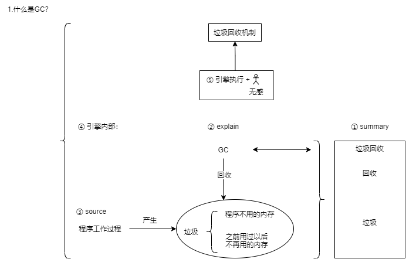

- Garbage Collection
- 高级语言自带 GC Java Pytenon JavaScript
- 无 GC 的语言，比如 C、C++ ，需要程序员手动管理内存，相对比较麻烦。

### 2.2 垃圾产生&为何回收

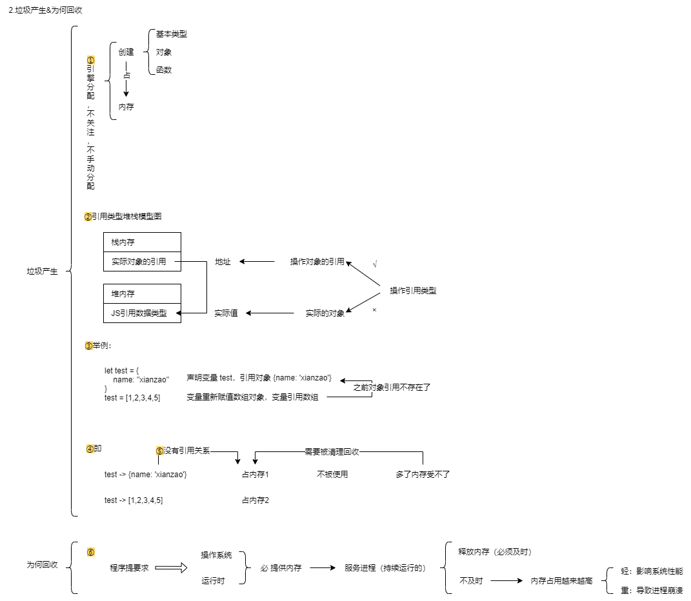

### 2.3 垃圾回收策略

#### 2.3.0 可达性

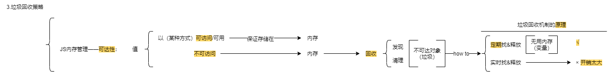

#### 2.3.1 标记清除法

##### What is mark-sweep?

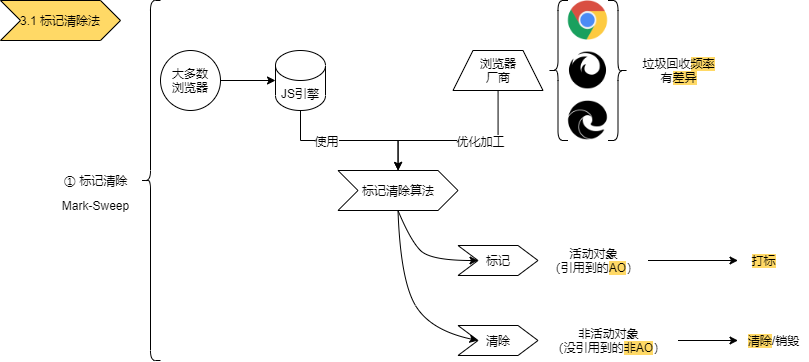

##### 怎么标记变量?

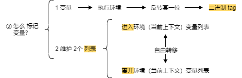

##### 1.策略

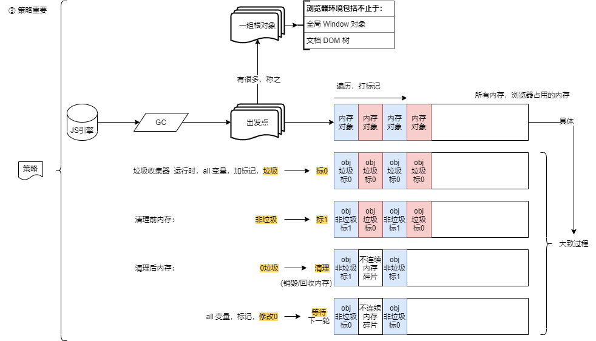

##### 2.优点


##### 3.缺点

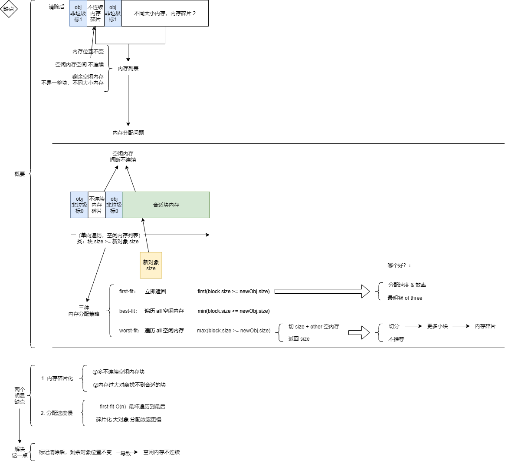

##### 标记整理法`mark-compact`

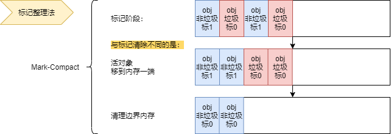

#### 2.3.2 引用计数法

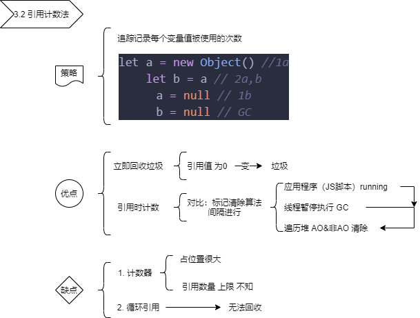

##### What is Reference Counting?

- 早先 de 垃圾回收算法
- 对象有没有其他对象引用
- 零引用
- 垃圾回收机制回收

##### 1.策略

追踪记录每个变量值被使用的次数

```js
let a = new Object() //1a
let b = a // 2a,b
a = null // 1b
b = null // GC
```

##### 2.优点

1. 立即回收垃圾（引用值 为 0 变 垃圾）
2. 引用时计数（对比：标记清除算法间隔进行：JS 运行中，需要线程暂停，执行 GC；还需要遍历堆里的 AO&非 AO 来清除。引用计数只需引用时技术即可。）

##### 3.缺点

1. 计数器

   - 占位置很大
   - limit(number(引用)) 不知

2. 循环引用——无法回收

### 2.4 V8 对 GC 的优化

#### 分代式垃圾回收

#### 并行回收（Parallel）

#### 增量标记与懒性清理

#### 增量

#### 三色标记法（暂停与恢复）

#### 写屏障（增量中修改引用）

#### 懒性情里

#### 增量标记与懒性清理的优缺点？

#### 并发回收（Concurrent）

#### 总结

## 三、JS 的内存泄漏

### 3.1 什么是内存泄漏？

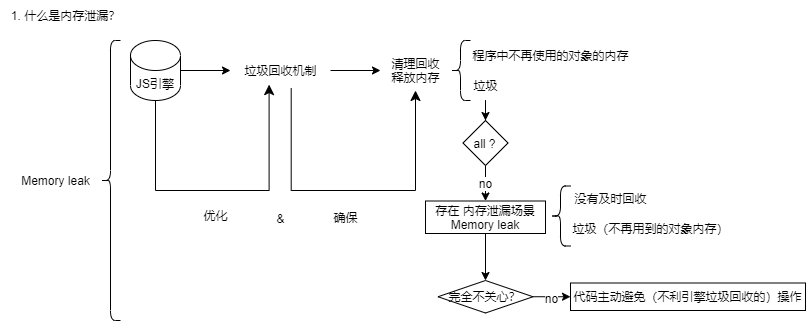

### 3.2 常见的内存泄漏

#### 3.2.1 不正当的闭包

1. 没有造成内存泄漏的闭包

```js
function fn1() {
  let test = new Array(1000).fill('xianzao') // test 可被回收 没有内存泄漏
  return function () {
    // 典型闭包：是有权访问另一 fun(fn1) 函数作用域中变量的函数
    console.log('zaoxian')
  } // 返回函数 没有 fn1 内部的引用
}
let fn1Child = fn1()
fn1Child()
```

2. 造成内存泄漏的闭包 & 解决方案：置空

```js
function fn2() {
  let test = new Array(1000).fill('xianzao') // test 不会被回收，造成内存泄漏
  return function () {
    // 闭包
    console.log(test)
    return test
  } // return 的函数中：存在另一 fun(fn2) 函数作用域中 变量的引用 test
}
let fn2Child = fn2()
fn2Child()
fn2Child = null // 解决：函数调用后，外部引用关系置空
```

#### 3.2.2 隐式全局变量

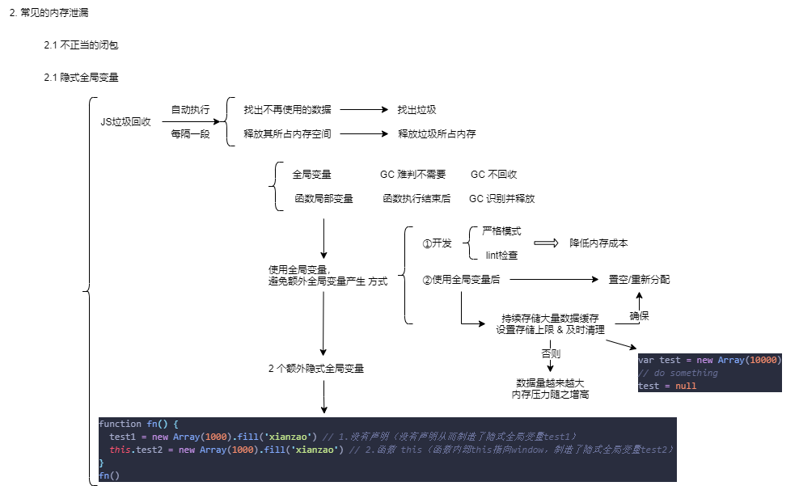

2 个额外隐式全局变量：

```js
function fn() {
  test1 = new Array(1000).fill('xianzao') // 1.没有声明（没有声明从而制造了隐式全局变量test1）
  this.test2 = new Array(1000).fill('xianzao') // 2.函数 this（函数内部this指向window，制造了隐式全局变量test2）
}
fn()
```

置空/重新分配：

```js
var test = new Array(10000)
// do something
test = null
```

#### 3.2.3 游离 DOM 引用

1. 解决图解：

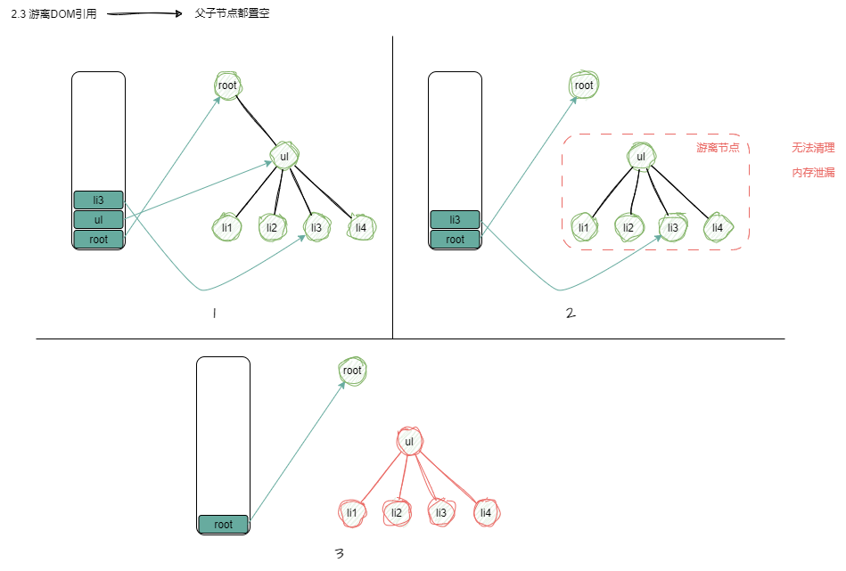

2. 概述：
   考虑 性能/代码简洁，  
   使用 `变量缓存 DOM 节点引用`，  
   但 移除节点时，  
   应该 释放缓存的引用，  
   否则 游离子树无法释放。

3. 代码举例

```html
<div id="root">
  <ul id="ul">
    <li></li>
    <li></li>
    <li id="li3"></li>
    <li></li>
  </ul>
</div>
<script>
  let root = document.querySelector('#root')
  let ul = document.querySelector('#ul')
  let li3 = document.querySelector('#li3')

  // 由于ul变量存在，整个ul及其子元素都不能GC
  root.removeChild(ul) // 1.移除 root 里 ul

  // 虽置空了ul变量，但由于li3变量引用ul的子节点，所以ul元素依然不能被GC
  ul = null // 2.变量缓存 DOM 节点引用——删除节点
  // 置空变量——避免额外全局变量产生
  // 否则，不能GC——内存泄漏

  // 已无变量引用，此时可以GC
  li3 = null
</script>
```

#### 3.2.4 定时器

使用了 `setInterval` `setTimeout` `requestAnimationFrame` ，
要调用 `clearInterval` `clearTimeout` `cancelAnimationFrame` 来清除，
从而避免 **第一行** 没有结束前（**调用第二行前**），**回调函数本身 ②** & **回调函数内依赖的变量 ①**无法回收，而造成的内存泄漏问题。

```js
// 获取数据
let someResource = getData()
setInterval(() => {
  const node = document.getElementById('Node')
	if(node) {
    node.innerHTML = JSON.stringify(someResource)) // ① 回调函数里的变量，无法回收，即 someResource 无法回收
	}
} // ② 回调函数本身，无法回收
, 1000)
```

#### 3.2.5 事件监听器

Vue 举例，React 也一样：

如果没有`第2步`（2.组件销毁时，主动清除事件监听器组件内挂载的事件处理函数），  
引用的变量/函数 被认为需要 而不进行回收；  
内部引用变量存储大量数据 -> 页面占用内存过 -> 意外的内存泄漏。

```html
<template>
  <div></div>
</template>

<script>
  export default {
    created() {
      // 事件监听器：1.组件内挂载 事件处理函数
      window.addEventListener('resize', this.doSomething)
    },
    beforeDestroy() {
      // 事件监听器：2.组件销毁，主动清除
      window.removeEventListener('resize', this.doSomething)
    },
    methods: {
      doSomething() {
        // do something
      }
    }
  }
</script>
```

#### 3.2.6 Map、Set 对象

`Map` `Set` `Object`（{}）都是强引用，主动清除，否则内存泄漏。

1. `Map` ： key 为对象，用 WeakMap，WeakMap 的键是弱引用&必须为对象（由于对象弱引用，不干扰 JS 的 GC），值：任意对象/原始值。
2. `Set` : 用 Set 引用对象，用 WeakSet，存储对象弱引用的唯一值，值同样不重复&只保存对象弱引用（由于对象弱引用，不干扰 JS 的 GC）。
3. 强&弱引用：
   - 强引用：JS GC 机制，持有对象引用（强引用），对象不会 GC；
   - 弱引用：对象被弱引用——不可访问的（弱可访问的）——可能任何时刻被回收。

例 1 ：简单重写引用

```js
let obj = { id: 1 } // 强引用
obj = null // 重写引用，清除对象引用，可回收
```

例 2 ：使用 Map Set

```js
let obj = { id: 1 }
let user = { info: obj } // user 强引用 obj
let set = new Set([obj]) // set 强引用 obj
let map = new Map([[obj, 'xianzao']]) // map 强引用 obj

obj = null // 重写置空

console.log(user.info) // {id: 1} ——>依然可取——>重写所有引用置空
console.log(set)
console.log(map)
```

例 3 ：使用 WeakMap WeakSet

```js
let obj = { id: 1 }
let weakSet = new WeakSet([obj]) // 弱引用 obj
let weakMap = new WeakMap([[obj, 'xianzao']]) // 弱引用 obj

obj = null // 重写置空

// {id: 1} ——>下一次 GC
```

#### 3.2.7 Console

**生产环境——及时清理输出！**

- 项目上线，不清理 console ——隐患，容易忽略；
- 控制台——数据输出，浏览器保存了——输出对象的信息数据引用；
- 未清理的 console ，if 输出对象——内存泄漏。

### 3.3 内存泄漏排查、定位与修复

例子：不正当使用闭包，构成内存泄漏

```html
<!DOCTYPE html>
<html lang="en">
  <head>
    <meta charset="UTF-8" />
    <title>test</title>
  </head>

  <body>
    <button id="click">click</button
    ><!-- 页面 button 元素 -->
    <h1 id="content"></h1>

    <script>
      let click = document.querySelector('#click') // 获取（页面 button 元素） DOM（Document Object Module 文档对象模型）
      let content = document.querySelector('#content') // 获取 content 的 DOM
      let arr = [] // 一个存闭包函数 closures 的空数组

      function closures() {
        let test = new Array(10000).fill('先定一个小目标：熟练掌握 JavaScript 。') // 长度 10000 的 test 数组

        return function () {
          return test
        } // 闭包函数 closures 返回 test 数组的方法
      } // 1.是什么：闭包函数 closures 函数；2.作用：

      click.addEventListener('click', function () {
        arr.push(closures())
        arr.push(closures())
        arr.push(closures())
        arr.push(closures())
        arr.push(closures())
        arr.push(closures())
        arr.push(closures())
        arr.push(closures())
        arr.push(closures())
        arr.push(closures()) // 点击一次按钮，往 arr 数组里，推 10 个上面的闭包函数 closures 函数，

        content.innerHTML = arr.length
      }) // 为元素（页面 button 元素）绑定点击事件
    </script>
  </body>
</html>
```
- 闭包是啥？能够访问自由变量的函数。
- 自由变量是啥？。。。
- [一、JavaScript 高级用法（1） 四、闭包](web0304_js_1_advanced_usage(1).md)

原因：arr 数据有多少元素，存在多少次闭包引用——>程序点击次数越多，push 越多，内存消耗越大，页面越来越卡。

#### 3.3.1 排查问题

#### 3.3.2 分析定位

##### 1.closure

##### 2.array

##### 3.总结

#### 3.3.3 修复验证

### 3.4 常见的前端内存问题

1. 内存泄漏
2. 内存膨胀：  
   短时间 内存占用 急速上升 到达峰值；  
   技术手段减少对内存的占用。
3. 频繁 GC：  
   GC 执行频繁，频繁使用 大临时变量 -> 新生代空间被装满，速度极快；  
   每次 新生代装满 -> 触发 GC（频繁 GC） -> 页面卡顿；  
   避免：减少 太多临时变量的情况（临时变量无用就回收）
