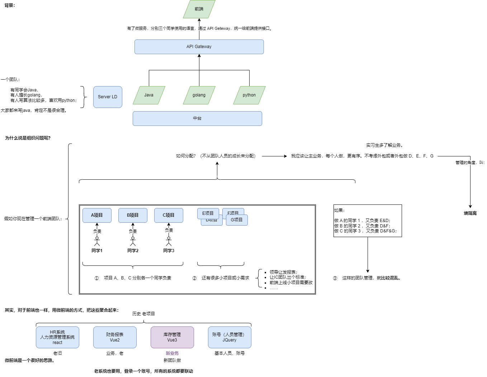
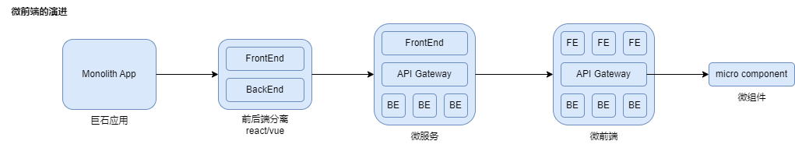
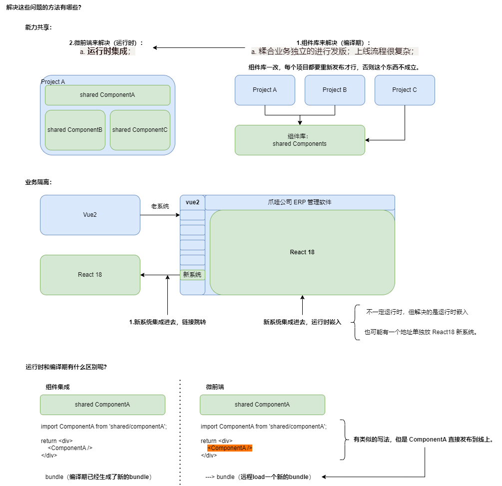

微前端（上）

# 大纲

一、什么是微前端？

    1.1 微前端的概念与历史
    1.2 微前端的典型方案

二、微前端的核心原理

    2.1 single-spa
      1. single-spa 原理
      2. single-spa 的主要问题

    2.2 qiankun
      1. qiankun 核心 api
      2. qiankun 原理

三、微前端实战

# 一、什么是微前端？

## 1.1 微前端的概念与历史

### 1.1.1 微前端历史

> 微前端本质上，**不是**一个**技术问题**，而是一个**架构/团队**的问题。

### 1.1.2 值得深入的方向

- 原因和背景-架构：从**原因和背景**角度，去深入的理解一下**架构**的概念。
- 原理的角度-前端加载：从**原理的角度**，去理解一些关于**前端加载**的概念。

### 1.1.3 背景

最早基于微服务的概念。

2014：微服务的概念被提出，以前用 Java 写接口 -> 变成用 Java/golang/Php/Python 书写接口；服务之间，通过 RPC 等一些其他的方式，把服务串联起来。

- 将一个大的后端服务，分解成很多小的服务
- 不同的服务，可以用不同的技术栈实现；
- 统一的 API 网关 - API Gateway 进行调度。



微前端就是一个很好的思路。

微服务/微前端，整体帮我们做了在技术侧、业务侧的更细致的划分。使我某一块的业务更加内聚，有利于团队之间的配合、维护。

微前端的概念：

- 2016 年 ThoughtWorks 提出的；
- 2018 年，sing-spa（微前端工具）开源；
- 2019 年，qiankun。
- 2020 年（底），qiankun2 发布、webpack5 提出 Module Federation（模块联邦）。

回过头来看，微前端是什么？

### 1.1.4 微前端的演进



#### 1.1.4.1 为什么要用微前端？

##### case

1. 多个系统，都在一个工程下，最后构建的是一个很大的 SPA 应用；
2. MPA 应用，独立上线部署。

##### 问题

1. **能力共享**：业务代码独立；相同的组件，需要人工拷贝，或者独立发布；
2. **业务隔离**：新业务，经常需要和老业务搅合在一起，让整体的复杂度更高。

#### 1.1.4.2 解决这些问题的方法有哪些？

##### 能力共享

（1.a ——> 2.a）
（1.b ——> 2.b）

1. （若）组件库来解决（**编译期**）：  
   a. 糅合业务独立的进行发版；上线流程很复杂；  
   b. 如果一个组件，react 也想用，vue 也想用；

2. （所以）微前端来解决（**运行时**）：  
   a. <span style="color:#DF9443">**运行时集成**</span>；  
   b. <span style="color:#DF9443">**技术栈无限定**</span>；

##### 业务隔离

1. 跳转链接：新业务和老业务以跳转链接的方式；  
   a. （但是）产品不愿意，期望：统一的风格，统一的运行时嵌入；

2. 微前端来解决：  
   a. 独立与自治；  
   b. 系统之间的解耦与组合；

##### 运行时和编译期有什么区别呢？

1. 能力共享 - 组件库来解决 ——> **编译期**

2. 能力共享 - 微前端来解决 ——> **运行时**

3. 组件集成：bundle（编译期已经生成了新的 bundle）  
   & 微前端：---> bundle（远程 load 一个新的 bundle）



#### 1.1.4.3 微前端的意义：

- 提升构建效率
- 升级平滑
- 独立开发/部署/交付
- 业务原子化/颗粒化
- 产品动态化
- 团队自治

不知道团队是否要用微前端，大概率不需要。
并不是所有问题都要用微前端解决，只能解决某一些问题。

# 48:02

# 1.2 微前端的方案

## 1.2.1 广义上：

### 1.2.1.1 Npm 包方案

```js
// 通用工程，很多组件，甚至是接口访问的逻辑： -> umd.js
<script src="xxxx/xxxx/common.min.js"></script>
```

### 1.2.1.2 Iframe 方案

#### 优点：

- 简单；
- 完美的隔离，JS css 都是独立运行；
- 可以页面可以放多个 iframe 来组合；

#### 缺点：

- 每次都要加载，状态不能保留；（子应用没有办法，接管部分主应用的路由）
- 通信不是很方便，postMessage
- 布局有限制，默认的也有点丑；
- 资源加载在 onload 之后，比较慢。

### 1.2.1.3 Web components 方案

#### Custom elements


自定义的一组 JS API

#### Shadow Dom

#### Html templates

##### 优点：

- 技术栈无关
- 支持独立开发
- 应用之间隔离（浏览器天生的隔离）

##### 缺点：

- 技术栈有限制（Stencil：语法有点像 React ，有点像 Vue）

### 1.2.1.4 MF(module federation) 方案 （webpack5 的**模块联邦方案**）

host：引用了其他应用的应用
remote：被其他应用所引用的应用

#### 优点

- 改造成本很低

#### 缺点

- 没有样式隔离
- 入口文件的缓存问题

## <span style="color: red;">**01:03:22**</span>

### Single-spa 方案

- 加载微应用
- 管理微应用状态（初始化、挂载、卸载）：路由匹配


# Q&A

## 1.关于微前端，很多简历，大多都会这么写：

基于 qiankun，MF 搭建了微前端应用框架；隔离了子应用，使用沙箱。

三年前算亮点，但现在不算亮点。

## 2.现在面试官会问什么？

- 为什么要用微前端？
- 解决了什么问题？
- 微前端的原理：
  - Sandbox 隔离-沙箱隔离，怎么做的？
  - Proxy 怎么做的？
  - CSS 隔离怎么做的？
  - Qiankun VS Single-spa 的区别？

# 二、微前端的核心原理

## 2.1 single-spa

### 2.1.1 single-spa 原理

### 2.1.2 single-spa 的主要问题

## 2.2 qiankun

### 2.1.1 qiankun 核心 api

### 2.1.2 qiankun 原理

# 三、微前端实战

# 总结
