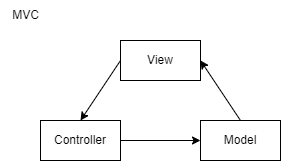
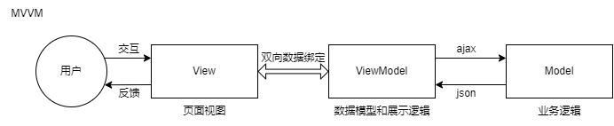

React 基础

# 目标

1. 入门 React，了解常规用法；
2. 掌握面试中 React 的基础问题；
3. 掌握 React 学习路线；

- react.js 简介
- jsx 模版语法及 babel 编译配置
- 事件/条件渲染/列表渲染等基础用法
- react.js 组件化及生命周期
- refs 及 React API 详解
- create-react-app cli 的使用
- "函数组件和 class 组件/受控组件和非受控组件"
- 异步过程使用单例的 event 对象
- 性能优化方式（⭐）
- 介绍 immutable 库 immutable-js 和 immer

# 1.react.js 简介（Course：React 简介）【done】

快速开始一节：80%常用概念。

React：ui = render (data) -> 单向数据流

## MVC

Model -> View -> Controller -> Model



```js
// model
var myapp = {} // 创建这个应用对象

myapp.Model = function () {
  var val = 0 // model层数据val

  this.add = function (v) {
    if (val < 100) val += v // 模型层val小于100，调用添加方法增加v
  }

  this.sub = function (v) {
    if (val > 0) val -= v // 模型层val大于0，调用减少方法减少v
  }

  this.getVal = function () {
    return val // 获取模型层数据val
  }

  /* 观察者模式 */
  var self = this, // self是Model层自己
    views = [] // views存多个view层

  this.register = function (view) {
    views.push(view) // 把view层注册进模型层。
  }

  this.notify = function () {
    // 通知
    for (var i = 0; i < views.length; i++) {
      views[i].render(self) // 调用所有view层各自的render函数
    }
  }
}

// view
myapp.View = function (controller) {
  var $num = $('#num'), // 获取 num dom
    $incBtn = $('#increase'), // 增加按钮
    $decBtn = $('#decrease') // 减少按钮

  this.render = function (model) {
    $num.text(model.getVal() + 'rmb') // 获取公共model层的值，并设置渲染到视图模板上
  }

  /* 绑定事件 */
  $incBtn.click(controller.increase) // 绑定 controller 层的增加事件
  $decBtn.click(controller.decrease) // 绑定 controller 层的减少事件
}

// controller
myapp.Controller = function () {
  var model = null,
    view = null

  this.init = function () {
    model = new myapp.Model() // 初始化model
    view = new myapp.View(this) // 初始化view

    /* View向Model注册，当Model更新就会去通知View啦 */
    model.register(view) // 模型层注册view层
    model.notify() // 模型通知
  }

  // 让Model更新数值并通知view更新视图
  this.increase = function () {
    model.add(1) // 模型添加
    model.notify() // 模型通知
  }

  this.decrease = function () {
    model.sub(1) // 模型减少
    model.notify() // 模型通知
  }
  // 模型通知会调用视图渲染，渲染模型绑定的数据。
}

// init
;(function () {
  var controller = new myapp.Controller()
  controller.init()
})()
```

## MVVM



```js
// model
var data = {
  val: 0
}

// view
<div id="myapp">
  <div>
    <span>{{ val }}rmb</span>
  </div>
  <div>
    <button v-on:click="sub(1)">-</button>
    <button v-on:click="add(1)">+</button>
  </div>
</div>

// controller
new Vue({
  el: '#myapp',
  data: data,
  methods: {
    add(v) {
      if(this.val  < 100) {
        this.val += v
      }
    },
    sub(v){
      if(this.val > 0) {
        this.val -= v
      }
    }
  }
})
```

## Vue 和 React，严格上都不是 MVVM

React：ui = render(data) 单项数据流。  
React：MV 没有 C  
Vue：ref 直接操作 DOM，跳过了 ViewModel。

面试：MVVM 是不是 Vue？不是。可以说 Vue 是 MVVM 框架，但不能说 Vue 就是 MVVM，因为 ref 可以直接操作 DOM，跳过了 ViewModel；ref 是一种扩展的能力。

# <span style="color:red;">37:14</span>

# 2.JSX 模版语法及 babel 编译配置

## 2.0 Course：JSX 模板语法【done】

### 补充：

JSX 是一种 JavaScript 语法扩展，将 UI 和逻辑层进行耦合。
是语法扩展，那么就不是真正的 HTMl，只是语法上更贴近 HTML 的用法；比如 html：class，jsx：className；html：z-index，jsx：zIndex。所以，jsx 只是类似于 HTML 的 JS 的扩展方式，并不是完整的 HTML。

react 将 jsx 编译，解析驼峰写法，转换成中划线（属性），虚拟 dom，-> browser -> class（DOMElement）

react 语法解析过程中的写法（并不是真正 html，类似于 html 的写法）

JS + 类似于 HTML 的写法，将写法编译，转换成对象，最后通过不同的环境进行渲染。

JSX 的能力是 react 提供的。

递归的创建 React.createElement()

通过一个对象表达出 dom 结构，就是虚拟 dom。通过比较两个对象的参数、属性，来达到比较两个真实 dom 的比较，最后找出不同，进行更新，然后就得出真实要更新的一个属性，然后将属性带入到真实 dom 的属性，好处就是真实 dom 上其他属性就不需要改变了，只需要关联到核心的变化就可以，这就是 diff 算法，进行 vdom 的目的。

用于在 JavaScript 代码中编写 XML 样式的声明性语法。它通常与 React 一起使用，用于创建声明式 UI 组件。JSX 允许开发人员在 JavaScript 中编写类似 HTML 的标记和组件结构，然后使用转换器将其转换为纯 JavaScript 代码。这使得编写和维护复杂的 UI 组件变得更加容易，因为它将模板和逻辑代码紧密耦合在一起，同时也提高了代码的可读性和可维护性。虽然 JSX 最初是由 React 引入的，但它也可以与其他类似 React 的库一起使用。

React.createElement(标签，属性，内容(变量、字符串))

React.createElement(type, [props], [...children])

### 【1】JSX 称为 <span style="color:red;">JS 的语法扩展</span>，将 UI 与逻辑层耦合在组件里，用{}标识。

### 【2】JSX 里使用小驼峰命名（camelCase）定义属性的名称：

- class 用 className
- tabindex 用 tabIndex
- label 标签的 for 用 htmlFor。

### 【3】JSX 支持 JS 变量、方法、表达式：

```jsx
// 变量
const friendsStr = '张三,李四,王五,赵六,田七,钱八,孙九,周十'
const element = <h1>欢迎你们，{friendsStr}！</h1>

// 方法
function mergeFriends(friends) {
  return friends.join(',')
}

const friends = ['张三', '李四', '王五', '赵六', '田七', '钱八', '孙九', '周十']

const element = <h1>让我们用激烈的掌声欢迎{mergeFriends(friends)}的到来！</h1>

function welcome(friends) {
  // 表达式
  if (friends) {
    return element
  }
  return <h1>欢迎你！</h1>
}
```

### 【4】JSX 支持指定属性

#### 【4.1】注意：JSX 支持防注入(防止 XSS 攻击)

```jsx
const element = </img>;

注意：JSX支持防注入(防止XSS攻击)
const title = response.potentiallyMaliciousInput;  // 此时只是字符串
// 直接使用是安全的： const element = <h1>{title}</h1>;
```

#### 【4.2】React 如何预防 XSS？

##### 【4.2.1】XSS 类型

###### 1.反射型 XSS

1.1 服务器在对此 URL `https://xxx.com/search?query=userInput`，的响应中回显提供的搜索词`query=123`：

```jsx
<p>您搜索的是: 123</p>
```

1.2 如果有用户请求攻击者的 URL ，则攻击者提供的脚本将在用户的浏览器中执行。

`https://xxx.com/search?query=`

```jsx
<p>您搜索的是: </p>
```

###### 2.存储型 XSS，存储到目标数据库

评论输入，所有访问用户都能看到了

```jsx
<textarea>
  
</textarea>
```

##### 【4.2.2】部分源码

```jsx
for (index = match.index; index < str.length; index++) {
  switch (str.charCodeAt(index)) {
    case 34: // "
      escape = '&quot;'
      break
    case 38: // &
      escape = '&amp;'
      break
    case 39: // '
      escape = '&#x27;'
      break
    case 60: // <
      escape = '&lt;'
      break
    case 62: // >
      escape = '&gt;'
      break
    default:
      continue
  }
}
```

##### 【4.2.3】React 对一段恶意代码进行转义

###### 1.一段恶意代码：

```jsx

```

###### 2.React 在渲染到浏览器前进行转义，

对浏览器有特殊含义的字符都被转义，恶意代码在渲染到 HTML 前都被转成了字符串（在浏览器中不会运行，只是一段字符串）：
`&lt;img src=&quot;empty.png&quot; onerror =&quot;alert(&#x27;xss&#x27;)&quot;&gt; `

#### 【4.3】React 对 JSX 的处理

##### 1.JSX：

```jsx
const element = <h1 className="greeting">Hello, world!</h1>
```

##### 2.通过 babel 编译后的代码：

```jsx
const element = React.createElement(
  'h1',
  { className: 'greeting' },
  'Hello, world!'
)
```

##### 3.React.createElement() 方法返回的 ReactElement：

```jsx
const element = {
  $$typeof: Symbol('react.element'),
  type: 'h1',
  key: null,
  props: {
    children: 'Hello, world!',
        className: 'greeting'
  }
  ...
}
```

##### 4.如何模拟一个 Children 会如何？

```jsx
const storedData = `{
    "ref":null,
    "type":"body",
    "props":{
        "dangerouslySetInnerHTML":{
            "__html":""
        }
    }
}`;
// 转成 JSON
const parsedData = JSON.parse(storedData);
// 将数据渲染到页面
render () {
    return <span> {parsedData} </span>;
}
```

##### 5.所以，$$typeof 是用来标记一个 ReactElement 的，JSON 化后 Symbol 会丢失，React 会报错。

### 【5】JSX 表示对象

```jsx
const element = <h1 className="greeting">Hello, world!</h1>
```

等同于 React.createElement

```jsx
// 等同于React.createElement
const element = React.createElement(
  'h1',
  { className: 'greeting' },
  'Hello, world!'
)

const element = {
  type: 'h1',
  props: {
    className: 'greeting',
    children: 'Hello, world!'
  }
}
```

### 【6】JSX 渲染为 DOM

使用 ReactDOM.render

```jsx
// 使用ReactDOM.render
const element = <h1>Hello, world</h1>
ReactDOM.render(element, document.getElementById('root'))
```

render 只能代表当前时刻的状态  
更新元素 只能再次 ReactDOM.render  
不建议多次 render

```jsx
function tick() {
  const element = (
    <div>
      <h1>Hello, world!</h1>
      <h2>It is {new Date().toLocaleTimeString()}.</h2>
    </div>
  )
  ReactDOM.render(element, document.getElementById('root'))
}

setInterval(tick, 1000) // 不建议多次render
```

### 【7】JSX 转 JS

JSX 可以当做语法糖，可以在 babel 官网中尝试，https://babeljs.io/repl

可以使用官网提供的 create-react-app npm run eject 来看 babelrc 中的配置，主要使用
https://www.babeljs.cn/docs/babel-preset-react

```bash
# 安装babel 及react 的依赖
npm install core-js @babel/core @babel/preset-env @babel/preset-react @babel/register babel-loader @babel/plugin-transform-runtime --save-dev
```

> .babelrc

```js
{
    "presets" : [
        "@babel/preset-env" ,
        "@babel/preset-es2015",
        "@babel/preset-react"
    ],
    "plugins" : [
        "@babel/plugin-transform-runtime"
    ]
}
```

## 2.1 JSX 语法【done】

### 2.1.1 官方文档：JSX 标记语法【done】

[React 阅读笔记——2.Writing markup with JSX【done】](https://github.com/djsz3y/learning-notes/blob/master/website/react/README.md#2writing-markup-with-jsxdone)

参考链接：[Writing markup with JSX](https://react.dev/learn#writing-markup-with-jsx)

### 2.1.2 官方文档：变量、表达式【done】

[React 阅读笔记——4.Displaying data【done】](https://github.com/djsz3y/learning-notes/blob/master/website/react/README.md#4displaying-datadone)

参考链接：[Displaying data](https://react.dev/learn#displaying-data)

### 2.1.3 官方文档：class style【done】

[React 阅读笔记——3.Adding styles【done】](https://github.com/djsz3y/learning-notes/blob/master/website/react/README.md#3adding-stylesdone)

参考链接：[Adding styles](https://react.dev/learn#adding-styles)

### 2.1.4 子元素和组件

```jsx

```

## 2.2 babel 编译配置

见 2.0 Course

# 3.事件/条件渲染/列表渲染等基础用法【to do】

## 3.1 官方文档：事件【done】

[React 阅读笔记——7.Responding to events【done】](https://github.com/djsz3y/learning-notes/blob/master/website/react/README.md#7responding-to-eventsdone)

参考链接：[Responding to events](https://react.dev/learn#responding-to-events)

## 3.2 官方文档：条件渲染【done】

[React 阅读笔记——5.Conditional rendering【done】](https://github.com/djsz3y/learning-notes/blob/master/website/react/README.md#5conditional-renderingdone)

参考链接：[Conditional rendering](https://react.dev/learn#conditional-rendering)

## 3.3 官方文档：列表渲染【done】

[React 阅读笔记——6.Rendering lists【done】](https://github.com/djsz3y/learning-notes/blob/master/website/react/README.md#6rendering-listsdone)

参考链接：[Rendering lists](https://react.dev/learn#rendering-lists)

## 3.4 组件和 props 类型检查

### 3.4.1 组件

#### 3.4.1.1 官方文档：Creating and nesting components

[React 阅读笔记——1.Creating and nesting components【done】](https://github.com/djsz3y/learning-notes/blob/master/website/react/README.md#1creating-and-nesting-componentsdone)

参考链接：[Creating and nesting components](https://react.dev/learn#components)

#### 3.4.1.2 Course：组件

##### 分类

[1]函数式组件

```jsx
function Welcome(props) {
  return <h1>Hello, {props.name}</h1>
}
```

[2]Class 类组件

```jsx
class Welcome extends React.Component {
  render() {
    return <h1>Hello, {this.props.name}</h1>
  }
}
```

##### 渲染组件

[1]定义组件，开头大写

```jsx
function Component(props) {
  return <div>...{props.prop1}...</div>
}
```

[2]渲染组件用`ReactDOM.render`

```jsx
ReactDOM.render(<Component prop1="专注于心，默默努力" />, dom)
```

[3]组件可以赋值给变量

```jsx
const element = <Component prop1="困境坚持乐观，低谷保持勇敢" />
```

[4]新组件直接 return 旧组件

```jsx
function NewComponent(props) {
  return element
}
```

[5]举例

```jsx
function Welcome(props) {
  return <h1>Hello, {props.name}</h1>
}

const element = <Welcome name="Sara" />
ReactDOM.render(element, document.getElementById('root'))

// 自定义组件使用大写字母开头
import React from 'react'

// 正确！组件需要以大写字母开头：
function Hello(props) {
  // 正确！ 这种 <div> 的使用是合法的，因为 div 是一个有效的 HTML 标签：
  return <div>Hello {props.toWhat}</div>
}

function HelloWorld() {
  // 正确！React 知道 <Hello /> 是一个组件，因为它是大写字母开头的：
  return <Hello toWhat="World" />
}
```

##### 组件的组合与拆分

[1]页面内可多次引用同一组件

```jsx
<Component prop1="专注于心，默默努力" />
<Component prop1="困境坚持乐观，低谷保持勇敢" />
```

[2]复杂组件可以拆分

```jsx
function OuterComponent(props) {
  return (
    <div className="OuterComponent">
      <InnerComponent something={props.something} />
      <div>...</div>
    </div>
  )
}
```

[3]举例

```jsx
// 页面内多次引用
;<div>
  <Welcome name="Sara" />
  <Welcome name="Cahal" />
  <Welcome name="Edite" />
</div>

function Comment(props) {
  return (
    <div className="Comment">
      <div className="UserInfo">
        
        <div className="UserInfo-name">{props.author.name}</div>
      </div>
      <div className="Comment-text">{props.text}</div>
      <div className="Comment-date">{formatDate(props.date)}</div>
    </div>
  )
}

// 拆分后为
function Comment(props) {
  return (
    <div className="Comment">
      <UserInfo user={props.author} />
      <div className="Comment-text">{props.text}</div>
      <div className="Comment-date">{formatDate(props.date)}</div>
    </div>
  )
}
```

##### 受控组件 与 非受控组件

```jsx

```

### 3.4.2 props 类型检查

#### Course：

所有 React 组件都必须像纯函数一样保护它们的 props 不被更改。

```jsx
// 错误，要像纯函数一样幂等
function withdraw(account, amount) {
  account.total -= amount
}
```

## 3.5 state 和 setState

### Course：

```jsx

```

# 4.react.js 组件化及生命周期【to do】

## 组件化

```jsx

```

## 4.2 生命周期

### 4.2.1 render

class 组件必需的方法
获取最新的 props 和 state
在不修改组件 state 的情况下，每次调用时都返回相同的结果

### 4.2.2 constructor

#### 为 React 组件实现构造函数的情况：

- 初始化 state：通过给 this.state 赋值对象来初始化内部 state；
- 方法绑定：为事件处理函数绑定实例；

```jsx
constructor(props) {
  super(props);
  // 不要在这里调用 this.setState()
  this.state = { counter: 0 };
  this.handleClick = this.handleClick.bind(this);
}
```

#### 注意避免：

1. 不要调用 setState()
2. 避免将 props 的值复制给 state

以下是错误的：

```jsx
this.state = { color: props.color } // wrong
```

### 4.2.3 componentDidMount

### 4.2.4 componentDidUpdate

### 4.2.5 componentWillUnmount

### 4.2.6 shouldComponentUpdate(nextProps, nextState)

（不常用）

### 4.2.7 static getDerivedStateFromProps(nextProps, prevState)

（不常用）

### 4.2.8 getSnapshotBeforeUpdate

### 4.2.9 static getDerivedStateFromError

（不常用）

### 4.2.10 componentDidCatch

### 4.2.11 UNSAFE_componentWillMount

### 4.2.12 UNSAFE_componentWillReceiveProps

### 4.2.13 UNSAFE_componentWillUpdate

（不建议使用）

# 5.refs 及 React API 详解

## refs

## React API

# 6.create-react-app cli 的使用

[Create React App 官网](https://create-react-app.dev/)

## 6.1 官方文档：简介【done】

[React 阅读笔记——简介【done】](https://github.com/djsz3y/learning-notes/blob/master/website/react/README.md#简介done)

参考链接：[Create React App 首页](https://create-react-app.dev/)

## 6.2 使用

```bash

```

参考链接：[Creating an App](https://create-react-app.dev/docs/getting-started#creating-an-app)

# 7."函数组件和 class 组件/受控组件和非受控组件"

# 8.异步过程使用单例的 event 对象

# 9.性能优化方式（⭐）

# 10.介绍 immutable 库 immutable-js 和 immer

# <span style="color:red;">总结</span>

经过以上整理，我对自己有如下要求：

- [x] 实战
- [ ] 阅读 React 官网：[阅读 React 官方文档笔记](https://github.com/djsz3y/learning-notes/blob/master/website/react/README.md)

# 友情链接

- [我的掘金主页](https://juejin.cn/user/1042768423037150)

- [我的 github 主页](https://github.com/djsz3y)

- [读书视频学习笔记](https://github.com/djsz3y/learning-notes)

- [爪哇学习笔记](https://github.com/djsz3y/zhaowa-study-notes)

- [bug 仓库](https://github.com/djsz3y/bug-repository)
