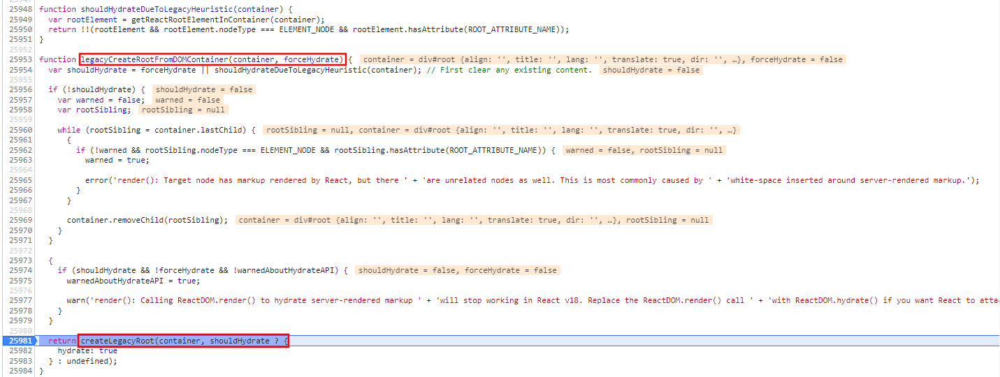
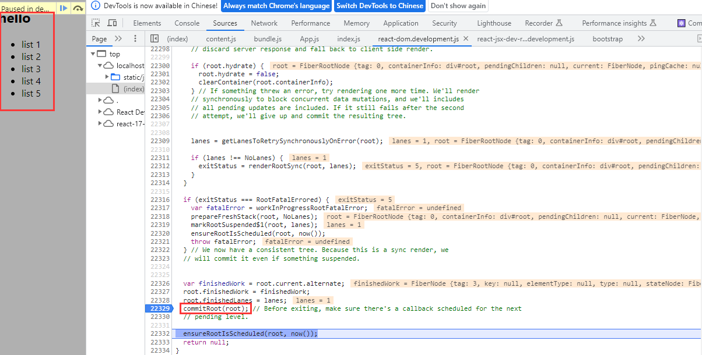

react.js 核心源码解析（上）

# 目标

弄清楚运行时，编译器是什么，了解 react 源码调试。

- react 代码组织及 diff 详解
- 组件的实现与挂载原理（⭐）
- 详解事务与队列原理（⭐）
- Fiber Reconciler 原理（⭐）
- Suspense 原理详解（⭐）
- lane 模型详解（⭐）
- 优先级插队以及时间切片详解（⭐）

React 源码

先问一个问题：读过源码吗？

# 1.关于源码的一些误区

## 1.1 是否读过源码

1. react 源码，很多人都没读过；
2. 读过的，跟写得好不好，其实没有什么太大的关系；
3. 就算不读，依然可以回答好问题。**（读过一部分，大概看过。）**

## 1.2 你读源码是为了什么？

假设你是一名 Vue 的同学，为什么要学 react 的源码？

1. **构建知识体系**（发现一类解决方案的规律）——> **做到技术无关**（比如 redux&mobx，如果只会 redux，你是不可能了解状态管理的规律的；但是你即了解 redux 又了解 mobx，又了解了更多的东西，你是不是就容易在这里面总结出这一类解决方案的规律，然后做到所谓的技术无关）。最终都要实现这一点，与技术无关（架构、更高 level 必经之路）。
2. react 和 vue 的**对比**——>更好地了解 vue。
3. **精神层面**，技多不压身，读了感觉自己很厉害很溜很牛皮很棒（这么多“很”都不认识了）。

了解 react 源码与实现原理：

1. 学习更多的东西，方便对前端的框架中原理、设计思路有更好的了解和吸收。
2. 学习一些其他源码的思想，对自己的工作、业务知识也有一些帮助。
3. 虽然公司里没有用过，但是对其他的知识也有比较了解。

## 1.3 源码应该怎么学？

### 1）最厉害的

- 源码全部通读完；
- 每一个生命周期、每一个 API 做了什么，为什么这么做，都有了解；
- 每一个要讨论的 issue 在 github 上，我很清楚。
- 怎么用，怎么玩，甚至怎么改变它，做一个类似于 casong 那种，这肯定是最厉害的。

### 2）部分理解

不是非常的感兴趣，想指导一下工作、interview；我们可以做到**部分理解**：

1. 我们了解整个 react 的执行流程，在大方向上不出错。 —— 以 react 17 为例。（比如问到一些东西完全不了解，完全只会背题）
2. 了解一些细节，了解一些常见的面试题。—— 以 react 18 的一些 API 为例。（因为不是必考）（比如说 fiber 架构）
3. 在使用上有自己的心得。

就可以了。

- 本节主要前两点。
- 第三点要在以后实战。

### 3）问到源码就不会

最差的。

# 2.关于 react 的一些问题

概要：

1. 包的版本
2. 包的内容
3. 什么是运行时框架

## 2.0 提问：

### 1）react 好在哪？

高优先级打断低优先级？版本？cra（create-react-app）？什么场景？

- react 不是每一个版本都可以高优先级打断低优先级，哪怕在 react 源码里看到 fiber、看到类，他依然可能做不到这件事。
- react 生态是什么样的？一般情况下，我要搞一个什么样的东西，这些东西有什么样的能力，说了很多，但是呢，我当前的版本还没实现。大家只看到了前一段话，fiber 好在哪？高优先级打断低优先级，这样说就是根本不了解了，还搞定过就不太可信了。

### 2）setState 是同步还是异步？

1. 准确的来说，在 legacy 模式（默认）下，如果没有 setTimeout，没有一些定时器，没有一些闭包，这样一些场景下的时候，除了这些场景下是同步的，其他全是异步的；包括 18，包括 concurrent。
2. 我们回头（next lesson）会手写一个这个东西。
3. 其实他想让你解释清楚什么情况下是同步的，什么情况下是异步的。

### 3）API 的话很简单，我们手动调用 batchUpdate

## 2.1 包的版本

### react 15

最早的时候，react 15，
stack reconciler
state* num -> 1
1,2,3 * num -> 2,4,6
223, 243, 246.

### react 17.0.2（稳定版本，一直用的这个）

三种模式（讲两种）：

- legacy 模式 -- 同步模式
- concurrent 模式 -- 异步、并发模式

我们如果打开[react 源码：17.0.2/packages/react-reconciler/src](https://github.com/facebook/react/tree/17.0.2/packages/react-reconciler/src)，像\*.old.js 一般是 legacy 模式编译的，\*.new.js 一般是 concurrent 模式编译的，但不绝对。

### react 18

直到 18 的版本，（真正由）同步的更新 -> 变为异步可中断的更新（要了解、知道，这个很难调试出来）。
一般情况下，会问优先级，比如说 batchUpdate 的原理、Suspense 的实现——和 Promise 有关（可以考察基础知识点）。

这是整个包版本的东西。

那么既然这么复杂的话，我们的源码应该怎么学呢？【1.3 源码应该怎么学？】

## 2.2 包的内容

只需要先关注三个包就行（packages 里）：

1. react:  
   （1.虚拟 dom 相关 API）  
   （2.hooks 用户侧 API）
2. react-reconciler:  
   （调和）
3. react-dom:  
   （操作 DOM 的 API）
4. scheduler

react-server：ssr  
react-art：svg 处理

其实：

- 每个包都能单独使用（react、react-reconciler、scheduler；react-dom 可以换掉）。
- RN（时候，单独使用，非常好玩）。
- 无数种办法写一个迷你的 react。


### react

### react-reconciler

### react-dom

### scheduler

## 2.3 什么是运行时框架？

### 【1】运行时，一般情况，会和编译器一起来说：

#### 函数执行前后增加能力——不用编译器：

[1]假如有一个函数 Test()，

```js
function Test() {
  // todo something...
}
```

[2]想在 Test 执行前后，增加一些能力（打印一些内容）：

```js
function wrapped(fn) {
  return function (...rest) {
    console.log('fn is starting...')
    fn.apply(this, rest)()
    console.log('fn is ending...')
  }
}
```

[3]执行 NewTest，就可以做到这一点：

```js
const NewTest = wrapped(Test)
NewTest(1, 2, 3) // 执行 NewTest
```

#### 函数执行前后增加能力——使用编译器：

[1]如果用户连 NewTest 这一行都不要加（第[3]步都不想），就像 Test 前后都打印，那么怎么办？

[2]那么大家想一想是不是我们可以：  
读到 function Test() {} 这几行代码，在这几行代码执行前后都塞入{1}，{2}（只要有 Test，我就放入这两行）；  
这就是编译器的能力。

```js
function Test() {
  console.log('fn is starting...') // {1}
  // todo something...
  console.log('fn is ending...') // {2}
}
```

#### 编译器的进一步解释：

[1]也就是：

一般我们说，非运行时，编译器的能力；  
**运用**到一些**编译器**的能力，就是**直接读写字符串**。
把**函数当作字符串去读写**，

[2]比如：

在 vue 里，这一行`<div v-for="item of xxx"></div>`为什么生效？

```html
<template>
  <div>
    <div v-for="item of xxx"></div>
  </div>
</template>
<script></script>
```

在 html 里没有这个规则，它就是利用了编译器的能力：  
只要读到这个字符串，我就知道把这句话给它扩写成几句，我们可以这样理解。

[3]相对上面总结一下，就是：

- vue 是一个半编译，半运行时的框架。
- react 除了 jsx，是一个完全运行时的框架。

### 【2】架构层面

[1]（我们再从另外一个角度想一想）  
你是一个架构的设计人员，如果架构设计不太灵活，用户必须遵照已有的规则先用、再用、再怎么使用；如果架构设计的足够灵活，想怎么用怎么用，想传什么传什么；要想把一个框架设计的足够灵活，那它就没有很多特定的语法。比如：react 没有语法糖，没有 v-if、v-for，所有的东西都在 jsx 里直接写。甚至可以写 IIFE，也可以直接写一个 if-else。这就是 react 的灵活性。

```jsx
<div>
  {(function () {
    return <div></div>
  })()}
</div>
```

[2]react 是运行时的，要想解决性能问题，不可能走编译：

react 为**保证灵活性**，就**不能走编译**，所有的东西基本上都要是**运行时**的。
然而，运行时是**不可控**的（用户的代码更新的，都不可控）。
不可控，只有**全 diff**。react 再小的更新，只有从头再来一遍。

（所以 react18 做时间切片）  
（不能 openblock、patchFlag 都不能走，因为本质上没有编译器的东西，没办法在静态的东西上做任何的优化的）

**react 的书写规则无法做优化，只能在运行时做优化。**

[3]不管怎样，都要**全 diff**（从头到尾完全的跑一遍）。  
那就**让用户感觉到性能**是 ok 的。

\*用户的性能体感是什么指标？

- FMP（首屏加载）、
- CLS、
- **FID**（尤其是 FID，first input delay，首次输入延时。）  
  更新的再慢，只要**让用户输入没有延时**，那么**用户就感觉不卡**。

这就是运行时做优化。  
\*现在体会一下：

- vue 文件，后缀是 vue，因为要现以字符串的形式去读；
- react 的文件后缀可以是 js，因为 react 唯一的编译只有 babel。

### 【3】react 中唯一的编译——babel 编译 jsx 为函数。

[1]编译前：

> a.js

```jsx
function App() {
  return (
    <div className="app">
      <h2>hello</h2>
      <div id="list">
        <ul>
          <li>list 1</li>
          <li>list 2</li>
          <li>list 3</li>
          <li>list 4</li>
          <li>list 5</li>
        </ul>
      </div>
    </div>
  )
}
```

[2]编译后：

[2.1]React Runtime(Automatic)

```js
import { jsx as _jsx } from 'react/jsx-runtime'
function App() {
  return /*#__PURE__*/ _jsx('div', {})
}
```

[2.2]React Runtime 换成 Classic 版本；

- 就是一个函数与函数的嵌套（React.createElement）：

> a.js

```js
function App() {
  return React.createElement(
    'div',
    { className: 'app' },
    React.createElement('h2', null, 'hello'),
    React.createElement(
      'div',
      { id: 'list' },
      React.createElement(
        'ul',
        null,
        React.createElement('li', null, 'list 1'),
        React.createElement('li', null, 'list 2'),
        React.createElement('li', null, 'list 3'),
        React.createElement('li', null, 'list 4'),
        React.createElement('li', null, 'list 5')
      )
    )
  )
}
```

这就是 要搞清楚 React 从头到尾有哪些东西，怎么来的。

# 3.画图学源码——17.0.2

babel6 : babel-preset-react-app
babel7 : @babel/preset-react

## 3.1 写 react 代码，最后成了什么样子？为什么是这个样子？

### 3.1.1 寻找 createElement

#### 【1】createElement 是什么？就是创建一个对象。

> 源码 [packages/react/src/ReactElement.js](https://github.com/facebook/react/blob/17.0.2/packages/react/src/ReactElement.js) 第 348 行

```js
/**
 * Create and return a new ReactElement of the given type.
 * See https://reactjs.org/docs/react-api.html#createelement
 */
export function createElement(type, config, children) {
  // ...
}
```

使用时就是：

```js
React.createElement('h2', null, 'hello')
```

#### 【2】我们还是从 [packages/react/index.js](https://github.com/facebook/react/blob/17.0.2/packages/react/index.js) 里看：

- 搜索 createElement ，发现最后一行引用自 `{...} from './src/React';`。

```js
// Export all exports so that they're available in tests.
// We can't use export * from in Flow for some reason.
export {
  // ...
  createElement
  // ...
} from './src/React'
```

#### 【3】打开 [packages/react/src/React.js](https://github.com/facebook/react/blob/17.0.2/packages/react/src/React.js) 第 101 行：

- 发现其实一样的，还是用的 `{...} from './ReactElement';`——当前目录下的 ReactElement 。

```js
import {
  createElement as createElementProd,
  createFactory as createFactoryProd,
  cloneElement as cloneElementProd,
  isValidElement
} from './ReactElement'
```

#### 【4】所以，还是看【1】ReactElement.js。

### 3.1.2 分析 createElement

打开 [packages/react/src/ReactElement.js](https://github.com/facebook/react/blob/17.0.2/packages/react/src/ReactElement.js#L348)，看第 348 行的 createElement 方法。

- 我们且不管 createElement 中间做了什么，直接看 return ；
- return 的参数里有 key、ref，也就是中间写了一些 key、ref；
- 最后调用了 ReactElement 方法。

```js
/**
 * Create and return a new ReactElement of the given type.
 * See https://reactjs.org/docs/react-api.html#createelement
 */
export function createElement(type, config, children) {
  // ...
  return ReactElement(
    type,
    key,
    ref,
    self,
    source,
    ReactCurrentOwner.current,
    props
  )
}
```

### 3.1.3 分析 ReactElement 方法<span style="color: red;">（TODO 看到一个好用插件：）</span>

> 再看[packages/react/src/ReactElement.js——第 146 行](https://github.com/facebook/react/blob/17.0.2/packages/react/src/ReactElement.js#L146)

[1]先定义一个 element，最后 return element——返回了一个对象。

[2]说白了，babel 生成的 React.createElement() 方法，  
这一系列的 createElement，最后形成的就是一个对象；  
这些对象以树的形式，一点点的嵌套起来；

```js
const ReactElement = function (type, key, ref, self, source, owner, props) {
  const element = {
    // ...
  }

  return element
}
```

[3]执行完，得到一个 vDom。

[3.1]所以上面的使用 babel 编译后——[2]编译后（本篇文章第 291 行）的代码：

> a.js

```js
import React from 'react'
function App() {
  React.createElement('div',...)
}
```

[3.2]得到的就是：

> a.js

```js
const vDom = {
  type: 'div',
  props: {
    className: 'app',
    children: [
      {
        type: 'h2',
        props: {
          value: 'hello' // 文本
        }
      }
      // ...
    ]
  }
}
```

[3.3]就这样一层一层的，得到的最后一个 jsx，  
就是虚拟 dom，291 行 `function App(){}` 函数执行的结果。

### 3.1.4 <strong style="color: red;">总结</strong>：

1. 这就是今天讲的**第一个重点**：  
   数据结构——虚拟 dom（React.createElement 的嵌套的执行结果）。

2. 即：图里的黄色框框 react 里的第 1 点。

3. jsx -> React.createElement -> VDom

4. react 组件，执行，得到虚拟 dom。

剩下的就是运行时了，没有编译了。  
接下来是调试部分。

> [总结：a.js](./practice_is_the_sole_criterion_for_testing_truth/react-17-study/src/a.js)

```js
// [1]编译前：
function App() {
  return (
    <div className="app">
      <h2>hello</h2>
      <div id="list">
        <ul>
          <li>list 1</li>
          <li>list 2</li>
          <li>list 3</li>
          <li>list 4</li>
          <li>list 5</li>
        </ul>
      </div>
    </div>
  )
}
// [2]编译后：
import React from 'react'
function App() {
  return React.createElement(
    'div',
    { className: 'app' },
    React.createElement('h2', null, 'hello'),
    React.createElement(
      'div',
      { id: 'list' },
      React.createElement(
        'ul',
        null,
        React.createElement('li', null, 'list 1'),
        React.createElement('li', null, 'list 2'),
        React.createElement('li', null, 'list 3'),
        React.createElement('li', null, 'list 4'),
        React.createElement('li', null, 'list 5')
      )
    )
  )
}
// [3]执行完，得到一个 vDom：
const vDom = {
  type: 'div',
  props: {
    className: 'app',
    children: [
      {
        type: 'h2',
        props: {
          value: 'hello' // 文本
        }
      }
      // ...
    ]
  }
}
```

## 3.2 额外问：

### 1）react 的 diff 和 vue 的 diff 有什么区别？（一般比较少问。）

答：

- react 的 diff 前后比对，普通遍历比。
- vue 有两种 diff，vue2 把前后不一样的找出来，然后再取中间的，vue3 的 diff 算法是最长上升子序列，也就是莱温斯坦最短距离。

### 2）react 的中断可恢复，它是 js 代码执行了一半停下来，然后中断恢复后，再继续执行吗？如果是这样的话，js 的代码怎么能做到中断呢？

答：

[1]校验优先级的函数：should && shouldYield()

[2]举个例子：

```js
let wip = root
while (wip && !shouldYield()) {
  // do something
  wip = wip.child
}
```

[3]源码：

只要没有交执行权`!shouldYield()`的时候，  
就接着往下走`performUnitOfWork`：

> [packages/react-reconciler/src/ReactFiberWorkLoop.old.js](https://github.com/facebook/react/blob/17.0.2/packages/react-reconciler/src/ReactFiberWorkLoop.old.js#LL1634C1-L1640C2)

```js
/** @noinline */
function workLoopConcurrent() {
  // Perform work until Scheduler asks us to yield
  while (workInProgress !== null && !shouldYield()) {
    performUnitOfWork(workInProgress)
  }
}
```

[4]一会看：怎么样**执行**这个函数 performUnitOfWork 的，一点点**打断点**打到这。

## 3.3 调试源码——准备

### 3.3.1 运行时框架，跟踪很容易：

运行时框架，跟踪很容易：

- vue 都不知道 js 线程怎么跑的
- react 不同，react 能很清楚的看到。

把编译的拷贝过来，开始调试源码。

### 3.3.2 创建&启动项目：

#### 1）创建一个项目 react-17-study：

```bash
npx create-react-app react-17-study
cd react-17-study
npm start
```

#### 2）版本降级（新启动的项目是@18.2.0 需要降级到@17.0.2 不然后面调试代码不是 17.0.2 的新手就更不懂了）

1. 卸载 react react-dom
2. 安装 react@17.0.2 react-dom@17.0.2

```bash
npm uninstall react react-dom
npm install react@17.0.2 react-dom@17.0.2
```

参考链接：

- [React 18 降级到 17.0.2](https://blog.csdn.net/qq3163566/article/details/125842229)

- [安装 React 脚手架，并指定版本](https://blog.csdn.net/m0_67301837/article/details/128345530)

#### 3）修改 index.js

> src/index.js

```js
import React from 'react'
import ReactDOM from 'react-dom'
import './index.css'
import App from './App'
import reportWebVitals from './reportWebVitals'

// debugger
ReactDOM.render(<App />, document.getElementById('root')) // 把 App 节点渲染到 root 里。

// If you want to start measuring performance in your app, pass a function
// to log results (for example: reportWebVitals(console.log))
// or send to an analytics endpoint. Learn more: https://bit.ly/CRA-vitals
reportWebVitals()
```

解释：

1. ReactDOM.render(<App />, document.getElementById('root')) // 把 App 节点渲染到 root 里。
2. root 在 public/index.html 里。

#### 4）修改 App.js ，接下来针对如下 code ，调试源码：

> src/App.js

```js
// import logo from './logo.svg'
import './App.css'

function App() {
  return (
    <div className="app">
      <h2>hello</h2>
      <div id="list">
        <ul>
          <li>list 1</li>
          <li>list 2</li>
          <li>list 3</li>
          <li>list 4</li>
          <li>list 5</li>
        </ul>
      </div>
    </div>
  )
}

export default App
```

### 3.3.3 调试简要步骤——如何进入正题？

- 源码（标记：方便追溯）

```js
|-render
  |-legacyRenderSubtreeIntoContainer
    |-legacyCreateRootFromDOMContainer ——创建一个根的 fiber 节点
      |-createLegacyRoot ——创建一个节点 `return new ReactDOMBlockingRoot(container, LegacyRoot, options);`
      |-unbatchedUpdates
        |-updateContainer
          |-scheduleUpdateOnFiber ——整个调度的核心入口
            |-performSyncWorkOnRoot
              |-renderRootSync
                |-workLoopSync ——直接执行，因为是 legacy 模式
                  |-performUnitOfWork
                    |-beginWork ——react三大阶段
                    |-completeWork ——react三大阶段
              |-commitRoot ——显示出来界面——react三大阶段
```

### 3.3.4 项目 react-17-study

> react-17-study

- 仓库地址：[react-17-study](https://github.com/djsz3y/zhaowa-study-notes/tree/master/formal_lessons/practice_is_the_sole_criterion_for_testing_truth/react-17-study)

# 4.开始调试

## 4.1 调试 render(element, container, callback) 函数

### 4.1.1 render 函数的位置：

> F12 ->  
> Sources -> Page ->  
> top -> localhost:3000 -> static/js ->  
> D:/.../react-17-study ->  
> node_modules/react-dom/cjs/react-dom.development.js

```js
function render(element, container, callback) {
  // ...
  return legacyRenderSubtreeIntoContainer(
    null,
    element,
    container,
    false,
    callback
  )
}
```

### 4.1.2 操作步骤：

Chrome:

- F10: Step over
- F11: Step into

#### 4.1.2.1 准备

1. 在 render 函数里的 `if (!isValidContainerLegacy(container))` {26089}打断点；

2. 在 index.js 的 ReactDOM.render 上面增加 debugger ；

#### 4.1.2.2 调试：

##### 第一步：

F5 刷新项目(index.js: debugger{6}) -> F10(index.js: ReactDOM.render{7})

##### 第二步：

(Teacher:)

- F11(logo.svg: `export default __webpack_public_path__ + 'static/media/logo.hash一大坨.svg'`{30})
- F11(index.js: ReactDOM.render{7})
- F11(react-jsx-dev-r...development.js: `var validType = isValidElementType(type); // We warn in this case but don't throw. We expect ...`{1121})
- Shift + F11(react-dom.development.js: `if (!isValidContainerLegacy(container))`{26089})

##### 第三步：

(Teacher:)

- F11(react-dom.development.js: `return !!(node && (node.nodeType === ELEMENT_NODE || node.nodeType === DOCUMENT_NODE || node.nodeType === DOCUMENT_FRAGMENT_NODE || node.nodeType === COMMENT_NODE && node.nodeValue === ' react-mount-point-unstable '));`{25903})
- Shift + F11(react-dom.development.js: `var isModernRoot = isContainerMarkedAsRoot(container) && container._reactRootContainer === undefined;`{26096})【这是校验无所谓】
- F10(react-dom.development.js: `if (isModernRoot) {`{26098})
- F10(react-dom.development.js: `return legacyRenderSubtreeIntoContainer(null, element, container, false, callback);`{26103})【**legacyRenderSubtreeIntoContainer**这个函数是干嘛的？先去判断 root 的 dom 节点下有没有一个叫做`_reactRootContainer`的东西，如果没有的话，他就会进入这里。】[Breakpoint]——**PS**：打上断点，后面全部用 Breakpoint 标记。
  

##### 第四步：

(Teacher:)

- F11(react-dom.development.js: `topLevelUpdateWarnings(container);`{25996})  
  [Breakpoint]——`var fiberRoot;`{26003}  
  【`root = container._reactRootContainer = legacyCreateRootFromDOMContainer(container, forceHydrate);`{26007}】【这里有个**核心**的方法叫做：**legacyCreateRootFromDOMContainer**，这个函数是干嘛的呢？创建一个根的 fiber 节点。】
- F10(react-dom.development.js: `warnOnInvalidCallback$1(callback === undefined ? null : callback, 'render');`{25997})
- F10(react-dom.development.js: `var root = container._reactRootContainer;`{26002})
- F10(react-dom.development.js: `if (!root) {`{26005})【此时，{26003}的 fiberRoot 为 undefined；{26002}的 container 这个 div 里的值都为 null，这个 h5 的 root 的节点下面`_reactRootContainer`是空的；所以我要现在创建它。】【继续往下走 Step over F10】
- F10(react-dom.development.js: `root = container._reactRootContainer = legacyCreateRootFromDOMContainer(container, forceHydrate);`{26007})【接下来进来 Step into F11】
  

aaaaaaaa，让我吟诗一首，难难难，难于上青天；行路难，行路难，多歧路，今安在；我好难；继续：我没有付出 20 倍的努力，我连 4 倍的努力都没有付出，aoeiuv。2023-6-4  
作为一个处女座，让我吐槽一下，好继续难下去 T_T。

##### 第五步：

(Teacher:)

- F11(react-dom.development.js: `var shouldHydrate = forceHydrate || shouldHydrateDueToLegacyHeuristic(container); // First clear any existing content.`{25954})【这一部分不管，这一部分是 SSR 的。】
- F11(react-dom.development.js: `var rootElement = getReactRootElementInContainer(container);`{25949})
- Shift + F11(react-dom.development.js: `if (!shouldHydrate) {`{25956})
- 先[Breakpoint]，再 F8(`return createLegacyRoot(container, shouldHydrate ? {`{25981})【有一个 API 叫做 createLegacyRoot，我们进去。】
  

- F11(react-dom.development.js: `return new ReactDOMBlockingRoot(container, LegacyRoot, options);`{25900})  
   【好，大家看，这里干嘛？我们创建了一个节点：`new ReactDOMBlockingRoot`；  
   上一行的 **createLegacyRoot** 方法定义位置{25899}，标记加粗一下方便追溯。】
  

好，我们往下走。

##### 第六步：

(Teacher:)

- F11(react-dom.development.js: `this._internalRoot = createRootImpl(container, tag, options);`{25835})  
  【创建节点 new ReactDOMBlockingRoot 的内部方法，就是创建节点的作用】
- F10(react-dom.development.js: `}`{25836})
  

- F10(react-dom.development.js: `return new ReactDOMBlockingRoot(container, LegacyRoot, options);`{25900})  
  【又回到了 createLegacyRoot 方法】

```js
function createLegacyRoot(container, options) {
  return new ReactDOMBlockingRoot(container, LegacyRoot, options)
}
```

- F10(react-dom.development.js: `  } : undefined);`{25983})【到达 **createLegacyRoot** 】
- F10(react-dom.development.js: `fiberRoot = root._internalRoot;`{26008})
- F10(react-dom.development.js: `if (typeof callback === 'function') {`{26010})  
   【好，我们来看：创建完以后，我们有一个 fiberRoot 的东西，fiberRoot 里有 current，】
  
  

- 【控制台（console）：】

```js
fiberRoot === fiberRoot.containerInfo._reactRootContainer._internalRoot
// -> true
```

- <strong style="color:red;">（重要）</strong>【也就是它**整个形成了一个环**；
  fiberRoot 就是 `root = container._reactRootContainer = legacyCreateRootFromDOMContainer(container, forceHydrate);` 的 root ，也就是 FiberRootNode ：】
  

- <strong style="color:red;">（重要）</strong>【FiberRootNode 下有 containerInfo(`fiberRoot.containerInfo`)，指向 #root 的 div dom 节点：】
  

- <strong style="color:red;">（重要）</strong>【`fiberRoot.containerInfo._reactRootContainer._internalRoot` 又指回了 fiberRoot：】
  

- 我们大家注意一下，root 是什么？

##### 第七步：

(Teacher:)

- 先[Breakpoint]，再 F8(react-dom.development.js: `updateContainer(children, fiberRoot, parentComponent, callback);`{26021})  
  【下面进入 **unbatchedUpdates** ，在 **updateContainer** 打断点，F8，然后进入 F11】
- F11(react-dom.development.js: `onScheduleRoot(container, element);`{25431})
- 先[Breakpoint]，再 F8(react-dom.development.js: `scheduleUpdateOnFiber(current$1, lane, eventTime);`{25482})  
  【有一个非常重要的函数， **scheduleUpdateOnFiber** ，打断点；这个是处理我们的**更新队列**的；这个就是我们的**调度**，调度的函数的核心的入口；我们进入，F11。】
- F11(react-dom.development.js: `checkForNestedUpdates();`{21835})
- 先[Breakpoint](react-dom.development.js: `performSyncWorkOnRoot(root);`{21881})  
  【在这个里面， performSyncWorkOnRoot 会做什么？大家可以看一下，为什么会进入这里？】
- 先[Breakpoint]，再 F8(react-dom.development.js: `if (lane === SyncLane) {`{21872})  
   【首先，{21872}这里有个判断，lane 模型是同步的；  
   即：在这种情况下，如果是异步操作，就会进入 `ensureRootIsScheduled(root, eventTime);`{21883}，先判断根节点为调度的，再往下调度。】  
   【但现在我们是同步的，相当于 legacy 模式，所以走 `performSyncWorkOnRoot(root);`{21881}这个函数。】  
   【F11 进入这个函数： performSyncWorkOnRoot 】
  

- F11(react-dom.development.js: `function performSyncWorkOnRoot(root) {`{22262})  
  【在这里他会调用 renderRootSync(root, lanes) 方法，以同步方式 render 去渲染；一路 F10 找到{22293}】

- [Breakpoint](react-dom.development.js: `exitStatus = renderRootSync(root, lanes);`{22277})
- [Breakpoint](react-dom.development.js: `exitStatus = renderRootSync(root, lanes);`{22289})
- 先[Breakpoint]，F10(react-dom.development.js: `exitStatus = renderRootSync(root, lanes);`{22293})【找到这一步，进入 】

- F11(react-dom.development.js: `function renderRootSync(root, lanes) {`{22655})【进入了 **renderRootSync** 函数】

- 先[Breakpoint]，再 F8(react-dom.development.js: `workLoopSync();`{22670})【核心就在这个位置 **workLoopSync** ，把其他断点都关掉。进入 F11】

- F11(react-dom.development.js: `while (workInProgress !== null) {`{22706})  
  【这个方法叫做 workLoopSync ，使用了 **performUnitOfWork** 方法；】
  

- Ctrl + F(react-dom.development.js: `function workLoopConcurrent() {`{22759})  
  【查询同样使用了 performUnitOfWork 方法的 workLoopConcurrent 函数；】
  

##### 解释：

1. 【看上面*两个图片* 的两个方法： workLoopSync & workLoopConcurrent ，区别是后者方法 while 循环里，多了 `&& !shouldYield()`】
2. 【workLoopConcurrent —— 在 concurrent 模式下，会判断高优先级是否要打断低优先级；这个 while 循环 为什么可以中断？就是在这里，即：`&& !shouldYield()`；】
3. 【刚刚进入的判断 `if (lane === SyncLane) {`{21872} ，而不是另外一个，所以走的 workLoopSync ，而不是 Concurrent 模式的 workLoopConcurrent 函数。】

> <strong style="color:red;">workLoopSync —— 同步模式直接执行。</strong>

```js
function workLoopSync() {
  // Already timed out, so perform work without checking if we need to yield.
  while (workInProgress !== null) {
    // {22706}
    performUnitOfWork(workInProgress)
  }
}
```

> <strong style="color:red;">workLoopConcurrent —— 在 concurrent 模式下，会判断高优先级是否要打断低优先级；</strong>  
> 这个 while 循环 为什么可以中断？就是在这里，即：`&& !shouldYield()`；

```js
function workLoopConcurrent() {
  // Perform work until Scheduler asks us to yield
  while (workInProgress !== null && !shouldYield()) {
    // {22761}
    performUnitOfWork(workInProgress)
  }
}
```

##### 第八步：

(Teacher:)

- 先[Breakpoint]，再 F10(react-dom.development.js: `performUnitOfWork(workInProgress);`{22707})【下面该处理每一个单元的工作了，进入 F11 这个函数 **performUnitOfWork** 】  
  

- F11(react-dom.development.js: `var current = unitOfWork.alternate;`{22770})  
  1）【现在我们已经进入了 `function performUnitOfWork(unitOfWork)` 函数，在 {22770} 打个断点；】  
    
  2）【然后点击这里（右侧调用栈的 workLoopSync 函数），】  
    
  3）【回到 workLoopSync 函数的第 {22707} 行；这个节点（在前面的步骤中已经处理过了）就是我们之前看到的节点（root FiberRootNode）指向的 current】  
    
    
  4）【第一个节点是 tag 为 3 的节点（为啥我这是 tag 为 2 的节点？重新刷新为 tag = 3。）：】  
    
  5）【第二个节点是 tag 为 2 的节点（这个节点就是 App），也就是说进入了 src/App.js 下的 `function App() {...}` 这个函数里了；好，我们再往下走。】  
    
    
  6）【下个节点是 tag 为 5 的节点（hostComponent，它就是 div），它的 className 就是 app，也就是它现在在 `<div className="app">` 这个节点上】  
    
    
    
  7）【再走 F10，现在就在 h2 这个节点上；】  
    
  8）【再走 F10，现在就在 div#list 这个节点上；】  
    
  9）【再走 F10，在 ul 节点 `type: ul`；】  
  10）【再走 F10，在第 1 个 li 节点；依次 F10 直到 第 5 个 li 节点；】  
  
- F10(react-dom.development.js: `if (next === null) {`{22785})  
  1）【从第 5 个 li 节点的 {22770} 行，一直 F10 到 {22785} 行；】  
  2）【此时 `unitOfWork.pendingProps` 里是 `children: "list 5"`，进入了 `if (next === null) {` 的判断；】  
  3）【此时的 next 是 null ，所以进入 completeUnitOfWork ；下一个没有节点了。】  
  
- F10(react-dom.development.js: `}`{22709})  
  1）【所有的 completeUnitOfWork 都完成以后，】  
  1.1）【如果给 completeUnitOfWork {22787} 打断点，会发现走了很多次，应该都是退出的。】  
    
  2）【直到走到 {22709} 行，workLoopSync() 函数执行完成。】  
  

##### 第九步：

(Teacher:)

- F10(react-dom.development.js: `break;`{22671})  
  【这个时候，completeUnitOfWork 都执行完，workLoopSync() 执行完，所有节点遍历完成后，界面上没东西。】
- F10(react-dom.development.js: `if (root.tag !== LegacyRoot && exitStatus === RootErrored) {`{22296})
- F10(react-dom.development.js: `commitRoot(root);`{22329})  
  【我们往下走，F10，一直到 **commitRoot** 执行完，界面上就有东西了。】  
  

好，结束。

所以整个过程，分为哪几部分？

### 4.1.3 react 源码的三大阶段（react-reconciler）【<strong style="color:red;">beginWork 和 completeWork 的 Fiber 树遍历递归的流程</strong>】：

#### 4.1.3.1 三大阶段：

【1】beginWork ——**中断可恢复**，主要打断的 beginWork 的流程。

- 最核心的内容，就是根据当前的 fiber 节点，去创建第一个子节点。
- beginWork 是根据当前的 currentFiber 对比你的 vdom, 生成 wipFiber

【2】completeWork

- 给你创建相应的 dom，以及 diff 的操作。
- createInstance 方法，创建。

【3】commitWork ——渲染是同步的过程

- 等到这里，再同步执行更新。

#### 4.1.3.2 调试步骤：

【1】第一次进入 beginWork$1：


`next = beginWork$1(current, unitOfWork, subtreeRenderLanes);`，F11（Step into）进入


`return beginWork(current, unitOfWork, lanes);`，F11（Step into）再进入，
然后一路 F10，直到 `      return updateHostRoot(current, workInProgress, renderLanes);`{19077}，更新 hostroot 根节点。

【2】第二次走入 beginWork `  var updateLanes = workInProgress.lanes;`{18845}，此时鼠标悬浮 workInProgress 上发现，tag 为 2.

```js
function beginWork(current, workInProgress, renderLanes) {
  //18844
  var updateLanes = workInProgress.lanes // 18845

  // ...
}
```

【3】`<h2>hello</h2>` 没有子节点，所以执行 completeWork ：


【4】在 `    completeUnitOfWork(unitOfWork);`{22787} F11 进入，一直 F10 直到 `    var siblingFiber = completedWork.sibling;`{22906}，这里的意思是：completeWork 执行完后，检查是否有兄弟节点，对于 h2 来说有兄弟节点，就是 `<div id="list">`：

所以有兄弟节点，把兄弟结点赋值给 workInProgress ，那么下一次执行 beginWork 时，workInProgress 就是兄弟节点 div 了。

```js
var siblingFiber = completedWork.sibling

if (siblingFiber !== null) {
  // If there is more work to do in this returnFiber, do that next.
  workInProgress = siblingFiber
  return
} // Otherwise, return to the parent
```

【5】遇到 li 同理

【6】这样就形成了<strong style="color:red;">beginWork 和 completeWork 的 Fiber 树遍历递归的流程</strong>：


beginWork 构建 fiber

## <span style="color: red;">1:23:31</span>

# 友情链接

- [我的掘金主页](https://juejin.cn/user/1042768423037150)

- [我的 github 主页](https://github.com/djsz3y)

- [读书视频学习笔记](https://github.com/djsz3y/learning-notes)

- [爪哇学习笔记](https://github.com/djsz3y/zhaowa-study-notes)

- [bug 仓库](https://github.com/djsz3y/bug-repository)
