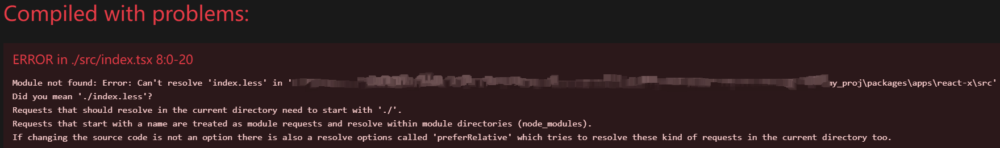
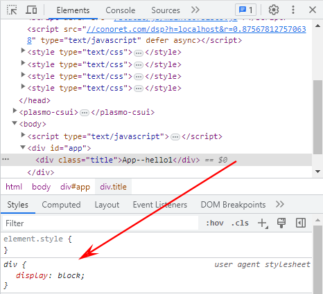
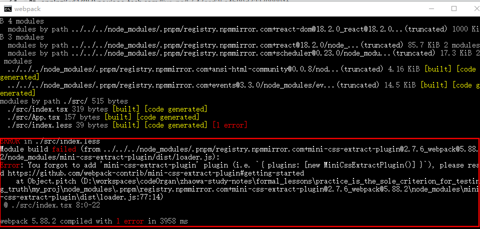
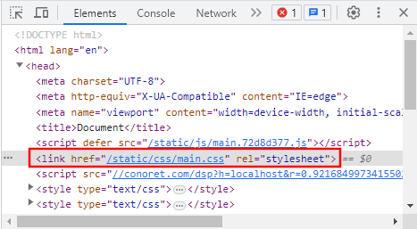
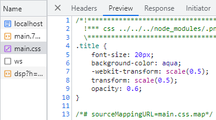
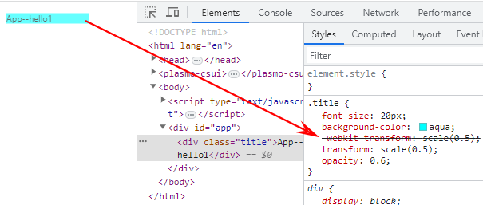
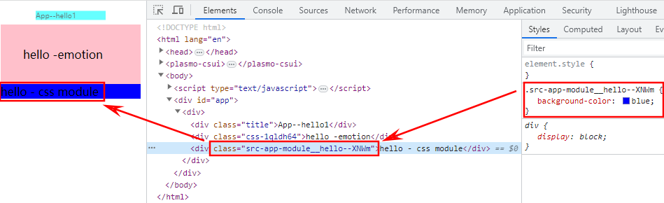
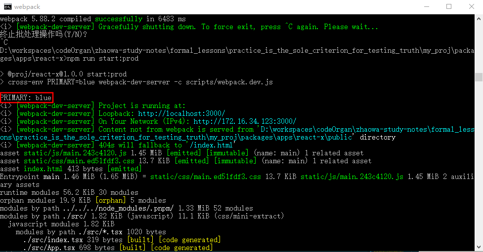

二十八、react 实战- 玩转 react 全家桶（第二讲 react 环境安装）

# 前言

多个条件，多项选择。

## 1.什么是亮点？

### 学术性

- 现在，行业的解决方案就是 A，你创造了一个 A+；
- svelte, solid.
- SCI

### 稀缺性

- 你用了一个东西，这个东西是新的，一般人不知道的。
- 小众。

### 组合性

- EI
- 现在有一个解决方案 A，但是有 m 缺点，有 p 优点
- 有另一个解决方案 B，但是有 n 缺点，有 m 优点
- 你搞了一个 A+B，针对你项目的特点

  - 可以接收 n 缺点，但是不能接受 m 缺点，而且需要 p 解决问题。

- 微前端，改了一些使用方法。让一部分能力增强了，但是可能会引入新的问题。

## 2.X 是不是亮点 ？

防抖节流不是亮点

- 换个人想出来 X 方案，需要多少技术积累。
- 如果不需要想很久，做出来，落地，有多困难。

## 3.写个类似 rollup 可以吗？

- rollup 有一些问题，js 写的，不够快；能否用 rust 写一个？
- rust 市面上有：swc ； swc 有什么问题？能否解决？
- go 语言写一个，有： esbuild ；esbuild 有什么问题？能否解决？

这些就是上述亮点的组合性，也就是亮点了吧。

vite = esbuild + 自己做模块化 + 构建用 rollup => 亮点。

## 4.优化方案

### 4.1 优化 what？

#### FMP

- 根据你的需求去优化
  - I/O 角度： 让你的 bundlesize 最小（下面的-例子）
    - minimize, terser, gzip（有插件 compression-webpack-plugin）
  - 怎么操作 CDN ？
  - 怎么优化 DNS ？
  - 怎么请求更少？——图片 webp ？

#### FID

### 4.2 角度优化，寻找痛点

- 从某个角度优化一个指标，在整个项目找当前项目里有哪些痛点！不是加个 key 、防抖、节流...就算优化了，不是这样的。优化一定是一个方案。
- 就比如优化简历每个人不一样，优化想体现什么，重点写什么是不一样的。
- 许多静态资源优化方案：  
  iconfont？图标使用一张大图一次性请求？打成 svg ？现在是 png 变成 webp 是否也可以？png 太多影响什么？若影响首屏速度：先加载屏幕上展示的页，加载完先用占位符占住，先用 FMP 上报，再请求图片 ？或者先加载完内容再加载图片？CDN 贵。

webpack 剔除无用图片，写个 loader 哪些图片不用了，删掉——算是一个小亮点。

### 4.3 例子（很多 polyfill 在不同浏览器中按需加载——@babel/preset-env——安装 core-js）：

#### 4.3.1 情景：

写一个语法比如 async/await 在低版本浏览器中不支持，打包时就要加上 polyfill 按需加载，在运行时 ie 浏览器中加载 async/await ，在最新浏览器中就不会加载这个东西；就会让 bundlesize 更小了。

#### 4.3.2 操作：

假如说，有很多 polyfill 在不同浏览器中按需加载，那会在.babelrc 里配置 '@babel/preset-env'

【1】安装：

> my_proj

```bash
pnpm i core-js -D --filter @proj/react-x
```

【2】配置：

> .babelrc

```json
{
  "presets": [
    [
      "@babel/preset-env",
      {
        "useBuiltIn": "usage",
        "corejs": 3
      }
    ],
    "@babel/preset-react",
    "@babel/preset-typescript"
  ]
}
```

### 4.4 gzip（有插件 compression-webpack-plugin ，自行学习）

#### 4.4.1 安装：

```bash
pnpm i compression-webpack-plugin -D --filter @proj/react-x
```

#### 4.4.2 了解 gzip ：

[1]gzip 压缩：

> HTTP 协议上的 gzip 编码是一种用来改进 web 应用程序性能的技术，web 服务器和客户端（浏览器）必须共同支持 gzip。目前主流的浏览器，Chrome,firefox,IE 等都支持该协议。  
> 简单来说，gzip 是一种压缩技术。

[2]为何要使用 gzip 压缩?

> 打包的时候开启 gzip 可以很大程度减少包的大小，页面大小可以变为原来的 30%甚至更小，非常适合于上线部署。  
> 更小的体积对于用户体验来说就意味着更快的加载速度以及更好的用户体验

[3]为什么 gzip 压缩后页面加载速度提升

> 浏览器向服务器发出请求，并且在请求头中声明可以使用 gzip 的编码格式，服务器接受到请求之后，读取压缩后的文件，服务器直接返回给浏览器 gzip 格式的文件，浏览器进行解压缩，这样以来就节省了服务器压缩的时间

[4]参考链接：

[webpack 优化系列二：Vue 配置 compression-webpack-plugin 实现 Gzip 压缩](https://blog.csdn.net/duanhy_love/article/details/125069009)

# 开始

## 一、css 解析

### 什么是 loader？

```js
import styles from './index.less';
import pkg from './mock.json';
import img from './assert/img1.png';

.xxx {

}
```

本质：

本质上 js 是不支持，浏览器不认识 `.xxx{}` ，只认识 `<style></style>` 和 `<link>`；所以需要 something 解析 this。

### 测试：浏览器不认识，需要解析的情况

【1】新建 index.less ：

> react-x/src/index.less

```less
.title {
  font-size: 20px;
  background-color: aqua;
}
```

【2】导入到 index.tsx ：

> react-x/src/index.tsx

```tsx
// ...
import './index.less'

// ...
```

【3】App.tsx 给 div 添加 title 类名：

> react-x/src/App.tsx

```tsx
// ...
return <div className="title">App--hello1</div>
// ...
```

【4】项目启动后显示：



### 解决：浏览器不认识，需要解析的情况（<span style="color: red;">不生效，就重启</span>）

【5】不管所有文件后缀是什么，都需要 babel 解析。所以打开 webpack.base.js ，在 module rules 里 ：

> webpack.base.js

```js
// ...
module: {
  rules: [
    {
      test: /.(ts|tsx)$/,
      use: {
        loader: 'babel-loader' // 需要配置一下：所以得创建 react-x/.babelrc
      }
    },
    {
      test: /.(css|less)$/,
      use: ['style-loader', 'css-loader', 'postcss-loader', 'less-loader']
    }
  ]
}
// ...
```

【5.1】style-loader ：如果去掉，页面没有 style 标签的样式了；



【5.1.1】此时可以尝试**安装**另一种插件 **mini-css-extract-plugin** ：

```bash
pnpm i mini-css-extract-plugin -D --filter @proj/react-x
```

【5.1.2】修改 webpack.base 配置 的 module rules ：

<strong style="color: red;">结论</strong>：为了方便**开发环境的热更新**：

- 生产环境：使用 MiniCssExtractPlugin.loader 抽离成文件
- 开发环境：使用 style-loader 页面使用 style

> webpack.base.js

```js
//...
	module: {
		rules: [
			{
				test: /.(ts|tsx)$/,
				use: {
					loader: 'babel-loader' // 需要配置一下：所以得创建 react-x/.babelrc
				}
			},
			{
				test: /.(css|less)$/,
				use: [
					// 法Ⅰ：'style-loader'
					// 法Ⅱ：MiniCssExtractPlugin.loader

					// 我们一般情况下，在开发环境中，我们用 'style-loader', 方便我们做热更新。
					// 生产环境下，我们要放在单独的文件里。
					!isDev ? 'style-loader' : MiniCssExtractPlugin.loader,
					'css-loader',
					'postcss-loader',
					'less-loader'
				]
			}
		]
	},
  //...
```

【5.1.3】此时启动，报错：



【5.1.4】所以还需要：在 plugins 里加入以下代码：

> webpack.base.js

```js
//...

plugins: [
  //...
  new MiniCssExtractPlugin({
    // [content hash] - chunk hash - hash : 内容变了，我才有消除缓存的意义和价值。
    filename: 'static/css/[name].[contenthash:8].css'
  }) // 重点
]
//...
```

- [content hash] - chunk hash - hash : 内容变了，我才有消除缓存的意义和价值。

【5.1.5】使用 mini-css-extract-plugin 插件，使得 css 以单文件用 link 引入页面。





【5.2】css-loader ：把 css 和 css 文件，插入到 script 标签里。

【5.3】postcss-loader

【5.4】less-loader ：把 less 语法解析成 css 。

【6】postcss 是 css 届的 babel ，可以配置——新建 .postcssrc.json ：

> .postcssrc.json

```json
{
  "plugins": {
    "autoprefixer": {}
  }
}
```

【7】浏览器兼容配置，新建 .browserslistrc :

> .browserslistrc

```
IE 8
chrome 20
```



【8.1】使用 tailwindcss 时，也在 .postcssrc.json 里添加：

> .postcssrc.json

```json
{
  "plugins": {
    "autoprefixer": {},
    "tailwindcss": {}
  }
}
```

【8.2】后面：

1. tailwindcss 需要 config ，所以先不加；否则可能报错。

2. 后面会有两节针对 postcss 写一些插件。

## 二、典型的 css 方案有哪些？（css 模块化方案、css 隔离方案有哪些？）

### 1.css in js

#### 1.1 emotion

优缺点：

- 好处：更灵活；
- 坏处：代码更复杂、没有提示。

安装：

```bash
pnpm i @emotion/css -D --filter @proj/react-x
```

使用：

> App.tsx

```tsx
// ...
import { css } from '@emotion/css'
// ...
const color: string = 'white'
// ...
      <div
        className={css`
          padding: 32px;
          background-color: pink;
          &: hover {
            color: ${color};
          }
        `}
      >
        hello -emotion
      </div>
// ...
```

#### 1.2 styled-component

这个可以自己查询使用方法。

#### 1.3 css in js 总结：

做技术选型的时候，可以有 css module 的方案/css 样式隔离方案：  
可以说自己之前调研过几种：  
我觉得这种怎么样，  
那种怎么样，  
后来我们选择了哪一种；  
这比直接说一个结果要好（因为这个嵌套了你的技术选型了）。

### 2.css module（\*.module.less 以模块化解析）

对于 css module 我们一般情况下使用 css module。我们来配置一下。

【1】配置 module rules ：

注意：  
处理 .module.(less|css) 、 .less 以及 .css 的时候，要用 oneOf: 包裹（代表任选一个）；  
否则显示 一串乱序字符串的样式名称；  
正确应该显示为：



> webpack.base.js

```js
			{
				oneOf: [
					{
						// 定义，使用 xxx.module.(less|css)
						test: /.module.(less|css)$/,
						include: [path.resolve(__dirname, '../src')],
						use: [
							// 法Ⅰ：'style-loader'
							// 法Ⅱ：MiniCssExtractPlugin.loader

							// 我们一般情况下，在开发环境中，我们用 'style-loader', 方便我们做热更新。
							// 生产环境下，我们要放在单独的文件里。
							!isDev
								? 'style-loader'
								: MiniCssExtractPlugin.loader,
							{
								// 'css-loader',
								loader: 'css-loader',
								options: {
									importLoaders: 2,
									// 开启 css modules
									modules: {
										localIdentName:
											'[path][name]__[local]--[hash:base64:4]' // css module 最后生成什么文件
									}
								}
							},
							'postcss-loader',
							'less-loader'
						]
					},
					{
						test: /.(less)$/,
						use: [
							// 法Ⅰ：'style-loader'
							// 法Ⅱ：MiniCssExtractPlugin.loader

							// 我们一般情况下，在开发环境中，我们用 'style-loader', 方便我们做热更新。
							// 生产环境下，我们要放在单独的文件里。
							!isDev
								? 'style-loader'
								: MiniCssExtractPlugin.loader,
							'css-loader',
							'postcss-loader',
							'less-loader'
						]
					},
					{
						test: /.(css)$/,
						use: [
							// 法Ⅰ：'style-loader'
							// 法Ⅱ：MiniCssExtractPlugin.loader

							// 我们一般情况下，在开发环境中，我们用 'style-loader', 方便我们做热更新。
							// 生产环境下，我们要放在单独的文件里。
							!isDev
								? 'style-loader'
								: MiniCssExtractPlugin.loader,
							'css-loader',
							'postcss-loader'
						]
					}
				]
			},
```

【2】创建 app.module.less ：

> app.module.less

```less
.hello {
  background-color: blue;
}
```

【3.1】引用：

> App.tsx

```tsx
// ...
import styles from './app.module.less'
// ...
```

【3.2】但显示：

已声明“styles”，但从未读取其值。ts(6133)
找不到模块“./app.module.less”或其相应的类型声明。ts(2307)

所以需要声明文件。

【4】创建声明文件 global.d.ts ：

> global.d.ts

```ts
declare module '*.module.less'
```

【5】使用 css module （使用 app.module.less）

> App.tsx

```tsx
// ...
import { css } from '@emotion/css'
import styles from './app.module.less'
// ...
;<div className={styles.hello}>hello - css module</div>
// ...
```

### 3.utility css （以 tailwindcss 为例）

原子化 css

- tailwindcss （已安装）
- unoCss

【1】初始化，生成配置文件 tailwind.config.js ，并编辑 content 为 `content: ['./src/**/*.{tsx, ts, jsx, js}'],`：

```bash
npx tailwindcss init

# Created Tailwind CSS config file: tailwind.config.js
```

> tailwind.config.js

```js
/** @type {import('tailwindcss').Config} */
module.exports = {
  content: ['./src/**/*.{tsx, ts, jsx, js}'],
  theme: {
    extend: {}
  },
  plugins: []
}
```

【2】只要根目录有 tailwind.config.js ，且安装插件 Tailwind CSS IntelliSense ；  
那么就可以这样使用 tailwindcss ：

> App.tsx

```tsx
<div className="text-blue-600 text-lg">hello - tailwindcss</div>
```

【3】修改 index.less ：

> index.less

```less
// .title {
// 	font-size: 20px;
// 	background-color: aqua;
// 	transform: scale(0.5);
//   opacity: 0.6;
// }

@tailwind base;
@tailwind components;
@tailwind utilities;
```

【4】修改 .postcssrc.json 添加 tailwindcss ：

> .postcssrc.json

```json
{
  "plugins": {
    "autoprefixer": {},
    "tailwindcss": {}
  }
}
```

#### 可以参考链接：

[官网：Tailwind CSS 入门-安装-Using PostCSS](https://www.tailwindcss.cn/docs/installation/using-postcss)

## 三、生产环境（CSS）

### 【1】安装插件：

> my_proj

```bash
pnpm i css-minimizer-webpack-plugin terser-webpack-plugin -D --filter @proj/react-x
```

### 【2】配置 webpack.prod.js

面试官不会问具体的配置策略：

- 因为有的配置策略 你自己也不好分析，大概知道有这些东西就行；

> webpack.prod.js

```js
const getBaseCfg = require('./webpack.base')
const { merge } = require('webpack-merge')
const path = require('path')
const CssMinimizerPlugin = require('css-minimizer-webpack-plugin')
const TerserPlugin = require('terser-webpack-plugin')

// 优化、压缩、分治
module.exports = merge(getBaseCfg(false), {
  optimization: {
    minimizer: [
      new CssMinimizerPlugin(),
      new TerserPlugin({
        // 并行压缩
        parallel: true,
        terserOptions: {
          compress: {
            pure_funcs: ['console.log', 'console.warn'] // 生产环境 不能带上 console.log console.warn 等
          }
        }
      })
    ],
    splitChunks: {
      // 缓存组
      cacheGroups: {
        vendors: {
          priority: 1,
          test: /node_modules/,
          name: 'vendors'
          // minChunk, chunks, minSize,
        },
        common: {
          name: 'commons',
          minChunks: 3
        }
      }
      // 面试官不会问具体的配置策略，因为有的配置策略 你自己也不好分析，大概知道有这些东西就行。
      // 还剩 cross-env
    }
  }
})
```

还剩 cross-env 。

## 四、其他

### 4.1 ts 声明文件 global.d.ts 添加-其他文件的声明 ：

> global.d.ts

```ts
declare module '*.module.less'
declare module '*.less'
declare module '*.svg'
declare module '*.png'
declare module '*.gif'
declare module '*.webp'
declare module '*.jpg'
declare module '*.css'
```

现在，开发环境的 css 、静态文件已经配置好了。

### 4.2 设置别名 alias （@）

> webpack.base.js

```js
// ...

module.exports = (isDev) => ({
  // ...
  resolve: {
    // ...
    alias: {
      '@': path.resolve(__dirname, '../src')
    }
  }
  // ...
})
```

### 4.3 生产环境特殊处理一些代码（cross-env）

有些开发环境的代码，在生产环境不需要或需要进行特殊处理的，那就使用 cross-env 。

#### 4.3.1 步骤

【1】已安装 package.json ：

- "cross-env": "^7.0.3",

【2】配置全局环境变量值 PRIMARY=blue ：

【2.1】设置 scripts 的 start:prod：

> package.json

```json
{
  // ...
  "scripts": {
    // ...
    "start:prod": "cross-env PRIMARY=blue webpack-dev-server -c scripts/webpack.dev.js"
    // ...
  }
  // ...
}
```

【2.2】打印 PRIMARY 值：

> webpack.dev.js

```js
// ...
console.log('PRIMARY:', process.env.PRIMARY)
// ...
```

【2.3】启动 npm run start:prod 命令：

可以看到 PRIMARY 的值。



【3】注入 PRIMARY（配置 webpack.base.js ）：

> webpack.base.js

```js
module.exports = (isDev) => ({
  plugins: [
    new webpack.DefinePlugin({
      // 有些代码 生产环境 不需要/进行特殊处理 ——使用 cross-env
      'process.env.PRIMARY': JSON.stringify(process.env.PRIMARY) // 注入
    })
  ]
})
```

【4】使用 PRIMARY（App.tsx）：

注意：<span style="color: red;">color: ${process.env.PRIMARY};</span>。

> App.tsx

```tsx
import { css } from '@emotion/css'
// ...
;<div
  className={css`
    padding: 32px;
    background-color: pink;
    &: hover {
      color: ${process.env.PRIMARY};
    }
  `}
>
  hello -emotion
</div>
// ...
```

【5】可以看到 hello -emotion 悬浮显示蓝色。

同理也可以设置绿色 green 。

#### 4.3.2 应用

如果有不同的配置，就相当于把**不同配置打成不同的包**了。

### 4.4 webpack & rollup & vite 触类旁通

这里用 webpack ，其他地方用 rollup ，vite 也就差不多了。

## 五、headless with styled ，应该怎么选？

### 5.1 本项目做什么？

本项目做一个知乎，所以 更加偏向于很多定制化的页面，所以不用带样式的组件库，用 headless 组件库（ @headlessui ——只有逻辑没有 ui，自己写 ui ）。

### 5.2 [headless ui](https://headlessui.com/)

比如折叠框，只有折叠的逻辑，样式自己写，方便自己做定制化。

【1】自己用，有可能要封装，所以安装一个全局的：

```bash
pnpm i @headlessui/react -S -w
```

【2】同样的， react、react-dom、@types/react、@types/react-dom 也安装成全局的：

```bash
pnpm i react react-dom @types/react @types/react-dom -S -w
```

# 1:30:03

## 如何选择合理的状态管理？

- zustand ?
- redux ?
- mobx ?

- zustand ?
- solid.js
- @reduxjs/toolkit
- redux ?
- mobx ?

状态管理的核心，就是我有一个统一的数据储存，完了修改的时候，可以触发更新。
react - vue
vue: 我在修改了数据的时候，让界面更新了。

- document.createElement()
- 我在什么时候，为什么能触发界面更新
- data.x -> set -> get -> observers -> notifyAll
  react: 我在 setState 的时候，让界面更新了。
- render -> 对比 -> effects -> 界面更新。

- 修改一个数据
- 数据的改变，触发某些函数的执行
- 这些函数，能够调用 setState

# 总结

1. 开发环境 css 等样式、静态文件相关配置
2. 组件

# 第三讲 组件库

## 如何选择合理的组件库？

## 如何构建一个组件库？

gulp 是一个很好的选择
rollup 分文件夹，一起构建。
antd 的构建：

### 组件库打包的方案有哪些？

一般情况下，我们需要“三证齐全”

#### umd

`<script src="xxxx.xxx.xxx.cdn.xxx.js"></script>`

#### cjs

`const xxx = require('xxxx')`

#### esm

`import { Button } from '@proj/c'`

### 组件库和前端项目，到底有什么区别？

### 使用 rollup 构建组件库。
