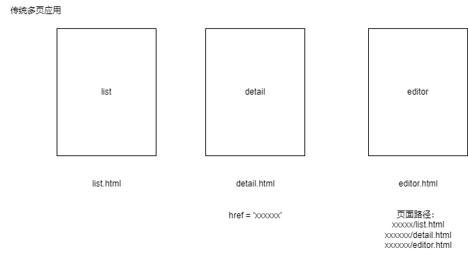
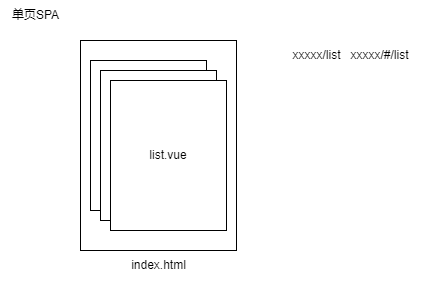

# PART1 - vue-router

## ⼀、vue-router 的实现原理

### 1.1 vue-router 是什么？

#### 1.1.1 路径切换和跳转发展史

经常遇到一些面试题：浏览器输入地址回车页面显示，出现哪些东西——页面加载过程（包含路由）。

1. **传统多页应用（多模板应用）**，（通常使用 php、phprender、jquery 编写），如何做**路由**？



| 各页面模板     | 对应 html 文件 | 页面路径（后台维护） | 返回模板                                                                          |
| -------------- | -------------- | -------------------- | --------------------------------------------------------------------------------- |
| list(列表页)   | list.html      | xxx/xxx/list.html    | 返回 list 模板<br/>（模板直接加载 list 页面的 js 和相关依赖，最终渲染出页面）     |
| detail(详情页) | detail.html    | xxx/xxx/detail.html  | 返回 detail 模板<br/>（模板直接加载 detail 页面的 js 和相关依赖，最终渲染出页面） |
| editor(编辑页) | editor.html    | xxx/xxx/editor.html  | 返回 editor 模板<br/>（模板直接加载 editor 页面的 js 和相关依赖，最终渲染出页面） |

- 【1.1】多 html 模板，模板绑定当前页面 js，后台做模板和地址的 mac 关系
- 【1.2】三个模板文件配置同一项目、同一内容区域，那么直接更改 list.html、detail.html、editor.html，就可以加载相应文件，从而渲染相应页面。
- 【1.3】文件-路径 mapping
- 【1.4】后台直接读取相应地址位置的文件，就能渲染当前页面。

2. 单页 SPA（Single Page Application）：



- 【2.1】前端不再是一个又一个模板页面，而是一个又一个单页集群。

  - 【2.1.1】整个应用都是挂载在一个 index.html 上的，在这一个 html 之内通过 js 文件区分 list、detail 还是 editor（只要命中 `xxx/xxx/**`，后台全部导向 index.html）这就是加载单页应用之后，前端展示单页应用的默认初始页面；假如单页应用的默认初始页是 list，就展示 list。
  - 【2.1.2】再去跳转时，实际上不是后台路由的跳转，而是前端路由的跳转；后台路由只需要配置相应的路径就可以了。
  - 【2.1.3】这就是现在前端和后台通过搭配、配置去实现路由的机制。

- 【2.2】后台路由 => 导航（后台路由以导航为整个链条）

- 【2.3】单页路由
  - 【2.3.1】标签跳转实现单页内多个模块切换 => 单页内多前端文件管理
  - 【2.3.2】单页内管理多个模块之间的切换和传参 => 前端管理（前端内部做管理）

3. 场景面试

   - 【3.1】原地刷新问题的由来：

     - 【3.1.1】场景：
       - 单页多个模块切换，原地刷新回到其他页面？或者，原地刷新到了空白页/404/该页暂时无法加载。那么请问遇到这些情况你是怎么做的，请你判断一下可能是哪些问题。
     - 【3.1.2】原因/由来：
       - 前提：既然前端管理，原地刷新时，首先要经过什么？我们都知道在页面输入 url 到加载页面的时候，有个很重要的过程是：url 解析了前面的域名，访问到制定的 IP（找到制定 IP 机）的过程后，通过后面的地址找到相应的应用的路径。
         - （通过域名反向解析到 IP，找到真正提供服务的地址；或者是 CDN 的话，找到最近的边缘节点机；到机器上后，后半部分就是路径，传统形式时，路径通常是文件的存放地址，但现在通常不以文件作为后缀了，通常跟后台协商共同定义好路径，后台一层一层逐层解析，解析固定路径的格式指向固定模板文件。这就是后台路由所处理的东西。浏览器加载页面时要知道加载哪个模板。后台路由指向的文件是以模板为单位的，模板是 html 文件，代表单个页面的根、根模板。）
         - （vue 还没实例化，js 还没加载，这是后台的解析过程。）
       - 原因 1：那么，本页 404 就是没有找到相应路径——也就是，**后台未配置当前路径的默认指向**。
         - （初始加载页，后台通常需要把当前地址指向到某一个模板，这样我们访问这个地址时，才可以访问这个模板。）
         - （有可能后台只配置了 list 路径，而没有配置`**`，只解析了 list，那么输入 detail 就找不到 detail 路径，于是不确定是否把 index.html 返回给我们，于是就出现了无法加载的情况。）
       - 原因 2：detail 为什么跑到 list 页上？确实配置了`**`，但是统一都指向了 index/最外层的 list 列表——也就是，**路由和地址一对多**（多个地址对应同一个路由指向文件）。
         - （所以不管访问 list、detail、editor，全部指向 index.html 的首页也就是 list 页，就会导致在详情页刷新并不能刷新详情页的内容，而是跳转列表页我需要重新进入详情页。）

   - 【3.2】解决方案 => ：
     1. 配置模块初始页
     2. active 标签（标志子页面）：
        - 以 query 形式配置 detail，如：`www.xxx.com/vue-router/**?page=detail`
        - 也可以 localStorage 本地存储里保存,到了 index.html 流向当前页面。
        - router 配置。

#### 1.1.2 手写？

使用路由管理工具：vue-router（和 vue 搭配使用）。

### 1.2 为什么要使⽤ vue-router

单页应用。

### 1.3 如何使⽤ vue-router

1. router 是以 plugin 形式加入到 vue 项目中。

2. 本质是类实体，需要实例化后方可使用 / 单例。  
   => 单例模式：路由必须唯一，前进后退刷新，返回、刷新、之前、当前。  
   => 路由操作的本质是栈操作。  
   => 路由注入和延续（hybrid）。  
   => （h5 去 h5，pc 去 pc，web 去 web，可以了解 nginx 配置）

   > router/index.js

   ```js
   import Vue from 'vue'
   import VueRouter from 'vue-router'

   // 1. router 是以 plugin 形式加入到 vue 项目中。
   Vue.use(VueRouter)

   const routes = []
   const scrollBehavior = (to, from, savedPosition) => {}

   // 2. 本质是类实体，需要实例化后方可使用 / 单例。
   // => 路由操作的本质 是 栈操作
   // => 路由注入和延续 （hybrid）
   const router = new VueRouter({
     routes,
     scrollBehavior
   })

   export default router
   ```

3. 基础配置类

   1. 同步使用
   2. 按需异步加载
      1. require 进行加载
      2. ES6 懒加载
      3. webpack require.ensure 懒加载

   > router/index.js

   ```js
   // ...
   import HomeView from '../views/HomeView.vue'
   // ...
   const routes = [
     {
       path: '/', // 路径
       name: 'home', // 名称
       component: HomeView // 模块 // 【1. 同步使用】
       // mode: 'hash' / 'history'
       // 面试：使用方式？
       // => 同步使用
     },
     {
       // 【2. 按需异步加载】
       // 如何调整为按需异步加载？
       path: '/Dynamic', // 路径
       name: 'Dynamic', // 名称
       // component: Dynamic  // 模块
       // 1. require 进行加载
       // component: (resolve) => require(['@/components/dynamicComponent'], resolve),
       // 2. ES6 懒加载
       // component: () => import('@/components/dynamicComponent', 'dynamic'),
       // 3. webpack require.ensure 懒加载
       component: (r) =>
         require.ensure(
           [],
           () => r(require('@/components/dynamicComponent')),
           'dynamic'
         )
     }
     // => 性能优化，单页加载速度优化
   ]
   // ...
   ```

4. 动态加载——滚动行为触发操作——`scrollBehavior`的三种方式：

   1. 设置滚动到开头，做路由的 resolve
   2. 滚动到指定位置
   3. 异步滚动

   > router/index.js

   ```js
   // ...
   const scrollBehavior = (to, from, savedPosition) => {
     // 1. 滚动到开头
     return { x: 0, y: 0 }
     // 2. 滚动到指定位置
     if (savedPosition) {
       return savedPosition
     } else {
       return {
         x: 0,
         y: 0
       }
     }
     // 3. 异步滚动
     return new Promise((resolve) => {
       setTimeout(() => {
         resolve(
           {
             x: 0,
             y: 0
           },
           1000
         )
       })
     })
   }
   // ...
   ```

## ⼆、路由的两种模式

### 2.1 hash 模式

1. 特性区分
2. 实现原理
3. ⼿写实现

### 2.2 history 模式

1. 特性区分
2. ⼿写实现
3. 对⽐ hash 模式区别

## 三、VUE 的⾼级组件使⽤

### 3.1 动态组件

### 3.2 异步组件

### 3.3 vue-router 实现路由懒加载

## 四、vue-router 进阶

### 4.1 vue-router 的完整导航解析流程

### 4.2 vue-router 滚动⾏为进阶处理
