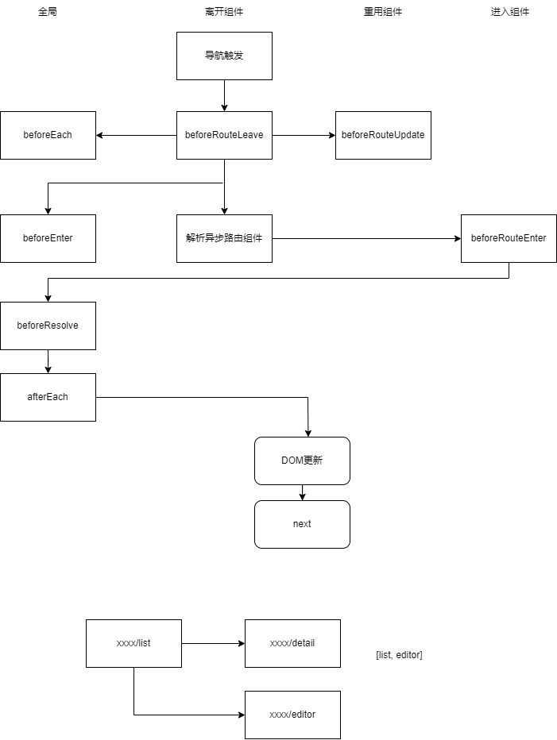

# vue-router 学习笔记

## ⼀、vue-router 的实现原理

### 1.1 vue-router 是什么？

#### 1.1.1 路径切换和跳转发展史

经常遇到一些面试题：浏览器输入地址回车页面显示，出现哪些东西——页面加载过程（包含路由）。

1. **传统多页应用（多模板应用）**，（通常使用 php、phprender、jquery 编写），如何做**路由**？


| 各页面模板     | 对应 html 文件 | 页面路径（后台维护） | 返回模板                                                                          |
| -------------- | -------------- | -------------------- | --------------------------------------------------------------------------------- |
| list(列表页)   | list.html      | xxx/xxx/list.html    | 返回 list 模板<br/>（模板直接加载 list 页面的 js 和相关依赖，最终渲染出页面）     |
| detail(详情页) | detail.html    | xxx/xxx/detail.html  | 返回 detail 模板<br/>（模板直接加载 detail 页面的 js 和相关依赖，最终渲染出页面） |
| editor(编辑页) | editor.html    | xxx/xxx/editor.html  | 返回 editor 模板<br/>（模板直接加载 editor 页面的 js 和相关依赖，最终渲染出页面） |

- 【1.1】多 html 模板，模板绑定当前页面 js，后台做模板和地址的 mac 关系
- 【1.2】三个模板文件配置同一项目、同一内容区域，那么直接更改 list.html、detail.html、editor.html，就可以加载相应文件，从而渲染相应页面。
- 【1.3】文件-路径 mapping
- 【1.4】后台直接读取相应地址位置的文件，就能渲染当前页面。

2. 单页 SPA（Single Page Application）：


- 【2.1】前端不再是一个又一个模板页面，而是一个又一个单页集群。

  - 【2.1.1】整个应用都是挂载在一个 index.html 上的，在这一个 html 之内通过 js 文件区分 list、detail 还是 editor（只要命中 `xxx/xxx/**`，后台全部导向 index.html）这就是加载单页应用之后，前端展示单页应用的默认初始页面；假如单页应用的默认初始页是 list，就展示 list。
  - 【2.1.2】再去跳转时，实际上不是后台路由的跳转，而是前端路由的跳转；后台路由只需要配置相应的路径就可以了。
  - 【2.1.3】这就是现在前端和后台通过搭配、配置去实现路由的机制。

- 【2.2】后台路由 => 导航（后台路由以导航为整个链条）

- 【2.3】单页路由
  - 【2.3.1】标签跳转实现单页内多个模块切换 => 单页内多前端文件管理
  - 【2.3.2】单页内管理多个模块之间的切换和传参 => 前端管理（前端内部做管理）

3. 场景面试

   - 【3.1】原地刷新问题的由来：

     - 【3.1.1】场景：
       - 单页多个模块切换，原地刷新回到其他页面？或者，原地刷新到了空白页/404/该页暂时无法加载。那么请问遇到这些情况你是怎么做的，请你判断一下可能是哪些问题。
     - 【3.1.2】原因/由来：
       - 前提：既然前端管理，原地刷新时，首先要经过什么？我们都知道在页面输入 url 到加载页面的时候，有个很重要的过程是：url 解析了前面的域名，访问到制定的 IP（找到制定 IP 机）的过程后，通过后面的地址找到相应的应用的路径。
         - （通过域名反向解析到 IP，找到真正提供服务的地址；或者是 CDN 的话，找到最近的边缘节点机；到机器上后，后半部分就是路径，传统形式时，路径通常是文件的存放地址，但现在通常不以文件作为后缀了，通常跟后台协商共同定义好路径，后台一层一层逐层解析，解析固定路径的格式指向固定模板文件。这就是后台路由所处理的东西。浏览器加载页面时要知道加载哪个模板。后台路由指向的文件是以模板为单位的，模板是 html 文件，代表单个页面的根、根模板。）
         - （vue 还没实例化，js 还没加载，这是后台的解析过程。）
       - 原因 1：那么，本页 404 就是没有找到相应路径——也就是，**后台未配置当前路径的默认指向**。
         - （初始加载页，后台通常需要把当前地址指向到某一个模板，这样我们访问这个地址时，才可以访问这个模板。）
         - （有可能后台只配置了 list 路径，而没有配置`**`，只解析了 list，那么输入 detail 就找不到 detail 路径，于是不确定是否把 index.html 返回给我们，于是就出现了无法加载的情况。）
       - 原因 2：detail 为什么跑到 list 页上？确实配置了`**`，但是统一都指向了 index/最外层的 list 列表——也就是，**路由和地址一对多**（多个地址对应同一个路由指向文件）。
         - （所以不管访问 list、detail、editor，全部指向 index.html 的首页也就是 list 页，就会导致在详情页刷新并不能刷新详情页的内容，而是跳转列表页我需要重新进入详情页。）

   - 【3.2】解决方案 => ：
     1. 配置模块初始页
     2. active 标签（标志子页面 => query | local）：
        - 以 query 形式配置 detail，如：`www.xxx.com/vue-router/**?page=detail`
        - 也可以 localStorage 本地存储里保存,到了 index.html 流向当前页面。
        - router 配置。

#### 1.1.2 手写？

使用路由管理工具：vue-router（和 vue 搭配使用）。

### 1.2 为什么要使⽤ vue-router

单页应用。

### 1.3 如何使⽤ vue-router

#### 1.3.1.使用步骤

1. 引入生成

2. 导入 vue 实例插件：router 是以 plugin 形式加入到 vue 项目中。

3. 实例化：本质是类实体，需要实例化后方可使用 / 单例。  
   => 单例模式：路由必须唯一，前进后退刷新，返回、刷新、之前、当前。  
   => 路由操作的本质 是 栈操作。  
   => 路由注入和延续（hybrid）。  
   => （h5 去 h5，pc 去 pc，web 去 web，可以了解 nginx 配置）

##### 举例

> router/index.js

```js
import Vue from 'vue'
// 1. 引入生成
import VueRouter from 'vue-router'

// 2. 导入 vue 实例插件：router 是以 plugin 形式加入到 vue 项目中。
Vue.use(VueRouter)

const routes = []
const scrollBehavior = (to, from, savedPosition) => {}

// 3. 实例化：本质是类实体，需要实例化后方可使用 / 单例。
//    => 单例模式：路由必须唯一，前进后退刷新，返回、刷新、之前、当前。
//    => 路由操作的本质 是 栈操作。
//    => 路由注入和延续（hybrid）。
//    => （h5 去 h5，pc 去 pc，web 去 web，可以了解 nginx 配置）
const router = new VueRouter({
  routes,
  scrollBehavior
})

export default router
```

#### 1.3.2.导航守卫



##### 1.全局

1. 全局前置守卫：`router.beforeEach((to, from, next) => { next() })`
2. 全局解析守卫：`router.beforeResolve((to, from, next) => { next() })`
3. 全局后置守卫：`router.afterEach((to, from) => {})`

> router/index.js

```js
import Vue from 'vue'
import VueRouter from 'vue-router'
Vue.use(VueRouter)
const routes = []
const scrollBehavior = (to, from, savedPosition) => {}
const router = new VueRouter({
  routes,
  scrollBehavior
})

// 全局守卫 - 全控制、整体进度条、行为记录
router.beforeEach((to, from, next) => {
  // 做前置处理
  next()
})
router.beforeResolve((to, from, next) => {
  next()
})
router.afterEach((to, from) => {})

export default router
```

##### 2.局部（组件内的守卫）

1. 路由进入前：beforeRouteEnter
2. 路由更新前：beforeRouteUpdate
3. 路由离开前：beforeRouteLeave

> xxx.vue

```vue
<script>
export default {
  data() {
    return {}
  },
  beforeRouteEnter(to, from, next) {
    // called before the route that renders this component is confirmed.
    // does NOT have access to `this` component instance,
    // because it has not been created yet when this guard is called!

    next((vm) => {
      // access to component instance via `vm`
    })
  },
  beforeRouteUpdate(to, from, next) {
    // called when the route that renders this component has changed.
    // This component being reused (by using an explicit `key`) in the new route or not doesn't change anything.
    // For example, for a route with dynamic params `/foo/:id`, when we
    // navigate between `/foo/1` and `/foo/2`, the same `Foo` component instance
    // will be reused (unless you provided a `key` to `<router-view>`), and this hook will be called when that happens.
    // has access to `this` component instance.

    // just use `this`
    this.name = to.params.name
    next()
  },
  beforeRouteLeave(to, from, next) {
    // called when the route that renders this component is about to be navigated away from.
    // has access to `this` component instance.

    const answer = window.confirm(
      '尚未保存，是否离开？' +
        'Do you really want to leave? you have unsaved changes!'
    )
    if (answer) {
      next()
    } else {
      next(false)
    }
  }
}
</script>
```

##### 3.路由独享的守卫（自己补充）

1. 路由配置对象里直接定义路由独享的守卫：beforeEnter；
2. 和全局前置守卫特点一样；

> router/index.js

```js
const router = new VueRouter({
  routes: [
    {
      path: '/foo',
      component: Foo,
      beforeEnter: (to, from, next) => {
        // ...
      }
    }
  ]
})
```

## ⼆、路由切换

软跳、硬跳，小跳、大跳，为什么软跳浏览器不加载？和路由切换有关系。

### 2.1 单页路由切换实质

1. 更新视图但是不重新请求页面
2. 路由的多种模式： hash hisory abstract

### 2.2 hash 模式

1. 特性区分
2. 实现原理
3. 手写实现

#### 1.特性区分

举例`https://www.example.com:8080/aaa/bbb?ccc=123&ddd=456#list`：

- `https`：协议
- `www.example.com`：域名
- `8080`：端口号
- `aaa/bbb`：虚拟路径
- `ccc=123&ddd=456`：参数 or query
- `#list`：锚

#### 2.实现原理

**核心** => hash 改变不会触发网页重载 / hash 值改变会改变浏览器的历史记录 / hash 改变会出发 window.onhashchange()

**问：如何改变 hash？**

1. a 标签形式入口`<a href="#/list"></a>`
2. window.location.hash 赋值
3. history.forward()/back() 浏览器前进/后退按钮

#### 3.手写实现：手写一个 hash router

> myRouter.js

```js
class MyRouter {
  constructor(config) {
    // 参数组织 / 路由表配置
    this._routes = config.routes

    // 路由历史栈
    this.routeHistory = [] // 路由栈
    this.currentUrl = ''
    this.currentIndex = -1 // 指针 索引

    // 跳转中间变量
    this.changeFlag = false

    // 流程调用
    this.init()
  }
  init() {
    // hashchange：监听hash变化
    window.addEventListener('hashchange', this.refresh.bind(this), false)

    // load：监听页面加载完成
    window.addEventListener('load', this.refresh.bind(this), false)
  }
  // 单页更新
  refresh() {
    // 1. 路由参数处理
    if (this.changeFlag) {
      this.changeFlag = false
    } else {
      this.currentUrl = location.hash.slice(1) || '/'
      // 去除分叉路径
      this.routeHistory = this.routeHistory.slice(0, this.currentIndex + 1)
      this.routeHistory.push(this.currentUrl)
      this.currentIndex++
    }

    // 2. 切换模块
    let path = MyRouter.getPath() // 获取路径
    let currentComponentName = '' // 当前模块名称
    let nodeList = document.querySelectorAll('[data-component-name]') // 单页节点集合

    // 查找当前路由名称对应
    // find()
    for (let i = 0; i < this._routes.length; i++) {
      if (this._routes[i].path === path) {
        currentComponentName = this._routes[i].name
        break
      }
    }

    // 遍历控制节点模块展示
    nodeList.forEach((item) => {
      if (item.dataset.componentName === currentComponentName) {
        item.style.display = 'block'
      } else {
        item.style.display = 'none'
      }
    })
  }

  push(option) {
    if (option.path) {
      MyRouter.changeHash(option.path, option.query)
    } else if (option.name) {
      let path = ''

      for (let i = 0; i < this._routes.length; i++) {
        if (this._routes[i].name === option.name) {
          path = this._routes[i].path
          break
        }
      }

      if (path) {
        MyRouter.changeHash(path, option.query)
      }
    }
  }

  back() {
    this.changeFlag = true
    // ……
  }

  forward() {
    this.changeFlag = true
    // ……
  }

  // 获取路径
  static getPath() {
    let href = window.location.href
    let index = href.indexOf('#') // 获取标识位
    if (index < 0) {
      return ''
    }
    href = href.slice(index + 1)

    let searchIndex = href.indexOf('?')
    if (searchIndex < 0) {
      return href
    } else {
      return href.slice(0, searchIndex)
    }
  }

  static changeHash(path, query) {
    if (query) {
      let str = ''
      for (let i in query) {
        str += '&' + i + '=' + query[i]
      }

      window.location.hash = str ? path + '?' + str.slice(1) : path
    } else {
      window.location.hash = path
    }
  }
}
```

> test-myRouter.html

```html
<!DOCTYPE html>
<html lang="en">
  <head>
    <meta charset="UTF-8" />
    <meta name="viewport" content="width=device-width" />
  </head>
  <body>
    <ul>
      <li>
        <a onclick="router.push({name: 'course'})">课程</a>
        <a onclick="router.push({name: 'teacher'})">老师</a>
      </li>
    </ul>
    <div class="main-content">
      <div class="main-box" data-component-name="course">zhaowa训练营</div>
      <div class="main-box" data-component-name="teacher">云隐</div>
    </div>
  </body>
</html>
<script src="./myRouter.js"></script>
<!-- /vue-router/myRouter/page.html#/teacher -->
<script>
  window.router = new MyRouter({
    routes: [
      {
        path: '/course',
        name: 'course'
      },
      {
        path: '/teacher',
        name: 'teacher'
      }
    ]
  })
</script>
<style>
  [data-component-name] {
    display: none;
  }
</style>
```

### 2.3 history 模式

1. 特性区分
2. 手写实现
3. 对⽐ hash 模式区别

#### 1.特性区分

**核心** => pushState() replaceState() / history 会改变浏览器的历史记录 / pushState 的三个参数：state、title、URL / 精准监听状态发生改变：window.onpopstate()

#### 2.手写实现 & 3.对⽐ hash 模式区别

- 实现方式一样，但 API 不一样。

**手写实现**的注意点：

- 锚点也会触发 window.onpopstate()：a 标签触发锚点也会触发 window.onpopstate()

- window.onpopstate() 既能兼容 hash，也能兼容 history 模式。

- init 监听 hashchange 改为 onpopstate 或者不改，因为可以兼容。

## 三、VUE 的⾼级组件使⽤

### 概要

1. 动态组件
2. 异步组件
3. vue-router 实现路由懒加载

### 代码举例

4. 基础配置类

   1. 同步使用
   2. 按需异步加载
      1. require 进行加载
      2. ES6 懒加载
      3. webpack require.ensure 懒加载

   > router/index.js

   ```js
   // ...
   import HomeView from '../views/HomeView.vue'
   // ...
   const routes = [
     {
       path: '/', // 路径
       name: 'home', // 名称
       component: HomeView // 模块 // 【1. 同步使用】
       // mode: 'hash' / 'history'
       // 面试：使用方式？
       // => 同步使用
     },
     {
       // 【2. 按需异步加载】
       // 如何调整为按需异步加载？
       path: '/Dynamic', // 路径
       name: 'Dynamic', // 名称
       // component: Dynamic  // 模块
       // 1. require 进行加载
       // component: (resolve) => require(['@/components/dynamicComponent'], resolve),
       // 2. ES6 懒加载
       // component: () => import('@/components/dynamicComponent', 'dynamic'),
       // 3. webpack require.ensure 懒加载
       component: (r) =>
         require.ensure(
           [],
           () => r(require('@/components/dynamicComponent')),
           'dynamic'
         )
     }
     // => 性能优化，单页加载速度优化
   ]
   // ...
   ```

## 四、vue-router 进阶

### 4.1 vue-router 的完整导航解析流程

### 4.2 vue-router 滚动⾏为进阶处理

5. 动态加载——滚动行为触发操作——`scrollBehavior`的三种方式：

   1. 设置滚动到开头，做路由的 resolve
   2. 滚动到指定位置
   3. 异步滚动

   > router/index.js

   ```js
   // ...
   const scrollBehavior = (to, from, savedPosition) => {
     // 1. 滚动到开头
     return { x: 0, y: 0 }
     // 2. 滚动到指定位置
     if (savedPosition) {
       return savedPosition
     } else {
       return {
         x: 0,
         y: 0
       }
     }
     // 3. 异步滚动
     return new Promise((resolve) => {
       setTimeout(() => {
         resolve(
           {
             x: 0,
             y: 0
           },
           1000
         )
       })
     })
   }
   // ...
   ```

## Learn More

Essential

- [Core Docs : vuejs](https://vuejs.org)
- [Forum](https://forum.vuejs.org)
- [Community Chat](https://chat.vuejs.org)
- [Twitter](https://twitter.com/vuejs)
- [Docs for This Template](http://vuejs-templates.github.io/webpack/)

Ecosystem

- [vue-router](http://router.vuejs.org/)
- [vuex](http://vuex.vuejs.org/)
- [vue-loader](http://vue-loader.vuejs.org/)
- [awesome-vue](https://github.com/vuejs/awesome-vue)

[Certified Vue.js Developer Preparation Guide](https://certification.vuejs.org/dashboard/guides/detail)

## 友情链接

- [我的掘金主页](https://juejin.cn/user/1042768423037150)

- [我的 github 主页](https://github.com/djsz3y)

- [读书视频学习笔记](https://github.com/djsz3y/learning-notes)

- [爪哇学习笔记](https://github.com/djsz3y/zhaowa-study-notes)

- [bug 仓库](https://github.com/djsz3y/bug-repository)
